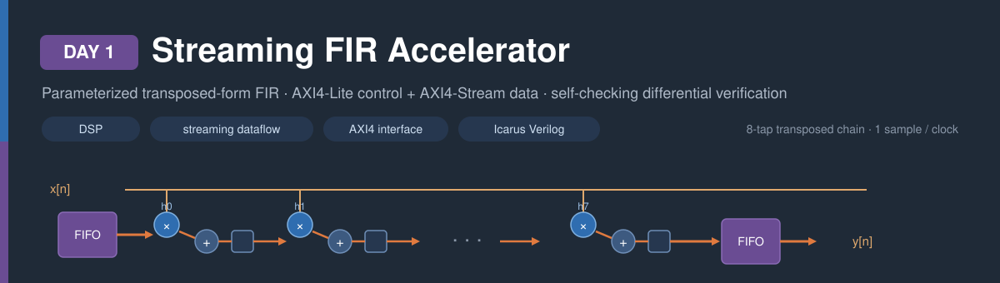
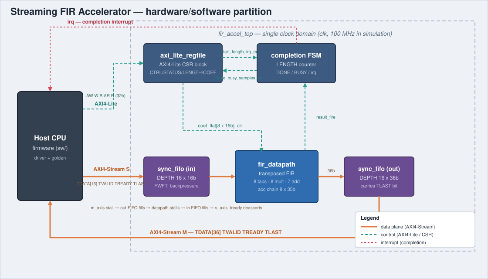
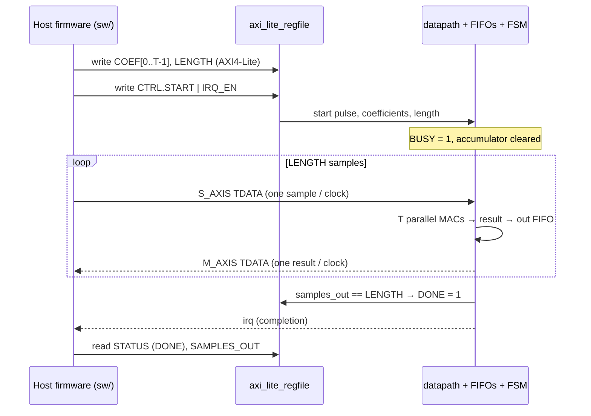

<!-- Author: Asresh -->


# Day 1 — Streaming FIR Accelerator

<!-- readability-guide:start -->
## Plain-language overview

This block applies a finite impulse response filter to a continuous stream of samples. Software loads the coefficients and starts the job; hardware performs the repeated multiply-and-add work while preserving sample order when either side pauses.

## Abbreviation guide

Every shortened technical term used in this README is expanded below for quick reference:

- **ADC** [Analog-to-Digital Converter]
- **AXI4** [Advanced eXtensible Interface 4]
- **AXI4-Lite** [Advanced eXtensible Interface 4 Lite]
- **AXI4-Stream** [Advanced eXtensible Interface 4 Stream]
- **AXIS** [Advanced eXtensible Interface Stream]
- **CLR** [Clear]
- **COEF** [Coefficient]
- **COUNT** [Count]
- **CPU** [Central Processing Unit]
- **CSR** [Control and Status Register]
- **CTRL** [Control]
- **DSP** [Digital Signal Processing]
- **EN** [Enable]
- **FIFO** [First-In, First-Out]
- **FIR** [Finite Impulse Response]
- **FSM** [Finite-State Machine]
- **IRQ** [Interrupt Request]
- **LUT** [Lookup Table]
- **MAC** [Multiply-Accumulate]
- **MIT** [Massachusetts Institute of Technology]
- **MSB** [Most Significant Bit]
- **OKAY** [Successful Bus Response]
- **RTL** [Register-Transfer Level]
- **SLVERR** [Slave Error]
- **SW** [Software]
- **TDATA** [Transfer Data]
- **TLAST** [Transfer Last]
- **TREADY** [Transfer Ready]
- **TVALID** [Transfer Valid]
- **WSTRB** [Write Strobe]
<!-- readability-guide:end -->

A parameterized, transposed-form FIR filter accelerator with an AXI4-Lite control plane and AXI4-Stream data plane, driven by C firmware and verified bit-exactly against a software golden model with a self-checking Icarus Verilog testbench.

---

## 1. Problem

A finite-impulse-response (FIR) filter computes, for each input sample,

```
y[n] = Σ h[k] · x[n-k]   for k = 0 … T-1
```

This is the workhorse of digital signal processing — channel equalization, anti-aliasing, pulse shaping, matched filtering. Every output sample costs `T` multiply-accumulate (MAC) operations, so a scalar CPU needs `T` cycles per sample at best. For a streaming source (a radio front-end, an audio ADC, a sensor bus) that arrives at one sample per clock, a scalar core simply cannot keep up once `T` grows beyond a handful of taps.

The filter is a natural accelerator target: the `T` MACs of one output are fully independent, so hardware can issue all of them every cycle and sustain **one output sample per clock** regardless of tap count. That is the speedup this project builds and measures.

## 2. Hardware/software partition

| Concern | Where it lives | Why |
|---|---|---|
| The inner MAC loop (`T` multiplies + adds per sample) | **Hardware** (`fir_datapath`) | Embarrassingly parallel; this is the whole point of the accelerator. |
| Sample buffering / rate decoupling | **Hardware** (`sync_fifo` ×2) | Backpressure has to be handled at clock speed; software cannot arbitrate per-cycle. |
| Coefficient / length configuration, job kickoff, completion | **Software** via **AXI4-Lite CSRs** | Infrequent, control-heavy, not on the sample-rate critical path. |
| Reference result, stimulus, result checking | **Software** (`sw/`) | Correctness model and the baseline the hardware is compared against. |

**Partition I rejected:** pushing coefficient storage *and* the running delay line into software, with hardware doing only a single MAC per CSR write. That keeps the hardware trivial but makes every sample a round-trip of AXI4-Lite transactions — hundreds of cycles per sample — which is *slower* than a pure-software FIR and defeats the purpose. The chosen split keeps the entire per-sample datapath in hardware and reserves software for the things that happen once per job.

## 3. Architecture



**`fir_datapath`** — the compute core. A transposed-form FIR: the incoming sample is broadcast to `T` signed multipliers, and each tap holds a running partial sum passed down an accumulator chain. The transposed form keeps the critical path at *one multiply + one add* independent of `T` (the direct form's adder tree grows with `T`). The accumulator is sized `DATA_WIDTH + COEF_WIDTH + ⌈log₂T⌉` bits so the full-precision result never overflows, making it bit-exact against a wide-integer software model. A single-entry output register with a valid/ready handshake stalls the chain cleanly under backpressure.

**`sync_fifo`** — a parameterized synchronous FIFO with first-word-fall-through and a valid/ready port on each side. One instance buffers the input stream, one buffers the output stream. These are the elements that convert a momentary consumer stall into clean end-to-end backpressure. Full/empty are distinguished with an extra pointer MSB, not a separate counter.

**`axi_lite_regfile`** — a single-outstanding AXI4-Lite slave exposing the control/status registers and the coefficient window. It decodes byte-strobed writes and drives the coefficients, length and start pulse into the core.

**`fir_accel_top`** — ties the four blocks together and hosts the completion FSM, which latches `LENGTH` on `START`, counts results as they are committed to the output FIFO, and raises `DONE` / `irq` on the last one.

## 4. Interface contract

### AXI4-Lite register map (32-bit registers)

| Offset | Name | Access | Reset | Fields |
|---|---|---|---|---|
| `0x00` | `CTRL` | W | 0 | `[0]` START (self-clearing), `[1]` IRQ_EN, `[2]` SOFT_CLR |
| `0x04` | `STATUS` | R | 0 | `[0]` DONE, `[1]` BUSY (DONE clears on next START) |
| `0x08` | `LENGTH` | R/W | 0 | number of samples in the job |
| `0x0C` | `TAP_COUNT` | R | `TAPS` | compile-time tap count |
| `0x10` | `DATA_WIDTH` | R | `DATA_WIDTH` | compile-time sample width |
| `0x14` | `SAMPLES_OUT` | R | 0 | results produced this job |
| `0x18` | `IN_LEVEL` | R | 0 | input FIFO occupancy |
| `0x1C` | `OUT_LEVEL` | R | 0 | output FIFO occupancy |
| `0x40 + 4·i` | `COEF[i]` | R/W | 0 | signed coefficient *i*, `i ∈ [0, TAPS)` |

All channels use the standard AXI4-Lite valid/ready handshake; responses are always `OKAY`. Writes honor `WSTRB`.

### AXI4-Stream data

* **S (input):** `TDATA[DATA_WIDTH]`, `TVALID`, `TREADY`, `TLAST` (accepted, not required). Samples are accepted only while `BUSY` and until `LENGTH` samples have been admitted — `TREADY` then deasserts, so a free-running producer cannot overrun a job.
* **M (output):** `TDATA[ACC_WIDTH]`, `TVALID`, `TREADY`, `TLAST` (asserted on the final result of the job).

## 5. Transaction flow



## 6. Build and run

```bash
make sw       # build the host/driver/reference and generate test vectors
make sim      # compile + run the Icarus differential testbench
make metrics  # regenerate results/metrics.md from the run
make elab     # elaborate the RTL at three distinct parameter sets
make synth    # cell/area report (analytical here; see note)
make all      # sw → sim → metrics
```

Tools actually used for the results below:

| Tool | Version | Role |
|---|---|---|
| Icarus Verilog (`iverilog`/`vvp`) | 13.0 (stable) | RTL simulation |
| Apple clang (`cc`) | 21.0.0 | host/driver/reference build |
| Python | 3.9.6 | metric extraction, area estimate, waveform |

> **Tool substitutions.** Verilator and Yosys are not installed on this machine. Verification therefore uses Icarus Verilog (the `Icarus + SystemVerilog testbench + immediate assertions` strategy) rather than Verilator, and `make synth` prints an analytical area estimate (`scripts/area_estimate.py`) instead of a synthesized cell count. `make synth` automatically uses Yosys if it is ever present.

## 7. Results

Measured on the default parameter set (`DATA_WIDTH=16`, `COEF_WIDTH=16`, `TAPS=8`, `FIFO_DEPTH=16`, `ACC_WIDTH=35`). Full committed table in [results/metrics.md](results/metrics.md); the raw `results/sim.log` is regenerated by `make sim` (logs are git-ignored).

| Metric | Value | Source |
|---|---|---|
| Jobs / samples checked | 34 / 1354 | simulation |
| Output mismatches vs golden | **0** | scoreboard |
| Input backpressure exercised | 28 cycles | `s_axis_tready` held low vs an offered sample |
| Steady-state throughput | **0.985 samples/cycle** | 512-sample job in 520 cycles |
| Compute density | **7.88 MAC/cycle** | throughput × taps |
| Fill latency | **3 cycles** | first input → first output |
| Software baseline | 8.0 cycles/sample | scalar model (`T` MACs/sample) |
| Hardware measured | 1.016 cycles/sample | 512-sample job |
| **Speedup** | **7.88×** | baseline ÷ hardware |
| Flip-flops (est.) | 484 | `scripts/area_estimate.py` |
| Multipliers / adders | 8 / 7 | structural (→ ~8 DSP slices) |
| LUTs (est., no DSP hardening) | ~1590 (≈566 + 8 DSP with hard multipliers) | analytical |

The speedup lands right at the theoretical ceiling (`≈ TAPS = 8×`): the accelerator issues all 8 MACs every cycle where the scalar baseline issues one, and sustains essentially one sample per clock end to end.

## 8. Verification

* **Strategy:** differential testing against an independent C golden model (`fir_ref`), run under Icarus Verilog with a self-checking SystemVerilog testbench and in-testbench protocol monitors. The C driver is *also* checked against a software device model before the testbench runs, so the golden itself is exercised two ways.
* **Volume:** 34 jobs, **1354 checked samples** (well over the 256-vector floor), each a full program → stream → drain → readback transaction.
* **Corner cases:** all-zero input; single-impulse (output = coefficients); positive saturation (max coef × max data on every tap); negative extreme (max coef × min data); mixed-sign extremes; `LENGTH = 1`; `LENGTH = FIFO_DEPTH` (exactly full); `LENGTH = 3·FIFO_DEPTH` (sustained refill); a 512-sample back-to-back job; a long consumer-stall job that fills both FIFOs and forces input backpressure; and randomized producer gaps + consumer stalls on every mode.
* **Protocol checks (immediate assertions + active stimulus):** a sample is actively offered before `START` and must be refused (arming gate); `M_AXIS` `TDATA` stable while stalled; `TLAST` framing exactly on the last beat; `SAMPLES_OUT == LENGTH`; `irq` asserted at `DONE`; and the test *fails* unless `s_axis_tready` was observed deasserting against an offered sample (backpressure actually exercised). All reported **0 violations**.
* **Proven vs tested:** correctness is *tested* exhaustively over the corner + random space, not formally proven. The accumulator-width no-overflow property is covered by the saturation corner (worst-case magnitude), and FIFO full/empty exclusivity by the full/refill cases — see Limitations for the formal follow-up.
* **Parameterization:** `make elab` elaborates cleanly at three sets — `(8,8,4,8)`, `(16,16,8,16)`, `(24,18,16,32)`.

## 9. Limitations and next steps

* Verification is simulation-based; a SymbiYosys bounded + k-induction proof of the FIFO handshake and accumulator-width properties is the natural next step (the `make formal` target is wired for it once `sby` is available).
* The AXI4-Lite slave is single-outstanding and always returns `OKAY`; it does not signal `SLVERR` on out-of-range access.
* Output is full-precision (`ACC_WIDTH`); a real datapath would add a configurable rounding/saturation stage back to `DATA_WIDTH`.
* No real synthesis numbers yet (no Yosys on this host) — the area figures are analytical and should be replaced by a vendor/Yosys report before trusting absolute LUT/DSP counts.
* Coefficients are fixed for a job; a reload-during-stream mode and a symmetric-coefficient (folded) datapath would roughly halve the multiplier count.

## 10. License

MIT — see [LICENSE](../LICENSE).
