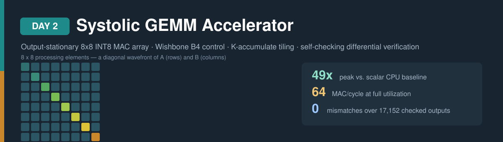
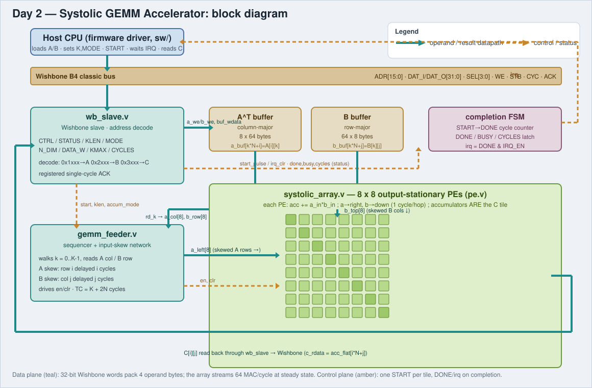
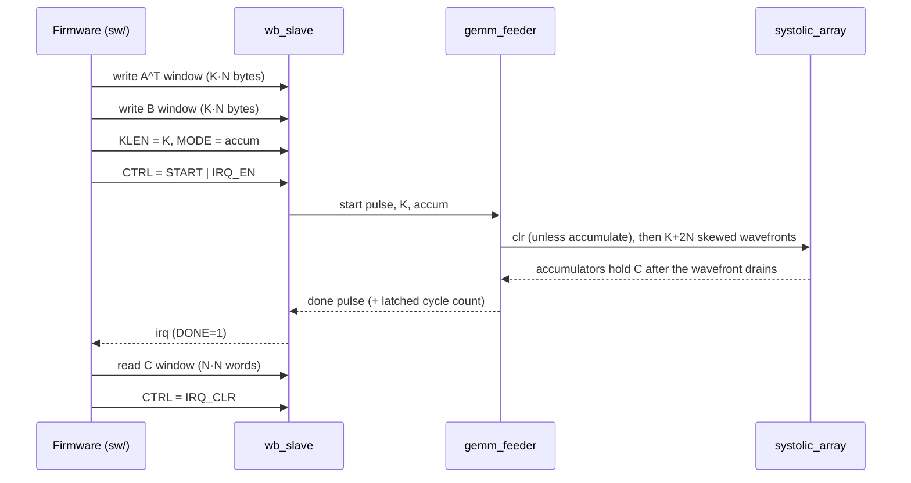

# Day 2 — Systolic GEMM Accelerator

A parameterized, output-stationary systolic array that multiplies signed 8-bit
matrices, with a Wishbone B4 control plane, a K-accumulate mode that lets
software tile an arbitrarily large product, and C firmware that drives it —
verified bit-exactly against a software golden model by a self-checking Icarus
Verilog testbench.

---

## 1. Problem

General matrix multiply (GEMM) is the inner kernel of almost all neural-network
inference: every fully-connected and convolution layer reduces to

```
C[i][j] = Σ A[i][k] · B[k][j]     for k = 0 … K-1
```

For an `N×N` output tile with inner dimension `K` this is `N²·K` multiply-
accumulate (MAC) operations. A scalar CPU issues one MAC per cycle at best, so a
single `8×8` tile with `K=64` costs 4096 cycles. Inference throughput is almost
entirely bound by how many MACs the machine can retire per cycle — which is why
every ML accelerator, from the Google TPU down, is built around a **systolic
array** of MAC cells that all fire every cycle.

The MACs of a GEMM are independent, and — crucially — each operand is reused
across a whole row or column of outputs. A systolic array exploits both: it
lays down `N²` MAC cells, streams each operand in once, and lets it march
through every cell that needs it. That is the accelerator this project builds
and measures: an `8×8` array that sustains up to **64 MAC/cycle**.

## 2. Hardware/software partition

| Concern | Where it lives | Why |
|---|---|---|
| The `N²` MACs of a tile, every cycle | **Hardware** (`systolic_array` / `pe`) | Embarrassingly parallel and operand-reuse heavy; this is the entire point of the accelerator. |
| Operand alignment (the diagonal skew) | **Hardware** (`gemm_feeder`) | Must present one wavefront per clock; a per-cycle reshaping job software cannot do at rate. |
| Tiling a large GEMM into `N×N` blocks, K-chunking, edge zero-padding | **Software** (`gemm_matmul`) | Control-heavy, runs once per tile, and keeps the hardware fixed-size and simple. |
| Job kickoff, completion, result read-back | **Software** via **Wishbone CSRs** + IRQ | Infrequent and off the MAC-rate critical path. |
| Reference result, stimulus, checking | **Software** (`sw/`) | Correctness model and the baseline the hardware is compared against. |

**Partition I rejected:** making the array exactly as large as the problem, or
streaming operands straight from the bus into the PEs every cycle. A fixed
`8×8` array with a *K-accumulate* mode is the better split — software feeds it
`K≤64` at a time and issues several accumulating runs to build a product over a
K larger than one tile, so one small, fully-utilized array covers any matrix
size without the bus ever having to sustain the array's `2·N` bytes/cycle
operand demand.

## 3. Architecture



**`pe`** — one processing element. It owns a single 32-bit accumulator, holds
`C[i][j]`, and every enabled cycle does `acc += a_in·b_in` while forwarding its
operands one hop (`a` rightward, `b` downward). Output-stationary means the
result never moves: after the wavefront passes, the accumulators *are* the C
tile, so no drain pass is needed.

**`systolic_array`** — the `N×N` grid of PEs. A operands enter the left edge and
march right; B operands enter the top edge and march down. Because each hop
costs one cycle, `A[i][k]` and `B[k][j]` meet in `PE[i][j]` on the same cycle
only if the edges are fed with a diagonal skew.

**`gemm_feeder`** — the sequencer and input-skew network. It walks `k = 0…K-1`,
reads column `k` of A and row `k` of B from the operand buffers, and pushes each
lane through a triangular shift register (row `i` delayed `i` cycles, column `j`
delayed `j` cycles) so the wavefront lands correctly aligned. It drives `en`/`clr`
and runs for `TC = K + 2N` cycles — the last useful MAC lands at `K-1+2(N-1)`,
and the trailing zero cycles cost nothing.

**`wb_slave`** — a Wishbone B4 classic slave. It exposes the control/status
registers, decodes the three memory windows (A, B, C), and acknowledges one
transfer per `CYC & STB` with a registered `ACK`.

**`gemm_top`** — ties the blocks together, holds the operand buffers (A stored
transposed/column-major, B row-major) and the completion FSM, which times the
`START→DONE` interval, latches the cycle count, and raises `DONE`/`irq`.

## 4. Interface contract

### Wishbone B4 register map (32-bit)

| Offset | Name | Access | Fields |
|---|---|---|---|
| `0x0000` | `CTRL` | W | `[0]` START (self-clearing), `[1]` IRQ_EN, `[2]` IRQ_CLR |
| `0x0004` | `STATUS` | R | `[0]` DONE, `[1]` BUSY |
| `0x0008` | `KLEN` | R/W | inner dimension K for the next run, `1…KMAX` |
| `0x000C` | `MODE` | R/W | `[0]` ACCUM (0 = clear C then compute, 1 = accumulate) |
| `0x0010` | `N_DIM` | R | compile-time array dimension `N` |
| `0x0014` | `DATA_W` | R | compile-time operand width |
| `0x0018` | `KMAX` | R | compile-time maximum K |
| `0x001C` | `CYCLES` | R | `START→DONE` cycle count of the last run |
| `0x1000 + 4·w` | `A_WIN[w]` | W | operand A^T, column-major, 4 lane-bytes/word |
| `0x2000 + 4·w` | `B_WIN[w]` | W | operand B, row-major, 4 lane-bytes/word |
| `0x3000 + 4·e` | `C_WIN[e]` | R | result `C[i][j]` at word `e = i·N + j` |

Every access uses the standard Wishbone valid/handshake (`CYC`,`STB`,`ACK`) with
byte strobes `SEL`. Operands are stored so the feeder can read a whole wavefront
per cycle: A window word `w` carries bytes `4w…4w+3`, and byte `k·N+i` holds
`A[i][k]` (B analogously holds `B[k][j]`).

### Transaction sequence (one tile)



## 5. Build and run

```bash
make sw       # build host/driver/reference, generate test vectors
make sim      # run the Icarus differential testbench (256+ vectors)
make metrics  # regenerate results/metrics.md from the run
make elab     # elaborate the RTL at three parameter sets (N=4 and N=8)
make synth    # analytical area estimate (Yosys not installed here)
make all      # sw -> sim -> metrics
```

The design parameters (`N`, `DATA_WIDTH`, `ACC_WIDTH`, `KMAX`) live in the
`Makefile` and are the single source of truth for the RTL elaboration, the
software, and the generated vectors.

## 6. Results (measured)

All hardware figures are cycle counts read from the accelerator's `CYCLES`
register in the Icarus simulation; see [`results/metrics.md`](results/metrics.md).

| Workload | MACs | Cycles | MAC/cycle | Array utilization |
|---|---|---|---|---|
| Peak single tile (`K=64`) | 4096 | 83 | **49.35** | 77.1% |
| Large tiles (`K ≥ 32`) | 431,424 | 9,344 | 46.17 | 72.1% |
| All 273 jobs (`K = 1…64`) | 577,920 | 14,217 | 40.65 | 63.5% |

The array's ceiling is `N² = 64` MAC/cycle; the gap is the fixed `2N`-cycle
fill/drain plus one setup cycle per run, which amortizes as `K` grows. Against a
scalar CPU baseline that retires one MAC per cycle, the peak tile is a **49.35×**
speedup and large tiles run **46.17×**.

## 7. Verification

| Check | Value |
|---|---|
| Jobs run | 273 |
| Output elements checked vs golden | 17,152 |
| Mismatches | **0** |
| Wishbone / protocol violations | **0** |

The testbench replays, against the RTL, the exact bus sequence the firmware
uses, and compares every checked C tile to the software golden produced by
`sw/gemm_host`. Coverage includes 256 random tiles with `K` uniform in `[1,64]`
plus directed corner cases: `K=1`, `K=KMAX`, an identity A (so `C` equals the B
tile), all-zero operands, `±127`/`−128` saturation extremes that drive large
positive and negative 32-bit accumulations, single-lane (`k=0` only) inputs, and
two **accumulate chains** that split a large K across several runs — exactly the
K-tiling path software uses. Before touching the RTL, `make sw` also runs the
whole driver against a behavioral device model and checks a full non-tile-aligned
`20×40×12` GEMM through `gemm_matmul` against a plain reference.

## 8. Files

```
rtl/    pe.v · systolic_array.v · gemm_feeder.v · wb_slave.v · gemm_top.v
sw/     gemm_accel.h · gemm_ref.c · gemm_driver.c · gemm_host.c
tb/     gemm_tb.sv (+ generated vectors/)
docs/   banner.svg · block_diagram.svg
scripts/ extract_metrics.py · area_estimate.py · elaborate.sh
results/ metrics.md
```

## 9. Toolchain and substitutions

Verified with **Icarus Verilog 13.0** and a C11 host compiler. **Verilator and
Yosys are not installed in this environment**, so `make synth` prints an
analytical FF/LUT/DSP estimate from the elaboration parameters
(`scripts/area_estimate.py`) instead of a synthesized cell report; `make elab`
still proves the RTL elaborates cleanly at three distinct parameter sets
(including a `4×4` array), which is the parameterization evidence Yosys would
otherwise provide.
