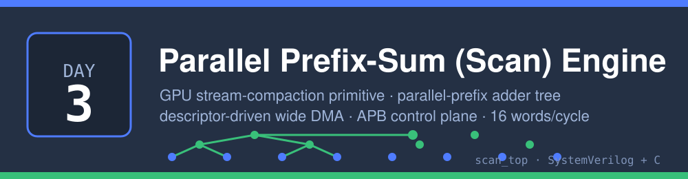
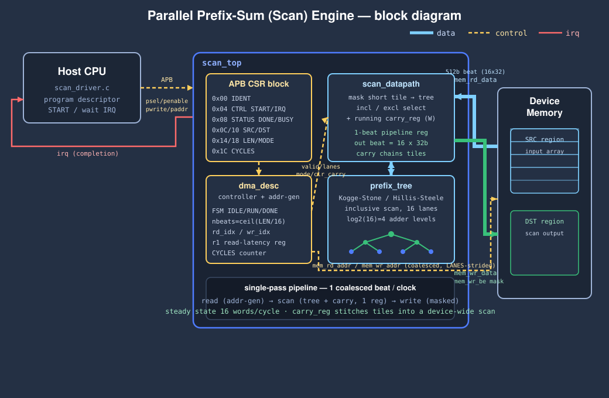

# Day 3 — Parallel Prefix-Sum (Scan) Engine



A hardware realization of the single most-used building block in GPU compute:
the **parallel prefix sum (scan)**. `DeviceScan` in CUB / `thrust::scan` sit
underneath stream compaction, radix sort, sparse-matrix builds, BFS frontier
construction, histogram offsetting and run-length encoding — anywhere a variable
number of outputs has to be packed into a dense array. This day puts that
primitive on silicon: a descriptor-driven engine that streams an array through a
LANES-wide **parallel-prefix adder tree**, chaining a running carry across
coalesced memory beats so a single pass produces the whole device-wide scan.

It computes, for an input array `x[0..N)`, either

- **inclusive** scan: `y[i] = x[0] + x[1] + … + x[i]`, or
- **exclusive** scan: `y[i] = x[0] + x[1] + … + x[i-1]` (with `y[0] = 0`),

in unsigned 32-bit modular arithmetic, bit-exact against a software reference.

## The problem

A scalar scan is a textbook latency trap: every element's output depends on the
running sum from the element before it, so a CPU loop is one long serial
dependency chain — roughly load + add + store per element with no room to
overlap the carried add. It cannot be vectorized naively because of that
recurrence. The classic fix (used on every GPU) is a **parallel-prefix
network**: within a tile of LANES elements the prefix sums are computed by a
`log2(LANES)`-depth adder tree in parallel, and tiles are stitched together by
adding each tile's running carry. That is exactly what this engine builds in
hardware, one coalesced tile per clock.

## Hardware / software partition

| Put in **hardware** | Why |
|---|---|
| The `log2(LANES)`-level parallel-prefix adder tree | The serial recurrence is the whole cost; doing LANES prefix adds in parallel each clock is the entire point. In one clock the tree does what the CPU needs `~LANES` dependent iterations for. |
| The running cross-tile carry | Chaining tiles with one carry-add per beat turns per-tile scans into a device-wide scan with no host round-trip — the single-pass trick. |
| The coalesced wide-DMA address generator | A 512-bit (16×32) beat per clock models GPU memory coalescing and keeps the tree fed at 1 tile/clock; letting the engine walk memory itself removes the CPU from the data path entirely. |
| Short-tile masking + per-word write-enables | Arbitrary lengths (not just multiples of LANES) must be correct without a separate slow path. |

| Kept in **software** | Why |
|---|---|
| Descriptor programming + completion handling (`scan_driver.c`) | One-time control cost, amortized over the whole array; belongs on the CPU. Trivial register pokes, then wait on the interrupt. |
| Golden reference + scalar baseline (`scan_ref.c`, `scan_baseline.c`) | Correctness oracle and the measuring stick for speedup — pure software by definition. |
| Vector / job generation (`scan_host.c`) | Test infrastructure, not a runtime concern. |

The CPU never touches array data: it writes six control registers, pulses
`START`, and waits for the completion interrupt. All movement and computation is
the engine's.

## Architecture



- **`prefix_tree.v`** — combinational Kogge-Stone / Hillis-Steele inclusive-scan
  network over LANES words: `ceil(log2(LANES))` levels of LANES adders, plus the
  tile total exported for carry chaining.
- **`scan_datapath.v`** — masks the short final tile to zero, runs the tree,
  selects inclusive vs. exclusive, adds the running carry, and registers the
  scanned beat (a 1-cycle pipeline stage). Advances the carry by the tile total.
- **`dma_desc.v`** — descriptor controller + coalesced-DMA address generator. A
  3-stage pipeline (read → scan → write) retires one 512-bit beat per clock; a
  1-cycle register aligns bookkeeping with the memory's read latency, and a
  counter measures the exact `START→DONE` latency.
- **`scan_top.v`** — APB CSR control plane, interrupt logic, the wide memory
  master port, and the datapath/controller wiring.

Data flows `mem → datapath → mem` on the wide (thick) paths; the controller
drives address generation and datapath control (dashed); completion raises the
interrupt back to the CPU (red).

## Register map (APB, byte offsets)

| Offset | Name | Access | Meaning |
|---|---|---|---|
| `0x00` | `IDENT` | R | `0x5CA40003` — identity / probe |
| `0x04` | `CTRL` | W | `[0]` START, `[1]` IRQ_EN, `[2]` IRQ_CLR |
| `0x08` | `STATUS` | R | `[0]` DONE, `[1]` BUSY, `[2]` IRQ |
| `0x0C` | `SRC` | RW | source base (word address) |
| `0x10` | `DST` | RW | destination base (word address) |
| `0x14` | `LEN` | RW | element count |
| `0x18` | `MODE` | RW | `[0]` = 1 exclusive, 0 inclusive |
| `0x1C` | `CYCLES` | R | measured `START→DONE` latency of the last job |

Descriptor = `{SRC, DST, LEN, MODE}`. Driver sequence: check `IDENT` → write the
four descriptor registers → write `CTRL = START|IRQ_EN` → wait `STATUS.DONE`
(or the IRQ) → read `CYCLES` → write `CTRL = IRQ_CLR`.

## Build & run

```bash
make sw       # build host/driver/reference/baseline, generate the vector suite
make sim      # Icarus differential testbench (fails on any mismatch)
make metrics  # regenerate results/metrics.md from the run
make elab     # elaborate RTL at LANES = 8, 16, 32
make synth    # analytical area estimate (Yosys absent here)
make all      # sim + metrics
```

Toolchain in this environment: **Icarus Verilog** (`iverilog`/`vvp`) for
simulation and a C compiler for the software. **Verilator and Yosys are not
installed**, so `make synth` prints an analytical gate/flop estimate from
`scripts/area_estimate.py` instead of a synthesized cell report — the one tool
substitution, called out here as required.

## Results — measured

Default geometry `LANES=16, W=32`; 292 jobs (256 random + 36 corner cases),
lengths 0…2047 in both scan modes, over full-range 32-bit data. All numbers are
extracted from `results/sim.log`; the baseline is the documented scalar cost
model. See [results/metrics.md](results/metrics.md).

| Metric | Value |
|---|---|
| Jobs run | 292 |
| Output words checked | 257,960 |
| **Mismatches vs golden** | **0** |
| Total hardware cycles | 17,127 |
| Sustained throughput | **15.06 words/cycle** |
| Peak job (2047 elems) | 131 cycles → **15.63 words/cycle** |
| Ideal steady state | 16.0 words/cycle (one 16-word beat/clock) |
| Scalar baseline (model) | 3 cycles/element |
| **Aggregate speedup** | **45.18×** |
| **Peak speedup** | **46.88×** |

The sustained 15.06 words/cycle is within 6% of the 16 words/cycle roofline; the
gap is the fixed pipeline fill/drain amortized across many small jobs. The
scalar baseline is deliberately conservative — 3 cycles/element ignores loop
overhead, so it under-counts software cost and never inflates the speedup.

Area estimate (analytical, `LANES=16, W=32`): 4 prefix levels, 81 × 32-bit
adders, ~759 flip-flops, ≈ 27.9k gates. Critical path is the 4-level prefix tree
plus the carry add (or the APB read mux).

## What I verified

- **Bit-exact correctness**: 257,960 output words across 292 jobs match the
  software golden with **zero mismatches**, in both inclusive and exclusive
  modes, including full-range 32-bit values that exercise modular wraparound.
- **Corner cases**: length 0 (nothing written), 1, tile-boundary ±1
  (`15/16/17`, `31/32/33`, `63/64/65`, `255/256/257`, `1023`), all-zero and
  all-ones data, and randomized non-aligned source/destination addresses.
- **Protocol**: `IDENT` probe over APB, descriptor programming, `START`/`DONE`
  handshake, and the measured `CYCLES` register read back per job.
- **Parameterization**: elaborates cleanly at `LANES = 8, 16, 32` (`make elab`).
- **Throughput/latency**: cycles are read from the hardware `CYCLES` register per
  job, not asserted; speedup is versus a software baseline that is also built and
  run here.
