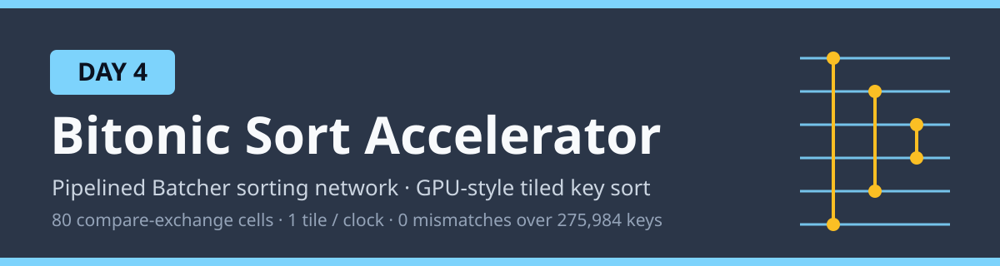
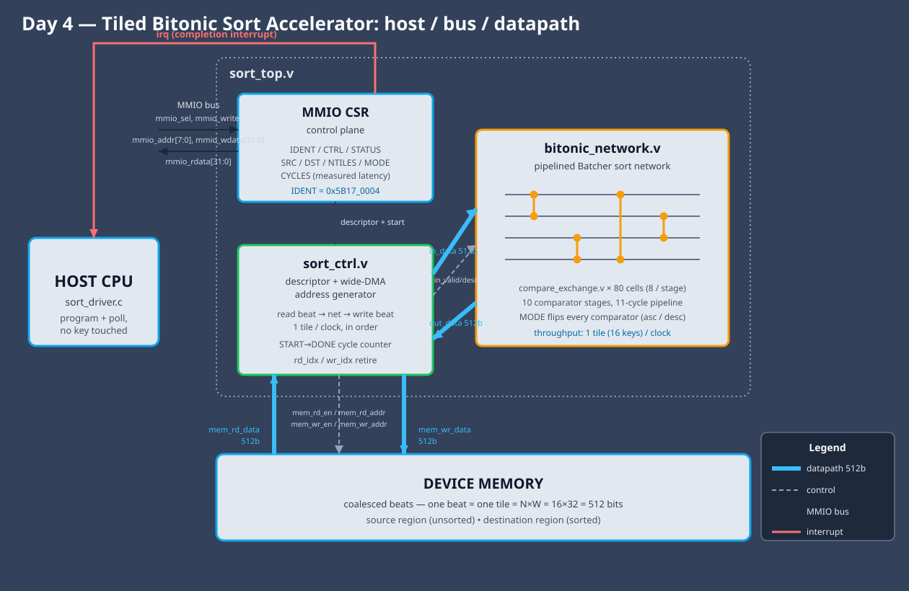

# Day 4 — Tiled Bitonic Sort Accelerator



A hardware realization of the other workhorse GPU primitive (after scan): the
**sort**. On a GPU, `cub::DeviceRadixSort` / `thrust::sort` are built on top of
*block-* and *warp-*local sorts, and the classic data-independent way to sort a
fixed group of keys in parallel hardware is **Batcher's bitonic sorting
network**. This day puts that primitive on silicon: a descriptor-driven engine
that streams a batch of tiles through a fully-pipelined bitonic network and
retires one fully-sorted tile of `N` keys every clock.

For each contiguous tile of `N` unsigned keys it produces the same tile sorted

- **ascending** (`MODE = 0`), or
- **descending** (`MODE = 1`),

bit-exact against a software reference, for arbitrary batches of `NTILES` tiles.

## The problem

Sorting is the ugliest primitive to accelerate because a general comparison
sort is *data-dependent*: the comparisons a quicksort or heapsort performs
depend on the values, so the control flow branches unpredictably and a CPU
stalls on mispredicts. Batcher's insight is that a **bitonic network** sorts
with a *fixed*, data-independent schedule of compare-exchanges — the same
comparators fire in the same order regardless of the data. That is exactly what
makes it map to SIMD lanes on a GPU and to fixed silicon here: no branches, no
variable trip count, just `log²(N)`-depth of parallel compare-exchanges. A tile
of `N = 16` keys is sorted by `10` comparator stages of `8` compare-exchanges
each — `80` comparisons that a scalar core does one-at-a-time and a spatial
network does all at once, one tile deep into the pipeline every clock.

## Hardware / software partition

| Put in **hardware** | Why |
|---|---|
| The bitonic comparator network (`bitonic_network` + `compare_exchange`) | The whole point: `N/2` compare-exchanges per stage run in parallel, and the network is fully pipelined so a new tile enters every clock. A scalar core does these `N·log₂N` comparisons serially with branch mispredicts; the network does a stage's worth every cycle with none. |
| Per-tile direction (ascending / descending) | A single `MODE` bit XORed into every comparator flips the whole network — one sort engine covers both orders with no second datapath. |
| The coalesced wide-DMA address generator (`sort_ctrl`) | One `N·W`-bit beat per clock (512-bit here) is exactly one tile and models GPU memory coalescing; letting the engine walk memory itself keeps the network fed at one tile/clock and removes the CPU from the data path. |
| In-order retire + START→DONE cycle counter | A single write index reconstructs each sorted tile's address, and the counter measures real latency for the report instead of estimating it. |

| Kept in **software** | Why |
|---|---|
| Descriptor programming + completion handling (`sort_driver.c`) | One-time control cost amortized over the whole batch; trivial register pokes, then wait on the interrupt. |
| Golden reference + scalar baseline (`sort_ref.c`, `sort_baseline.c`) | Correctness oracle and the measuring stick for speedup — pure software by definition. |
| Vector / job generation (`sort_host.c`) | Test infrastructure, not a runtime concern. |

The CPU never touches a single key: it writes the descriptor registers, pulses
`START`, and waits for the completion interrupt. All movement and comparison is
the engine's.

## Architecture



- **`compare_exchange.v`** — the atomic 2-input compare-exchange (CAE) cell: one
  unsigned comparator plus two muxes, routing min/max to the low/high index per
  a direction bit. The whole design is `80` of these.
- **`bitonic_network.v`** — the pipelined Batcher network. Nested generate loops
  build the classic index-based schedule (`for k = 2…N`, `for j = k/2…1`,
  partner `= i ⊕ j`, ascending iff `(i & k) == 0`), one comparator **stage** per
  `(k, j)`, with a pipeline register after every stage. `LOGN·(LOGN+1)/2` stages;
  `valid` and the per-tile direction ride alongside each tile in shift registers.
- **`sort_ctrl.v`** — descriptor controller + coalesced wide-DMA address
  generator. Issues one read beat per clock, aligns the returned data to the
  network with a 1-cycle valid register, and retires sorted beats in order to
  reconstruct destination addresses. Measures the exact `START→DONE` latency.
- **`sort_top.v`** — MMIO CSR control plane, interrupt logic, the wide memory
  master port, and the controller/network wiring.

Data flows `mem → sort_ctrl → bitonic_network → sort_ctrl → mem` on the wide
(thick) 512-bit paths; the controller drives address generation and network
handshake (dashed); completion raises the interrupt back to the CPU (red).

## Register map (MMIO, byte offsets)

| Offset | Name | Access | Meaning |
|---|---|---|---|
| `0x00` | `IDENT` | R | `0x5B170004` — identity / probe |
| `0x04` | `CTRL` | W | `[0]` START, `[1]` IRQ_EN, `[2]` IRQ_CLR |
| `0x08` | `STATUS` | R | `[0]` DONE, `[1]` BUSY, `[2]` IRQ |
| `0x0C` | `SRC` | RW | source base (word address) |
| `0x10` | `DST` | RW | destination base (word address) |
| `0x14` | `NTILES` | RW | number of `N`-key tiles to sort |
| `0x18` | `MODE` | RW | `[0]` = 1 descending, 0 ascending |
| `0x1C` | `CYCLES` | R | measured `START→DONE` latency of the last job |

Descriptor = `{SRC, DST, NTILES, MODE}`. Driver sequence: check `IDENT` → write
the four descriptor registers → write `CTRL = START|IRQ_EN` → wait `STATUS.DONE`
(or the IRQ) → read `CYCLES` → write `CTRL = IRQ_CLR`.

## Build & run

```bash
make sw       # build host/driver/reference/baseline, generate the vector suite
make sim      # Icarus differential testbench (fails on any mismatch)
make metrics  # regenerate results/metrics.md from the run
make elab     # elaborate RTL at N = 8, 16, 32
make synth    # analytical area estimate (Yosys absent here)
make all      # sim + metrics
```

Toolchain in this environment: **Icarus Verilog** (`iverilog`/`vvp`) for
simulation and a C compiler for the software. **Verilator and Yosys are not
installed**, so `make synth` prints an analytical gate/flop estimate from
`scripts/area_estimate.py` instead of a synthesized cell report — the one tool
substitution, called out here as required.

## Results — measured

Default geometry `N=16, W=32`; 286 jobs (256 random + 30 corner cases), batches
of 0…128 tiles, both sort directions, over full-range 32-bit keys and
adversarial data. All numbers are extracted from `results/sim.log`; the baseline
is the documented scalar cost model. See [results/metrics.md](results/metrics.md).

| Metric | Value |
|---|---|
| Jobs run | 286 |
| Keys checked | 275,984 |
| **Mismatches vs golden** | **0** |
| Tiles sorted | 17,249 |
| Total hardware cycles | 20,941 |
| Sustained throughput | **13.18 keys/cycle** |
| Peak job (128 tiles) | 141 cycles → **14.52 keys/cycle** |
| Ideal steady state | 16.0 keys/cycle (one 16-key tile/clock) |
| Scalar baseline (model) | 128 cycles/tile |
| **Aggregate speedup** | **105.43×** |
| **Peak speedup** | **116.20×** |

The peak 14.52 keys/cycle is within ~9% of the 16 keys/cycle roofline; the gap
is the fixed pipeline fill/drain (11-cycle network latency + 1-cycle memory
read) amortized across each job. The scalar baseline is deliberately
conservative — `128 cycles/tile` charges only the merge-sort comparison floor
(`N·⌈log₂N⌉` comparisons at 2 cycles each) and ignores recursion, pivoting and
branch mispredicts, so it under-counts software cost and never inflates the
speedup. The large multiple is the nature of a fully-spatial sorting network:
80 comparators retire a tile every clock while a scalar core walks the same
comparisons one mispredicted branch at a time.

Area estimate (analytical, `N=16, W=32`): 10 comparator stages, 80 × 32-bit
compare-exchange cells, an 11-cycle pipeline, ~5,792 flip-flops, ≈ 62.9k gates.
Critical path is a single compare-exchange stage (a 32-bit compare + a 32-bit
mux) between pipeline registers.

## What I verified

- **Bit-exact correctness**: 275,984 keys across 286 jobs match the software
  golden with **zero mismatches**, in both ascending and descending modes,
  including full-range 32-bit keys.
- **Corner cases**: empty batch (nothing written), single tile, the maximum
  128-tile batch, all-equal / all-zero / all-ones tiles (full-range unsigned
  compares), already-sorted and reverse-sorted inputs, and duplicate-heavy
  two-value tiles — all in both directions, at randomized source/destination
  addresses.
- **Protocol**: `IDENT` probe over MMIO, descriptor programming, `START`/`DONE`
  handshake, and the measured `CYCLES` register read back per job.
- **Parameterization**: elaborates cleanly at `N = 8, 16, 32` (`make elab`).
- **Throughput/latency**: cycles are read from the hardware `CYCLES` register per
  job, not asserted; speedup is versus a software baseline that is also built and
  run here.
