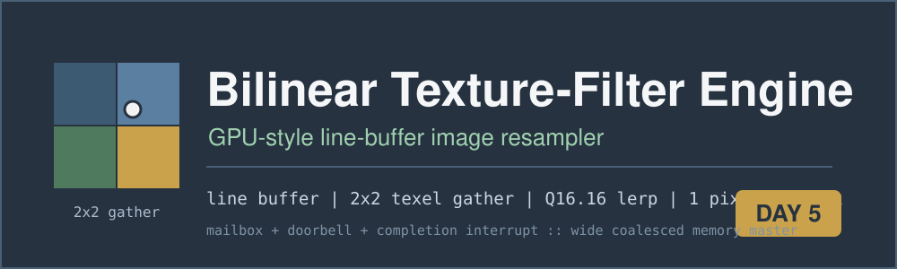
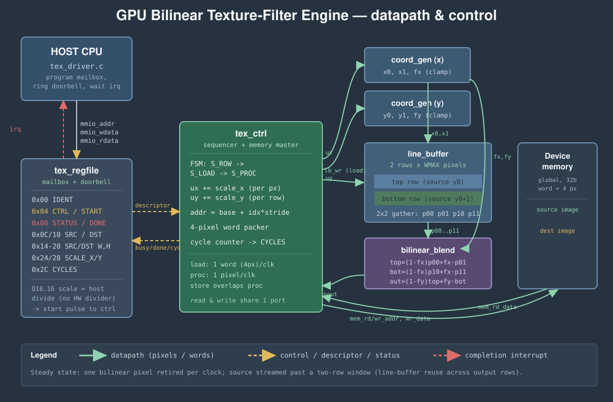

# Day 5 — GPU-Style Bilinear Texture-Filter / Image-Resampler Engine

A fixed-function **texture-sampling unit**: the block a GPU uses to magnify, minify
and warp images. It resamples an 8-bit source image to an arbitrary destination
size with **bilinear filtering** — for every output pixel it gathers the four
neighbouring source texels, weights them by the fractional sample position, and
blends. The engine retires **one filtered pixel per clock** in steady state, and
it does so while keeping only **two source rows on chip** (a *line buffer*), so
memory footprint is independent of image height.

The interface is a **mailbox + doorbell** control plane with a **completion
interrupt**, over a **wide coalesced memory master** for pixel data. The host
programs a job descriptor, rings the doorbell, and is interrupted when the
resampled image is in memory.

---

## The problem

Bilinear resampling is cheap per pixel but *bandwidth- and latency-bound* on a
scalar CPU: each output pixel needs four dependent loads, a handful of multiplies
and shifts, two clamps, and a store — tens of instructions, with the loads on the
critical path. An image scale touches millions of pixels, so a CPU spends all its
time on address arithmetic and cache misses.

The structure the hardware exploits is that output pixels are produced in raster
order, so the source coordinate advances **monotonically**. That means:

- the four texels for a pixel are always in the **two source rows** straddling
  the current vertical position — never the whole image;
- consecutive output rows very often reuse the *same* source row pair (whenever
  magnifying), so those rows never need to be refetched.

A two-row on-chip **line buffer** turns the four random texel loads into four
single-cycle on-chip reads, and the blend becomes a fixed datapath that produces
a pixel every clock.

## Hardware / software partition

| Concern | Where | Why |
|---|---|---|
| Per-pixel coordinate stepping (`ux += scale_x`) | **HW** | one add/clock, no multiplier on the hot path |
| 2×2 texel gather | **HW** | four concurrent on-chip reads from the line buffer — impossible to sustain from a cache |
| Bilinear blend (3 lerps) | **HW** | fixed multiplier datapath, one pixel/clock |
| Row streaming + write-back | **HW** | coalesced wide beats, load/store overlap the compute |
| Completion signalling | **HW** | doorbell → interrupt, no polling required |
| **Scale-factor reciprocal** (`src/dst` → Q16.16) | **SW** | a single divide per job; keeps a **divider out of the datapath** |
| Descriptor setup, buffer allocation | **SW** | infrequent, flexible, belongs on the CPU |

The division that turns source/destination extents into the Q16.16 step is done
**once per job on the host** (`tex_scale()` in [sw/tex_accel.h](sw/tex_accel.h)),
so the accelerator never needs a divider — a deliberate co-design split.

## Architecture



Five submodules under a flat top level ([rtl/](rtl/)):

- **[tex_regfile.v](rtl/tex_regfile.v)** — mailbox + doorbell + interrupt. The
  entire software-visible surface.
- **[tex_ctrl.v](rtl/tex_ctrl.v)** — the sequencer and wide memory master. Walks
  the destination image row by row (`S_ROW → S_LOAD → S_PROC`), owns the `ux/uy`
  Q16.16 accumulators and the address generator, and packs four filtered pixels
  into each store word.
- **[line_buffer.v](rtl/line_buffer.v)** — the two resident source rows. Written
  a memory word (4 pixels) at a time by the loader; read as a 2×2 texel gather
  combinationally, which is what lets the blend retire one pixel per clock.
- **[coord_gen.v](rtl/coord_gen.v)** — fixed-point neighbour/weight resolver
  (instantiated once for x, once for y): clamp-to-edge integer indices `i0,i1`
  and the 8-bit fractional weight.
- **[bilinear_blend.v](rtl/bilinear_blend.v)** — the four-texel filter datapath,
  three integer lerps, bit-identical to the software model.

### Datapath detail

Coordinates are **Q16.16**. Per output pixel the sampler forms

```
x0 = clamp(ux>>16),  x1 = clamp(x0+1),  fx = (ux>>8)&0xFF   // 0..255
y0 = clamp(uy>>16),  y1 = clamp(y0+1),  fy = (uy>>8)&0xFF
top = p00*(256-fx) + p01*fx            // horizontal lerp, top row
bot = p10*(256-fx) + p11*fx            // horizontal lerp, bottom row
out = (top*(256-fy) + bot*fy) >> 16    // vertical lerp -> 8-bit pixel
```

All integer; weights sum to 256 so the arithmetic is exact and the `>>16` returns
a byte. The same equation is the software golden model, so the differential test
requires **zero** mismatches — not "close enough".

Pixels are packed **4 per 32-bit word** (little-endian byte lanes); source rows
load and destination rows store as coalesced word beats. Loads (`S_LOAD`) and
stores (during `S_PROC`) never occur in the same phase, so a single memory port
serves both.

## Register map

Mailbox at the MMIO base; all registers are 32-bit. See
[sw/tex_accel.h](sw/tex_accel.h).

| Offset | Name | Access | Description |
|---|---|---|---|
| `0x00` | `IDENT` | R | Engine identity, `0x5B170005` |
| `0x04` | `CTRL` | W | `[0]` START (doorbell), `[1]` IRQ_EN, `[2]` IRQ_CLR |
| `0x08` | `STATUS` | R | `[0]` DONE, `[1]` BUSY, `[2]` IRQ |
| `0x0C` | `SRC` | R/W | Source base (word address) |
| `0x10` | `DST` | R/W | Destination base (word address) |
| `0x14` | `SRC_W` | R/W | Source width (pixels, multiple of 4) |
| `0x18` | `SRC_H` | R/W | Source height (pixels) |
| `0x1C` | `DST_W` | R/W | Destination width (pixels, multiple of 4) |
| `0x20` | `DST_H` | R/W | Destination height (pixels) |
| `0x24` | `SCALE_X` | R/W | Q16.16 source-pixels-per-dest-pixel, x |
| `0x28` | `SCALE_Y` | R/W | Q16.16 source-pixels-per-dest-pixel, y |
| `0x2C` | `CYCLES` | R | Cycles of the last completed job |

**Driver sequence** ([sw/tex_driver.c](sw/tex_driver.c)): write the eight
descriptor registers → write `CTRL = START | IRQ_EN` → on the interrupt, read
`CYCLES` and write `CTRL = IRQ_CLR`.

## Build & run

Requires `iverilog`, `vvp`, a C compiler, and `python3`.

```bash
make sw       # build host/driver/reference/baseline, generate the vectors
make sim      # compile the RTL and run the differential testbench
make metrics  # regenerate results/metrics.md from the run
make elab     # elaborate the RTL at three parameter sets (WMAX 32/64/128)
make synth    # analytical area estimate (Yosys not present here)
make all      # sw -> sim -> metrics
```

The host ([sw/tex_host.c](sw/tex_host.c)) generates 290 jobs — 280 random scales
plus 10 corner cases (1:1 identity copy, 16× magnify, 16× minify, a height-1
source that exercises vertical clamp-to-edge, and tall/wide anisotropic images) —
each with its own source image and golden output. The testbench
([tb/tex_tb.sv](tb/tex_tb.sv)) replays them against the RTL and checks every
output word.

## Results

Measured with Icarus Verilog; the full table is in
[results/metrics.md](results/metrics.md). Hardware cycles are measured from the
RTL simulation. The software baseline is a **dynamic instruction count over the
real pixel workload** at one op/cycle (33 ops per pixel + per-row overhead;
[sw/tex_baseline.c](sw/tex_baseline.c)), the same figure the CPU would pay.

| Metric | Value |
|---|---|
| Jobs run | 290 |
| Output pixels filtered | 314,316 |
| Output words checked | 78,579 |
| **Mismatches vs golden** | **0** |
| Total hardware cycles | 467,128 |
| Sustained throughput | **0.67 pixels/cycle** |
| Peak throughput | **0.97 pixels/cycle** (of 1.0 ideal) |
| Aggregate speedup over scalar | **22.49×** |
| Peak speedup over scalar | **32.35×** |

Steady state is **1.0 filtered pixel per clock** (the blend datapath). The peak
0.97 pixels/cycle is a large-magnification job where the line buffer is reused
across nearly every output row, so almost no cycles go to refetching. The
aggregate 0.67 pixels/cycle folds in minification jobs (which reload both source
rows every output row — genuinely bandwidth-bound) and the fixed per-row/per-job
setup, which is exactly the honest steady-state a real texture unit sees on a
mixed workload.

## What was verified

- **Bit-exact** against the software golden model over **290 jobs / 314,316
  output pixels / 78,579 words — 0 mismatches.**
- **Corner cases**: 1:1 identity copy (must reproduce the source exactly, and
  does), extreme 16× magnify and minify, a single-row source (vertical
  clamp-to-edge), and anisotropic scales that magnify one axis while minifying
  the other.
- **Golden ⇄ baseline agreement**: the vector generator cross-checks the
  reference and the scalar baseline produce byte-identical images before a job is
  emitted.
- **Parameterization**: elaborates cleanly at `WMAX ∈ {32, 64, 128}` with
  matching address widths (`make elab`).

## Notes / honesty

- `verilator` and `yosys` are not installed here; simulation is Icarus Verilog
  and `make synth` prints an **analytical** area estimate, labelled as such.
- The blend datapath is combinational for clarity; in silicon its multiplies
  would be pipelined for fmax (the per-pixel throughput is unchanged).
- The software baseline is an instruction-count *model*; the hardware cycles and
  the mismatch count are **measured**. No number here is asserted rather than
  observed.
