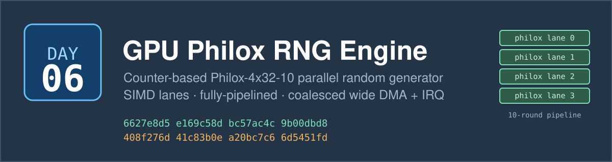
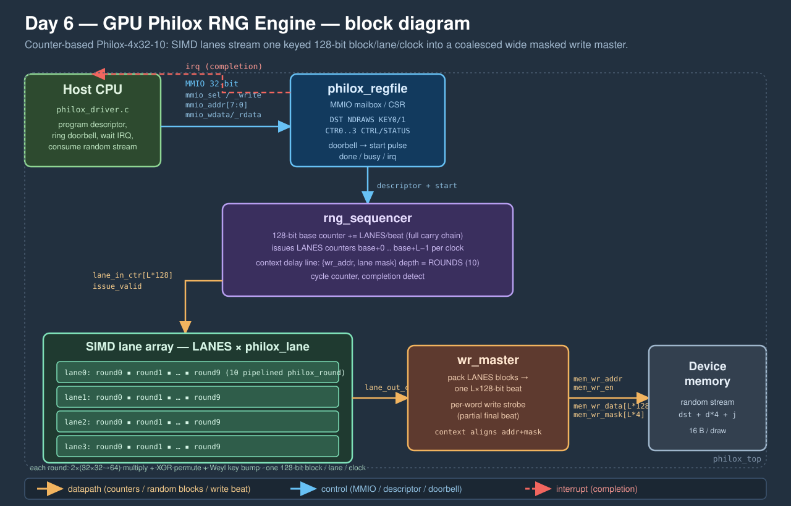

# Day 6 — GPU-Style Philox Counter-Based Parallel RNG Engine

A fixed-function **random-number generator** — the block a GPU leans on for
Monte-Carlo. It implements **Philox-4x32-10**, the counter-based PRNG from
Random123 (Salmon, Moraes, Dror & Shaw, SC'11) and the default generator in
NVIDIA cuRAND. Philox is not a stateful stream cipher: the *n*-th random draw is
a **keyed, invertible function of the integer *n***, with no carried state. That
one property is why it dominates GPU / HFT Monte-Carlo — every simulation path
and timestep gets its own independent, perfectly reproducible sub-stream from
its own counter, and generation parallelises with **zero coordination**.

This engine is the silicon version of that generator core. A **SIMD array of
fully-pipelined Philox lanes** consumes one 128-bit counter per lane per clock
and, ten rounds later, retires that counter's 128-bit random block — so at
`LANES = 4` it produces **512 random bits (16 × 32-bit words) every clock** in
steady state. The host programs a descriptor (destination, draw count, 64-bit
key, 128-bit base counter) over an **MMIO mailbox**, rings a doorbell, and is
interrupted when the stream is in memory, delivered by a **coalesced wide masked
write master**.

---

## The problem

A counter-based PRNG is *arithmetically heavy per draw*: Philox-4x32-10 is ten
rounds, each round two 32×32→64 multiplies plus an XOR permutation and a key
bump — on the order of **130 scalar operations per 128-bit draw**. A Monte-Carlo
pricer might need billions of draws, and on a scalar CPU every one of them walks
that whole multiply/XOR chain sequentially.

But the structure is ideal for hardware:

- **No dependence between draws.** Draw *n* depends only on counter `base + n`,
  never on draw *n−1*. So draws can be generated *in parallel* (SIMD lanes) and
  *pipelined* (a new counter every clock) with no hazards — the exact opposite of
  a Mersenne-Twister-style stateful generator.
- **The round is a fixed datapath.** Two constant-multiplier multiplies and a
  fixed wiring permutation — no control flow, no memory — so each round is one
  pipeline stage and the lane retires one draw per clock after fill.
- **Output is pure, coalesced writes.** The engine only *produces* data, so the
  memory side is a wide sequential write stream with no read traffic.

The hardware turns 130 serial ops/draw into `LANES` draws every clock.

## Hardware / software partition

| Concern | Where | Why |
|---|---|---|
| Philox round (2 muls + XOR permute) | **HW** | fixed datapath, one round/stage, no control flow |
| 10-round pipeline, one draw/clock/lane | **HW** | draws are independent — perfect for a pipeline |
| SIMD replication across lanes | **HW** | counter-based ⇒ embarrassingly parallel, no coordination |
| 128-bit counter walk + carry | **HW** | one add/beat on the issue path, spans 32-bit word wraps |
| Coalesced wide masked write-back | **HW** | pack `LANES` blocks into one beat; strobe the partial tail |
| Completion signalling | **HW** | doorbell → interrupt, no polling required |
| **Key / base-counter assignment** (path & stream tiling) | **SW** | which counter range maps to which path is a modelling choice |
| Descriptor setup, buffer allocation | **SW** | infrequent, flexible, belongs on the CPU |
| Consuming draws (uniform→float, Box–Muller, …) | **SW** | downstream transform varies per application |

Splitting a Monte-Carlo workload into disjoint counter ranges under a shared key
is a **software** decision (two jobs with the same key and non-overlapping
counter windows produce disjoint, reproducible sub-streams); the **hardware**
just turns a (key, counter-range) descriptor into bits as fast as the lanes allow.

## Architecture



Five submodules under a flat top level ([rtl/](rtl/)):

- **[philox_round.v](rtl/philox_round.v)** — one combinational Philox-4x32 round:
  two 32×32→64 multiplies by the fixed multipliers `M0/M1`, then the cross-XOR
  permutation under the round key. Bit-identical to `phx_round()` in
  [sw/philox_accel.h](sw/philox_accel.h).
- **[philox_lane.v](rtl/philox_lane.v)** — one fully-pipelined lane: `ROUNDS`
  round stages separated by pipeline registers, with the Weyl key schedule
  (`k += r·W`) unrolled as constants of the job key. Accepts a fresh counter
  every clock, retires its 128-bit block `ROUNDS` cycles later.
- **[rng_sequencer.v](rtl/rng_sequencer.v)** — the control core: walks the counter
  range, issues `LANES` counters (`base+0 … base+L−1`) per clock with a full
  128-bit carry chain, and runs a **context delay line** (write address + partial
  lane mask) clocked in lockstep with the lanes so each beat's address and mask
  emerge exactly when its random words do. Detects completion and counts cycles.
- **[wr_master.v](rtl/wr_master.v)** — packs the `LANES` retiring blocks into one
  `LANES·128`-bit beat and expands the per-lane valid mask into a per-32-bit-word
  write strobe (AXI-wstrb style), so a partial final beat writes only real draws.
- **[philox_regfile.v](rtl/philox_regfile.v)** — the MMIO mailbox: descriptor
  registers, doorbell → start pulse, sticky done, and the completion interrupt.

The top level **[philox_top.v](rtl/philox_top.v)** wires the mailbox to the
sequencer, the sequencer to the `LANES`-wide lane array, and the lanes to the
write master. Everything is parameterized by `LANES`, `ROUNDS` and `ADDR_WIDTH`
(the design elaborates from a single lane to a wide SIMD engine, and even at a
reduced round count — see `make elab`).

## Register map

MMIO mailbox, 32-bit registers (byte offsets). Base is target-defined
(`0x4000_0000` in the driver).

| Offset | Name | Dir | Meaning |
|---|---|---|---|
| `0x00` | `IDENT`  | RO | engine identity, reads `0x5B160006` |
| `0x04` | `CTRL`   | WO | `[0]` START (doorbell) · `[1]` IRQ_EN · `[2]` IRQ_CLR |
| `0x08` | `STATUS` | RO | `[0]` DONE · `[1]` BUSY · `[2]` IRQ |
| `0x0C` | `DST`    | RW | destination base (32-bit word address) |
| `0x10` | `NDRAWS` | RW | number of Philox draws (16 B / 4 words each) |
| `0x14` | `KEY0`   | RW | Philox key word 0 (stream / seed low) |
| `0x18` | `KEY1`   | RW | Philox key word 1 (stream / seed high) |
| `0x1C` | `CTR0`   | RW | base counter word 0 (LSW) |
| `0x20` | `CTR1`   | RW | base counter word 1 |
| `0x24` | `CTR2`   | RW | base counter word 2 |
| `0x28` | `CTR3`   | RW | base counter word 3 (MSW) |
| `0x2C` | `CYCLES` | RO | hardware cycles of the last completed job |
| `0x30` | `LANES`  | RO | SIMD lane count (build parameter) |

Draw *d* writes 4 little-endian words at `DST + d*4`; the 128-bit counter for
draw *d* is `{CTR3,CTR2,CTR1,CTR0} + d` with carry across the words.

Launch sequence (see [sw/philox_driver.c](sw/philox_driver.c)): write
`DST/NDRAWS/KEY0/KEY1/CTR0..3`, then `CTRL = START | IRQ_EN`; on the completion
interrupt read `CYCLES` and `CTRL = IRQ_CLR`.

## Build & run

Requires a C compiler and **Icarus Verilog** (`iverilog`/`vvp`). Yosys and
Verilator are not used here.

```bash
make sw       # build host/driver/reference/baseline, generate test vectors
make sim      # run the Icarus differential testbench (must print TEST PASSED)
make metrics  # regenerate results/metrics.md from the run
make elab     # elaborate the RTL at three parameter sets (LANES 1/4/8)
make synth    # analytical area estimate (Yosys absent) or a real stat if present
make all      # sw -> sim -> metrics
```

The software layer builds a known-answer self-test against the **three published
Random123 `philox4x32x10` vectors** before generating any random job, so the
golden model is anchored to the reference implementation:

```
KAT 0: got 6627e8d5 e169c58d bc57ac4c 9b00dbd8  OK
KAT 1: got 408f276d 41c83b0e a20bc7c6 6d5451fd  OK
KAT 2: got d16cfe09 94fdcceb 5001e420 24126ea1  OK
```

## Results

Measured on this environment (Icarus Verilog), `LANES = 4`, 100 MHz TB clock.
Full table in [results/metrics.md](results/metrics.md).

| Metric | Value |
|---|---|
| Jobs run | 294 (14 corner + 280 random) |
| Random 32-bit words checked vs golden | 276,808 |
| **Mismatches** | **0** |
| Philox draws generated | 69,202 |
| Total hardware cycles | 20,356 |
| Sustained throughput | **3.40 draws/cycle (13.60 words/cycle)** |
| Peak throughput | **3.71 draws/cycle (14.82 words/cycle)** |
| Ideal throughput | 4.0 draws/cycle (16.0 words/cycle) |
| Scalar baseline (model) | 130 ops/draw |
| **Aggregate speedup over scalar** | **441.95×** |
| **Peak speedup over scalar** | **481.76×** |

Ideal steady-state throughput is `LANES` = 4.0 draws/cycle (16.0 random
words/cycle): the four-lane SIMD array retires one Philox-4x32-10 block per lane
per clock. The measured 3.40 sustained / 3.71 peak draws/cycle is that bound
minus the fixed 10-stage pipeline fill/drain and per-job mailbox setup — the gap
closes on longer runs, which is why the peak (a 504-draw job) sits closest to the
ceiling. The speedup is large because Philox is genuinely expensive per draw on a
scalar core (~130 ops) while the engine retires four draws every clock; the
baseline is a dynamic instruction count over the *real* draw workload at one op
per cycle, not an asserted figure.

## What was verified

- **Bit-exact** output over **276,808 random words** across **294 jobs**,
  **0 mismatches** against a software golden model.
- **Three independent implementations agree**: the looped C golden model
  ([philox_ref.c](sw/philox_ref.c)), a hand-unrolled C baseline
  ([philox_baseline.c](sw/philox_baseline.c), cross-checked byte-identical), and
  the Verilog RTL.
- **Anchored to the reference**: all three published Random123 `philox4x32x10`
  known-answer vectors pass in software before the suite runs.
- **Corner cases**: single draw; exact / one-short / one-over lane-beat
  boundaries; all-zero and all-ones counter & key; base counters placed at 32-bit
  wrap points so the **128-bit carry chain** ripples across a job; and draw counts
  with every non-zero remainder mod `LANES` (partial final beat + write strobe).
- **Parameterization**: the RTL elaborates cleanly at `LANES ∈ {1,4,8}` and at a
  reduced round count (`make elab`).
- **Firmware contract**: [philox_driver.c](sw/philox_driver.c) compiles against
  the same register map the testbench drives.
