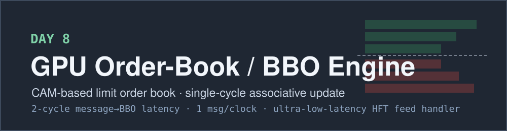
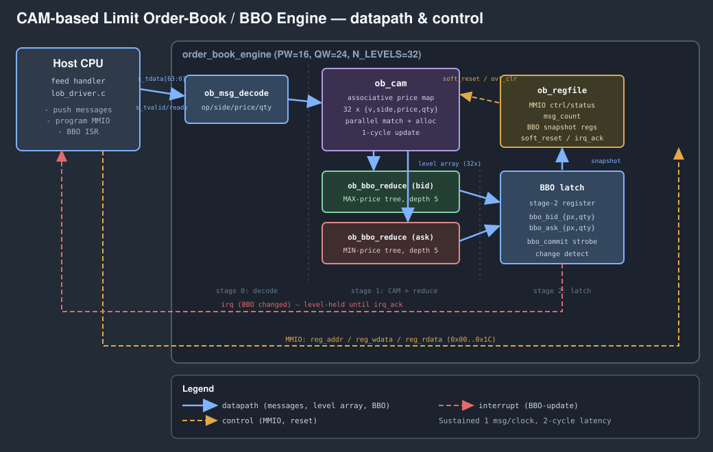

<!-- Author: Asresh -->


# Day 8 — CAM-Based Limit Order-Book / BBO Engine

<!-- readability-guide:start -->
## Plain-language overview

This engine maintains price levels for a limit order book and reports the best buy and sell prices. Software streams market updates; hardware matches prices in parallel and updates the top of book with deterministic latency.

## Abbreviation guide

Every shortened technical term used in this README is expanded below for quick reference:

- **AXI** [Advanced eXtensible Interface]
- **AXI4** [Advanced eXtensible Interface 4]
- **AXI4-Stream** [Advanced eXtensible Interface 4 Stream]
- **BBO** [Best Bid and Offer]
- **CAM** [Content-Addressable Memory]
- **CLR** [Clear]
- **CPU** [Central Processing Unit]
- **CTRL** [Control]
- **FPGA** [Field-Programmable Gate Array]
- **HFT** [High-Frequency Trading]
- **HW** [Hardware]
- **IRQACK** [Interrupt Request Acknowledge]
- **MAX** [Maximum]
- **MIN** [Minimum]
- **MMIO** [Memory-Mapped Input/Output]
- **MSGCOUNT** [Message Count]
- **PW** [Price Width]
- **QW** [Quantity Width]
- **RTL** [Register-Transfer Level]
- **SW** [Software]
<!-- readability-guide:end -->

An **ultra-low-latency limit order-book accelerator**: a content-addressable
price-level map (a hardware CAM) ingests a normalised market-data feed over
AXI4-Stream, maintains an aggregated price-level book, and republishes the
**best bid and best offer (BBO)** two clocks after every message. The whole
match → update → reduce runs at **one message per clock** — the exact shape of
the "book build" that sits on the critical path of every FPGA HFT tick-to-trade
system.

The associative memory is the point. A software book pays an O(L) linear scan to
find the price level and another O(L) scan to recompute the top of book on every
single message. The CAM collapses the find to a **single-cycle parallel match**
across all levels, and a **log-depth comparator tree** collapses the BBO
recompute to a fixed 2-cycle latency regardless of how deep the book is.

## The problem

A market-data feed is a firehose of small messages — add liquidity at a price,
cancel some, replace it, trade against it. Downstream logic (a strategy, a
risk check, a smart order router) only ever needs one derived fact fast: *what
is the best bid and best offer right now?* The naïve software loop rebuilds that
answer with two linear passes over the active levels per message, so its latency
grows with book depth exactly when the book is busiest. In a tick-to-trade path,
those microseconds are the product.

Put the book in silicon and the cost structure inverts. Every price level is a
CAM entry; an incoming `(side, price)` is compared against **all** entries in
parallel in one cycle, the matched level's quantity is updated (or a free slot
is allocated), and two balanced comparator trees pick the max-price bid and
min-price ask simultaneously. Depth stops mattering: the answer is always ready
two clocks later, and a new message can enter every clock.

## Hardware / software partition

| Concern | Where | Why |
|---|---|---|
| Associative `(side,price)` match across all levels | **Hardware** (`ob_cam`) | The whole win: O(L) software search → one-cycle parallel compare. |
| Quantity update, free-slot allocation, overflow | **Hardware** (`ob_cam`) | Priority-encoded, single-cycle; keeps the pipe at 1 msg/clock. |
| Best-bid (max) / best-ask (min) selection | **Hardware** (`ob_bbo_reduce`) | Log-depth comparator tree — fixed latency independent of depth. |
| Message decode (unpack the beat) | **Hardware** (`ob_msg_decode`) | Trivial field slicing at line rate. |
| Feed parse → normalise → push, BBO consumption | **Software** (`lob_driver.c`) | Policy and protocol glue, not throughput; runs once per message but off the critical datapath. |
| Golden book + scalar baseline | **Software** (`lob_ref.c`, `lob_baseline.c`) | The bit-exact reference the hardware is checked against, and the cost model the speedup is measured against. |

The book is *aggregated by price level* (a common feed-handler normalisation),
so the engine holds one entry per distinct `(side, price)` rather than per order
— which is exactly what a CAM is good at.

## Architecture



```
host ──AXI4-Stream──▶ ob_msg_decode ──▶ ob_cam  (32-level associative price map)
   MMIO ctrl/snapshot        │                 │ level array (valid,side,price,qty)
        ▲                     │        ┌────────┴────────┐
        │                     │        ▼                 ▼
   ob_regfile ◀───────────────┘   ob_bbo_reduce(bid)  ob_bbo_reduce(ask)
        │                          MAX-price tree      MIN-price tree
        │                               └──────┬──────────┘
        └───────── irq (BBO changed) ◀──── BBO latch + commit strobe
```

**Two-stage pipeline.** Cycle *t* accepts a beat; `ob_cam` computes the next
level array combinationally from the registered array and registers it. Cycle
*t+1* the two reduction trees read the updated array and the BBO is latched with
a `bbo_commit` strobe. Because each message reads the committed array and writes
the next, back-to-back messages sustain **1 msg/clock** with a **2-cycle**
message-to-BBO latency. A `bbo_commit`-qualified change detector raises the
BBO-update interrupt only when the top of book actually moves.

### Message and BBO formats

A message is one 64-bit AXI4-Stream beat; fields are derived from `QW`/`PW` so
hardware and software agree bit-for-bit:

| Field | Bits | Meaning |
|---|---|---|
| `qty`   | `[23:0]`  | quantity (aggregated) |
| `price` | `[39:24]` | price tick |
| `side`  | `[40]`    | 0 = bid, 1 = ask |
| `op`    | `[42:41]` | 0 ADD, 1 SUB, 2 SET, 3 CLR |

Op semantics (identical in RTL and the golden model): **ADD** `qty += q`
(allocates on a miss); **SUB** `qty = max(qty−q, 0)`; **SET** `qty = q`; **CLR**
remove the level. A level is freed the instant its quantity hits zero; an
allocate on a full book raises a sticky overflow flag and drops the message.

## Register map (32-bit MMIO)

| Offset | Name | Access | Bits | Meaning |
|---|---|---|---|---|
| `0x00` | `CTRL`     | W | `[0]` soft_reset (pulse), `[1]` irq_enable | clear the book / arm interrupt |
| `0x04` | `STATUS`   | R | `[0]` busy, `[1]` overflow, `[2]` irq_pending, `[15:8]` active_levels | engine state |
| `0x08` | `MSGCOUNT` | R | `[31:0]` | messages committed since reset |
| `0x0C` | `IRQACK`   | W | `[0]` | write 1 → clear irq_pending + overflow |
| `0x10` | `BID_PX`   | R | `[15:0]` price, `[16]` valid | best-bid price |
| `0x14` | `BID_QTY`  | R | `[23:0]` | best-bid quantity |
| `0x18` | `ASK_PX`   | R | `[15:0]` price, `[16]` valid | best-ask price |
| `0x1C` | `ASK_QTY`  | R | `[23:0]` | best-ask quantity |

## RTL modules

| File | Role |
|---|---|
| `rtl/ob_msg_decode.v` | Unpack a 64-bit stream beat into `{op, side, price, qty}`. |
| `rtl/ob_cam.v` | The associative memory: parallel `(side,price)` match, single-cycle quantity update, priority-encoded free-slot allocation, sticky overflow. |
| `rtl/ob_bbo_reduce.v` | Parameterized log-depth comparator tree; `MODE=0` picks the max-price bid, `MODE=1` the min-price ask. |
| `rtl/ob_regfile.v` | 32-bit MMIO control/status/snapshot register file; emits `soft_reset` / `irq_ack` pulses. |
| `rtl/order_book_engine.v` | Top level: stream handshake, 2-stage pipeline, BBO latch + commit strobe, change-detect interrupt. |

## Build & run

```bash
make sw       # build host/reference/baseline, generate the message corpus + golden BBO
make sim      # Icarus differential testbench: every BBO vs the golden model
make metrics  # regenerate results/metrics.md from the run
make elab     # elaborate the RTL at three parameter sets
make synth    # analytical area estimate (Yosys not installed here)
make all      # sw -> sim -> metrics
```

**Toolchain note.** This environment has Icarus Verilog + a C compiler but no
Verilator or Yosys, so `make sim` runs under `iverilog`/`vvp` and `make synth`
prints an analytical flip-flop / gate estimate (`scripts/area_estimate.py`)
instead of a synthesized cell report. `make elab` proves the RTL parameterizes
cleanly at `PW/QW/N_LEVELS` = `16/24/32`, `20/32/64`, and `12/16/16`.

## Results (measured)

Icarus Verilog, default parameters `PW=16, QW=24, N_LEVELS=32`. The testbench
runs every stream twice — once with randomised AXI-Stream backpressure
(correctness) and once at full rate (performance) — and checks the engine's BBO
against the software golden model after **every** message.

| Metric | Value |
|---|---|
| Streams (corner + random) | 266 (10 + 256) |
| Messages processed | 8,214 |
| BBO records checked (2 passes) | 16,428 |
| **Mismatches vs golden model** | **0** |
| Overflow streams (HW / SW) | 1 / 1 |
| Longest stream | 64 messages |
| CAM depth | 32 price levels |
| **Message → BBO latency** | **2 cycles** |
| **Sustained throughput** | **0.939 messages/clock** |
| HW cycles (full-rate pass) | 8,746 |
| Baseline cycles (scalar model) | 346,464 |
| Baseline cost / message (avg) | 42.18 cycles |
| Baseline peak / message (full book) | 200 cycles |
| **Aggregate speedup** | **39.61×** |
| **Peak speedup** (full book) | **200.00×** |

Sustained throughput is `messages / full-rate HW cycles`; it sits just under the
1.0 ideal because each of the 266 streams pays a fixed 2-cycle pipeline drain.
The scalar baseline (`lob_baseline.c`) is an explicit, documented cost model —
`C_CMP=2` cycles per level scanned (find + BBO recompute), `C_UPD=4` for the
matched/allocated update, `C_FIX=6` per-message fixed overhead — so the two
linear O(L) scans dominate exactly as they would on a CPU. **Aggregate speedup**
compares total scalar-model cycles to full-rate HW cycles over the identical
8,214-message corpus; **peak speedup** compares the worst-case per-message scalar
cost (a miss against a full 32-level book) to the engine's steady-state 1
message/clock.

Analytical area estimate at the default parameters (`make synth`): ~1,462
flip-flops (1,344 in the 32×42-bit CAM level array) and ~5k 2-input-gate
equivalents, dominated by the two 5-deep BBO reduction trees.

## What was verified

- **Bit-exact BBO** — best-bid/offer price, quantity and valid flags checked
  against the golden reference after all 8,214 messages, in both the
  backpressured and full-rate passes: **0 mismatches**.
- **Corner cases** — empty-book no-ops (SUB/CLR on a miss), price-level
  aggregation, best-level removal stepping the BBO up/down, SUB clamping to zero
  and freeing the level, SET-to-zero freeing, CAM **overflow** (more distinct
  levels than slots) and post-free re-allocation, and max-value price/quantity
  edges.
- **Interface** — AXI4-Stream `tvalid/tready` handshake honoured under randomised
  backpressure; MMIO `MSGCOUNT` cross-checked against the driven message count
  every stream.
- **Parameterization** — clean elaboration at three distinct `PW/QW/N_LEVELS`
  sets.

## Files

```
day08 - gpu_order_book_engine/
├── README.md
├── Makefile
├── rtl/    ob_msg_decode.v  ob_cam.v  ob_bbo_reduce.v  ob_regfile.v  order_book_engine.v
├── tb/     ob_tb.sv            + vectors/ (generated corpus, golden BBO, lob_const.vh)
├── sw/     lob.h  lob_ref.c  lob_baseline.c  lob_host.c  lob_driver.c
├── scripts/ extract_metrics.py  area_estimate.py  elaborate.sh
├── docs/   banner.svg  block_diagram.svg
└── results/ metrics.md  sim.log
```
