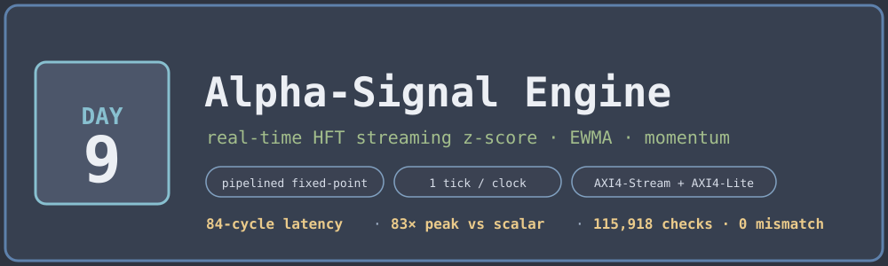
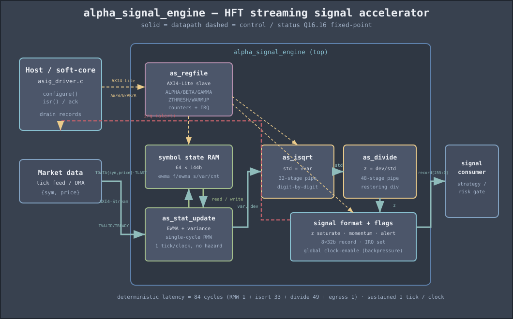

<!-- Author: Asresh -->


# Day 9 — Alpha-Signal Engine (real-time HFT streaming signals)

<!-- readability-guide:start -->
## Plain-language overview

This engine turns incoming market ticks into moving-average, volatility, and momentum signals. Software configures thresholds and consumes alerts; hardware updates per-symbol state and performs the long arithmetic pipeline for every tick.

## Abbreviation guide

Every shortened technical term used in this README is expanded below for quick reference:

- **ACK** [Acknowledge]
- **ALERTCNT** [Alert Count]
- **ALU** [Arithmetic Logic Unit]
- **AXI4** [Advanced eXtensible Interface 4]
- **AXI4-Lite** [Advanced eXtensible Interface 4 Lite]
- **AXI4-Stream** [Advanced eXtensible Interface 4 Stream]
- **CTRL** [Control]
- **EWMA** [Exponentially Weighted Moving Average]
- **FPGA** [Field-Programmable Gate Array]
- **FSM** [Finite-State Machine]
- **HFT** [High-Frequency Trading]
- **HW** [Hardware]
- **IRQ** [Interrupt Request]
- **libm** [Standard Mathematics Library]
- **Q0** [Fixed-Point Format with 0 Fractional Bits]
- **Q16** [Fixed-Point Format with 16 Fractional Bits]
- **RAM** [Random-Access Memory]
- **RECCNT** [Record Count]
- **RMW** [Read-Modify-Write]
- **RTL** [Register-Transfer Level]
- **SW** [Software]
- **TDATA** [Transfer Data]
- **TICKCNT** [Tick Count]
- **TLAST** [Transfer Last]
- **ZTHRESH** [Z-Score Threshold]
<!-- readability-guide:end -->

A streaming accelerator that turns a raw market-tick feed into per-symbol
trading signals in the wire. For every incoming `(symbol, price)` tick it keeps
running per-symbol state — a fast EWMA, a slow EWMA, a rolling variance, and a
tick count — and emits, one tick per clock, an 8-word signal record:

```
{ symbol, price, ewma_fast, ewma_slow, std, z_score, momentum, flags }
```

The **z-score** `(price − ewma_slow) / std` is a normalised mean-reversion
signal; **momentum** `ewma_fast − ewma_slow` is a fast/slow crossover signal;
`flags` raises an **alert** (and an interrupt) when `|z|` crosses a configured
threshold after warm-up. These are exactly the "alpha in the datapath" features
an FPGA sits between the exchange feed and the order gateway to compute, where
every nanosecond of deterministic latency is money.

## The problem

Software computes these signals per tick with a multiply, a square root and a
divide on the critical path — tens to hundreds of cycles, and jittery. At
market-data rates (millions of messages/second, microbursts far higher) a
scalar core cannot keep the signal current, and the *variance* of its latency is
itself a trading risk. The interesting engineering is not the math, it is doing
it at **one tick per clock with fixed latency** while the same symbol can appear
on consecutive ticks (a read-modify-write hazard on per-symbol state).

## Hardware / software partition

| Concern | Where | Why |
|---|---|---|
| Per-symbol EWMA / variance read-modify-write | **HW** — `as_stat_update` + symbol RAM | The hot loop; a single-cycle RMW removes the same-symbol hazard and sustains 1 tick/clock |
| `std = √variance` | **HW** — `as_isqrt` (32-stage) | A sqrt on the critical path is the scalar bottleneck; unrolled digit-by-digit it pipelines to 1/clock |
| `z = deviation / std` | **HW** — `as_divide` (48-stage) | Same story for divide; restoring divider, fully pipelined |
| Threshold / momentum / flags / IRQ | **HW** — signal-format tail | Alerting must be as low-latency as the signal itself |
| Decay weights, thresholds, warm-up, counters | **SW** — driver over AXI4-Lite | Policy, tuned per venue/strategy; changes rarely, so it belongs in registers not gates |
| Feeding ticks / draining records / servicing the interrupt | **SW** — `asig_driver.c` | Orchestration and downstream routing are control-plane work |

All datapath arithmetic is **Q16.16 fixed-point** defined bit-for-bit so the
hardware and the C reference agree exactly — no floating point in the fabric,
and a fully reproducible golden model. The seed tick of each symbol initialises
both EWMAs to the first price (no cold-start transient), matching how production
engines warm up.

## Architecture



The critical trick is the **single-cycle read-modify-write** on the symbol RAM:
the state read, the combinational EWMA/variance update, and the write-back all
happen in one clock, so a value written for a symbol on cycle *t* is visible to
the next tick of that symbol on cycle *t+1*. Back-to-back ticks on the *same*
symbol therefore stream at full rate with no stale-state hazard and no stall —
verified directly by a 400-tick single-symbol corner case.

Downstream is a pure feed-forward tail: `√variance` then `deviation / std`, both
unrolled into deep pipelines, giving a fixed **84-cycle** tick-to-record latency
at a sustained **one tick per clock**. A single global clock-enable freezes the
whole pipeline on egress backpressure — correct because a fixed-latency
feed-forward pipeline can be stalled as one unit.

### Modules

| File | Role |
|---|---|
| `rtl/alpha_signal_engine.v` | Top: AXI4-Stream ingress/egress, symbol RAM, clear FSM, pipeline glue, counters, IRQ |
| `rtl/as_stat_update.v` | Combinational Q16.16 EWMA + variance update (single-cycle RMW core) |
| `rtl/as_isqrt.v` | Fully-pipelined integer square root (`std = √var`), 32 stages |
| `rtl/as_divide.v` | Fully-pipelined unsigned restoring divider (`z = dev / std`), 48 stages |
| `rtl/as_regfile.v` | AXI4-Lite control/status register file |

## Register map (AXI4-Lite, 32-bit)

| Offset | Name | Access | Meaning |
|---|---|---|---|
| 0x00 | CTRL | R/W | `[0]` enable · `[1]` soft_reset (pulse) · `[2]` irq_enable |
| 0x04 | ALPHA | R/W | Q0.16 fast-EWMA weight |
| 0x08 | BETA | R/W | Q0.16 slow-EWMA weight |
| 0x0C | GAMMA | R/W | Q0.16 variance weight |
| 0x10 | ZTHRESH | R/W | Q16.16 `|z|` alert threshold |
| 0x14 | WARMUP | R/W | ticks before signals arm |
| 0x18 | STATUS | R | `[0]` busy · `[1]` irq |
| 0x1C | TICKCNT | R | accepted ticks |
| 0x20 | RECCNT | R | emitted records |
| 0x24 | ALERTCNT | R | alerts raised |
| 0x28 | IRQ_ACK | W | any write clears the interrupt |

**Ingress** (AXI4-Stream slave): `TDATA = {sym[63:32], price[31:0]}`, `TLAST`
ends a stream. **Egress** (AXI4-Stream master): `TDATA[255:0]` = the 8×32-bit
record, one beat per tick.

## Build & run

```bash
make sim      # build SW, generate vectors, run the differential testbench
make metrics  # regenerate results/metrics.md from the run
make elab     # elaborate the RTL at three parameter sets
make synth    # analytical flop/adder estimate (Yosys not in this environment)
```

Toolchain: **Icarus Verilog** (`iverilog`/`vvp`) and a C compiler. This
environment has no Verilator or Yosys, so `make synth` prints a transparent
register/adder estimate from the parameters instead of a synthesized cell report.

## Results (measured)

From `results/sim.log` and `tb/vectors/sw_metrics.txt`:

| Metric | Value |
|---|---|
| Streams / ticks processed | 264 / 57,959 |
| Records checked (2 passes) | **115,918** |
| Field mismatches | **0** |
| Control-plane errors (counters, alert count, IRQ) | **0** |
| Sustained ingest (full rate) | **1.000 ticks/clock** |
| Signal latency (tick → record) | **84 cycles** (deterministic) |
| HW cycles, all streams incl. drain | 80,135 |
| Scalar baseline cycles | 4,385,705 |
| **Aggregate speedup** | **54.73×** |
| **Peak speedup (steady state)** | **83.00×** |

The scalar baseline is a documented in-order cost model (`sw/asig_baseline.c`):
each tick pays the latency of a native multiply, a hardware square root and a
hardware divide plus the surrounding ALU work — 83 cycles per steady-state tick.
The accelerator retires one tick per clock, so peak speedup is that per-tick cost
directly; the aggregate figure additionally includes per-stream pipeline fill and
drain and the cheaper seed ticks.

## What was verified

- **Bit-exact** hardware vs. software golden over **115,918** emitted records
  across two passes — every one of the 8 fields per record, 0 mismatches.
- **Pass A** drives randomised ingress gaps *and* egress backpressure; **Pass B**
  runs full rate. Identical results prove backpressure and stalling are correct.
- **Corner cases:** constant price (variance 0 → `std=0` → guarded `z=0`); a
  400-tick single-symbol run (the RMW hazard); strictly-alternating two-symbol
  interleave; a flat→jump step (alert + z saturation); ramps; all-symbol
  round-robin; price extremes; and warm-up/threshold edges.
- **Control plane:** per-stream `TICKCNT`/`RECCNT` counters, `ALERTCNT`, and the
  interrupt (assert on threshold crossing, acknowledge/clear) all checked over
  AXI4-Lite — 0 errors.
- The integer square root is **self-tested** against libm over 200,000 random
  inputs before any golden data is trusted.
- RTL **elaborates cleanly at three parameter sets** (`make elab`).
