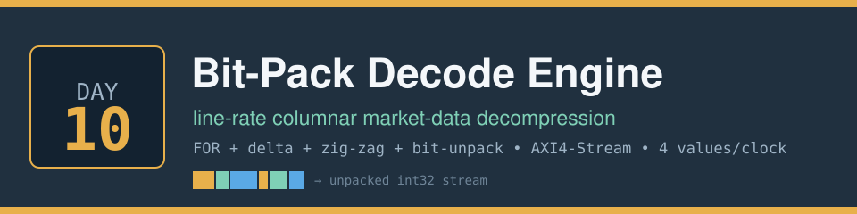
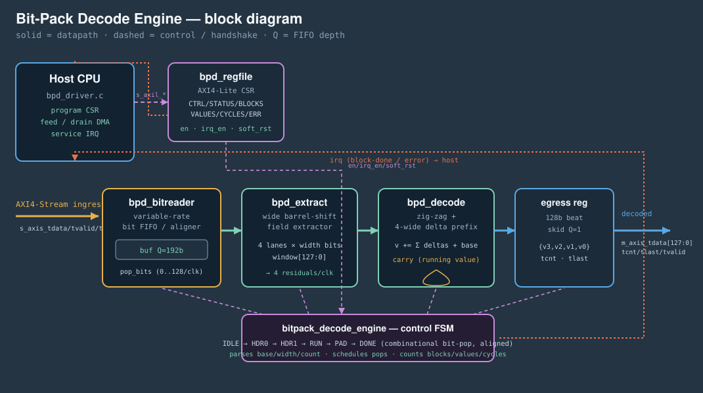

<!-- Author: Asresh -->


# Day 10 — Bit-Pack Decode Engine (line-rate columnar market-data decompression)

<!-- readability-guide:start -->
## Plain-language overview

This decoder expands tightly packed integer columns into ordinary values. Software describes each compressed block; hardware extracts several fields in parallel, reverses zig-zag coding, and rebuilds delta-coded values.

## Abbreviation guide

Every shortened technical term used in this README is expanded below for quick reference:

- **ACK** [Acknowledge]
- **AXI** [Advanced eXtensible Interface]
- **AXI4** [Advanced eXtensible Interface 4]
- **AXI4-Lite** [Advanced eXtensible Interface 4 Lite]
- **CSR** [Control and Status Register]
- **CTRL** [Control]
- **EN** [Enable]
- **ERR** [Error]
- **ERRCODE** [Error Code]
- **FIFO** [First-In, First-Out]
- **FOR** [Frame of Reference]
- **FSM** [Finite-State Machine]
- **HW** [Hardware]
- **ID** [Identifier]
- **IRQ** [Interrupt Request]
- **LSB** [Least Significant Bit]
- **MAX** [Maximum]
- **MIN** [Minimum]
- **RO** [Read-Only]
- **RTL** [Register-Transfer Level]
- **RW** [Read/Write]
- **SW** [Software]
- **W1C** [Write One to Clear]
<!-- readability-guide:end -->

A streaming accelerator that decompresses columnar integer data at up to **four
values per clock**. Recorded and live market-data feeds don't ship raw 32-bit
prices/sizes/timestamps — they ship them *compressed*: take the difference from
the previous value (**delta**), map the signed delta to a small unsigned number
(**zig-zag**), and pack a run of them at the minimum bit-width (**bit-packing**),
all relative to a per-block **frame-of-reference** base. This "FOR + delta +
zig-zag + bit-pack" layout is exactly what Parquet `DELTA_BINARY_PACKED`,
InfluxDB/Gorilla, and kdb-style tick stores use.

The catch: decoding it is a *variable-rate* problem. Each value is `width` bits
wide, fields straddle 32-bit word boundaries, and reconstructing a value needs
the running sum of every delta before it. A scalar core does this one value at a
time with a shift, a mask, a branch for the word-crossing, a zig-zag, and a
serial add — and that is the bottleneck when you are replaying billions of
recorded ticks for a backtest, or decompressing a live feed on the critical path
into a strategy. This engine puts the whole codec in the datapath.

## The problem

The hard part isn't the arithmetic, it's turning a **variable-length** bit
stream into a **fixed-rate** one. To retire 4 values in a clock the hardware
must extract four `width`-bit fields at four different bit offsets *at once*
(offsets that are not byte-aligned and depend on `width`), keep a bit-accurate
buffer that refills from a 32-bit AXI-Stream and drains an arbitrary number of
bits per cycle, and carry a running value across the whole block without a
pipeline bubble. Do that wrong by a single bit and the entire rest of the stream
decodes to garbage — so it has to be bit-exact under backpressure, ingress gaps,
every width from 0 to 32, and value wraparound past `INT_MIN`/`INT_MAX`.

## Hardware / software partition

| Concern | Where | Why |
|---|---|---|
| Bit-buffer / aligner (refill 32b, pop 0..128b) | **HW** — `bpd_bitreader` | Variable-rate consumption at line rate is the whole game; a wide shift register does it in one cycle |
| Parallel field extraction (4 × `width` bits) | **HW** — `bpd_extract` | Four unaligned barrel shifts per clock is what a scalar core cannot do — this is the throughput win |
| Zig-zag + delta prefix + base | **HW** — `bpd_decode` | Combinational 4-wide prefix keeps the running value current every clock, no feedback bubble |
| Block framing / pop scheduling / counters | **HW** — engine FSM | Header parse and bit-accounting must be in lockstep with the datapath |
| Decay of *what* to decode, buffer addresses, IRQ policy | **SW** — `bpd_driver.c` over AXI4-Lite | Orchestration and routing are control-plane work that changes rarely |
| Golden reference + scalar baseline | **SW** — `bpd_ref.c`, `bpd_baseline.c` | The bit-exact model the hardware is checked against, and the cost model it is measured against |

Everything is integer and defined bit-for-bit so the RTL and the C reference
agree exactly — the codec is self-describing (`{base, width, count}` header),
so there is no floating point and a fully reproducible golden model.

## Architecture



The datapath is a pure feed-forward stream: `bpd_bitreader` holds a 192-bit
buffer, greedily swallowing a 32-bit ingress word whenever there is room and
dropping `pop_bits` off the front each cycle. `bpd_extract` reads the low 128
bits as a window and pulls four `width`-bit fields with four parallel barrel
shifters. `bpd_decode` zig-zag-decodes each field to a signed delta and runs a
**combinational 4-wide prefix sum** seeded by the running block value (`carry`),
so a value written on cycle *t* feeds the next group on cycle *t+1* with no
stall. The result is registered into a 128-bit egress beat carrying up to four
values plus a lane count and `tlast`.

The key correctness trick is that the **bit-pop is combinational and aligned to
the sampling cycle**: the FSM reads `window` and consumes exactly the bits it
used in the *same* clock, so the next field sits at bit 0 on the following clock.
Block boundaries realign to a 32-bit word via a computed pad, so blocks chain
back-to-back with no drift.

## Register map (AXI4-Lite)

| Offset | Name | Access | Description |
|---|---|---|---|
| 0x00 | `CTRL`    | RW  | `[0]` EN, `[1]` IRQ_EN, `[2]` SOFT_RST (self-clearing) |
| 0x04 | `STATUS`  | RO  | `[0]` BUSY, `[1]` DONE, `[2]` ERR, `[3]` IRQ |
| 0x08 | `BLOCKS`  | RO  | blocks decoded |
| 0x0C | `VALUES`  | RO  | values emitted |
| 0x10 | `CYCLES`  | RO  | active decode cycles |
| 0x14 | `ERRCODE` | RO  | last error (1 = empty block, 2 = illegal width) |
| 0x18 | `IRQ_ACK` | W1C | write clears DONE/ERR/IRQ |
| 0x1C | `ID`      | RO  | `0xB17DEC10` |

### Compressed block wire format

```
word0            : base            (v[-1], the frame-of-reference value)
word1            : {width[31:26], reserved[25:16], count[15:0]}
ceil(count*width/32) words : count zig-zag residuals, width bits each, LSB-first
```

Decode of value *i*: `v[i] = v[i-1] + zigzag((field_i))`, with `v[-1] = base`.
`width == 0` is a constant run (every value equals `base`).

## Build & run

```bash
make sw       # build host/driver/reference/baseline, generate test vectors
make sim      # Icarus differential testbench (266+ blocks, 2 passes + peak + error)
make metrics  # regenerate results/metrics.md
make elab     # elaborate the RTL at three buffer depths
make synth    # analytical area estimate (Yosys not required)
make all      # sw -> sim -> metrics
```

Requires `iverilog` and a C compiler. `verilator`/`yosys` are not needed; `make
synth` falls back to an analytical estimate when Yosys is absent.

## Results (measured in simulation)

Icarus simulation of the RTL against the C golden model. Each run streams every
block twice — once under randomised ingress bubbles + egress backpressure, once
at full rate — then a peak micro-benchmark and a malformed-block error test.

| Metric | Value |
|---|---|
| Blocks decoded | 268 |
| Values decoded (per pass) | 67,171 |
| Compressed ingress words | 33,632 |
| Field width range across blocks | 0..32 bits |
| Engine active cycles (full rate) | 35,884 |
| Sustained throughput (aggregate, mixed widths) | **1.86 values/clock** |
| **Peak throughput** (width 8) | **4.00 values/clock** |
| Decode latency (first word in → first value out) | **5 cycles** |
| Scalar baseline (documented cost model) | 744,899 cycles |
| **Speedup — aggregate** | **20.76×** |
| **Speedup — peak** | **39.85×** |
| Mismatches vs golden | **0** |

The aggregate figure spans widths 0–32; wide fields are bounded by the 32-bit
ingress bus (you can't decode faster than the compressed bits arrive — which is
the whole point of compression), while the small-delta blocks typical of real
tick columns hit the full 4 values/clock. Speedup is against the documented
scalar cost model in `bpd_baseline.c` over the identical block stream.

## What was verified

- **Bit-exact** against the C golden decoder over **268 blocks / 67,171 values**,
  checked twice (randomised backpressure + full rate) — **0 mismatches**, plus a
  4,096-value peak block — every decoded 32-bit value compared.
- **Corner cases**: `width = 0` constant run, `width = 32` full-word fields,
  `count = 1`, counts not a multiple of the 4-lane group, alternating-sign
  deltas (zig-zag stress), strictly monotonic runs, and wraparound past
  `INT_MAX`/`INT_MIN`.
- **Control plane**: ID register, block/value/cycle counters match the stream,
  and a malformed block (`count = 0`) raises `STATUS.ERR` with the right errcode
  and interrupt.
- The host self-checks that the reference codec round-trips every block before
  it is ever streamed to the RTL.
- Software builds clean (`-Wall -Wextra`); the firmware driver is compile-checked
  against the register contract.

## Files

```
rtl/  bitpack_decode_engine.v  top + control FSM
      bpd_bitreader.v          variable-rate bit FIFO / aligner
      bpd_extract.v            4-lane barrel-shift field extractor
      bpd_decode.v             zig-zag + 4-wide delta prefix
      bpd_regfile.v            AXI4-Lite CSR
sw/   bpd.h bpd_ref.c bpd_baseline.c bpd_driver.c bpd_host.c
tb/   bpd_tb.sv                fully-clocked differential testbench
```
