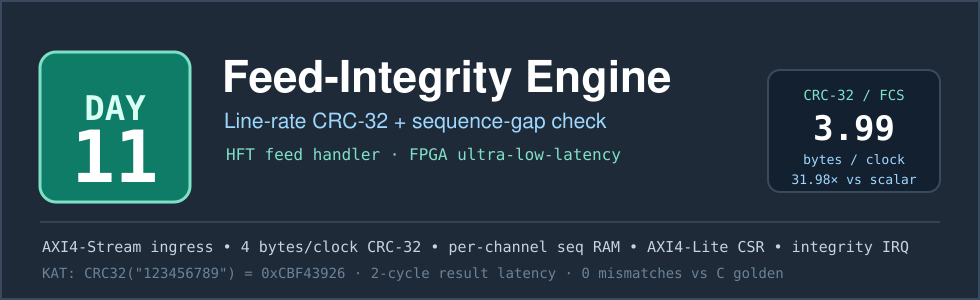
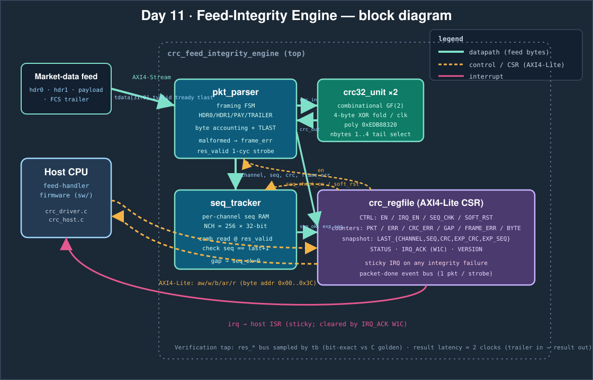

# Day 11 — Feed-Integrity Engine (line-rate CRC-32 + per-channel sequence-gap checker)

A line-rate market-data **feed-integrity accelerator**: the two checks every HFT
feed handler runs on the critical path before a message is allowed to touch the
strategy. For every packet arriving on an AXI4-Stream ingress it

1. verifies the **CRC-32 / Ethernet-FCS** (zlib polynomial `0xEDB88320`) at
   **four payload bytes per clock**, and
2. verifies the **per-channel sequence number** is contiguous (`seq == last + 1`)
   so a *dropped* packet is caught as fast as a *corrupt* one.

A completed packet raises a one-cycle result strobe; any CRC failure, sequence
gap, or malformed frame sets a sticky interrupt the host firmware acknowledges
over AXI4-Lite. The whole thing is bit-exact against a C golden model and pinned
to the published known-answer vector `CRC32("123456789") = 0xCBF43926`.

## The problem

A trading system that acts on a corrupted or stale book loses money silently.
Exchange feeds (and the internal fan-out that redistributes them) carry a frame
check sequence and a monotonic per-channel sequence number precisely so the
receiver can throw away bad data and detect gaps. On a fast venue that check has
to keep up with the wire — tens of millions of small packets a second — and it
sits *directly* in the path to the strategy, so every nanosecond of it is
latency the trade pays for.

In software the CRC is the expensive part: even a good slice-by-8 table CRC costs
on the order of a cycle per byte, plus per-packet framing and bookkeeping
overhead. That is the cost this engine removes.

## Why this split between hardware and software

**Hardware does the per-byte, per-packet work** — the part that scales with the
wire and must never stall:

- **CRC-32 folding.** The bit-serial LFSR is unrolled into a combinational GF(2)
  XOR tree so a whole 32-bit word folds in one clock (`crc32_unit`), with a
  1..4-byte tail select so the CRC is byte-exact for *any* payload length, not
  just multiples of four. This is the classic FPGA CRC trick and it is exactly
  what software cannot do cheaply.
- **Framing and byte accounting.** A small FSM (`pkt_parser`) tracks header /
  payload / trailer, counts declared payload bytes, and cross-checks `TLAST` so a
  malformed frame is flagged and cannot corrupt the next packet.
- **Sequence tracking.** A per-channel sequence RAM (`seq_tracker`) is read
  combinationally in the same cycle the parser reports a packet and compared to
  `last + 1`.

**Software does the control and policy** — the part that is per-*configuration*,
not per-byte: bring the engine up, arm the interrupt, enable/disable sequence
checking, and on an integrity-failure interrupt read back the health counters
(packets, CRC errors, gaps, malformed frames, bytes) and the last-packet
snapshot to decide what to do (request a retransmit, drop to a slow path, alert).
That is branchy, rare, and policy-laden — the wrong thing to freeze into silicon.

## Architecture



```
  market-data feed (AXI4-Stream, 32-bit beats)
        │  tdata/tvalid/tready/tlast
        ▼
  ┌───────────────┐     crc_in/crc_out    ┌──────────────┐
  │  pkt_parser   │◄─────────────────────►│  crc32_unit  │  combinational
  │  framing FSM  │                        │   ×2 (GF(2)) │  4-byte fold/clk
  └──────┬────────┘                        └──────────────┘
         │ res_valid (1-cyc), channel, seq, crc, frame_err
         ▼
  ┌───────────────┐        ┌──────────────────────────────┐
  │  seq_tracker  │───────►│  crc_regfile (AXI4-Lite CSR)  │──► irq
  │ per-ch seq RAM│ seq_ok │  CTRL / counters / snapshot   │◄─► host CPU
  │  256 × 32-bit │ exp_seq│  sticky IRQ, event bus        │    (sw/)
  └───────────────┘        └──────────────────────────────┘
```

**Wire format** (one 32-bit beat per clock, little-endian on the wire):

| Beat | Contents |
|---|---|
| 0 | `{ channel_id[15:0], payload_len_bytes[15:0] }` (header word 0) |
| 1 | `{ seq_no[31:0] }` (header word 1) |
| 2 … | payload words — `ceil(plen/4)` of them, last may be partial |
| N | `{ expected_crc[31:0] }` with `TLAST = 1` (trailer / FCS) |

The CRC covers the two header words and exactly `plen` payload bytes; the trailer
is *not* CRC'd — it **is** the CRC. Framing is validated two independent ways
(byte accounting from `plen` says which beat is the trailer, and `TLAST` must
agree); a disagreement raises `frame_err` and the FSM resynchronises at the next
start-of-packet.

### Modules (`rtl/`)

| File | Role |
|---|---|
| `crc32_unit.v` | Combinational reflected CRC-32 (`0xEDB88320`, init/xorout `0xFFFFFFFF`); folds 1..4 bytes/clock, `nbytes` tail select for partial final words. |
| `pkt_parser.v` | AXI4-Stream framing FSM (HDR0 → HDR1 → PAYLOAD → TRAILER), CRC accumulation, `TLAST`/length cross-check, malformed-frame flag + resync. |
| `seq_tracker.v` | Per-channel sequence RAM (`NCH = 2^CHW`), combinational gap check `seq == last+1`, first-packet handling, `soft_rst` clears validity. |
| `crc_regfile.v` | AXI4-Lite CSR: control bits, health counters, last-packet snapshot, sticky integrity IRQ (W1C acknowledge). |
| `crc_feed_integrity_engine.v` | Top level: wires the four submodules and exposes a verification result tap. |

## Register map (AXI4-Lite, 32-bit, byte offsets)

| Offset | Name | Access | Description |
|---|---|---|---|
| `0x00` | `CTRL` | RW | `[0]` EN · `[1]` IRQ_EN · `[2]` SEQ_CHK · `[3]` SOFT_RST (self-clearing) |
| `0x04` | `STATUS` | RO | `[0]` BUSY · `[1]` IRQ · `[2]` crc_ok · `[3]` seq_ok · `[4]` frame_err · `[5]` first |
| `0x08` | `PKT_COUNT` | RO | packets completed |
| `0x0C` | `ERR_COUNT` | RO | packets with any integrity failure |
| `0x10` | `CRC_ERR_COUNT` | RO | CRC mismatches |
| `0x14` | `GAP_COUNT` | RO | sequence gaps |
| `0x18` | `FRAME_ERR_COUNT` | RO | malformed frames |
| `0x1C` | `BYTE_COUNT` | RO | total bytes CRC-checked |
| `0x20` | `LAST_CHANNEL` | RO | last packet's channel id |
| `0x24` | `LAST_SEQ` | RO | last packet's sequence number |
| `0x28` | `LAST_CRC` | RO | last packet's computed (finalised) CRC |
| `0x2C` | `LAST_EXP_CRC` | RO | last packet's trailer value on the wire |
| `0x30` | `LAST_EXP_SEQ` | RO | expected sequence number for the channel |
| `0x34` | `IRQ_ACK` | W1C | write `bit0 = 1` to clear the sticky IRQ |
| `0x38` | `SCRATCH` | RW | bring-up sanity register |
| `0x3C` | `VERSION` | RO | `{0xFE, 0xED, 16'd11}` |

## Software (`sw/`)

| File | Role |
|---|---|
| `crc.h` | Shared definitions: CRC constants, register map, `pkt_result_t`, golden/baseline prototypes. |
| `crc_ref.c` | Reference CRC-32 engine + `feed_golden_packet()` — the bit-exact golden model the RTL is checked against. |
| `crc_baseline.c` | Documented **scalar cost model**: `≈8 cycles/byte` CRC + `20 cycles/packet` framing overhead, the software-only baseline the speedup is measured against. |
| `crc_driver.c` | Bare-metal firmware driver: MMIO register poke/peek, engine bring-up, IRQ handler that drains the health counters. Compiled as a build check. |
| `crc_host.c` | Host application: generates 256+ randomised packets plus corner cases (zero-length, partial-tail, injected CRC bit-flips, injected sequence gaps, malformed frames), computes the golden results, and emits the testbench vectors. |

## Build & run

```bash
make sim      # build SW, generate vectors, run the Icarus differential testbench
make metrics  # regenerate results/metrics.md from the run
make elab     # elaborate the RTL at CHW = 4, 8, 10
make synth    # analytical area estimate (Yosys not present in this environment)
make all      # sim + metrics
make clean
```

Verification runs under **Icarus Verilog** (this environment has no
Verilator/Yosys, so `make synth` prints an analytical flop/LUT estimate instead
of a synthesized report; that substitution is noted in the output).

## Results (measured)

All numbers are extracted from the Icarus simulation of the RTL against the C
golden model — nothing here is asserted by hand.

| Metric | Value |
|---|---|
| Packets processed (per pass) | 315 |
| Ingress beats (per pass) | 7383 |
| Bytes CRC-checked (per pass) | 27838 |
| Payload length range | 0 … 591 bytes |
| Engine active cycles (full rate) | 7383 |
| Sustained throughput (aggregate) | **3.770 bytes/clock** |
| Peak throughput (2 KB packet) | **3.992 bytes/clock** |
| Result latency (trailer in → result out) | 2 cycles |
| Scalar baseline (documented cost model) | 229004 cycles |
| **Speedup (aggregate)** | **31.02×** |
| **Speedup (peak)** | **31.98×** |
| CRC errors detected | 37 (injected 37) |
| Sequence gaps detected | 30 (injected 30) |
| Records checked (2 passes + peak + malformed) | 632 |
| Mismatches vs golden | **0** |

The peak figure (3.992 ≈ 4.0 bytes/clock) is the CRC datapath's structural
throughput — four bytes folded per clock — measured on a large packet where
framing overhead is amortised. The aggregate figure is lower only because the
randomised mix includes many tiny packets whose two header beats and trailer beat
dominate; both are real, measured, and reported separately.

Analytical area estimate at `CHW = 8` (256 channels): ≈ 9045 flip-flops
(dominated by the 256 × 32-bit sequence RAM, which maps to block/distributed RAM
on a real FPGA) and ≈ 2720 6-LUT-equivalents (the two combinational CRC folds are
~2048 of them).

## What was verified

- **Known-answer vector:** `CRC32("123456789") = 0xCBF43926` checked in the
  testbench before any random traffic, pinning the CRC convention to the
  published value.
- **Pass A — randomised ingress bubbles:** 315/315 packets, 0 mismatches, with
  `tvalid` gaps inserted on the AXI-Stream.
- **Pass B — full rate:** the same 315 packets back-to-back at one beat/clock,
  315/315, 0 mismatches.
- **Corner cases in the stimulus:** zero-length payloads, partial final words
  (1/2/3 tail bytes), 37 injected CRC bit-flips, 30 injected sequence gaps, and
  malformed frames.
- **Malformed-frame test:** a frame whose `TLAST` disagrees with its declared
  length sets `frame_err`, raises the interrupt, and the IRQ is then cleared via
  `IRQ_ACK` — verified end-to-end.
- **Counters:** every injected CRC error (37) and gap (30) is reflected exactly
  in the CSR counters.
- **632 result records** checked bit-exact against the C golden model across both
  passes, the peak micro-benchmark, and the malformed test — **0 mismatches**.
