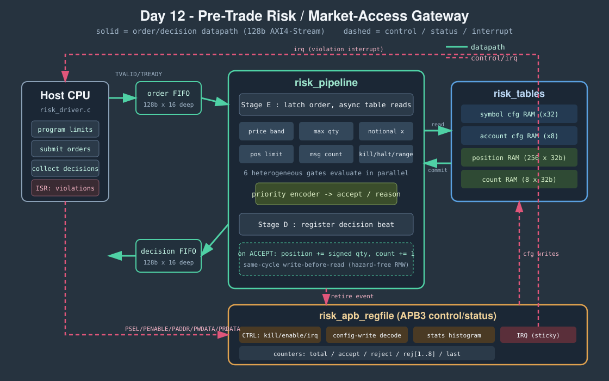

<!-- Author: Asresh -->


# Day 12 — Pre-Trade Risk Engine (line-rate market-access gateway)

<!-- readability-guide:start -->
## Plain-language overview

This gateway checks every order against limits such as price, size, position, and kill-switch state before the order can leave the system. Software programs policy; hardware evaluates the independent rules in parallel and returns one clear accept-or-reject reason.

## Abbreviation guide

Every shortened technical term used in this README is expanded below for quick reference:

- **ACK** [Acknowledge]
- **APB** [Advanced Peripheral Bus]
- **APB3** [Advanced Peripheral Bus version 3]
- **AXI4** [Advanced eXtensible Interface 4]
- **AXI4-Stream** [Advanced eXtensible Interface 4 Stream]
- **AXIS** [Advanced eXtensible Interface Stream]
- **C11** [C Programming Language 2011 Standard]
- **CI** [Continuous Integration]
- **CSR** [Control and Status Register]
- **CTRL** [Control]
- **DMA** [Direct Memory Access]
- **FPGA** [Field-Programmable Gate Array]
- **FSM** [Finite-State Machine]
- **HFT** [High-Frequency Trading]
- **IPC** [Instructions Per Cycle]
- **IRQ** [Interrupt Request]
- **LUT** [Lookup Table]
- **MMIO** [Memory-Mapped Input/Output]
- **MSGCOUNT** [Message Count]
- **POSLIMIT** [Position Limit]
- **PRICEBAND** [Price Band]
- **RAM** [Random-Access Memory]
- **REJ** [Rejection Count]
- **RMW** [Read-Modify-Write]
- **RTL** [Register-Transfer Level]
- **SEC** [Single-Error Correction]
- **SIMD** [Single Instruction, Multiple Data]
- **W1** [Write One]
- **W1C** [Write One to Clear]
<!-- readability-guide:end -->

A hardware **pre-trade risk firewall**: the checks a broker/HFT market-access
gateway must run on *every* outbound order — in the critical path, before the
message is allowed onto the wire to the exchange. It is the FPGA form of the
SEC Rule 15c3-5 "market access" controls, done at **one order per clock** with
a deterministic **2-cycle** ingest-to-decision latency.

Each order arrives as a single 128-bit AXI4-Stream beat and is checked against
six independent risk gates that all evaluate in parallel:

1. **Kill switch** — global market-access halt (highest priority).
2. **Range** — symbol / account id inside the configured table.
3. **Halt** — this symbol or this account is trading-disabled.
4. **Price band** — fat-finger guard, `price ∈ [lo, hi]`.
5. **Max order size** — `qty != 0 && qty ≤ max_qty`.
6. **Max notional** — `price × qty ≤ max_notional`.
7. **Position limit** — `|net_position + signed_qty| ≤ pos_limit`.
8. **Message cap** — per-account accepted-order count `< max_msgs`.

A priority encoder collapses the gates to a single **accept / reason** verdict.
On accept the engine commits the new net position and increments the account's
order count the same cycle; on any breach it emits a reason code and raises a
sticky violation interrupt the host firmware clears W1C.

## The problem

A single mispriced or oversized order that leaks to an exchange can be a
career-ending loss, and the check that stops it sits *directly* in the order
path — every nanosecond it costs is latency the trade pays. In software this is
a chain of unpredictable branches, two config lookups, a keyed position-map
load, a 64-bit multiply, and a store-back — tens of cycles per order, and worse
when the branch predictor guesses the reject path wrong. On a busy session that
is real, jittery latency on the hot path.

The gate is also *mandatory*: regulators require it, so it cannot simply be
switched off for speed. That makes it the ideal thing to push into hardware —
fixed work, done to every message, on the critical path.

## Why this split between hardware and software

**Hardware does the per-order work** — the part that runs on every single
message and must never stall or jitter:

- **The six gates in parallel.** Software evaluates risk checks as a serial
  chain of mispredictable branches; the RTL runs all six as independent
  combinational comparators and resolves them with a **priority encoder** in one
  cycle. The 32×32→64-bit notional multiply that is expensive in a scalar loop
  is just a datapath multiplier here.
- **Single-cycle position read-modify-write.** Net position per
  `(account, symbol)` lives in on-chip RAM read combinationally in the evaluate
  cycle and written back the same cycle on accept, with write-before-read
  forwarding so back-to-back orders on the *same* key never see stale state — no
  pipeline bubble, no software lock.
- **Deterministic latency.** Because every piece of state is keyed on the order
  stream and never on the clock, the decision is bit-identical whether the
  ingress stalls, the egress backpressures, or both — a property the testbench
  checks directly.

**Software does the policy and the control plane** — the part that is
per-*configuration*, not per-order:

- Compute the fat-finger price bounds from a reference price and a band, choose
  size / notional / position / message limits, and program them over APB.
- Bring-up, soft reset, draining decisions, and servicing the violation
  interrupt (`risk_driver.c` — real MMIO firmware, compile-checked in CI).

## Block diagram



`risk_pipeline` is the datapath; `risk_tables` holds the config + mutable state;
`risk_apb_regfile` is the APB3 control/status plane and interrupt. Orders and
decisions move as 128-bit AXI4-Stream beats (attached to host DMA FIFOs);
configuration, statistics, and the interrupt travel over APB.

### Order / decision beat layout (128-bit)

| bits | order ingress | bits | decision egress |
|---|---|---|---|
| `[15:0]`   | symbol      | `[23:0]`  | order_id |
| `[31:16]`  | account     | `[24]`    | accept |
| `[63:32]`  | price       | `[28:25]` | reason code |
| `[95:64]`  | qty         | `[47:32]` | symbol |
| `[119:96]` | order_id    | `[55:48]` | account |
| `[120]`    | side (0=buy)| `[95:64]` | net position after |

## Register map (APB3, 32-bit)

| offset | name | access | meaning |
|---|---|---|---|
| `0x000` | `CTRL` | R/W | `[0]`kill `[1]`enable `[2]`irq_en `[3]`soft_reset (W1, self-clear) |
| `0x004` | `STATUS` | R | `[0]`irq_pending `[1]`kill_active `[2]`clr_busy |
| `0x008` | `IRQ_ACK` | W1C | write `1` to clear the interrupt |
| `0x00C` | `TOTAL` | R | orders processed |
| `0x010` | `ACCEPTED` | R | accepted orders |
| `0x014` | `REJECTED` | R | rejected orders |
| `0x018` | `LAST` | R | `[3:0]`last reason `[31:8]`last order_id |
| `0x01C`–`0x038` | `REJ[1..8]` | R | per-reason rejection histogram |
| `0x0FC` | `VERSION` | R | magic `0x15C30512` |
| `0x400 + s*0x20` | symbol `s` cfg | W | words: lo, hi, max_qty, notional_lo, notional_hi, enabled |
| `0x800 + a*0x10` | account `a` cfg | W | words: pos_limit, max_msgs, enabled |

### Reason codes

| 0 | 1 | 2 | 3 | 4 | 5 | 6 | 7 | 8 |
|---|---|---|---|---|---|---|---|---|
| ACCEPT | KILL | RANGE | HALT | PRICEBAND | MAXQTY | NOTIONAL | POSLIMIT | MSGCOUNT |

## Build & run

```bash
make sw        # build host/reference/baseline + firmware compile-check, gen vectors
make sim       # Icarus differential testbench (Pass A + Pass B + peak + kill/IRQ)
make metrics   # regenerate results/metrics.md
make elab      # elaborate RTL at (16,4), (32,8), (64,16)
make synth     # flop/LUT area (Yosys if present, else analytical estimate)
```

Toolchain used here: Icarus Verilog 13.0 + a C11 host compiler. Verilator and
Yosys are not installed in this environment, so `make synth` falls back to a
clearly-labelled analytical area estimate and throughput is measured under
Icarus.

## Results (measured)

Default configuration `SYM_N=32, ACCT_N=8`, 312 orders (12 directed corner
cases exercising every reason code + 300 randomized), seed `0x0BADC0DE`.

| metric | value |
|---|---|
| orders checked (main stream) | 312 (102 accept / 210 reject) |
| ingest→decision latency | 2 cycles (deterministic) |
| sustained throughput | 0.9936 orders/clock |
| peak throughput (1024-order burst) | 0.9981 orders/clock |
| scalar baseline | 16764 cycles (53.73 / order) |
| **aggregate speedup** | **53.39×** |
| **peak speedup** | **53.63×** |
| Pass A (random bubbles + backpressure) | 0 mismatches |
| Pass B (full rate) | 0 mismatches |
| CSR statistics histogram | matches golden model |
| kill-switch / interrupt test | pass |

The scalar baseline is a documented instruction-count cost model
(`risk_baseline.c`): per order it charges the unpack, two config lookups, a
keyed position load, the six comparison gates, a 64-bit notional multiply, the
accepted-order stores, plus a branch-mispredict penalty on the reject path — no
SIMD, ~1 IPC. Speedup is measured against the identical work done by the engine.

## What was verified

- **Bit-exact vs a C golden model** over every order, checking all decision
  fields — `order_id, accept, reason, symbol, account, net position after`.
- **Timing independence.** Pass A runs under randomized ingress bubbles *and*
  egress backpressure; Pass B runs at full rate after a soft reset. Both produce
  the identical golden decisions — 0 mismatches — proving the verdict never
  depends on the clock.
- **Anchor.** The first directed order is a deliberate fat-finger price; the RTL
  is asserted to reject it with `REJ_PRICEBAND` — a pinned, hand-checkable value.
- **Every reason code exercised.** The directed prefix forces RANGE, HALT,
  MAXQTY, NOTIONAL, POSLIMIT, MSGCOUNT (and accepts); the aggregate histogram
  read back over APB matches the golden per-reason counts exactly.
- **Read-modify-write hazard.** A 1024-order all-accept burst to one
  `(account, symbol)` key accumulates the correct running position with zero
  bubbles, proving the same-cycle write-before-read forwarding.
- **Kill switch + interrupt.** With the global kill engaged, every order is
  rejected `REJ_KILL`, the sticky interrupt asserts, and an `IRQ_ACK` W1C clears
  it.
- **Parameterized.** RTL elaborates clean at `(SYM_N, ACCT_N)` of `(16,4)`,
  `(32,8)`, and `(64,16)`.

## Files

```
rtl/pretrade_risk_engine.v  top: AXIS ingress/egress + APB + IRQ
rtl/risk_pipeline.v         2-stage gate array + priority encoder + RMW commit
rtl/risk_tables.v           symbol/account config + position/count RAM + clear FSM
rtl/risk_apb_regfile.v      APB3 control/status, config decode, stats, interrupt
sw/risk.h                   shared contract (layouts, reason codes, register map)
sw/risk_ref.c               bit-exact golden model
sw/risk_baseline.c          scalar-core cost model
sw/risk_driver.c            bare-metal MMIO firmware driver
sw/risk_host.c              vector generator + golden harness
tb/risk_tb.sv               differential testbench
```
