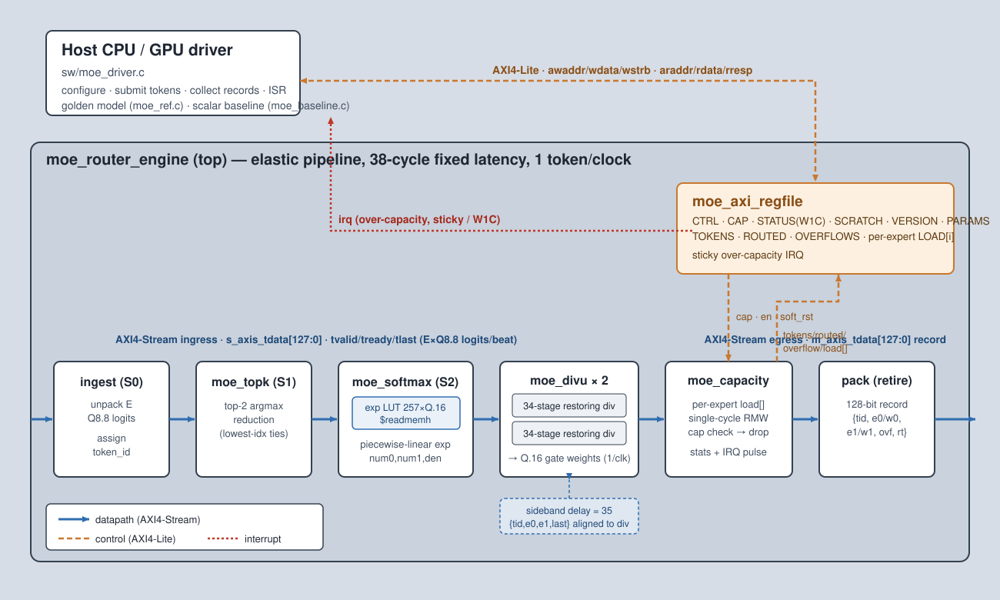

<!-- Author: Asresh -->


# Day 13 — GPU MoE Router Engine

<!-- readability-guide:start -->
## Plain-language overview

A mixture-of-experts model must choose which expert networks process each token. Software configures capacities and moves token scores; hardware selects the best experts, computes routing weights, and enforces capacity without a serial scan.

## Abbreviation guide

Every shortened technical term used in this README is expanded below for quick reference:

- **argmax** [Argument of the Maximum]
- **AXI4** [Advanced eXtensible Interface 4]
- **AXI4-Lite** [Advanced eXtensible Interface 4 Lite]
- **AXI4-Stream** [Advanced eXtensible Interface 4 Stream]
- **CAP** [Capacity]
- **CSR** [Control and Status Register]
- **CTRL** [Control]
- **EN** [Enable]
- **GPU** [Graphics Processing Unit]
- **IRQ** [Interrupt Request]
- **LUT** [Lookup Table]
- **MoE** [Mixture of Experts]
- **Q8** [Fixed-Point Format with 8 Fractional Bits]
- **RMW** [Read-Modify-Write]
- **RO** [Read-Only]
- **RTL** [Register-Transfer Level]
- **RW** [Read/Write]
- **SW** [Software]
- **W1C** [Write One to Clear]
<!-- readability-guide:end -->

A line-rate **Mixture-of-Experts (MoE) top-k routing / gating engine** — the primitive
that sits in front of every expert layer in a sparse transformer. For each token it takes
a vector of expert *logits*, decides which two experts should process the token, computes
their softmax gate weights, enforces a per-expert capacity limit (dropping the overflow
the way GShard/Switch layers do), and emits a compact dispatch record. In a distributed /
heterogeneous inference deployment those records are exactly what steers tokens to expert
shards living on different GPUs, so the router is squarely on the critical path and has to
keep up with the token stream.

The engine retires **one token per clock** at a deterministic 38-cycle latency, is
**bit-exact** against a C golden model over 316 tokens (12 directed corner cases + 300
random plus a capacity storm), and runs **116.9× / 131× (aggregate / peak)** over a
documented scalar cost-model baseline.

## The problem

MoE gating is cheap per operation but awkward per token: for every token you must find the
top-`k` of `E` expert scores, exponentiate, normalise, and update per-expert load counters
that feed back into the *next* token's routing decision. On a scalar core that is a short
dependent chain of compares, `exp()`, a divide, and a counter read-modify-write — a few
hundred cycles that does not vectorise well because the top-k selection and the capacity
feedback are inherently serial. Doing it in hardware turns that chain into a fixed-latency
pipeline that accepts a new token every cycle.

## Hardware / software split

| Concern | Where | Why |
|---|---|---|
| top-k argmax, softmax exp, renormalise divide, capacity RMW | **hardware** (`rtl/`) | on the token critical path; a fixed-latency pipeline hides the dependent chain and sustains 1 token/clock, and the per-expert counter feedback is a single-cycle read-modify-write |
| exp evaluation | **shared LUT** | the software writes `exp_lut.hex`; the RTL `$readmemh`s the identical table, so hardware and golden model are provably the same arithmetic |
| capacity / IRQ programming, stat collection, token submission | **software** (`sw/moe_driver.c`) | control-plane work with no throughput requirement; belongs on the host |
| golden model + scalar baseline | **software** (`sw/moe_ref.c`, `sw/moe_baseline.c`) | reference for the differential test and the honest speedup denominator |

The gate arithmetic is all **integer / fixed-point** (Q8.8 logits, Q.16 weights) so the
result is bit-reproducible; the only approximation is the piecewise-linear `exp` LUT, whose
error against a double-precision softmax is measured (below), not assumed.

## Block diagram



One 128-bit AXI4-Stream beat carries a token's `E` packed Q8.8 logits. `moe_topk` reduces
them to the two largest (strict-greater compare → lowest-index ties). `moe_softmax` looks
up `exp(logit − max)` for the selected pair from a 257-entry Q.16 LUT (piecewise-linear
interpolation) and forms the numerators and denominator. Two fully-pipelined 34-stage
restoring dividers (`moe_divu`) renormalise to Q.16 gate weights at one result per clock.
`moe_capacity` holds a per-expert accepted-token counter, drops any slot whose expert is at
capacity, and updates the counters and statistics in the same cycle. The whole datapath is
one **elastic pipeline**: a single advance signal freezes every stage (and both dividers) on
egress backpressure, so it stalls losslessly and stays bit-exact under ingress bubbles or
backpressure. `moe_axi_regfile` is the AXI4-Lite control/status plane and raises a sticky
over-capacity interrupt cleared write-1-to-clear.

### Transaction sequence

```mermaid
sequenceDiagram
    participant SW as Host (moe_driver.c)
    participant CSR as moe_axi_regfile
    participant PIPE as router pipeline
    participant CAP as moe_capacity
    SW->>CSR: write CAP, CTRL=EN|IRQ_EN|SOFT_RST
    loop per token
        SW->>PIPE: s_axis beat (E×Q8.8 logits)
        PIPE->>PIPE: top-k → exp-LUT → renormalise (38-cycle pipeline)
        PIPE->>CAP: retire {e0,e1,w0,w1}
        CAP-->>SW: m_axis dispatch record
        CAP->>CAP: load[e]++ / drop if ≥ CAP
    end
    CAP->>CSR: over-capacity → sticky IRQ
    CSR-->>SW: irq
    SW->>CSR: read TOKENS/ROUTED/OVERFLOWS/LOAD[i]; W1C STATUS
```

## Register map (AXI4-Lite, 32-bit)

| Offset | Name | Access | Description |
|---|---|---|---|
| `0x00` | `CTRL` | RW | `[0]` EN · `[1]` SOFT_RST (self-clearing; clears counters + tid) · `[2]` IRQ_EN |
| `0x04` | `STATUS` | RO / W1C | `[0]` over-capacity IRQ (sticky; write 1 to clear) |
| `0x08` | `CAP` | RW | per-expert capacity (tokens) |
| `0x0C` | `TOKENS` | RO | total tokens processed |
| `0x10` | `OVERFLOWS` | RO | total dropped (over-capacity) slots |
| `0x14` | `ROUTED` | RO | total accepted routed slots |
| `0x18` | `PARAMS` | RO | `[7:0]` E · `[15:8]` K · `[23:16]` LOGIT_W |
| `0x1C` | `SCRATCH` | RW | bring-up sanity register |
| `0x20` | `VERSION` | RO | `0xFEED_000D` |
| `0x40+4i` | `LOAD[i]` | RO | per-expert accepted-token load counter |

### Dispatch record (128-bit egress beat, K=2)

| Field | Bits | Field | Bits |
|---|---|---|---|
| `token_id` | `[15:0]` | `top1_weight` (Q.16) | `[81:64]` |
| `top0_weight` (Q.16) | `[49:32]` | `top1_expert` | `[89:82]` |
| `top0_expert` | `[57:50]` | `overflow1` | `[95]` |
| `overflow0` | `[63]` | `routed` (accepted slots) | `[97:96]` |

## Build & run

```bash
make sim      # build sw, generate vectors + golden, run the differential testbench
make metrics  # regenerate results/metrics.md from the run
make elab     # elaborate the RTL at E = 4, 8, 16 (proves parameterization)
make synth    # Yosys area if present, else analytical estimate
make all      # sim + metrics
```

Requires `iverilog` and a C compiler. `make sim E=16` runs the whole flow at a different
expert count (any `E ≥ 2` is supported; the default is `E=8`, `K=2`).

## Results (measured)

All numbers below are measured from the Icarus simulation and the C models at `E=8, K=2,
CAP=64`, 316 tokens.

| Metric | Value |
|---|---|
| ingest→dispatch latency | **38 cycles** (fixed) |
| sustained throughput | **0.893 tokens/clock** (incl. pipeline fill/drain) |
| peak throughput | **1.000 tokens/clock** |
| scalar baseline | 41396 cycles (131.0 / token) |
| **aggregate speedup** | **116.94×** |
| **peak speedup** | **131.00×** |
| max gate-weight error vs double softmax | **1.35e-04** |
| accepted / dropped slots | 507 / 125 |
| Pass A (bubbles + backpressure) | 0 mismatches |
| Pass B (full rate) | 0 mismatches |
| CSR statistics check | OK |
| capacity IRQ check | OK |

The scalar baseline is a transparent cost model (`sw/moe_baseline.c`): per token it charges
top-k compares, `k` `exp()` calls, `k` divides, and the capacity read-modify-writes, with
each modelled op cost spelled out in the source. Analytical area (Yosys not present here):
~9.1k flops and ~2.1k comb cells, dominated by the two 34-stage dividers; see
`make synth`.

## What was verified

- **Bit-exactness** against `sw/moe_ref.c` on every dispatch record over 316 tokens —
  12 directed corner cases (all-equal ties, one dominant expert, monotone ramps, a
  max-at-both-ends tie, a deep-negative spread that clips `exp` to zero, and an 8-token
  capacity storm) plus 300 random tokens — run twice: once under **randomised ingress
  bubbles + egress backpressure**, once at **full rate**. 0 mismatches.
- **Control plane:** `SCRATCH`/`VERSION`/`PARAMS` read-back, the `TOKENS`/`ROUTED`/
  `OVERFLOWS` statistics and the summed per-expert `LOAD[i]` counters all match the golden
  totals; soft-reset clears the counters.
- **Interrupt:** over-capacity drops raise the sticky IRQ; write-1-to-clear deasserts it.
- **Parameterization:** the RTL elaborates and the full differential test passes at
  `E = 4, 8, 16`.
- **Accuracy:** the fixed-point gate weights track a double-precision top-k softmax to
  within `1.35e-04` (Q.16).

## Layout

```
rtl/   moe_router_engine.v  top: elastic pipeline + wiring
       moe_topk.v           top-2 argmax reduction
       moe_softmax.v        exp-LUT + softmax numerators
       moe_divu.v           34-stage pipelined restoring divider
       moe_capacity.v       per-expert capacity counters + stats
       moe_axi_regfile.v    AXI4-Lite control/status + IRQ
sw/    moe.h moe_ref.c moe_baseline.c moe_driver.c moe_host.c
tb/    moe_tb.sv            differential testbench (+ generated vectors)
docs/  block_diagram.svg banner.svg
```
