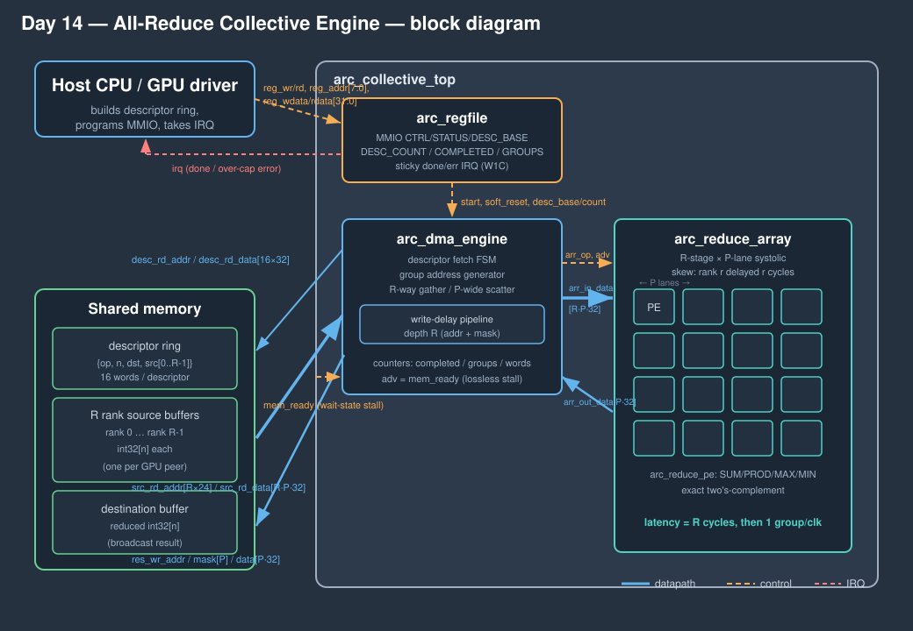
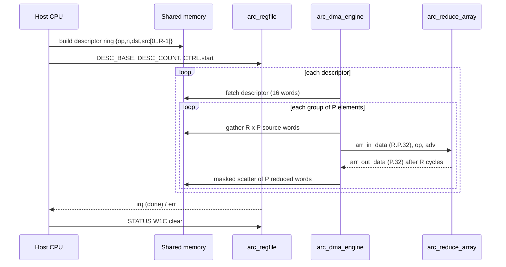

<!-- Author: Asresh -->


# Day 14 — GPU All-Reduce Collective Engine

<!-- readability-guide:start -->
## Plain-language overview

All-reduce combines arrays from several devices and returns the combined result to every participant. Software builds transfer descriptors; hardware gathers aligned words, reduces them across a systolic pipeline, and writes the result back.

## Abbreviation guide

Every shortened technical term used in this README is expanded below for quick reference:

- **ARR** [Array]
- **COUNT** [Count]
- **CPU** [Central Processing Unit]
- **CSR** [Control and Status Register]
- **CTRL** [Control]
- **DMA** [Direct Memory Access]
- **DW** [Data Width]
- **ERRCODE** [Error Code]
- **GPU** [Graphics Processing Unit]
- **int32** [Signed 32-bit Integer]
- **IRQ** [Interrupt Request]
- **MAX** [Maximum]
- **MEM** [Memory]
- **MIN** [Minimum]
- **MMIO** [Memory-Mapped Input/Output]
- **REG** [Register]
- **RO** [Read-Only]
- **RTL** [Register-Transfer Level]
- **RW** [Read/Write]
- **W1** [Write One]
- **W1C** [Write One to Clear]
<!-- readability-guide:end -->

A line-rate **multi-GPU all-reduce collective engine** — the hardware behind the
`ncclAllReduce` primitive that fuses gradients and activations across GPUs in
distributed training and heterogeneous inference. Given **R** rank buffers of
**N** `int32` elements each (one buffer per GPU peer), it reduces them
element-wise with one of **SUM / PROD / MAX / MIN** and scatters the reduced
vector to a destination buffer, driven entirely by a **descriptor ring** the
host builds in shared memory.

The datapath is an **R-stage × P-lane systolic reduction array**: the R ranks
form the spatial depth of a systolic chain and element-groups flow through it
one per clock, so after an R-cycle fill it retires **P reduced elements every
clock**. It is **bit-exact** against a C golden model over 49 collectives /
3627 elements per pass, and runs **51.6× / 71.4× (aggregate / peak)** over a
documented scalar cost-model baseline.

## The problem

An all-reduce is bandwidth- and latency-bound, not compute-heavy: for every one
of N output elements a scalar core loads R operands, folds them with R−1
reduction ops, and stores one result — a short, memory-bound dependent chain
repeated N times, per collective, with per-op setup overhead in between. It
vectorises only so far on a CPU and competes with everything else for the core.
Pushing it into a fixed-function engine turns the fold into a systolic pipeline
that accepts a new element-group every cycle and is fed by a wide coalesced
gather across the R rank buffers — exactly the shape of the reduce-scatter step
inside a ring all-reduce.

## Hardware / software split

| Concern | Where | Why |
|---|---|---|
| element-wise reduction across R ranks, address generation, scatter | **hardware** (`rtl/`) | the throughput-critical inner loop; a systolic array sustains P elements/clock and the R-way gather hides memory latency |
| descriptor-ring walk, per-group tail masking, stall handling | **hardware** (`arc_dma_engine`) | must keep the array fed every cycle and stall losslessly on memory wait states |
| building the descriptor ring, programming base/count, servicing IRQ | **software** (`sw/arc_driver.c`) | control-plane work with no throughput requirement; belongs on the host core |
| golden model + scalar baseline | **software** (`sw/arc_ref.c`, `sw/arc_baseline.c`) | reference for the differential test and the honest speedup denominator |

Every reduction op is **exact two's-complement integer arithmetic** (wrapping
add/multiply, signed compare-select), so the hardware and the golden model agree
bit-for-bit — there is no approximation to bound.

## Block diagram



The host writes a ring of descriptors into shared memory — each
`{op, n, dst_base, src_base[0..R-1]}` — then programs `DESC_BASE`/`DESC_COUNT`
and kicks `CTRL.start`. `arc_dma_engine` fetches a descriptor, and for every
group of `P` elements drives `R` gather addresses (a wide coalesced read of
`R·P` words) into `arc_reduce_array`. The array skews rank `r` by `r` cycles so
it meets the travelling partial at stage `r`, and each stage registers its
`arc_reduce_pe` output; after an `R`-cycle fill it emits one `P`-wide reduced
group per clock. A write-delay pipeline of matching depth `R` carries the
destination address and tail mask so the masked scatter lines up with the array
output. The whole datapath advances on a single `adv = mem_ready` gate, so a
memory wait state freezes address generation, the array **and** the write
pipeline together — it stalls losslessly and stays bit-exact. `arc_regfile` is
the MMIO control/status plane and raises a sticky **done / error** interrupt
cleared write-1-to-clear.

### Transaction sequence



## Register map (MMIO)

| Offset | Name | Access | Description |
|---|---|---|---|
| 0x00 | `CTRL` | W | `[0]` start (W1 pulse), `[1]` soft_reset, `[2]` irq_en |
| 0x04 | `STATUS` | R / W1C | `[0]` done_irq, `[1]` err_irq (both W1C), `[2]` busy |
| 0x08 | `DESC_BASE` | RW | descriptor-ring base (word address) |
| 0x0C | `DESC_COUNT` | RW | number of descriptors to process |
| 0x10 | `COMPLETED` | RO | descriptors completed |
| 0x14 | `GROUPS` | RO | result groups streamed |
| 0x18 | `WORDS` | RO | result words written |
| 0x1C | `SCRATCH` | RW | bus-sanity scratch |
| 0x20 | `PARAMS` | RO | `[7:0]`=R `[15:8]`=P `[23:16]`=DW |
| 0x24 | `VERSION` | RO | `0xFEED000E` |
| 0x28 | `ERRCODE` | RO | last error (1=invalid desc, 2=zero length) |

**Descriptor** (16 words): `w0` = `{[8]=valid, [1:0]=op}`, `w1` = `n`,
`w2` = `dst_base`, `w3..w3+R-1` = `src_base[r]`. `op`: 0=SUM, 1=PROD, 2=MAX,
3=MIN.

## Build & run

```bash
make sim      # build sw, generate vectors, run the differential testbench
make metrics  # regenerate results/metrics.md from the run
make elab     # elaborate the RTL at R=2/P=4, R=4/P=4, R=8/P=8
make synth    # analytical area estimate (Yosys not present in this environment)
```

Toolchain: **Icarus Verilog** (`iverilog`/`vvp`) and a C compiler. Set design
size with `make sim R=8 P=8`.

## Results (measured, R=4, P=4)

| metric | value |
|---|---|
| collectives (descriptors) / pass | 49 (9 directed + 40 random) |
| elements reduced / groups | 3627 / 924 |
| gather→scatter latency | 4 cycles (= R) |
| sustained throughput | **2.87 words/clock** |
| peak throughput (single big collective) | **3.97 words/clock** (P = 4 ideal) |
| span, full ring | 1264 cycles (3627 words) |
| span, peak collective | 516 cycles (2048 words) |
| scalar baseline | 65,286 cycles (18/element) |
| **aggregate speedup** | **51.65×** |
| **peak speedup** | **71.44×** |
| mismatches (Pass A + Pass B + Peak) | **0** |

Peak throughput approaches the `P`-element-per-clock roofline; sustained is
lower because the 49-descriptor ring pays a per-collective fetch + drain
overhead (realistic for many small collectives). Numbers are extracted from the
simulation by `scripts/extract_metrics.py`, not asserted.

### Parameterization (full differential sim at each set, all bit-exact)

| R × P | latency | peak words/clock | result |
|---|---|---|---|
| 2 × 4 | 2 | 3.98 | 0 mismatches |
| 4 × 4 | 4 | 3.97 | 0 mismatches |
| 8 × 8 | 8 | 7.76 | 0 mismatches |

## What is verified

- **Bit-exact** destination buffers vs a C golden model (`arc_ref.c`) over every
  descriptor — SUM (incl. a case that wraps 32 bits), PROD, and signed MAX/MIN
  over full-range and all-negative data.
- **Pass A** runs the whole ring under randomised memory wait states
  (`mem_ready` dropped ~25%); **Pass B** re-runs at full rate. Identical results
  prove the `adv`-gated pipeline stalls losslessly.
- **Directed corner cases**: single-element tail (1-lane write mask),
  exactly-one-group, two-group + 1-lane tail, and a large peak collective.
- **CSR statistics** (`COMPLETED` / `GROUPS` / `WORDS`) match the golden totals.
- **Error / interrupt**: a zero-length descriptor raises the sticky error IRQ
  with `ERRCODE == 2`; write-1-to-clear drops both the status bit and the line.
- Elaborates cleanly and **simulates bit-exactly** at three `(R, P)` sets.
