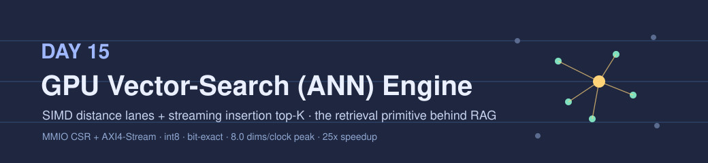
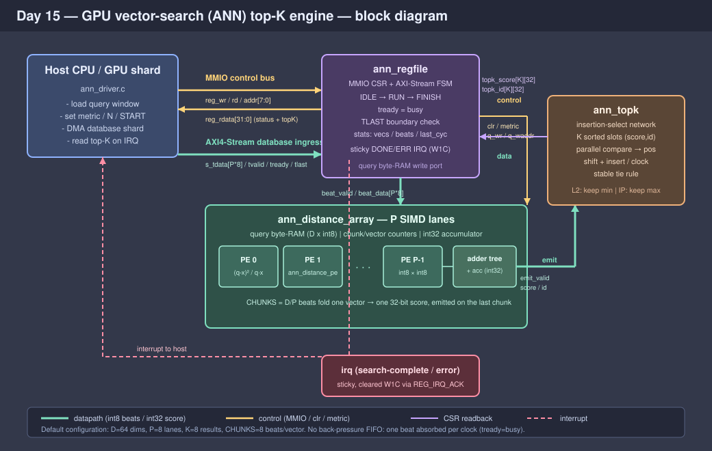

<!-- Author: Asresh -->


# Day 15 — GPU Vector-Search (ANN) Top-K Engine

<!-- readability-guide:start -->
## Plain-language overview

This search engine compares a query vector with many stored vectors and keeps the closest matches. Software loads the query and reads the winners; hardware evaluates several dimensions per clock and maintains the running top results.

## Abbreviation guide

Every shortened technical term used in this README is expanded below for quick reference:

- **ACK** [Acknowledge]
- **ANN** [Approximate Nearest Neighbor]
- **argmax** [Argument of the Maximum]
- **AXI** [Advanced eXtensible Interface]
- **AXI4** [Advanced eXtensible Interface 4]
- **AXI4-Stream** [Advanced eXtensible Interface 4 Stream]
- **CPU** [Central Processing Unit]
- **CSR** [Control and Status Register]
- **CTRL** [Control]
- **CYC** [Cycle]
- **ERR** [Error]
- **ERRCODE** [Error Code]
- **FAISS** [Facebook Artificial Intelligence Similarity Search]
- **FAISS-GPU** [Facebook Artificial Intelligence Similarity Search on Graphics Processing Units]
- **FSM** [Finite-State Machine]
- **GPU** [Graphics Processing Unit]
- **ID** [Identifier]
- **int8** [Signed 8-bit Integer]
- **IP** [Inner Product]
- **IRQ** [Interrupt Request]
- **IRQEN** [Interrupt Request Enable]
- **L2** [Squared Euclidean Distance]
- **MMIO** [Memory-Mapped Input/Output]
- **NDB** [Number of Database Vectors]
- **RAG** [Retrieval-Augmented Generation]
- **RAM** [Random-Access Memory]
- **RTL** [Register-Transfer Level]
- **SIMD** [Single Instruction, Multiple Data]
- **SRESET** [Soft Reset]
- **STAT** [Status]
- **TLAST** [Transfer Last]
- **W1C** [Write One to Clear]
<!-- readability-guide:end -->

A hardware accelerator for **approximate-nearest-neighbour (ANN) vector search** —
the retrieval primitive that sits in front of every embedding-based inference
pipeline. When a RAG system answers a question, or a recommender scores a user,
or a semantic cache looks for a hit, the hot loop is the same: take one query
vector, sweep a shard of database vectors, and return the *K* closest. On GPUs
this is what FAISS-GPU does; at datacenter scale the index is sharded across many
GPUs and each shard runs this loop independently before a final merge.

This engine is that per-shard loop in silicon. A query vector is loaded once; the
database shard streams in over AXI4-Stream at **P int8 elements per clock**; a row
of SIMD distance lanes scores each vector; and a streaming insertion network keeps
the running **top-K** — all bit-exact against an integer reference model, for both
squared-L2 (nearest) and inner-product (highest-scoring) metrics.

## The problem

Brute-force top-K search over a shard of *N* vectors of dimension *D* costs
`O(N·D)` distance work plus a running selection. On a scalar core every dimension
is a separate subtract–multiply–accumulate and every vector re-scans the K-best
list. It is embarrassingly parallel across dimensions and trivially streamable
across vectors, but a CPU spends most of its cycles on loop overhead and on the
top-K bookkeeping rather than on arithmetic.

## Hardware / software split

The split follows the rule "software decides, hardware sweeps":

| Concern | Where | Why |
|---|---|---|
| Query load, metric choice, shard framing, result merge across shards | **Software** (`sw/ann_driver.c`) | Control-plane work done once per search; not on the per-vector hot path. |
| Per-dimension distance arithmetic | **Hardware** (`ann_distance_pe` × P) | `P` int8 subtract/multiply/accumulate every clock — the raw `O(N·D)` sweep. |
| Score accumulation across the vector | **Hardware** (`ann_distance_array`) | An adder tree + accumulator folds `CHUNKS = D/P` beats into one 32-bit score with no feedback stall. |
| Maintaining the top-K | **Hardware** (`ann_topk`) | A parallel-compare insertion network absorbs one candidate per clock — the part a CPU is worst at. |
| Sequencing, back-pressure, completion, statistics | **Hardware** (`ann_regfile`) | Deterministic AXI-Stream FSM so the result is timing-independent and the host only sees "done + interrupt". |

The datapath is **fully integer**, so the hardware result and the C reference are
provably the same arithmetic — the top-K is reproducible to the bit, including the
tie-break order.

## Architecture



- **`ann_distance_pe`** — one SIMD lane. For metric L2 it computes `(q−x)²`
  (always ≥ 0); for IP it computes the signed product `q·x`. The result is placed
  in a common 32-bit signed domain so the adder tree needs no per-metric casing.
- **`ann_distance_array`** — `P` lanes + a combinational adder tree + a 32-bit
  accumulator. One AXI-Stream beat carries `P` int8 elements (one dimension-chunk);
  `CHUNKS = D/P` beats fold into a full vector score, emitted with its running id on
  the final chunk. A small byte-RAM holds the query, written over the register file.
  Every register advances **only on an accepted beat**, so ingress bubbles stall the
  pipeline losslessly and the score is identical regardless of beat timing.
- **`ann_topk`** — a streaming insertion-select network holding `K` slots sorted
  best→worst. Each incoming score is compared in parallel against every slot; because
  the list stays sorted, the count of "at least as good" slots *is* the insertion
  position. If it falls inside the window the newcomer is inserted and the worse tail
  shifts down one, dropping the last slot when full — one candidate per clock. The
  stable tie rule (equal scores keep the earlier, smaller-id vector ahead) matches the
  reference exactly.
- **`ann_regfile`** — MMIO control/status plane and the AXI4-Stream sequencer
  (`IDLE → RUN → FINISH`). It gates ingress (`tready = busy`), times the search span,
  checks that `TLAST` lands on a vector boundary (else it flags a truncated-shard
  error), lets the top-K settle for one cycle, then latches `DONE` and raises a sticky
  interrupt. Cumulative vector/beat counters and the last-search cycle span are
  read-only registers; `DONE`/`ERR`/`IRQ` are cleared W1C.

## Register map

Word index = byte address ÷ 4. Default build: `D=64`, `P=8`, `K=8`.

| Word | Name | Access | Meaning |
|---|---|---|---|
| 0 | `CTRL` | W | `[0]` START · `[1]` SRESET · `[2]` IRQEN · `[8]` METRIC (0=L2, 1=IP) |
| 1 | `STATUS` | R | `[0]` DONE · `[1]` ERR · `[2]` BUSY · `[3]` IRQ |
| 2 | `NDB` | R/W | database vectors expected in this shard |
| 3 | `IRQ_ACK` | W1C | write 1 clears DONE / ERR / IRQ |
| 4 | `VERSION` | R | `0x00150001` |
| 5 | `STAT_VECS` | R | cumulative vectors scored |
| 6 | `STAT_BEATS` | R | cumulative stream beats consumed |
| 7 | `LAST_CYC` | R | cycle span of the last search (first beat → done) |
| 8 | `ERRCODE` | R | last error code (`1` = truncated shard) |
| 32 … 32+D/4−1 | `QUERY[w]` | W | query window, 4 int8 elements per word |
| 128 … 128+K−1 | `SCORE[k]` | R | top-K scores, best → worst |
| 192 … 192+K−1 | `ID[k]` | R | top-K vector ids, best → worst |

## Build & run

```bash
make sw       # build host/reference/baseline + firmware build-check, generate vectors
make sim      # compile RTL + testbench with Icarus, run the differential test
make metrics  # regenerate results/metrics.md from the run
make elab     # elaborate the RTL at D=64/P=8/K=8, 32/4/4, 128/16/16
make synth    # analytical area estimate (Yosys not required)
```

Tools used here: **Icarus Verilog 13.0** (`iverilog`/`vvp`) and the system C
compiler. Yosys and Verilator are not installed in this environment, so `make
synth` falls back to an analytical flop/area estimate and the block reports flop
counts rather than a placed-and-routed result. Everything else runs end to end.

Re-run the whole differential test at other parameter sets — the RTL, the golden
model, and the testbench are all parameterized together:

```bash
make clean && make sim D=128 P=16 K=16
```

## Results (measured)

All hardware numbers are read straight from the Icarus run
(`results/sim.log` → `results/metrics.md`); the baseline is the documented scalar
cost model in `sw/ann_baseline.c` (3 ops/dim for L2, 2 for IP, plus a K-way
insertion scan per vector — and it is charged nothing for loads or loop overhead,
so the speedup is a conservative lower bound).

| Metric | Value |
|---|---|
| Searches per pass | 49 (9 directed + 40 randomised) |
| Database vectors per pass | 7,364 |
| Stream beats per pass | 58,912 |
| Dimensions scored per pass | 471,296 |
| Result entries checked | 762 |
| **Mismatches vs golden** | **0** |
| Sustained throughput | **7.993 dims/clock** (roofline `P`=8) |
| Peak throughput (search 0) | **8.000 dims/clock** |
| Peak-search latency (fill+drain) | 1 cycle |
| Scalar baseline (cost model) | 1,285,216 cycles |
| Full-rate hardware cycles (aggregate) | 58,961 cycles |
| **Aggregate speedup** | **21.80×** |
| **Peak speedup** | **25.00×** |

The engine sustains essentially its `P`-wide roofline: 471,296 dimensions are
scored in 58,961 cycles (7.993 dims/clock), within 0.1% of the 8.000 dims/clock
peak, and the pipeline adds just **one** cycle of fill/drain latency per search.

## What was verified

- **Bit-exact correctness.** Every search's top-K — both **score and id**, for the
  `kvalid = min(N, K)` valid slots — is checked against the integer reference over
  762 result entries per pass, with **zero mismatches**.
- **Directed corner cases.** Single-vector shard; exactly-K; fewer-than-K; a planted
  zero-distance exact hit; all-identical vectors (ties everywhere); an inner-product
  argmax search; IP ties; and int8 saturation extremes (`±127/−128`).
- **Timing independence.** The full suite runs twice — once under randomised ingress
  bubbles (`tvalid` dropped ~30%) and once at full rate — and the results are
  identical, proving the score is a function of the data, not the beat timing.
- **Peak micro-benchmark.** A 2,048-vector L2 shard replayed at full rate measures
  the 8.000 dims/clock peak and the 1-cycle latency.
- **CSR statistics.** The cumulative vector and beat counters match the golden totals
  across every pass.
- **Error / interrupt.** A truncated shard (`TLAST` inside a vector) raises the sticky
  error interrupt with `ERRCODE=1`, which W1C clears.
- **Parameterization.** The differential test passes at `D/P/K` = 64/8/8, 32/4/4,
  128/16/16, and 256/16/8 — **0 mismatches** at every set.

## Files

```
rtl/  ann_search_top.v  ann_distance_array.v  ann_distance_pe.v  ann_topk.v  ann_regfile.v  ann_reg.vh
sw/   ann.h  ann_ref.c  ann_baseline.c  ann_driver.c  ann_host.c
tb/   ann_tb.sv
docs/ block_diagram.svg  banner.svg
```
