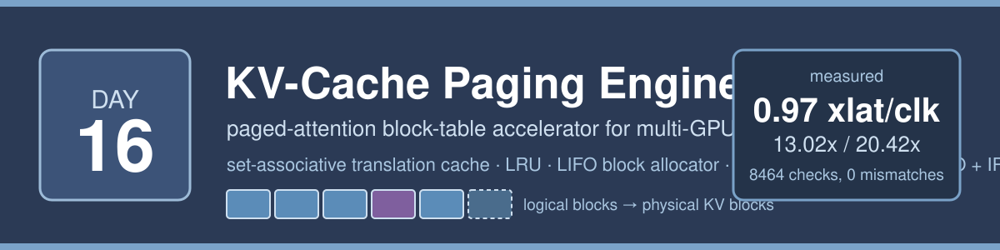
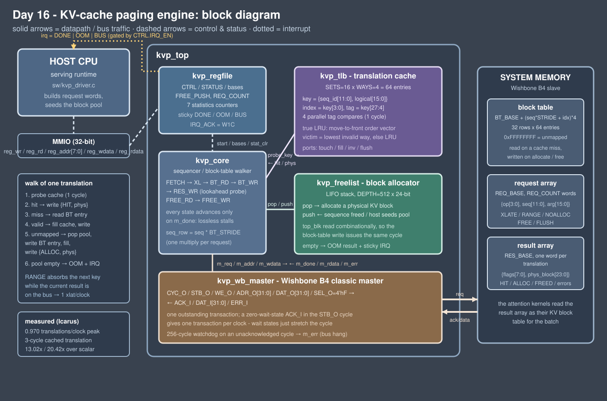

<!-- Author: Asresh -->


# Day 16 — KV-Cache Paging Engine (paged-attention block-table accelerator)

<!-- readability-guide:start -->
## Plain-language overview

Large language model serving stores attention history in fixed-size memory blocks that move as requests grow and finish. Software manages policy and batches; hardware translates logical blocks, caches recent translations, and allocates physical blocks when needed.

## Abbreviation guide

Every shortened technical term used in this README is expanded below for quick reference:

- **ACK** [Acknowledge]
- **B4** [Wishbone Revision B4]
- **COUNT** [Count]
- **CPU** [Central Processing Unit]
- **CTRL** [Control]
- **CYC** [Cycle]
- **DUT** [Device Under Test]
- **EBADOP** [Error: Bad Operation]
- **EINVAL** [Error: Invalid Argument]
- **EN** [Enable]
- **EOOM** [Error: Out of Memory]
- **ERR** [Error]
- **FIFO** [First-In, First-Out]
- **GPU** [Graphics Processing Unit]
- **IRQ** [Interrupt Request]
- **KV** [Key-Value]
- **LIFO** [Last-In, First-Out]
- **LLM** [Large Language Model]
- **LRU** [Least Recently Used]
- **MMIO** [Memory-Mapped Input/Output]
- **OOM** [Out of Memory]
- **REQ** [Request]
- **RTL** [Register-Transfer Level]
- **RW** [Read/Write]
- **SEL** [Select]
- **STAT** [Status]
- **vLLM** [Virtualized Large Language Model Serving Engine]
- **W1C** [Write One to Clear]
- **XL** [Translate]
- **XLATE** [Translate]
<!-- readability-guide:end -->

A hardware address-translation front end for a **paged KV cache** — the vLLM
*PagedAttention* data structure that every modern LLM serving stack is built on.
The attention kernels want **physical KV-block numbers**; the serving runtime
thinks in `(sequence, logical block)` pairs. This engine turns the second into the
first at bus rate, and owns the two operations that come with it: **allocating** a
physical block when a sequence grows, and **returning** its blocks to the pool when
it is evicted.

## The problem

A KV cache is not one contiguous tensor per sequence. It is a pool of fixed-size
physical blocks, and every sequence owns a **block table**: logical block *i* of
sequence *s* lives at physical block `block_table[s][i]`. Serving a batch means
walking those tables constantly:

- **prefill** — a new sequence needs *n* blocks, so *n* table entries must be
  allocated from a shared pool and written back;
- **decode** — every step re-reads the block table for the whole context of every
  sequence in the batch, thousands of translations per step;
- **eviction / preemption** — a finished sequence's blocks must go back to the
  pool, in an order that keeps the next allocation cheap;
- **out of memory** — when the pool runs dry the scheduler has to know
  *immediately*, because it must preempt a sequence before the next step.

On a multi-GPU serving node this is pure pointer-chasing on the critical path: a
hash/array probe, a dependent load from a multi-megabyte block table, a
compare, an allocation, a store — per block, per sequence, per step, in the
runtime's hot loop. It is control-flow-bound work with essentially no arithmetic,
which is exactly the shape of thing a small piece of hardware does better than a
core.

## The hardware/software split

**Hardware** takes the mechanical per-block work, because it is fixed-function,
latency-critical and identical every time:

| in hardware | why |
|---|---|
| the translation cache (`kvp_tlb`) | 4 tag comparisons in **parallel** resolve a translation in **one cycle**; in software the same probe is ~12 sequential operations |
| the block-table walk (`kvp_core`) | a dependent load + compare + conditional store becomes a 2–3-state walk with no branch mispredicts |
| block allocation (`kvp_freelist`) | pop / push a LIFO of physical blocks — one cycle, and the combinational stack-top read lets the dependent block-table write issue in the *same* cycle |
| LRU replacement | a move-to-front order vector updates in the cycle of the access, free |
| batching + writeback | the engine streams a whole batch of requests and writes the physical block table the kernels will read, so the CPU is out of the loop entirely |

**Software** keeps everything that is policy, because policy changes and hardware
does not:

| in software | why |
|---|---|
| which sequences are admitted, how long their contexts are | scheduling policy, changes per serving strategy |
| when to evict / preempt a sequence (`OP_FREE`) | the runtime owns fairness and priority |
| seeding the physical-block pool (`FREE_PUSH`) | the pool layout belongs to the memory allocator, not the engine |
| reacting to out-of-memory | the interrupt hands control back to the scheduler, which decides *who* loses their blocks |
| the reference implementation | `sw/kvp_model.c` predicts every result bit-exactly, which is what makes the differential test possible |

The engine deliberately does **not** decide policy: it never evicts a sequence on
its own, and an exhausted pool is reported (sticky bit + interrupt), not resolved.



## Architecture

| module | role |
|---|---|
| [rtl/kvp_top.v](rtl/kvp_top.v) | top level: MMIO plane, one Wishbone B4 master, datapath wiring |
| [rtl/kvp_tlb.v](rtl/kvp_tlb.v) | set-associative translation cache, `SETS`×`WAYS` entries, parallel tag compare, true LRU (move-to-front order vector), invalid-way-first victim choice, single probe port shared by lookup / fill / invalidate / flush |
| [rtl/kvp_core.v](rtl/kvp_core.v) | sequencer and block-table walker: `FETCH → XL → BT_RD → BT_WR → RES_WR`, plus the `FREE_RD → FREE_WR` release walk |
| [rtl/kvp_freelist.v](rtl/kvp_freelist.v) | physical-block allocator: LIFO stack, `DEPTH`×`PHYS_W`, combinational top read |
| [rtl/kvp_wb_master.v](rtl/kvp_wb_master.v) | Wishbone B4 classic master, `SEL_O=4'hF`, `ERR_I` handling and a 256-cycle watchdog on an unacknowledged cycle |
| [rtl/kvp_regfile.v](rtl/kvp_regfile.v) | MMIO control/status, 7 statistics counters, sticky DONE/OOM/BUS + W1C interrupt |
| [rtl/kvp_defs.vh](rtl/kvp_defs.vh) | encodings shared with `sw/kvp.h` |

Two properties are worth calling out, because both are what the testbench proves:

**Elasticity.** Every state advances only on `m_done` from the bus master. Memory
wait states, a slow interconnect, even a hung slave stretch the walk without
changing a single result — the output stream is a function of the request stream
alone, never of bus timing. Measured: the same 1,955 result words and the same
block table come out of a 4,971-cycle full-rate pass and an 11,854-cycle pass with
6,883 memory stall cycles injected.

**One translation per bus transaction.** While the result word of translation *i*
is on the bus, the core already presents the key of translation *i+1* to the
(combinational) cache probe port and absorbs it in the same cycle if it hits. A
hot sequence therefore retires a translation per clock against a zero-wait-state
slave instead of one per two cycles — measured **0.970 translations/clock** on the
512-translation fully-cached batch, with **93.5 %** of cycles carrying a Wishbone
transaction. The engine is bus-bound by design; the block table lives in memory,
so one request read + one result write is the floor.

### Request and result words

A request is one 32-bit word in memory: `{op[3:0], seq_id[11:0], arg[15:0]}`.

| op | name | arg | results |
|---|---|---|---|
| 0 | `XLATE` | logical block | 1 — translate, allocate if unmapped |
| 1 | `RANGE` | count | *count* — translate logical `0..count-1` (a prefill / a full-context decode step) |
| 2 | `NOALLOC` | logical block | 1 — translate, **error** if unmapped (a probe that must not grow the cache) |
| 3 | `FREE` | count | 1 — return blocks `0..count-1` to the pool, payload = blocks returned |
| 4 | `FLUSH` | — | 1 — invalidate the whole translation cache |

A result is one 32-bit word: `{flags[7:0], payload[23:0]}`, payload = physical
block number.

| flag | bit | meaning |
|---|---|---|
| `HIT` | 0 | served from the translation cache |
| `ALLOC` | 1 | a new physical block was allocated and written to the block table |
| `FREED` | 2 | payload = number of blocks returned |
| `FLUSHED` | 3 | cache invalidated |
| `EINVAL` | 4 | `NOALLOC` hit an unmapped entry |
| `EOOM` | 5 | pool exhausted — the rest of a `RANGE` is abandoned |
| `EBADOP` | 6 | unknown opcode |

A plain miss that found a valid block-table entry has **no** flags set: the
distinction between "cache hit", "table walk" and "freshly allocated" is visible
to the runtime for every single translation.

### Register map

MMIO, 32-bit registers, byte address = index × 4.

| # | name | access | description |
|---|---|---|---|
| 0 | `CTRL` | W | bit0 `START` (self-clearing), bit1 `SOFT_RESET` (flush cache, drop pool, clear stats), bit2 `IRQ_EN` |
| 1 | `STATUS` | R | bit0 `BUSY`, bit1 `DONE`, bit2 `OOM`, bit3 `BUS_ERR`, bit4 `IRQ` (bits 1–3 sticky) |
| 2 | `REQ_BASE` | RW | byte address of the request array |
| 3 | `RES_BASE` | RW | byte address of the result array |
| 4 | `REQ_COUNT` | RW | number of request words in the batch |
| 5 | `BT_BASE` | RW | byte address of the block table |
| 6 | `BT_STRIDE` | RW | words per sequence row |
| 7 | `FREE_PUSH` | W | push one physical block number onto the free pool |
| 8 | `FREE_COUNT` | R | blocks currently in the pool |
| 9 | `STAT_REQS` | R | request words consumed |
| 10 | `STAT_XLATES` | R | translations performed |
| 11 | `STAT_HITS` | R | served from the translation cache |
| 12 | `STAT_MISSES` | R | block-table walks |
| 13 | `STAT_ALLOCS` | R | physical blocks allocated |
| 14 | `STAT_FREES` | R | physical blocks returned |
| 15 | `STAT_ERRS` | R | error results (invalid / OOM / bad op / bus) |
| 16 | `LAST_CYC` | R | cycle span of the last batch |
| 17 | `RES_WORDS` | R | result words written by the last batch |
| 18 | `IRQ_ACK` | W1C | write 1 to clear `DONE` / `OOM` / `BUS_ERR` |
| 19 | `VERSION` | R | `0x00160001` |

The register sequence a driver uses is in [sw/kvp_driver.c](sw/kvp_driver.c) —
configure, seed the pool, submit, wait for the interrupt, read the statistics —
and the testbench performs exactly that sequence on the DUT.

## Build and run

```bash
make sim
```

```bash
make all
```

```bash
make sweep
```

```bash
make synth
```

`make sim` builds the host/model/baseline (and compiles the firmware as a build
check), generates the vectors and golden files into `tb/vectors/`, then runs the
Icarus differential testbench. `make all` also regenerates
[results/metrics.md](results/metrics.md). `make sweep` re-parameterizes **both**
the RTL and the golden model and runs the full differential test at four cache
geometries. `make synth` falls back to an analytical area estimate — this
environment has Icarus Verilog but no Verilator and no Yosys.

## Results

Measured on the Icarus run in [results/sim.log](results/sim.log); regenerated by
`make metrics` into [results/metrics.md](results/metrics.md).

| metric | value |
|---|---|
| batches / pass | 16 |
| request words / pass | 371 |
| translations / pass | 1,909 |
| served from the translation cache | 610 (32.0 %) |
| block-table walks | 1,299 |
| physical blocks allocated / returned | 539 / 162 |
| result words written / pass | 1,955 |
| checks | 8,464 |
| **mismatches** | **0** |
| full-rate cycles (aggregate) | 4,971 |
| wait-state pass cycles (aggregate) | 11,854 (6,883 memory stall cycles) |
| Wishbone transactions (full rate) | 4,647 (93.5 % bus occupancy) |
| sustained throughput | 0.3840 translations/clock |
| sustained throughput | 0.3933 result words/clock |
| peak throughput (batch 10, fully cached) | **0.9697 translations/clock** (512 in 528 cycles) |
| single-translation latency (start → done) | **3 cycles** |
| scalar baseline (cost model) | 64,716 cycles |
| **aggregate speedup** | **13.02×** |
| **peak speedup** | **20.42×** |

Selected per-batch cycle spans, straight from the log:

| batch | workload | translations | cycles |
|---|---|---|---|
| 0 | cold prefill, 8 blocks (8 allocations) | 8 | 26 |
| 1 | the same context again, fully cached | 8 | 10 |
| 2 | `FLUSH` then re-walk (8 table walks, 0 allocations) | 8 | 20 |
| 4 | evict the sequence, then re-prefill from the pool | 4 | 89 |
| 10 | peak: 8 × 64 fully-cached translations | 512 | 528 |
| 11 | latency probe: one fully-cached translation | 1 | 3 |

The baseline is the documented scalar cost model in
[sw/kvp_baseline.c](sw/kvp_baseline.c): 4 cycles to decode a request word, 21 for
a translation served from a software cache, 34 for a block-table walk, 42 for a
walk plus an allocation, 12 to release a block, at one modelled operation per
cycle. It charges **nothing** for cache misses on the block table (a real
last-level-cache miss to a multi-megabyte table costs tens of cycles), nothing for
loop overhead or branch mispredicts, and nothing for the atomics a real runtime
needs around a shared block pool — so the speedup above is a conservative lower
bound.

## What was verified

Two full passes over the same 16-batch serving trace — one with randomised memory
wait states (0–3), one at zero wait states — with **8,464 checks and 0
mismatches**. Per batch the testbench checks:

- **every result word** in memory against the golden model — the physical block
  number *and* the flags, so a wrong hit/miss decision, a wrong replacement victim
  or a wrong allocation order all fail;
- **all seven statistics counters** plus `FREE_COUNT` and `RES_WORDS`;
- the sticky `OOM` bit, the interrupt output, and that `IRQ_ACK` clears it;

and at the end of each pass, the **entire 2,048-word block table** against the
golden image — so a stale or missing writeback cannot hide.

Directed corner cases in the trace: cold prefill; a fully-cached re-read; a cache
flush that turns hits into walks without allocating; `NOALLOC` on a mapped and on
an unmapped block; sequence eviction followed by a re-prefill that must reuse the
released blocks in **LIFO order**; pool exhaustion mid-`RANGE` (4 blocks, 10
asked); an unknown opcode; both zero-count degenerate forms; block-table rows
pre-populated by software with an empty pool; **LRU thrash** — 9 sequences
contending for one 4-way set, probed forward, forward again and in reverse, which
pins down the replacement order exactly; and a 512-translation peak batch. Plus
**320 randomised requests** across the whole opcode mix (55 % `RANGE`, 20 %
`XLATE`, 10 % `NOALLOC`, 10 % `FREE`, 5 % `FLUSH`) over 32 sequences.

Error paths, checked directly: a poisoned block-table address answering with
Wishbone `ERR_I`, and a slave that never acknowledges (the master's watchdog).
Both must raise the sticky bus-error bit and the interrupt, end the run cleanly
rather than wedging the engine, and clear on W1C.

The test was checked for teeth by mutation: forcing the LRU victim to way 0
produces result mismatches in the thrash batch, and turning the block pool from
LIFO into FIFO order produces 4,476 mismatches. Both are silent under a weaker
test that only checked "some physical block came back".

Parameterization — `make sweep` runs the **whole differential test** (not just
elaboration) with the RTL and the golden model rebuilt at each geometry:

| sets × ways | pool depth | checks | mismatches | full-rate cycles | peak batch |
|---|---|---|---|---|---|
| 16 × 4 | 512 | 8,464 | 0 | 4,971 | 528 |
| 8 × 2 | 256 | 8,372 | 0 | 5,391 | 1,040 |
| 32 × 8 | 512 | 8,464 | 0 | 4,872 | 528 |
| 4 × 4 | 64 | 7,316 | 0 | 3,971 | 1,040 |

The 8×2 and 4×4 points are the interesting ones: a 16-entry cache cannot hold the
64-block context, so the peak batch falls back to block-table walks and takes
1,040 cycles instead of 528 — the geometry changes the hit rate, the replacement
decisions and every allocated block number, and the model tracks all of it
bit-exactly.

## Layout

```
day16 - gpu_kv_cache_paging_engine/
├── rtl/        kvp_top, kvp_core, kvp_tlb, kvp_freelist, kvp_wb_master, kvp_regfile
├── sw/         kvp_host (workload + golden), kvp_model, kvp_baseline, kvp_driver (firmware)
├── tb/         kvp_tb.sv + generated vectors in tb/vectors/
├── scripts/    param_sweep.sh, extract_metrics.py, area_estimate.py
├── docs/       banner.svg, block_diagram.svg
└── results/    metrics.md (committed), sim.log
```

Toolchain in this environment: **Icarus Verilog 13.0** and **cc/clang**. No
Verilator, no Yosys — `make synth` reports the analytical state/comparator
estimate instead of a synthesized cell count, and no timing or area number in this
README comes from a synthesis run.
