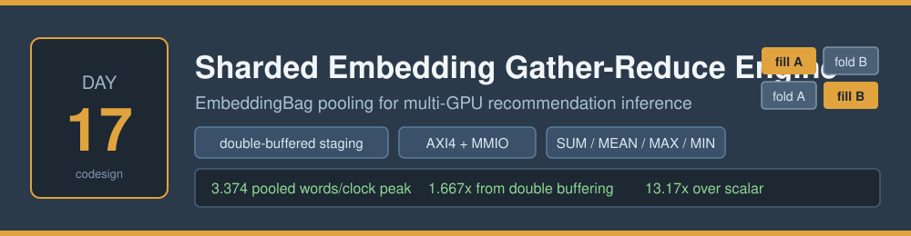
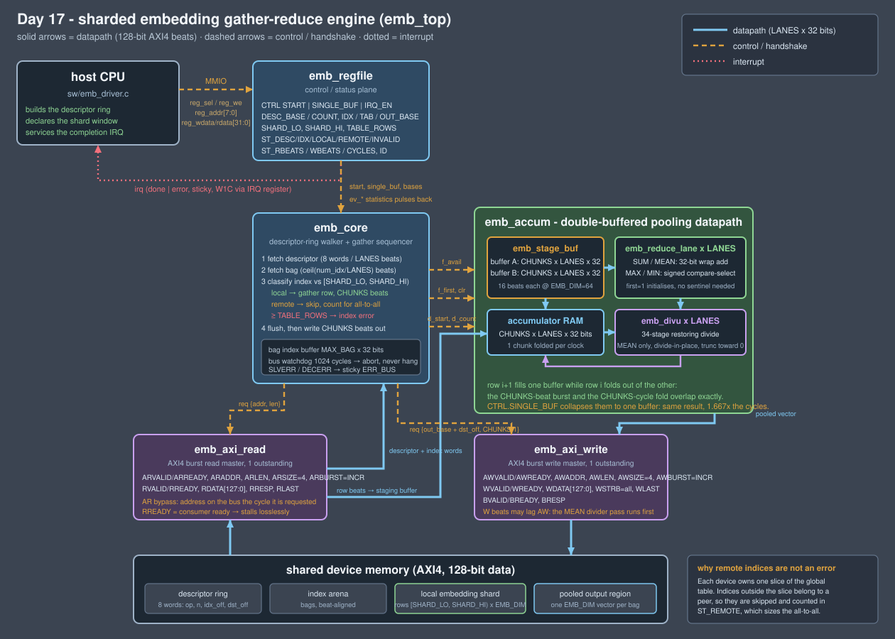

# Day 17 — Sharded Embedding Gather-Reduce Engine (multi-GPU EmbeddingBag)

A hardware **embedding-table gather and pooling engine** — the first layer of every
deep-learning recommendation model, and the one part of the network that does not
fit on a single device. The dense tower is a GEMM problem. The sparse tower is a
*memory* problem: hundreds of gigabytes of embedding tables sharded across the
GPUs of a node, and per query a few thousand row lookups scattered at random
through them, each one pooled down to a single vector before anything dense
happens.

This engine is that lookup path: give it a ring of bags (a bag being one sparse
feature's list of row indices), tell it which slice of the global table this
device owns, and it gathers the local rows, pools them with `SUM` / `MEAN` /
`MAX` / `MIN`, and writes one pooled vector per bag — while counting exactly how
many indices belonged to a *peer* device, which is what sizes the all-to-all that
follows.

## The problem

`nn.EmbeddingBag` looks trivial written down:

```python
out[b] = pool(table[idx] for idx in bag[b])
```

On a sharded multi-GPU node it is anything but. The table is split by row across
`R` devices, so every index first has to be classified — mine, or a peer's? — and
only the local ones can be gathered. What the CPU actually executes per index is
a compare against the shard window, a multiply to form the row address, a
dependent load of `EMB_DIM` words from a table far too large for any cache, and
then `EMB_DIM` fused load/op/store pairs to fold that row into the accumulator.
Per bag. Per feature. Per query. At production batch sizes this is millions of
scattered row reads per inference step, and it is what makes the sparse tower,
not the dense one, the latency floor of a recommender.

The shape of the work is the interesting part:

- **arithmetic is trivial** — one add or one signed compare per element;
- **the addresses are unpredictable** — a random row per index, so no prefetcher
  helps and every row read is a fresh dependent load;
- **the loop is completely regular** — always `EMB_DIM` elements, always the same
  fold, always the same output size.

That combination — no arithmetic to speak of, memory latency on the critical
path, and a perfectly fixed inner loop — is exactly what a small piece of
hardware with two staging buffers beats a core at. The core cannot overlap the
fetch of row *i+1* with the fold of row *i*; a ping-pong buffer does it for free.

## The hardware/software split

**Hardware** takes everything that repeats per index and per element:

| in hardware | why |
|---|---|
| shard classification (`emb_core`) | two compares against `SHARD_LO` / `SHARD_HI` resolve in the cycle the index is read; in software it is a load, two branches and a mispredict on a data-dependent condition |
| row gather (`emb_axi_read`) | one `CHUNKS`-beat INCR burst per row instead of `EMB_DIM` scalar loads, with the AR beat placed on the bus in the same cycle it is requested |
| the pooling fold (`emb_accum`) | `LANES` reduce lanes fold a whole beat per clock, one adder deep, so the fold keeps pace with a full-rate burst |
| **double buffering** (`emb_stage_buf`) | row *i+1* streams into one buffer while row *i* folds out of the other — the fetch latency disappears behind arithmetic that would otherwise be waiting for it. Measured at **1.667×** against the same design with the overlap switched off |
| `MEAN` renormalisation (`emb_divu`) | `LANES` pipelined 34-stage restoring dividers, one quotient per clock, truncating toward zero exactly like C's `/` |
| the statistics (`emb_regfile`) | the local / remote / invalid split is counted as the walk happens, so the runtime gets its all-to-all sizes for free instead of re-scanning the index arrays |

**Software** keeps everything that is a policy decision or happens once per batch:

- laying out the descriptor ring — which bags, in which order, with which
  pooling op, writing where (`emb_build_ring` in `sw/emb_driver.c`);
- declaring the shard window and the global table size;
- deciding what to do about the counts the engine reports — an over-long bag, an
  out-of-range index, a saturated pool — because those are model-level
  decisions, not datapath ones;
- servicing one interrupt per batch, not one per bag.

The split point is the descriptor: the CPU touches descriptors and status words,
never an embedding row.

### Why a remote index is not an error

`SHARD_LO`/`SHARD_HI` describe the rows *this* device holds. An index outside that
window is not a bug — it is a row that a peer device owns and will pool into its
own partial, and the framework will combine the partials afterwards. So the
engine skips it, counts it in `ST_REMOTE`, and pools only what it has. `MEAN`
therefore divides by the number of **locally** pooled rows, which is the partial
a sharded reduce expects. A bag whose indices are *all* remote pools nothing and
emits a zero vector — the additive identity the reduce needs. Only an index past
the end of the *global* table (`>= TABLE_ROWS`) is a real error, and that raises
a sticky flag without derailing the rest of the bag.

## Block diagram



## How it works

A descriptor is 8 words (32 bytes, so it is memory-beat aligned for
`LANES ∈ {2,4,8}`): `{op, num_idx, idx_off, dst_off, reserved×4}`. For each one
`emb_core` runs:

1. **fetch the descriptor** — one burst of `8/LANES` beats.
2. **fetch the whole bag** — `ceil(num_idx/LANES)` beats into a `MAX_BAG`-deep
   index buffer, so the row gather never interleaves pointer loads with data
   loads. A bag longer than the buffer is rejected whole (`ERR_BAGLEN`) rather
   than silently truncated.
3. **walk the indices in order** — classify, and for a local hit issue one
   `CHUNKS`-beat burst for the row into whichever staging buffer is free.
   Classification and burst issue happen in the same cycle, so back-to-back row
   gathers are separated by two cycles rather than four.
4. **fold, concurrently** — `emb_accum` reads the *other* buffer one chunk per
   clock and folds it through `LANES` reduce lanes into the accumulator. A row
   takes `CHUNKS` cycles to fold and `CHUNKS` beats to fetch, so the two pipeline
   stages are exactly matched and the engine retires `LANES` words per clock.
   The `first` flag initialises the accumulator on the first locally pooled row,
   which is what makes `MAX`/`MIN` correct without a sentinel.
5. **drain** — for `MEAN`, a divide-in-place pass pushes every chunk through the
   `LANES` dividers and writes the quotients back into the accumulator, with no
   backpressure and no FIFO; then the pooled vector goes out as one `CHUNKS`-beat
   write burst. The `AW` beat is issued before the divider pass starts, because
   AXI4 lets `W` lag `AW`.

Ordering is strict: indices are folded in bag order, so a wrapping `SUM` is
reproducible to the bit. Every result is a function of the descriptor ring alone
— bus wait states and the buffering mode change only the cycle count, which is
what runs A, B and C of the testbench prove against each other.

`CTRL.SINGLE_BUF` collapses the two buffers into one: a row may only be fetched
when nothing is staged and nothing is folding. Results are identical; it just
takes 1.667× as long. That is the double-buffering measurement, made against the
same RTL rather than against an estimate.

## Register map

MMIO, 32-bit registers, byte offsets from the engine's base address.

| offset | name | access | description |
|---|---|---|---|
| `0x00` | `CTRL` | W | `[0]` START (self-clearing), `[1]` SINGLE_BUF, `[2]` IRQ_EN, `[3]` CLR_STATS |
| `0x04` | `STATUS` | R | `[0]` BUSY, `[1]` DONE, `[2]` ERR_BAGLEN, `[3]` ERR_INDEX, `[4]` ERR_BUS |
| `0x08` | `IRQ` | R/W1C | `[0]` DONE, `[1]` ERROR |
| `0x0C` | `DESC_BASE` | R/W | descriptor ring base, word offset in device memory |
| `0x10` | `DESC_COUNT` | R/W | descriptors to walk this run (0 completes immediately) |
| `0x14` | `IDX_BASE` | R/W | index arena base, word offset |
| `0x18` | `TAB_BASE` | R/W | local embedding shard base, word offset |
| `0x1C` | `OUT_BASE` | R/W | pooled output region base, word offset |
| `0x20` | `SHARD_LO` | R/W | first global row this device owns |
| `0x24` | `SHARD_HI` | R/W | one past the last global row this device owns |
| `0x28` | `TABLE_ROWS` | R/W | rows in the *global* sharded table |
| `0x2C` | `ST_DESC` | R | descriptors retired |
| `0x30` | `ST_IDX` | R | indices examined |
| `0x34` | `ST_LOCAL` | R | rows gathered from the local shard |
| `0x38` | `ST_REMOTE` | R | indices owned by a peer shard (sizes the all-to-all) |
| `0x3C` | `ST_INVALID` | R | indices `>= TABLE_ROWS` |
| `0x40` | `ST_RBEATS` | R | AXI4 read beats issued |
| `0x44` | `ST_WBEATS` | R | AXI4 write beats issued |
| `0x48` | `ST_CYCLES` | R | cycles the last run was busy |
| `0x4C` | `ID` | R | `0xE9B0_0000 \| CHUNKS<<8 \| LANES` — the firmware refuses a mismatched bitstream |

Descriptor layout, 8 words:

| word | field |
|---|---|
| 0 | `op` — 0 `SUM`, 1 `MEAN`, 2 `MAX`, 3 `MIN` |
| 1 | `num_idx` — bag length |
| 2 | `idx_off` — word offset of the bag within the index arena (beat aligned) |
| 3 | `dst_off` — word offset of the `EMB_DIM`-word pooled output |
| 4–7 | reserved |

## Build and run

```bash
make sw       # build the golden model, the scalar baseline and the firmware, generate vectors
```

```bash
make sim      # Icarus differential run: 248,960 checks, 0 mismatches
```

```bash
make metrics  # regenerate results/metrics.md from the run
```

```bash
make sweep    # full differential simulation at four geometries
```

```bash
make synth    # datapath area report
```

Geometry is set on the command line and drives the RTL, the golden model and the
testbench from the same numbers:

```bash
make sim DIM=128 LANES=4 MAX_BAG=48
```

Icarus Verilog 13.0 and `cc` are the only tools required. Verilator and Yosys are
not installed on this machine, so `make synth` reports the analytical resource
estimate in `scripts/area_estimate.py` (labelled as such — those are structural
counts read off the RTL, not synthesis results) and there is no gate-level area
or timing number anywhere in this README.

## Results

Default geometry `EMB_DIM=64`, `LANES=4` (128-bit memory interface),
`CHUNKS=16`, `MAX_BAG=64`; global table 4096 rows, this device owns rows
`[1024, 1280)`. Every figure below is read out of `results/sim.log`; the
baseline is the documented scalar cost model in `sw/emb_baseline.c`.

| metric | value |
|---|---|
| descriptors (bags) / pass | 319 (19 directed + 300 randomised) |
| indices examined / pass | 9,523 |
| rows gathered from the local shard | 6,000 (63.0%) |
| indices owned by a peer shard | 3,521 (37.0%) |
| embedding words gathered + pooled / pass | 384,000 |
| AXI4 read beats / write beats | 99,134 / 5,088 |
| pooled output words written / pass | 20,416 |
| checks / mismatches | 248,960 / **0** |
| full-rate cycles (aggregate) | 131,651 |
| wait-state pass cycles (aggregate) | 356,748 (225,097 bus stall cycles) |
| single-buffer cycles (identical results, overlap off) | 219,490 |
| AXI4 bus occupancy, full rate | 79.2% |
| sustained throughput | **2.917 pooled words/clock** (roofline 4) |
| peak throughput (64-row all-local bag) | **3.374 pooled words/clock**, 87.1% bus occupancy |
| peak cycles per row (16-beat burst) | 18.97 |
| **double-buffering speedup** | **1.667×** |
| scalar baseline (cost model) | 1,733,292 cycles |
| **aggregate speedup** | **13.17×** |
| **peak speedup** | **14.08×** |

The residual gap to the `LANES=4` roofline is per-row bus overhead, not datapath
stall: at 18.97 cycles per 16-beat row burst, three cycles go to the request
handshake and the slave's address-to-data latency. The read master keeps one
transaction outstanding, so a row's `AR` cannot be issued until the previous
row's `RLAST` has landed; a second outstanding request would close most of that
gap and is the obvious next revision.

Cost-model terms (one cycle per modelled scalar operation, evaluated over 420,194
modelled operations): descriptor decode 6, index classify 6, row address 4,
first-row element 3, folded element 4, `MEAN` element 22 (32-bit divide),
copy-out element 2, empty-bag element 2. The model is deliberately generous to
the CPU — no cache misses on the table walk, no branch mispredicts on the shard
classification, no loop overhead.

### Geometry sweep

Each row is a complete differential run — golden model and RTL both rebuilt from
those parameters — not just an elaboration check.

| `EMB_DIM` / `LANES` / `MAX_BAG` | checks | full-rate cycles | sustained words/clock | double-buffering |
|---|---|---|---|---|
| 64 / 4 / 64 | 248,960 | 131,651 | 2.917 | 1.667× |
| 32 / 8 / 32 | 130,272 | 31,617 | 3.341 | 1.331× |
| 128 / 4 / 48 | 373,696 | 205,126 | 3.142 | 1.724× |
| 32 / 2 / 64 | 175,328 | 137,577 | 1.433 | 1.657× |

928,256 checks across the sweep, 0 mismatches. The double-buffering gain tracks
`CHUNKS`, as it should: the deeper the row burst, the more fetch latency there is
to hide behind the fold, and the `32/8` case (`CHUNKS=4`) has the least.

## What was verified

Bit-exact against the C golden model (`sw/emb_model.c`) — every word of the
output region, and every statistics register — over 319 bags / 9,523 indices /
6,000 gathered rows / 20,416 pooled output words per pass, checked under
randomised AXI wait states on all five channels and again at full rate, and again
in single-buffer mode. Runs A, B, C and F must produce identical memory images.

Directed corner cases, all in the ring rather than bolted on:

- an **empty bag** (`num_idx = 0`) → zero vector;
- a **single local** index, and a **single remote** index → zero vector;
- a bag where **every** index is remote → zero vector;
- exactly `LANES` indices, i.e. one whole index beat;
- **`MAX` over `INT32_MIN` and `-1`** → `-1`, and `MIN` over `INT32_MAX` and
  `-1` → `-1`, so the all-negative / all-positive cases prove there is no
  zero-initialised accumulator hiding in the fold;
- **`SUM` of `INT32_MAX` + `INT32_MAX`** → two's-complement wrap to `-2`;
- **`MEAN` of `-7` and `0`** → `-3`, truncating toward zero, plus `MEAN` with
  count 1, `MEAN` that divides exactly, and `MEAN` over alternating
  `INT32_MAX`/`INT32_MIN` rows;
- the **same index five times** — duplicates fold, they do not deduplicate;
- both **shard boundaries** (`SHARD_LO` and `SHARD_HI - 1`) gathered, and
  `SHARD_HI` itself correctly classified as remote;
- a **`MAX_BAG`-deep all-local bag** — the peak-throughput descriptor;
- `num_idx > MAX_BAG` → `ERR_BAGLEN`, descriptor rejected, **nothing written**;
- an index `>= TABLE_ROWS` → `ERR_INDEX`, while the rest of the bag still pools;
- a bag mixing local, remote and invalid indices.

Plus 300 randomised bags (random op, length 1…`MAX_BAG`, indices drawn so ~60%
land in the local shard) — well past the 256-vector bar without diluting the
directed cases.

Beyond the data path:

- **the engine writes nothing outside the output region** — all 41,792 words of
  descriptors, index arena and embedding shard are compared against the
  pre-run image after every full run;
- the output region is **poisoned with `0xDEADC0DE`** before each run, so a
  missing write is a mismatch rather than a stale pass;
- **statistics registers** are checked against the model *and* against the beats
  the testbench's AXI slave actually saw, so the counters cannot drift from the
  bus;
- **`STATUS` error bits and the sticky `IRQ`** are checked, including that the
  `irq` line asserts and that write-1-to-clear drops it;
- a **read `SLVERR`** latches `ERR_BUS`, aborts the walk and returns to idle;
- a **wedged slave** that never accepts an address trips the 1024-cycle bus
  watchdog rather than hanging the ring;
- a **zero-length ring** completes immediately having moved no data;
- after both injected faults a **clean run is bit-exact again**, proving the
  faults left no residue;
- the **device `ID` register** and every configuration register read back.

The suite was mutation-checked, so a pass means something: removing the
first-row accumulator initialisation in `emb_reduce_lane`, and renormalising
`MEAN` by the bag length instead of the locally pooled count, both fail on
directed descriptors within the first run.

248,960 checks per pass, 928,256 across the geometry sweep, **0 mismatches**.

## Layout

```
rtl/emb_defs.vh        parameters, opcodes, register offsets
rtl/emb_top.v          top level
rtl/emb_core.v         descriptor-ring walker + gather sequencer
rtl/emb_accum.v        double-buffered pooling accumulator + drain
rtl/emb_stage_buf.v    ping-pong row staging store
rtl/emb_reduce_lane.v  one SIMD lane of the pooling fold
rtl/emb_divu.v         pipelined signed restoring divider (MEAN)
rtl/emb_regfile.v      MMIO control / status plane
rtl/emb_axi_read.v     AXI4 burst read master
rtl/emb_axi_write.v    AXI4 burst write master

sw/emb.h               shared geometry, memory map, register map
sw/emb_model.c         bit-exact golden model (the specification)
sw/emb_baseline.c      scalar software-only cost model
sw/emb_driver.c        firmware: ring build, configure, start, IRQ, self-check
sw/emb_host.c          vector / golden / constants generator

tb/emb_tb.sv           differential testbench + AXI4 slave model
scripts/               metrics extraction, geometry sweep, area estimate
results/metrics.md      measured numbers, regenerated by `make metrics`
```
