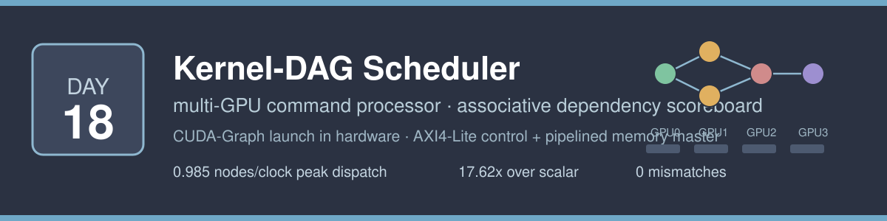
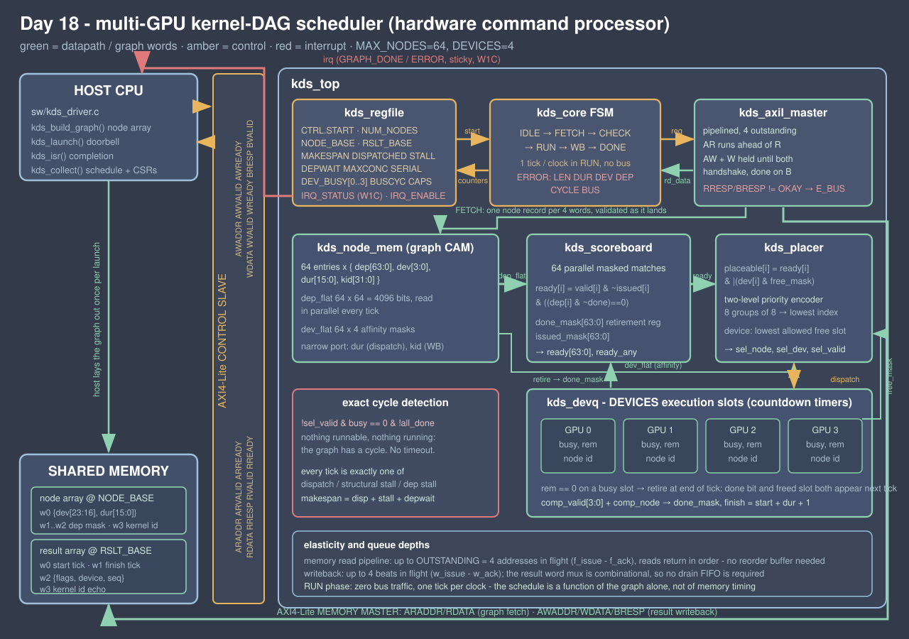

<!-- Author: Asresh -->


# Day 18 — Multi-GPU Kernel-DAG Scheduler (hardware command processor)

<!-- readability-guide:start -->
## Plain-language overview

This command processor schedules a graph of dependent kernels across several devices. Software describes dependencies and allowed devices; hardware finds ready work in parallel, launches it, and records completion times.

## Abbreviation guide

Every shortened technical term used in this README is expanded below for quick reference:

- **AXI4** [Advanced eXtensible Interface 4]
- **AXI4-Lite** [Advanced eXtensible Interface 4 Lite]
- **BRESP** [Write Response]
- **CAM** [Content-Addressable Memory]
- **CAPS** [Capabilities]
- **CPU** [Central Processing Unit]
- **CSR** [Control and Status Register]
- **CTRL** [Control]
- **CUDA** [Compute Unified Device Architecture]
- **DAG** [Directed Acyclic Graph]
- **DEP** [Dependency]
- **DEPW** [Dependency Width]
- **DEV** [Device]
- **DUR** [Duration]
- **ERR** [Error]
- **FSM** [Finite-State Machine]
- **GPU** [Graphics Processing Unit]
- **IRQ** [Interrupt Request]
- **LEN** [Length]
- **MAX** [Maximum]
- **OKAY** [Successful Bus Response]
- **RAM** [Random-Access Memory]
- **RRESP** [Read Response]
- **RTL** [Register-Transfer Level]
- **RW** [Read/Write]
- **SLVERR** [Slave Error]
- **W1C** [Write One to Clear]
- **WB** [Wishbone Bus]
- **XLA** [Accelerated Linear Algebra]
<!-- readability-guide:end -->

A hardware **command processor** for a multi-GPU node: give it a graph of
kernels with their dependencies and their device affinities, and it schedules
the whole thing onto the devices itself — one placement decision per clock,
without the host being involved after the doorbell.

This is the piece of an inference runtime that a CPU is worst at. A CUDA graph
(or a TensorRT engine, or an XLA executable) is a DAG of hundreds of small
kernels. Somebody has to decide, continuously, which kernels are now runnable
and which device each one should go to. On a CPU that decision is a loop over
the node list, and while the loop runs the GPUs are idle. Here it is a single
cycle of combinational logic over an associative scoreboard, and the answer
arrives in the same cycle the last predecessor retires.

## The problem

Launching a graph looks trivial written down:

```python
for node in topological_order(graph):
    wait_for(node.predecessors)
    launch(node, device=pick_device(node))
```

What a runtime actually executes per decision is: scan every unretired node,
load its dependency mask, AND-NOT it against the retirement set, branch on a
data-dependent condition, then poll every device's completion flag, then build
a launch record and ring a doorbell. That is O(N) work per launched kernel, so
O(N²) per graph — and none of it overlaps with the devices, because the devices
are waiting for the launch that the scan is delaying.

The shape of the work is what makes it a hardware problem:

- **the state is tiny** — a few hundred bits of dependency mask per node, all of
  which fit on chip;
- **the query is the same every time** — "which nodes have all predecessors
  retired, and of those which can go on a free device I am allowed to use";
- **it must be answered continuously** — every retirement changes the answer,
  and every cycle spent computing it is a cycle a GPU spends idle.

A CAM answers that query for all 64 nodes at once. The interesting consequence
is not just that it is fast: it is that the scheduling latency drops to zero
relative to execution, so the schedule the hardware produces is the *ideal*
list schedule for that policy, not the one the CPU had time to compute.

## The hardware/software split

**Hardware** takes everything that repeats per scheduling decision:

| in hardware | why |
|---|---|
| the dependency match (`kds_scoreboard`) | all 64 masks are compared against the retirement register in parallel, so a node becomes eligible in the cycle its last predecessor retires — in software this is a walk of the node list per decision |
| placement (`kds_placer`) | affinity AND free-device mask, then a two-level (group-of-8) priority encoder: the winning node *and* the device it goes to resolve combinationally, with fixed tie-breaks |
| the graph store (`kds_node_mem`) | 64 × {dep mask, affinity, duration, kernel id}; the dep and affinity masks leave the module in parallel because the match needs all of them every tick, which is what makes it a CAM and not a RAM |
| device tracking (`kds_devq`) | one countdown slot per GPU / stream queue; two slots retiring on the same tick both retire, no serialisation |
| cycle detection (`kds_core`) | nothing runnable and nothing running is an exact condition, so a cyclic graph is reported immediately instead of after a timeout |
| the statistics (`kds_regfile`) | makespan, dispatch count, structural stalls, dependency stalls, peak concurrency and per-device occupancy are counted as the schedule happens, so the runtime gets its load-balance data for free rather than re-deriving it from timestamps |

**Software** keeps everything that is a policy decision or happens once per
launch:

- building the graph — which kernels, which edges, which devices each kernel is
  *allowed* on (`kds_build_graph` / `kds_add_edge` in `sw/kds_driver.c`).
  Placement **policy** is software; placement **mechanics** are hardware;
- the launch itself: point `NODE_BASE` / `RSLT_BASE` at the graph, write
  `NUM_NODES`, ring `CTRL.START`;
- the completion path (`kds_isr`), and what to do about a rejected graph — a
  zero duration, an empty affinity mask, a dangling edge, a cycle — because
  those are all program bugs, not runtime conditions;
- reading the schedule back (`kds_collect`) and deciding what it means: whether
  to widen the graph, rebalance affinity, or merge kernels.

## Block diagram



## How a tick works

Everything below reads state as it stands at the start of the tick and commits
at the end of it, exactly like a flop. The golden model in `sw/kds_model.c` is a
line-for-line mirror of it.

```
ready[i]     = valid[i] & ~issued[i] & ((dep[i] & ~done) == 0)
free         = devices whose slot is idle
placeable[i] = ready[i] & |(dev[i] & free)
dispatch     = lowest-indexed placeable node, onto its lowest-indexed
               allowed free device
```

A dispatched node is loaded into its slot with `duration-1` and counts down. A
busy slot sitting at zero retires its node at the end of that tick, so the done
bit and the freed slot both appear on the *next* tick and a dependent can be
issued immediately:

```
finish = start + duration + 1
```

and a node holds its device for `duration + 1` ticks — one issue cycle plus
`duration` execution ticks. Two identities fall straight out of that, and the
testbench checks both on every graph:

```
makespan       == dispatched + stall_ticks + depwait_ticks
sum(dev_busy)  == sum over nodes of (duration + 1) == serial_ticks
```

The first says every tick is exactly one of *dispatch*, *structural stall*
(something is ready but every device it is allowed on is busy) or *dependency
stall* (nothing is ready). The second says no device tick is ever lost or
double-counted. Together they pin the whole accounting.

`RUN` touches no bus at all — the graph is already on chip — so the schedule is
a function of the graph alone. That is why the same run under randomised wait
states and at full rate produces byte-identical results.

## Register map

AXI4-Lite slave, 32-bit registers. `sw/kds.h` and `rtl/kds_defs.vh` hold the
same map.

| offset | name | access | meaning |
|---|---|---|---|
| `0x00` | `CTRL` | W | bit 0 `START` (self-clearing doorbell) |
| `0x04` | `STATUS` | R | `[0]` BUSY, `[1]` DONE, `[2]` ERR, `[6:4]` FSM state, `[11:8]` error code |
| `0x08` | `NUM_NODES` | RW | nodes in this launch, 1…`MAX_NODES` |
| `0x0C` | `NODE_BASE` | RW | byte address of the node array |
| `0x10` | `RSLT_BASE` | RW | byte address of the result array |
| `0x14` | `IRQ_STATUS` | R/W1C | `[0]` GRAPH_DONE, `[1]` ERROR |
| `0x18` | `IRQ_ENABLE` | RW | per-source enable; masking the line does not clear the sticky bit |
| `0x1C` | `MAKESPAN` | R | scheduler ticks of the last `RUN` phase |
| `0x20` | `DISPATCHED` | R | nodes issued |
| `0x24` | `STALL_TICKS` | R | ready, but every allowed device busy |
| `0x28` | `DEPWAIT_TICKS` | R | nothing ready (waiting on dependencies) |
| `0x2C` | `MAX_CONC` | R | peak simultaneously occupied devices |
| `0x30` | `SERIAL_TICKS` | R | Σ (duration + 1) — what the schedule was compressed from |
| `0x34` | `BUS_CYCLES` | R | cycles spent in `FETCH` + `WB` |
| `0x38` | `FETCH_WORDS` | R | graph words read |
| `0x3C` | `WB_WORDS` | R | result words written |
| `0x40`…`0x4C` | `DEV_BUSY[0..3]` | R | per-device occupied ticks |
| `0x60` | `CAPS` | R | `{16'b0, MAX_NODES, DEVICES}` |

Error codes in `STATUS[11:8]`: `1` LEN (`NUM_NODES` zero or above
`MAX_NODES`), `2` DUR (a zero duration), `3` DEV (empty affinity mask, or a
device that does not exist on this scheduler), `4` DEP (an edge from a node
index ≥ `NUM_NODES`, or a self-edge), `5` CYCLE, `6` BUS (`RRESP`/`BRESP` not
`OKAY`). `LEN`/`DUR`/`DEV`/`DEP` are reported with a fixed priority, so the code
never depends on which record arrived first.

### Node record (`NODE_WORDS` = `DEPW` + 2 words, 4 at the default geometry)

| word | contents |
|---|---|
| `w0` | `{8'b reserved, 8'b affinity mask, 16'b duration}` |
| `w1..wDEPW` | dependency bitmask — bit *j* set means node *j* must retire first |
| `wDEPW+1` | kernel id (opaque, echoed into the result) |

### Result record (4 words per node)

| word | contents |
|---|---|
| `w0` | start tick (the tick the node was issued) |
| `w1` | finish tick (the tick its dependents became eligible) |
| `w2` | `{8'b flags, 8'b device, 16'b dispatch sequence}` |
| `w3` | kernel id echo |

## Build and run

Requires `iverilog` and a C compiler. Verilator and Yosys are not installed in
this environment, so `make synth` falls back to an analytical area estimate
(`scripts/area_estimate.py`) — that substitution is the only one.

```sh
make sw       # build host / golden model / baseline, compile-check the driver
make sim      # generate vectors, run the differential testbench
make metrics  # regenerate results/metrics.md from the run
make sweep    # full differential simulation at four geometries
make synth    # analytical area estimate (Yosys absent)
make all      # sim -> metrics
```

Geometry is a make variable: `make sim NODES=128 DEVS=8`. The RTL, the golden
model and the testbench are all built from the same two numbers.

## Results

Measured on the Icarus run in `results/sim.log`; the full table with the
cost-model terms is in [`results/metrics.md`](results/metrics.md).

| metric | value |
|---|---|
| geometry (scoreboard nodes / devices / words per node record) | 64 / 4 / 4 |
| graph launches per pass | 326 (317 clean + 9 rejected) |
| kernel nodes scheduled per pass | 9,991 |
| scheduler ticks per pass | 56,632 |
| serial ticks the schedule was compressed from | 146,263 |
| graph words fetched / result words written | 40,092 / 39,964 |
| checks per pass | 255,388 |
| mismatches | **0** |
| engine cycles, full rate (START → interrupt) | 140,266 |
| wait-state pass cycles | 515,157 (698,152 injected bus stall cycles) |
| bus-phase cycles (fetch + writeback) | 81,349 |
| **AXI4-Lite occupancy in the bus phases** | **98.4 %** (0.984 words/clock) |
| single-node graph latency (START → interrupt) | **32 cycles** |
| **peak dispatch rate** (64 independent nodes) | **0.985 nodes/clock** (roofline 1.000) |
| sustained dispatch rate over all graphs | 0.176 nodes/clock |
| **parallel compression** (serial ticks / scheduler ticks) | **2.583×** (roofline 4.000×) |
| scalar baseline (cost model) | 2,470,936 cycles |
| **aggregate speedup** | **17.62×** |
| **peak speedup** | **18.37×** |

Two of those numbers deserve reading carefully.

**Sustained dispatch (0.176 nodes/clock) is not a limit of the scheduler.** It
is the shape of the workload: most ticks in a real DAG are spent waiting for a
kernel to finish, not waiting for a placement decision. The scheduler's own
roofline is the peak figure — 64 independent nodes issue in 65 ticks, one per
clock — and the useful measure of what it extracted from the graphs is the
**parallel compression**: 146,263 serial ticks executed in 56,632, i.e. 2.583 of
the 4 devices busy on average, over graphs that include pinned-affinity chains
that *cannot* use more than one.

**The baseline is a cost model, not a guess about a loop.** `sw/kds_baseline.c`
is a simulator of the same policy driven by a CPU: it counts every readiness
scan visit, every completion poll, every launch and every graph word load as it
happens, and multiplies by a documented per-operation cost (graph word load 4
cycles, one node visited in a scan 4 + 2·`DEPW` = 8, one device poll 6, one
kernel launch 120 — deliberately charitable, a real CUDA launch is microseconds).
Over this workload that is 39,964 loads, 104,823 scan visits, 45,596 polls and
9,991 launches. The same model reports **7,098,584 device-ticks lost** to the CPU
holding the scheduling decision while devices sat idle — which is the thing this
engine actually removes.

## What was verified

Every graph is checked against `sw/kds_model.c`, a tick-by-tick mirror of the
`RUN` phase, on the per-node schedule *and* on every CSR.

- **Two full passes** — one with randomised wait states independently generated
  on all five AXI4-Lite memory channels (698,152 injected stall cycles), one at
  full rate. Both produce byte-identical memory and identical counters, which is
  the property the design is built around.
- **A full-memory sweep after each pass** — all 80,844 words of the simulated
  shared memory compared against the golden image, so a write anywhere outside a
  result region fails the run. Rejected graphs are additionally checked to have
  left their result region at its poison pattern.
- **The two structural identities** on every clean graph:
  `makespan == dispatched + stall + depwait` and
  `Σ dev_busy == serial_ticks`.
- **17 directed graph shapes**: a single node; an 8-deep serial chain; 8
  independent nodes on 4 devices; a diamond; 8 independent nodes all pinned to
  device 0 (affinity forces serialisation); two chains pinned to different
  devices; a `MAX_NODES`-deep chain; `MAX_NODES` independent nodes at duration 1
  (the dispatch roofline) and at duration 16; one 1000-tick kernel beside a crowd
  of short ones; a 32-way fan-in join; a fan-out from a single root; every node
  pinned to the highest device; **reverse-topological labelling** (node 0 waits
  on the last node, so index order is not execution order); two layered
  graphs; and a mixed-affinity graph where half the nodes float and half are
  pinned.
- **9 directed rejection cases**: zero duration, empty affinity mask, a device
  that does not exist, an edge to a node index ≥ `NUM_NODES`, a self-edge, a
  two-node cycle, a three-node cycle beside valid nodes, `NUM_NODES` = 0, and
  `NUM_NODES` = `MAX_NODES` + 1. The partial counters at the point a cycle is
  detected are compared too, not just the error code.
- **300 randomised graphs** generated in topological order and then **relabelled
  with a random permutation**, so node index order is deliberately not
  topological order, with random durations, random dependency density (4–22 %)
  and random non-empty affinity masks.
- **Directed bus and interrupt tests**: read `SLVERR` during the graph fetch →
  `E_BUS`; write `SLVERR` during the writeback → `E_BUS` with the makespan still
  correct (the schedule had already run); recovery — the same graph re-runs
  cleanly straight after a bus fault; interrupt masking (the line stays low, the
  sticky status bit does not); W1C behaviour; an unknown register reads zero;
  `CAPS`; and a check that the engine never addressed a word outside the memory
  image.
- **Mutation-checked.** Three deliberate defects were injected and all three were
  caught: inverting the placer's node tie-break (highest instead of lowest
  index), a device retiring one tick early, and the scoreboard ignoring the
  issued mask so a node could be dispatched twice.
- **Full differential simulation at four geometries** — `MAX_NODES` × `DEVICES`
  of 64×4, 32×2, 32×8 and 128×4 — **1,113,064 checks in total, 0 mismatches**.

```
 checks                 : 255388
 mismatches             : 0
TEST PASSED
```
