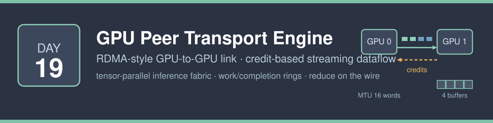
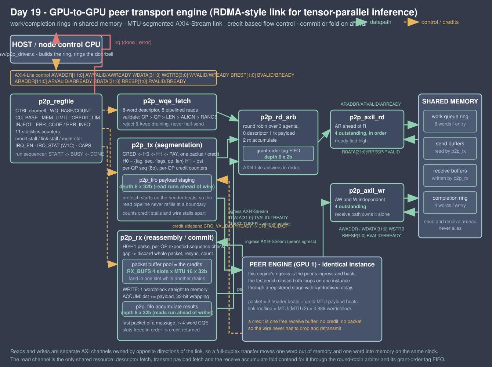

<!-- Author: Asresh -->


# Day 19 — GPU-to-GPU Peer Transport Engine

<!-- readability-guide:start -->
## Plain-language overview

This transport moves payloads directly between devices under credit-based flow control. Software posts work descriptors; hardware divides messages into packets, tracks sequence numbers and receive space, and optionally reduces data as it arrives.

## Abbreviation guide

Every shortened technical term used in this README is expanded below for quick reference:

- **ACCUM** [Accumulate]
- **AXI4** [Advanced eXtensible Interface 4]
- **AXI4-Lite** [Advanced eXtensible Interface 4 Lite]
- **AXI4-Stream** [Advanced eXtensible Interface 4 Stream]
- **BUFS** [Buffers]
- **CAPS** [Capabilities]
- **COUNT** [Count]
- **CPU** [Central Processing Unit]
- **CSR** [Control and Status Register]
- **CTRL** [Control]
- **EN** [Enable]
- **ERR** [Error]
- **FIFO** [First-In, First-Out]
- **GPU** [Graphics Processing Unit]
- **H0** [Header Word 0]
- **H1** [Header Word 1]
- **IRQ** [Interrupt Request]
- **LEN** [Length]
- **MAX** [Maximum]
- **MEM** [Memory]
- **MIN** [Minimum]
- **MTU** [Maximum Transmission Unit]
- **OKAY** [Successful Bus Response]
- **QP** [Queue Pair]
- **RDMA** [Remote Direct Memory Access]
- **RTL** [Register-Transfer Level]
- **RW** [Read/Write]
- **RW1C** [Read/Write One to Clear]
- **RX** [Receive]
- **SEQ** [Sequence]
- **SLVERR** [Slave Error]
- **STAT** [Status]
- **SW** [Software]
- **TLAST** [Transfer Last]
- **TUSER** [Transfer User Sideband]
- **TX** [Transmit]
- **W1C** [Write One to Clear]
- **WQ** [Work Queue]
<!-- readability-guide:end -->

The interconnect half of a multi-GPU inference node, in hardware: a peer
transport engine that takes a ring of RDMA-style work-queue entries out of
shared memory, segments each message into MTU-sized packets, puts them on a
link under credit-based flow control, and — at the far end — reassembles them,
commits them to the peer's memory, and posts completions. Optionally it folds
the arriving payload into the destination instead of overwriting it, which is
the reduce half of a reduce-scatter done on the wire.

Day 14 built the collective *arithmetic* — an all-reduce array that folds R
rank buffers into one. This is the layer underneath it: the thing that actually
moves a tensor shard from one device's memory to another's while the arithmetic
is waiting for it.

## The problem

Tensor-parallel inference is a sequence of small matmuls separated by
collectives. A 70B model sharded eight ways spends a meaningful fraction of
every token on `all_gather` and `reduce_scatter` of activation slices —
transfers of a few kilobytes, thousands of times a second, with a hard latency
budget because nothing downstream can start until they land.

Written down, moving a shard is trivial:

```python
for chunk in split(tensor, MTU):
    while not credits[peer]:
        poll()
    send(header(peer, seq, chunk), chunk)
```

What a software transport actually executes per packet is: load the descriptor,
range- and alignment-check it, compute the segment boundary, build two header
words, test flow control, copy `MTU` words out to the link, and on the far side
pull `MTU` words off the link and store them — plus a completion record per
message. All of it is per-word or per-packet work on a core that would
otherwise be launching kernels, and none of it overlaps with the link, because
the copy *is* the link.

The shape of the work is what makes it a hardware problem:

- **the state is tiny** — a sequence number, a credit count and an expected
  sequence per queue pair, plus one descriptor in flight;
- **the inner loop is fixed** — segment, header, move a word, repeat, and the
  only decisions are "is there a credit" and "is this the last packet";
- **it is latency-critical and bandwidth-critical at once** — a transfer of a
  few hundred words has to start in tens of cycles *and* run at wire rate once
  started, and a CPU cannot do both.

So the whole datapath moves into hardware and software keeps exactly the parts
that need judgement: what to send, to whom, and what to do when the counters
say the link is unhealthy.

## The hardware/software split

**Hardware** takes everything that repeats per packet and per word:

| in hardware | why |
|---|---|
| segmentation (`p2p_tx`) | the packet boundary, the two header words, the per-queue-pair sequence number and the credit test are the same three decisions every 18 beats — in software they are branches between every `memcpy` |
| payload staging (`p2p_fifo`, depth 8) | the read master runs ahead of the wire, and the fetch starts on the *header* beats, so the memory round trip is hidden inside the packet rather than added to it |
| flow control (credits, `p2p_tx` + `p2p_rx`) | a credit is a free receive buffer; because the sender cannot launch a packet without one, an arriving packet always has somewhere to land and the link never has to drop and retransmit |
| reassembly and commit (`p2p_rx`) | packets land in a buffer pool and drain to memory in arrival order, so what memory sees is a function of the descriptor ring, not of bus scheduling |
| the accumulate fold (`p2p_rx`) | `dst += payload` in the receive path is a reduce-scatter with no kernel launch on the receiving device; the destination reads run ahead into an 8-deep result FIFO, so the fold costs read bandwidth rather than latency |
| descriptor validation (`p2p_wqe_fetch`) | a malformed descriptor costs one control decision in front of the datapath instead of a half-sent packet the peer has to unpick; the ring keeps draining past it |
| the statistics (`p2p_regfile`) | cycles waiting on credits, on the wire and on memory are counted separately as the transfer happens, which is the only part of the picture a runtime can act on |

**Software** keeps everything that is a policy decision:

| in software | why |
|---|---|
| what to send | which shard goes to which peer is a model-parallel decision, not a transport one |
| queue-pair assignment | independent streams that must not serialise behind each other |
| how many receive buffers to post | the credit/silicon trade-off, and it depends on the round-trip time of the actual fabric |
| what to do about stalls | `p2p_driver_advise()` reads the three stall counters and says whether the peer needs more buffers, the wire is saturated, or the engine is fighting the compute kernels for memory |
| reaping completions | the completion ring is ordinary memory; draining it is a few loads |



## One transfer, end to end

```mermaid
sequenceDiagram
    participant SW as host CPU
    participant CSR as p2p_regfile
    participant WQ as p2p_wqe_fetch
    participant TX as p2p_tx
    participant RX as p2p_rx (peer)
    participant MEM as shared memory

    SW->>MEM: build ring: {op, qp, src, dst, len, tag}
    SW->>CSR: WQ_BASE / WQ_COUNT / CQ_BASE / MEM_LIMIT / CREDIT_LIM
    SW->>CSR: CTRL.START (doorbell)
    CSR->>WQ: start
    WQ->>MEM: 8 pipelined reads (descriptor)
    MEM-->>WQ: descriptor words
    WQ->>WQ: validate OP > QP > LEN > ALIGN > RANGE
    WQ->>TX: accepted descriptor
    loop one iteration per MTU-sized packet
        TX->>TX: take a credit for this queue pair
        TX->>RX: H0 {tag, seq, flags, qp, len}, H1 {dst}
        TX->>MEM: payload reads (started on the header beats)
        MEM-->>TX: payload words -> 8-deep staging FIFO
        TX->>RX: payload beats, TLAST on the last
        RX->>RX: sequence check; gap -> discard whole packet, resync
        RX->>MEM: commit (WRITE) or read-fold-write (ACCUM)
        RX-->>TX: credit return (slot freed)
    end
    RX->>MEM: 4-word completion entry on the last packet
    CSR->>SW: irq (done | error)
    SW->>CSR: read counters, IRQ_STAT W1C
    SW->>MEM: reap the completion ring
```

## How it works

**A packet** is two header beats and up to `MTU_WORDS` payload beats on a
32-bit AXI4-Stream:

```
beat 0 (TUSER=1) : [31:24] tag  [23:16] seq  [15:12] flags  [11:8] qp  [7:0] len
beat 1           : destination byte address
beat 2..len+1    : payload
```

`flags` carries first-of-message, last-of-message and accumulate. Two header
words per sixteen payload words is where the link roofline of
`MTU/(MTU+2) = 0.889` payload words per clock comes from.

**Credits are buffers.** The receiver has `RX_BUFS` packet buffers of
`MTU_WORDS` each. The transmitter starts each packet by taking a credit for
that queue pair and cannot start without one; the receiver returns the credit
over a sideband when the slot has been fully drained to memory. Nothing is ever
dropped for want of space, so there is no retransmit path and no timeout — the
buffer pool *is* the flow-control window, and `CREDIT_LIM` lets software shrink
it to any value down to one without changing a single result.

**Ordering is what makes it testable.** Slots are allocated and freed in order,
so the receiver commits packets in exactly the order they arrived. Combined
with send and receive arenas that never alias — which the vector generator
checks explicitly rather than assuming — the final memory image is a pure
function of the descriptor rings. That is the claim the testbench is built to
break: the same 331 launches run under randomised bus wait states, randomised
link backpressure and randomised credit delay, again at full rate, and again
with every launch forced down to a single credit, and all three must produce
byte-identical memory.

**A sequence gap is visible and survivable.** Each queue pair carries an 8-bit
sequence; the receiver checks it on the header beat. A gap discards the whole
packet — never half of it — counts it, resynchronises, returns the credit, and
carries on. `INJECT.SEQ_SKIP` makes the transmitter burn one sequence value so
this path is exercised for real rather than argued about.

**Accumulate has one ordering rule.** An `ACCUM` packet reads the destination
it is about to fold into, so it does not start until every write of the
previous packet has been acknowledged. Without that gate two accumulates onto
the same region could read stale data and the answer would depend on how deep
the write pipeline happened to be. Plain writes need no gate — the write
channel is in-order all the way to memory.

## Register map

AXI4-Lite, 32-bit registers, byte offsets. Reads of unmapped offsets return
zero with `OKAY`.

| offset | name | access | meaning |
|---|---|---|---|
| 0x00 | `CTRL` | W | `[0]` START (doorbell, self-clearing) · `[1]` SOFT_RESET |
| 0x04 | `STATUS` | R | `[0]` BUSY · `[1]` DONE · `[2]` ERR · `[3]` SEQERR |
| 0x08 | `WQ_BASE` | RW | byte address of the work-queue ring |
| 0x0C | `WQ_COUNT` | RW | entries to consume this launch |
| 0x10 | `CQ_BASE` | RW | byte address of the completion ring |
| 0x14 | `MEM_LIMIT` | RW | size of the addressable window; regions past it are rejected |
| 0x18 | `CREDIT_LIM` | RW | usable credits, clamped to 1..`RX_BUFS` |
| 0x1C | `INJECT` | RW | `[0]` skip one sequence value this launch |
| 0x20 | `IRQ_EN` | RW | `[0]` done · `[1]` error |
| 0x24 | `IRQ_STAT` | RW1C | sticky interrupt status |
| 0x28 | `ERR_CODE` | R | first error latched: 1 OP, 2 QP, 3 LEN, 4 ALIGN, 5 RANGE, 6 BUS |
| 0x2C | `ERR_INFO` | R | work-queue index that raised it |
| 0x30 | `ST_WQE` | R | descriptors accepted |
| 0x34 | `ST_PKT` | R | packets transmitted |
| 0x38 | `ST_TXW` | R | payload words transmitted |
| 0x3C | `ST_RXW` | R | payload words committed to memory |
| 0x40 | `ST_CQE` | R | completion entries posted |
| 0x44 | `ST_ERR` | R | descriptors rejected |
| 0x48 | `ST_SEQ` | R | packets discarded on a sequence gap |
| 0x4C | `ST_CYCLES` | R | cycles from doorbell to interrupt |
| 0x50 | `ST_CRSTALL` | R | transmitter cycles waiting on a credit |
| 0x54 | `ST_LKSTALL` | R | transmitter cycles waiting on the wire |
| 0x58 | `ST_MEMSTALL` | R | datapath cycles waiting on the memory port |
| 0x5C | `CAPS` | R | `{RX_BUFS, NUM_QP, MTU_WORDS}` packed, one byte each |

**Work-queue entry** — 8 words, 32 bytes:

| word | field |
|---|---|
| 0 | `[3:0]` opcode (0 WRITE, 1 ACCUM) · `[7:4]` queue pair |
| 1 | source byte address (local, 4-byte aligned) |
| 2 | destination byte address (peer, 4-byte aligned) |
| 3 | length in 32-bit words |
| 4 | `[7:0]` message tag, echoed into the completion |
| 5–7 | reserved |

**Completion entry** — 4 words, 16 bytes: `{status | qp<<8 | opcode<<12}`,
tag, bytes committed, sequence number of the last packet.

## Build and run

```bash
make sim
```

```bash
make metrics
```

```bash
make sweep
```

```bash
make mutate
```

```bash
make synth
```

`make sim` builds the host program, regenerates the whole experiment, and runs
all three passes under Icarus Verilog. `make sweep` repeats the entire
differential run at four geometries. `make mutate` injects defects and checks
that the testbench catches them. Geometry is overridable:
`make sim MTU=32 QP=2 BUFS=4`.

Yosys is not installed on the machine this was developed on, so `make synth`
falls back to `scripts/area_estimate.py`, which counts sequential state exactly
and is explicit that its combinational figures are not measured. Verilator is
not installed either; everything here runs under Icarus Verilog 13 and `cc`.

## Results

Measured on the Icarus run in `results/sim.log`; the full table is
`results/metrics.md`. Geometry: MTU 16 words, 4 queue pairs, 4 receive buffers.

| metric | value |
|---|---|
| launches per pass | 331 (322 clean + 9 with rejected descriptors) |
| descriptors accepted / rejected | 1075 / 9 |
| packets transmitted per pass | 2283 |
| payload words transmitted / committed | 28328 / 28280 |
| completion entries posted | 1074 |
| packets discarded on an injected sequence gap | 3 |
| shared memory image | 70656 words |
| **checks per pass set** | **221952** |
| **mismatches** | **0** |
| pass 0 (randomised wait states, link gaps, credit delay) | 368142 cycles (658904 injected bus stall cycles) |
| pass 1 (full rate) | 101835 cycles |
| pass 2 (one credit per queue pair) | 118719 cycles |
| engine busy cycles, full rate | 68368 |
| memory read / write beats, full rate | 45424 / 32576 |
| single-word message latency, doorbell to interrupt | **29 cycles** |
| **peak link occupancy** (2048-word message) | **88.6%** — 2304 beats in 2599 cycles |
| **peak payload rate, WRITE** | **0.788 words/clock** (roofline 0.889 = MTU/(MTU+2)) |
| **peak payload rate, ACCUM** (512-word message) | **0.451 words/clock** |
| sustained payload rate over all launches | 0.414 words/clock |
| transmitter cycles on credits / on the wire, full rate | 7728 / 0 |
| scalar baseline (cost model, `sw/p2p_baseline.c`) | 704436 cycles |
| **aggregate speedup** | **10.30x** |
| **peak speedup** | **15.01x** |

The baseline is a cost model, not a straw man: named per-operation cycle counts
(descriptor word load 4, validation 24, header build 12, packet post 30,
flow-control test 6, payload word out 8, payload word in 8, accumulated word in
13, completion word store 4, completion bookkeeping 20) evaluated over the
exact operation counts the same workload requires — 8672 descriptor loads, 2283
packet builds, 28328 words out, 19888 plain words in, 8440 accumulated words
in, 1075 completions. They assume everything hits in cache and charge nothing
for interrupts or locking, so the speedup is a floor.

Two numbers worth reading together: the aggregate rate is 0.414 words/clock
against a peak of 0.788, because most of the 331 launches are short and pay the
29-cycle fixed cost. That is the honest shape of a transport engine — it is
fast per byte and it still has a floor per message, which is exactly why the
sustained figure is reported next to the peak rather than instead of it.

The accumulate rate is 0.451 words/clock against 0.788 for a plain write,
because folding costs a destination read per word on the same shared read
channel the transmitter is using. Pipelining the fold behind an 8-deep result
FIFO took it from 0.235 to 0.451 words/clock; the remaining gap is read
bandwidth, not latency, and it is the price of not launching a reduction kernel
on the receiving device at all.

## What was verified

**331 launches per pass**, replayed three times:

- **pass 0** — randomised wait states independently on all five AXI4-Lite
  memory channels, randomised link backpressure, randomised credit-return delay
- **pass 1** — full rate, no wait states, no gaps
- **pass 2** — full rate but every launch forced to a single credit, so the
  transmitter never has more than one packet in flight

All three must agree byte for byte and counter for counter, which is the
property the design exists to have.

**31 directed cases**: single word · exactly MTU · MTU+1 · zero length ·
four MTUs · two queue pairs at once · accumulate of one word · accumulate of a
full MTU · accumulate across `INT32_MAX`, `INT32_MIN`, −1 and −1+−1 ·
accumulate of negative values · two accumulates onto the same destination ·
a write followed by an accumulate onto the same destination · one credit ·
two credits · a sequence gap on a middle packet · a sequence gap on the last
packet of a message (so no completion is posted and the byte count carries into
the next one) · a sequence gap on an accumulate · a 2048-word peak message · a
512-word accumulate peak · sixteen one-word messages · every queue pair with
mixed opcodes · and nine rejection cases (unknown opcode, queue pair out of
range, length over `MAX_MSG_WORDS`, unaligned source, unaligned destination,
destination past `MEM_LIMIT`, source past `MEM_LIMIT`, error-priority ordering
when three checks fail at once, and a good/bad/good ring that must keep
draining) plus an empty ring.

**300 randomised launches**: 1–6 descriptors each, random opcode, queue pair,
length 0–48 words and credit limit.

**Checks per pass set: 221952, mismatches 0.** That includes a full sweep of
all 70656 words of simulated memory after each pass — so a write anywhere
outside a destination region, past the end of a message, or into the wrong
completion slot fails the run — plus every timing-independent CSR after every
launch, and a count of out-of-range bus accesses (0).

**Directed control-plane tests**: `CAPS` against the build parameters; a
checksum of the register map in `sw/p2p.h` compared against the same sum
computed from `rtl/p2p_defs.vh`, so the firmware header and the RTL cannot
drift apart; an unmapped register read; `CREDIT_LIM` clamping zero to one;
interrupt masking (the status bit sets while masked, the pin stays low, and
unmasking raises it); write-1-to-clear including clearing the wrong bit first;
a read `SLVERR` during a descriptor fetch, which must surface as `ERR_BUS`; a
write `SLVERR` during a payload commit; and recovery — soft reset after a fault
followed by a clean launch that produces the right answer.

**Parameter sweep** — the entire differential run, host program and vectors
regenerated per point:

| MTU / queue pairs / receive buffers | checks | mismatches |
|---|---|---|
| 16 / 4 / 4 | 221952 | 0 |
| 32 / 2 / 4 | 221955 | 0 |
| 8 / 8 / 8 | 218880 | 0 |
| 64 / 4 / 2 | 228096 | 0 |
| **total** | **890883** | **0** |

**Mutation check** — four injected defects, all caught:

| defect | how it showed up |
|---|---|
| transmitter never sets the last-of-message flag | 66 mismatches (no completions posted) |
| receiver treats `ACCUM` as an overwrite | 27 mismatches (memory sweep and completion opcodes) |
| descriptor validation reports `RANGE` where it should report `ALIGN` | 6 mismatches (error-priority cases) |
| read arbiter routes responses by the tail of its tag FIFO instead of the head | hang on the first launch, caught by the testbench watchdog |

The 8/8/8 sweep point is the one that earned its keep: it exposed a real defect
where a packet discarded on a sequence gap and a buffer slot being released on
the same clock both tried to increment the retirement counter, and one
increment was silently lost. The engine then waited forever for a packet that
had already retired. It is fixed by summing the two events instead of
incrementing twice — and it is exactly the kind of bug that only appears when
the geometry changes the timing.

## Files

```
rtl/p2p_defs.vh       encodings shared with the firmware header
rtl/p2p_fifo.v        synchronous show-ahead FIFO (staging, accumulate results)
rtl/p2p_axil_rd.v     pipelined AXI4-Lite read master, 4 outstanding, in order
rtl/p2p_axil_wr.v     pipelined AXI4-Lite write master, 4 outstanding
rtl/p2p_rd_arb.v      round-robin read arbiter + grant-order tag FIFO
rtl/p2p_wqe_fetch.v   work-queue ring reader and descriptor validator
rtl/p2p_tx.v          segmentation, headers, credits, payload staging
rtl/p2p_rx.v          reassembly, sequence check, commit / fold, completions
rtl/p2p_regfile.v     AXI4-Lite control plane, statistics, run sequencer
rtl/p2p_top.v         the engine

sw/p2p.h              register map, descriptor formats
sw/p2p_driver.c       bare-metal firmware: post, launch, reap, advise
sw/p2p_model.c        golden model of one launch
sw/p2p_baseline.c     documented scalar cost model
sw/p2p_host.c         builds the experiment: memory image, golden image, runs

tb/p2p_tb.sv          differential testbench, memory model, link loopback
scripts/param_sweep.sh   full differential run at four geometries
scripts/mutate.sh        injected-defect check
scripts/extract_metrics.py
scripts/area_estimate.py
```
