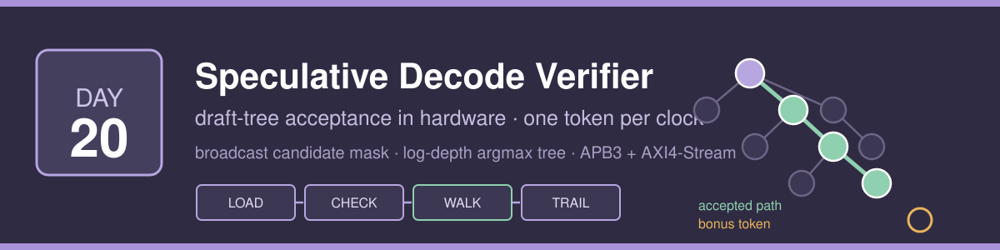
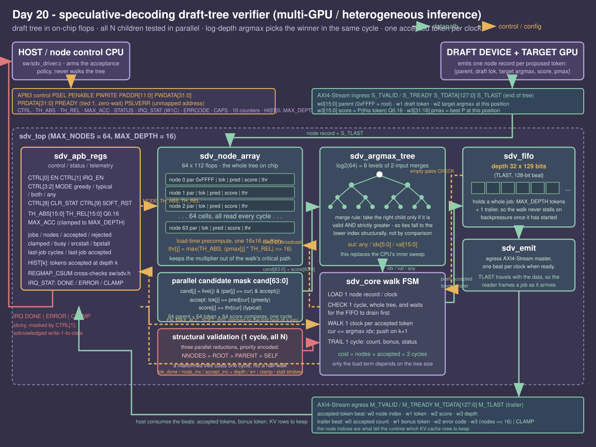
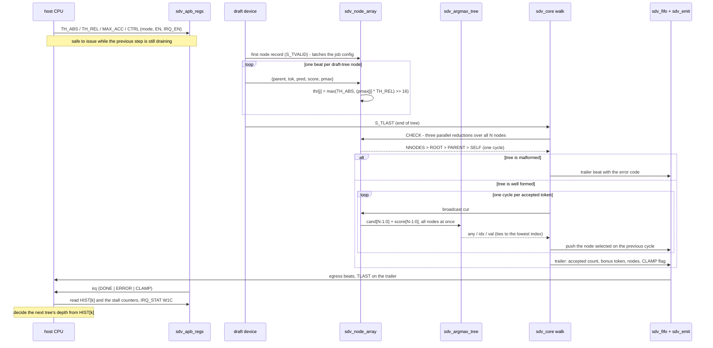

# Day 20 - Speculative-Decoding Draft-Tree Verifier

A hardware verifier for the acceptance step of tree-based speculative decoding.
Give it a draft tree - a small model's proposed continuations, plus what the
target model actually predicted at each position - and it returns the longest
acceptable path through that tree, the bonus token the target supplies for
free, and the node indices whose KV-cache rows are worth keeping. One accepted
token per clock, whatever the fan-out, with the host uninvolved between the
draft device's first beat and the interrupt.

---

## The problem

Speculative decoding is the standard way to make a large model's token
generation cheaper: a small draft model proposes several tokens, the large
target model verifies all of them in one forward pass, and whatever prefix the
target agrees with is emitted at once. Tree-based variants (Medusa, EAGLE,
SpecInfer, Sequoia) push the same idea further - instead of one linear draft of
`k` tokens, the draft model proposes a *tree* of alternatives, so a wrong guess
at position 2 does not throw away positions 3 and 4.

The verification step in the middle is where this gets awkward. It is a pointer
chase, not arithmetic:

```
cur = root
loop:
    best = none
    for j in all nodes:                 # a full sweep, every step
        if parent[j] != cur:   continue
        if not accept(j, cur): continue
        if best is none or score[j] > score[best]: best = j
    if best is none: break
    emit(best); cur = best
```

That inner loop is `O(nodes x depth)` comparisons of pure control flow, with a
data-dependent branch on every iteration and no index from a parent to its
children. It runs on the host CPU, and it runs *between* the draft model
finishing and the target model's next forward pass starting - so both GPUs are
idle for the whole of it. For a 64-node tree with 16 accepted tokens the scalar
cost model in [`sw/sdv_baseline.c`](sw/sdv_baseline.c) charges 1872 cycles;
the verification itself is trivial work sitting directly in the critical path
of every decode step.

This day puts the sweep in hardware. The whole tree is loaded into an on-chip
flop array, and on every step of the walk **all 64 nodes simultaneously answer
"is my parent the node we are standing on, and does my token pass the
acceptance test"** - then a log-depth argmax tree names the winner in the same
cycle. An accepted token costs one clock regardless of how wide the tree is.

## What goes in hardware and what stays in software

The split follows the shape of the work, not convenience.

**In hardware**, because it is a wide parallel reduction that a scalar CPU can
only do one node at a time:

- the candidate mask: 64 parent-index compares, 64 token compares and 64 score
  compares every cycle, all at once ([`sdv_node_array.v`](rtl/sdv_node_array.v))
- the argmax over that mask, in `log2(64) = 6` levels of two-input merges
  ([`sdv_argmax_tree.v`](rtl/sdv_argmax_tree.v)) - this is the block that
  literally replaces the CPU's inner loop
- structural validation of the tree: three parallel reductions over the same
  array, so checking a 64-node tree is *one cycle* and a malformed tree costs a
  control decision rather than a half-finished walk
- the per-position acceptance histogram, counted for free on the datapath

**In software** ([`sw/sdv_driver.c`](sw/sdv_driver.c)), because it is policy,
runs once per step, and would only add registers if it were moved:

- the acceptance policy itself: which mode, and the two thresholds. These are
  four register writes, and the engine latches them on the *first ingress beat*
  of a job rather than on a doorbell - so the firmware programs the next step's
  policy while the current step's tokens are still draining out of the egress
  FIFO. There is no doorbell write in the steady-state path at all.
- deciding what to do with the answer: which KV-cache rows to keep, whether to
  make the draft tree deeper or wider next time. The last function in the
  driver reads the histogram and returns the depth beyond which fewer than one
  step in eight is still being accepted, which is the depth the draft tree
  should be truncated to.

Two things deliberately **do not** go in hardware. Building the draft tree is
the draft model's job. And the acceptance thresholds are not computed on chip
from a distribution - the target model already has the probabilities, so it
sends `score` (the target's probability of this node's draft token) and `pmax`
(the largest target probability at this position) along with each node, and the
hardware does one multiply per node at load time to turn them into a threshold.
Doing that multiply on ingress instead of during the walk is what keeps a path
step to a single cycle: the walk's critical path is broadcast mux -> compare ->
argmax tree, with no multiplier in it.

## Block diagram



## How a job runs

Four phases, and every cycle belongs to exactly one of them:

| phase | cycles | what happens |
|---|---|---|
| `LOAD` | one per node | one 128-bit node record per clock into the flop array; `thr[j] = max(TH_ABS, (pmax[j] * TH_REL) >> 16)` is computed on the way in |
| `CHECK` | 1 | all structural checks resolve in parallel and are priority-encoded (`NNODES > ROOT > PARENT > SELF`). Also waits for the previous job to leave the egress FIFO |
| `WALK` | one per accepted token, plus one | all N nodes tested against the node being extended at once; the argmax tree names the winner in the same cycle |
| `TRAIL` | 1 | the trailer beat: accepted count, bonus token, error code, node count and the clamp flag |

So a job costs `nodes + accepted + 3` cycles, and **only the load term depends
on the size of the tree**. A 64-node tree and a 4-node tree cost the same per
accepted token.

Two properties fall out of the structure rather than out of testing:

- **The selected path is a pure function of the tree.** The argmax tree's merge
  rule takes the right child only when it is valid *and strictly greater*, and
  leaf `i` is seeded with index `i`, so ties resolve to the lowest index
  structurally - not by a comparison that could be got wrong. Nothing in the
  design assumes a parent has a lower index than its children; the randomised
  trees are built parent-before-child and then relabelled through a random
  permutation specifically to prove that.
- **The walk can never be stalled by the consumer.** The result FIFO is sized
  to hold a whole job (`MAX_DEPTH` tokens plus the trailer) and `CHECK` waits
  for it to drain, so once a job starts stepping it runs to completion at one
  token per clock no matter what the downstream link is doing. The FIFO's
  overflow flag is checked in simulation and by construction can never assert.

## One decode step, end to end



## Acceptance modes

`CTRL[3:2]` selects the predicate applied to each candidate child, where
`cur` is the node being extended:

| mode | predicate | use |
|---|---|---|
| `GREEDY` | `tok[j] == pred[cur]` | exact match against the target's argmax - lossless greedy decoding |
| `TYPICAL` | `score[j] >= max(TH_ABS, (pmax[cur] * TH_REL) >> 16)` | typical acceptance: keep a token the target finds plausible even if it is not the argmax |
| `BOTH` | greedy AND typical | conservative |
| `ANY` | greedy OR typical | aggressive |

`MAX_ACC` caps the accepted path; the hardware clamps it to `MAX_DEPTH` itself,
and sets the `CLAMP` flag in the trailer (and `IRQ_STAT[2]`) when a candidate
existed but the cap was reached - which is how the runtime knows the cap, and
not the draft quality, is what limited the step.

## Register map

APB3, zero-wait (`PREADY` tied high). Unmapped addresses answer with `PSLVERR`
rather than silently reading zero.

| offset | name | access | description |
|---|---|---|---|
| `0x00` | `CTRL` | RW | `[0]` EN, `[1]` IRQ_EN, `[3:2]` MODE, `[8]` CLR_STAT (self-clearing), `[9]` SOFT_RST (self-clearing) |
| `0x04` | `STATUS` | RO | `[0]` BUSY, `[1]` egress FIFO empty |
| `0x08` | `TH_ABS` | RW | absolute acceptance floor, unsigned Q0.16 |
| `0x0C` | `TH_REL` | RW | relative floor as a fraction of the parent's `pmax`, Q0.16 |
| `0x10` | `MAX_ACC` | RW | cap on accepted tokens; clamped to `MAX_DEPTH` in hardware |
| `0x14` | `IRQ_STAT` | RW1C | `[0]` DONE, `[1]` ERROR, `[2]` CLAMP - sticky, write 1 to clear |
| `0x18` | `ERRCODE` | RO/W | last error code; any write clears it |
| `0x1C` | `CAPS` | RO | `[15:0]` MAX_NODES, `[23:16]` MAX_DEPTH |
| `0x20` | `VERSION` | RO | `0x00200001` |
| `0x24` | `ST_JOBS` | RO | jobs completed |
| `0x28` | `ST_NODES` | RO | node records accepted off the ingress link |
| `0x2C` | `ST_ACCEPT` | RO | tokens accepted in total |
| `0x30` | `ST_ERRJOBS` | RO | jobs rejected by validation |
| `0x34` | `ST_CLAMP` | RO | jobs that hit the accepted-token cap |
| `0x38` | `ST_BUSY` | RO | cycles not idle |
| `0x3C` | `ST_SRCSTALL` | RO | cycles loading with `S_TVALID` low - the draft device is behind |
| `0x40` | `ST_BPSTALL` | RO | cycles with `S_TVALID` high and the engine not ready |
| `0x44` | `ST_LASTCYC` | RO | first beat to trailer, last job |
| `0x48` | `ST_LASTACC` | RO | tokens accepted, last job |
| `0x4C` | `REGMAP_CSUM` | RO | `0x00003410`, cross-checks `rtl/sdv_defs.vh` against `sw/sdv.h` |
| `0x80`+ | `HIST[k]` | RO | `MAX_DEPTH` counters: tokens accepted at path position `k` |

`REGMAP_CSUM` is `sum(offset * (index + 1))` over the whole map. The value is
defined independently in the Verilog header and the C header and compared in
simulation, so the two cannot drift apart without the testbench noticing.

### Wire formats

Ingress, one 128-bit beat per node, `TLAST` on the last node of a tree:

| word | field |
|---|---|
| `w0[15:0]` | parent node index (`0xFFFF` on the root) |
| `w1` | draft token id proposed at this node |
| `w2` | target model's argmax token at this node's position (`pred`) |
| `w3[15:0]` | `score`: target probability of *this* node's draft token, Q0.16 |
| `w3[31:16]` | `pmax`: largest target probability at this node's position, Q0.16 |

Egress, accepted-token beats followed by one trailer beat with `TLAST`:

| word | accepted-token beat | trailer beat |
|---|---|---|
| `w0` | node index | accepted count |
| `w1` | token id | bonus token (the target's own continuation from the last accepted node) |
| `w2` | score | error code |
| `w3` | depth (1-based) | `(nodes << 16) \| flags` |

## Build and run

```bash
make sim
```

```bash
make check
```

```bash
make sweep
```

```bash
make mutate
```

```bash
make metrics
```

```bash
make synth
```

`make sim` builds the host program, generates the vectors, and runs the Icarus
differential testbench. `make check` rebuilds the C side under
`-fsanitize=undefined,address -fno-sanitize-recover=all` and regenerates every
vector through it, so a sanitizer finding is a non-zero exit rather than a line
of output nobody reads. `make sweep` re-runs the whole experiment at five
geometries. `make mutate` injects defects and requires the testbench to catch
them. `make synth` falls back to an analytical flop/comparator count from
`scripts/area_estimate.py` - Yosys is not installed here, and that estimate is
labelled as an estimate, not quoted as a measured result.

Tested with Icarus Verilog 13.0 and Apple clang; the RTL and testbench stay
within constructs Icarus 12 accepts, which is what CI runs.

## Results

Every number below is read out of `results/sim.log` or the cost model in
`sw/sdv_baseline.c`. The full table with the derivations is in
[`results/metrics.md`](results/metrics.md).

| metric | value |
|---|---|
| geometry | MAX_NODES 64, MAX_DEPTH 16 |
| jobs per pass | 333 (33 directed, 300 randomised) |
| draft-tree nodes streamed in per pass | 10654 |
| egress beats per pass | 1050 (717 accepted tokens + 333 trailers) |
| jobs rejected / clamped | 8 / 44 |
| **checks per pass** | **10772** |
| **mismatches** | **0** |
| minimum job latency (first beat to trailer) | **4 cycles** |
| peak job, 64-node chain | 83 cycles = 64 LOAD + 1 CHECK + 17 WALK + 1 TRAIL |
| ingress rate during LOAD | **1.000 nodes/clock** (roofline 1.000) |
| **accepted-token rate through the walk** | **0.941 tokens/clock** (16 tokens in 17 cycles, roofline 1.000) |
| peak node rate over a whole job | 0.771 nodes/clock |
| sustained node rate, all jobs at full rate | 0.726 nodes/clock |
| sustained node rate while busy | 0.886 nodes/clock |
| cycles starved by the draft link / by egress backpressure | 0 / 29 |
| scalar baseline (cost model) | 153276 cycles |
| **aggregate speedup** | **10.44x** (153276 vs 14685 cycles) |
| aggregate speedup against engine-busy cycles | 12.74x |
| **peak speedup** | **22.55x** (1872 vs 83 cycles for the peak job) |

The accepted-token rate is the number that matters: 0.941 tokens/clock against
a roofline of 1.000, and it does not degrade as the tree gets wider, because
the argmax over all 64 candidates happens in the same cycle as the compare.
The scalar version's cost grows with `nodes x depth`; this one's grows with
`nodes + depth`.

The cost model charges the CPU 1 cycle per 32-bit word loaded, 1 per node
examined in a path-step sweep, 2 per acceptance predicate evaluated, 3 per
relative-threshold multiply, 1 per result word stored and 12 per job of call
overhead - evaluated over 42616 words loaded, 34204 node visits, 32567
predicate evaluations, 1042 multiplies and 4200 stores. One cycle per examined
node is optimistic for a dependent pointer chase, so the speedups are lower
bounds.

## What was verified

The RTL is checked against a C golden model ([`sw/sdv_model.c`](sw/sdv_model.c))
that is itself cross-checked against an independently written scalar baseline
([`sw/sdv_baseline.c`](sw/sdv_baseline.c)) - the generator refuses to emit
vectors if the two disagree, so the accelerator is compared against a result
two separate implementations already agree on. **10772 checks per pass, 0
mismatches.**

Five passes over the same 333 jobs:

- **Pass A** - every job on its own under randomised ingress bubbles (30%) and
  randomised egress backpressure (35%), every egress beat compared word for
  word, `TLAST` position included.
- **Pass B** - the same jobs back to back at full rate with ingress and egress
  running concurrently, so a job loads while the previous one's result is still
  draining. Identical beats and identical counters are required: **the result
  may not depend on link timing.**
- **Pass C** - the peak job and the minimum job alone at full rate, with the
  measured cycle count checked against `nodes + accepted + 3`.
- **Pass D** - control plane: `VERSION`, `CAPS`, the register-map checksum
  against `sw/sdv.h`, all five cumulative counters and all 16 histogram buckets
  against the model's totals, `PSLVERR` on two unmapped addresses and its
  absence on a mapped one, interrupt masking, sticky behaviour, the
  write-1-to-clear acknowledge and the latched error code.
- **Pass E** - soft reset, then a job afterwards to prove the engine recovers
  and that the counters restarted from zero.

33 directed cases, exercised in every pass rather than in a special one:

a `MAX_NODES` chain (the peak case), root-only, a chain of exactly `MAX_DEPTH`
accepted tokens, one longer than the cap, `MAX_ACC` of 1 and of 0, `MAX_ACC`
above `MAX_DEPTH` so the hardware has to clamp it, nothing matching at all,
wide fan-out from the root with exactly one match, a three-way score tie where
the lowest index must win, the highest score winning from the last index,
typical mode exactly on the threshold and one below it, the relative threshold
dominating the absolute one, `pmax = 0` so the relative term vanishes, both
thresholds zero, saturated probabilities at `0xFFFF`, `BOTH` where greedy
passes but the score does not, `ANY` where the score passes but greedy does
not, `BOTH` where only the child passing both survives, reverse labelling where
every parent has a *higher* index than its child, an unreachable 2-cycle beside
a live chain (inert, not an error), duplicate sibling tokens distinguished only
by score, a tree that runs out before the cap does - plus 9 rejection cases:
too many nodes, exactly one node past the array, node 0 not a root, a second
root, a dangling parent index, a self edge, three checks failing at once so the
priority encode has to be right, dangling and self together so `PARENT` must
outrank `SELF`, and a good job immediately after the bad ones to prove the
engine recovers.

The 300 randomised trees are built parent-before-child and then relabelled
through a random permutation that fixes node 0, so index order is deliberately
*not* tree order. Mode, both thresholds and the cap are randomised per job,
with the threshold distribution chosen to keep a healthy spread of accepted
path lengths across the run.

**Mutation-checked.** Six defects injected into copies of the RTL, all six
caught: the argmax tie-break going to the higher index, the two-term threshold
taking the min instead of the max, the acceptance compare losing its equal
case, `MAX_ACC` not being clamped to `MAX_DEPTH`, the error priority encode
reordered, and the over-length detector off by exactly one beat. A test suite
that cannot fail proves nothing; `make mutate` is what makes that claim
checkable.

**Differential simulation at five geometries** (`make sweep`), each one
regenerating the whole experiment from scratch: MAX_NODES x MAX_DEPTH of 64x16
(10772 checks), 128x16 (11962), 32x8 (9216), 64x4 (8183) and 16x4 (8023) -
**48156 checks, 0 mismatches**. 64x4 is deliberately a wide tree against a
shallow cap, so almost every job clamps.

**Sanitizer gate** (`make check`): the host, model and baseline rebuilt under
UBSan and ASan with `-fno-sanitize-recover=all`, and every vector regenerated
through them. Clean.
