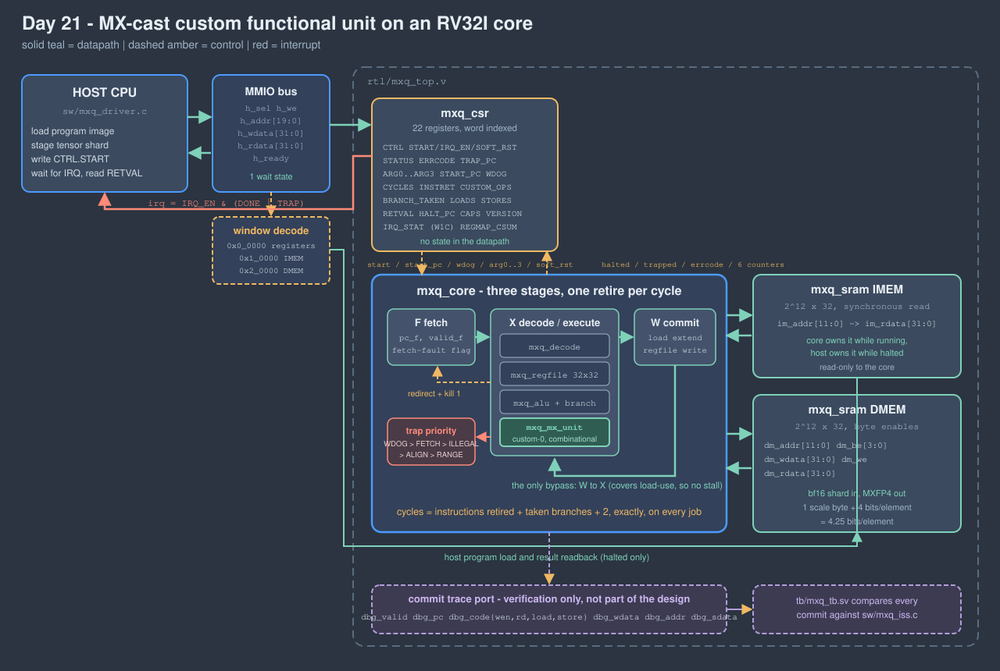

<!-- Author: Asresh -->


# Day 21 - MX-Cast Custom Functional Unit on an RV32I Core

<!-- readability-guide:start -->
## Plain-language overview

This project adds five instructions to a small processor for converting ordinary floating-point values to compact microscaling values and back. Software runs normal loops; the custom execution unit performs the difficult bit selection, rounding, scaling, and packing in one instruction each.

## Abbreviation guide

Every shortened technical term used in this README is expanded below for quick reference:

- **ALU** [Arithmetic Logic Unit]
- **amax** [Absolute Maximum]
- **AUIPC** [Add Upper Immediate to Program Counter]
- **AWQ** [Activation-Aware Weight Quantization]
- **bf16** [Brain Floating-Point 16-bit]
- **BLK** [Block]
- **CAPS** [Capabilities]
- **CI** [Continuous Integration]
- **CLR** [Clear]
- **CPU** [Central Processing Unit]
- **CTRL** [Control]
- **DMEM** [Data Memory]
- **E8M0** [8-bit Exponent, 0-bit Mantissa]
- **ECALL** [Environment Call]
- **EN** [Enable]
- **ERRCODE** [Error Code]
- **GPTQ** [Generative Pre-trained Transformer Quantization]
- **IMEM** [Instruction Memory]
- **Inf** [Infinity]
- **INSTRET** [Instructions Retired]
- **IRQ** [Interrupt Request]
- **ISA** [Instruction Set Architecture]
- **JAL** [Jump and Link]
- **LB** [Load Byte]
- **LBU** [Load Byte Unsigned]
- **LH** [Load Halfword]
- **LHU** [Load Halfword Unsigned]
- **MX** [Microscaling]
- **MXAMAX** [Microscaling Absolute Maximum]
- **MXDQ** [Microscaling Dequantize]
- **MXFP4** [Microscaling 4-bit Floating-Point]
- **MXFP6** [Microscaling 6-bit Floating-Point]
- **MXFP8** [Microscaling 8-bit Floating-Point]
- **MXPK** [Microscaling Pack]
- **MXQ4** [Microscaling Quantize to 4-bit]
- **MXSCALE** [Microscaling Scale]
- **NaN** [Not a Number]
- **OCP** [Open Compute Project]
- **PC** [Program Counter]
- **Q4** [Fixed-Point Format with 4 Fractional Bits]
- **RETVAL** [Return Value]
- **RISC** [Reduced Instruction Set Computer]
- **RISC-V** [Reduced Instruction Set Computer Five]
- **RTL** [Register-Transfer Level]
- **RV32I** [32-bit RISC-V Base Integer Instruction Set]
- **RW** [Read/Write]
- **SB** [Store Byte]
- **SLTU** [Set Less Than Unsigned]
- **SRA** [Shift Right Arithmetic]
- **SRAM** [Static Random-Access Memory]
- **STAT** [Status]
- **W1C** [Write One to Clear]
- **WDOG** [Watchdog]
<!-- readability-guide:end -->

Five custom instructions bolted into the execute stage of a three-stage RISC-V
pipeline, and the whole thing built around them: the core, its memories, its
control plane, an assembler, an instruction-set simulator, and two versions of
each cast kernel - one that uses the custom instructions and one that is
strictly base RV32I. Both run on the same hardware over the same data, so the
speedup this day reports is a **measured cycle ratio between two programs**,
not a comparison against a cost model of a machine nobody built.

**11.96x** on the quantise cast, **7.50x** on the dequantise, **10.53x** on the
round trip. The five instructions cost about 1010 gate equivalents - under 8%
of the core's logic.

---

## The problem

Every quantised-inference deployment moves tensors in a block-scaled format.
The OCP Microscaling formats (MXFP8, MXFP6, **MXFP4**) replace a block of 32
values with one shared 8-bit power-of-two scale plus a few bits per element;
MXFP4 costs 4.25 bits per element against bf16's 16, which is the compression
that makes a weight shard or an activation worth pushing across a device
boundary at all. Blackwell-class hardware consumes these formats natively, and
llama.cpp, AWQ, GPTQ and every serving stack that quantises on the fly all have
the same pair of kernels somewhere in them.

The pair is called a *cast*, and it is not arithmetic - it is bit manipulation
with a hard rounding rule:

```
quantise a block of 32 bf16 values:
    amax = max over the block of |v|            # 32 magnitude compares
    X    = exponent(amax) - 2                   # the shared E8M0 scale
    for each v:
        u = |v| / 2^(X-127)                     # one exponent subtract, one shift
        c = round_to_nearest_even(u onto {0,.5,1,1.5,2,3,4,6})
        emit (sign(v) << 3) | c                 # 4 bits
```

On a scalar machine every line of that is a handful of instructions.
Extracting the exponent, clamping Inf and NaN, flushing subnormals, forming the
shifted significand, tracking whether anything was shifted out (without which
round-to-nearest-*even* cannot be exact), then walking the seven midpoints of a
non-uniform grid. The base-RV32I version in
[`sw/mxq_kernels.c`](sw/mxq_kernels.c) needs **46 instructions per element**
for the quantise and 11 more for the amax fold - **1959 instructions per
32-element block**, measured, not estimated.

That is the work this day moves into the instruction set.

## What goes in hardware and what stays in software

The split is not "the cast goes in hardware". The cast is a *loop*, and loops
belong in software; what belongs in hardware is the part of each iteration that
a general-purpose datapath does badly.

**In hardware**, as five register-to-register instructions in the execute stage
beside the ALU:

| instruction | what it replaces | why hardware |
|---|---|---|
| `MXAMAX rd, rs1, rs2` | ~11 instructions x 2 elements | exponent extract, Inf/NaN clamp, subnormal flush and a 3-way max, all of which are field manipulation on a value the register file already holds |
| `MXSCALE rd, rs1` | ~6 instructions | one exponent subtract with two clamps; trivial, but it is on the critical path of every block |
| `MXQ4 rd, rs1, rs2` | ~46 instructions x 2 elements | the whole quantise: variable shift, sticky bit, and **seven independent magnitude comparisons in parallel** - a scalar machine can only do them one at a time, and they do not depend on each other |
| `MXDQ rd, rs1, rs2` | ~26 instructions x 2 elements | reconstruct two bf16 from two codes and the shared scale, including exponent underflow and overflow |
| `MXPK rd, rs1, rs2` | 3 instructions | byte-shift accumulate, so four quantise results become one stored word without a shift/mask/or chain |

**In software**, because it is control flow and addressing and a CPU is
perfectly good at both:

- the block loop, the element loop and all the pointer arithmetic;
- the block size, which the hardware never learns - `MXQ_BLK` of 16, 32 and 64
  all run on the same silicon, and the parameter sweep proves it;
- deciding *which* cast to run, where the shard lives, and what to do when a
  program traps.

The instructions are deliberately **not** an accelerator behind a bus. An MX
cast instruction costs exactly what an `ADD` costs: no handshake, no descriptor,
no doorbell, no state. That is the whole reason the win survives - the kernel
that uses them is still an ordinary loop that a compiler could have emitted, and
its inner iteration is four instructions long instead of ninety.

### Why two elements per instruction, not four or eight

Because a 32-bit register holds exactly two bf16 values. The unit's width is
set by the register file, not chosen. Widening it would mean either a wider
register file or a separate one, and both of those turn a functional unit into
an accelerator - which is a different design with a different cost.

## Architecture



### The core

Three stages, one instruction retired per cycle:

- **F** presents the PC to the instruction memory.
- **X** decodes, reads the registers, executes (ALU, branch compare, MX unit)
  and presents the data address.
- **W** selects the writeback value and commits it.

There is **no load-use stall**. A load's data leaves the memory at the top of
the W cycle, which is the same cycle its consumer spends in X, so the single
W-to-X bypass covers it. The cost is that the SRAM output sits in front of the
ALU - that is this design's critical path, and it is called out here rather than
hidden, because the alternative (a stall) would have cost a cycle on roughly one
instruction in five of the quantise kernel.

The only bubble in the machine is the one instruction already fetched behind a
taken branch. So

```
cycles = instructions retired + taken branches + 2
```

exactly, always - the two being the fill of F/X at the start and the drain of W
at the end. The testbench checks that identity on **every job**, which is what
turns "the pipeline stalled somewhere it should not have" from a slightly worse
number into a failed run.

Traps are precise and prioritised - watchdog, then fetch, then illegal
instruction, then misalignment, then address range. A trapping instruction does
not retire, does not write a register and does not touch memory.

### The functional unit

[`rtl/mxq_mx_unit.v`](rtl/mxq_mx_unit.v) is combinational and stateless. The
longest path is `MXQ4`: exponent subtract, then one variable shift, then seven
magnitude comparisons **in parallel**, then a 3-bit population count. The
comparisons are what a scalar loop has to serialise, and they are the reason a
46-instruction sequence collapses into one.

The rounding deserves a note, because it is where a cast usually goes subtly
wrong. Round-to-nearest-even on the non-uniform grid `{0, .5, 1, 1.5, 2, 3, 4,
6}` normally needs tie detection and a table of which way each tie goes. It
does not here: the pair straddling midpoint *k* is `(k, k+1)`, so the even
member of that pair is `k` when *k* is even and `k+1` when it is odd - which is
exactly the difference between a strict and a non-strict comparison. Adding the
sticky bit to the operand expresses "strictly above the midpoint" without a
second compare. Seven comparators, no tie logic, and the same three lines in
the Verilog, in the C model and in the base-ISA kernel.

Three semantic choices are made in the unit rather than left to the caller,
because a cast that behaves differently at the edges produces different numbers
on different hardware:

- bf16 **subnormals flush to zero** - they are below any representable product
  of a scale and a code;
- **Inf and NaN clamp** to the largest finite bf16 magnitude, so one bad element
  rescales its block instead of destroying it;
- rounding is round-to-nearest-**even**, which is what makes the cast unbiased
  over a block.

### Memories

Both RAMs are single ported and owned by the core while it runs, by the host
while it is halted. That is not a simplification, it is the contract: a host
that writes a program while the program is running has a bug, and this turns the
bug into a read of zero instead of a race. There is a directed test for it.

## Register map

Word-indexed at the byte offsets below; the instruction memory is a window at
`0x1_0000` and the data memory at `0x2_0000`.

| offset | name | access | meaning |
|---|---|---|---|
| `0x00` | `CTRL` | W | `[0]` START, `[1]` IRQ_EN, `[2]` SOFT_RST, `[3]` CLR_STAT; all but IRQ_EN self-clear |
| `0x04` | `STATUS` | R | `[0]` RUNNING, `[1]` HALTED, `[2]` TRAP |
| `0x08` | `IRQ_STAT` | R/W1C | `[0]` DONE, `[1]` TRAP - sticky, so a completion cannot be lost |
| `0x0C` | `ERRCODE` | R | latched trap cause, 0 when the program reached `ECALL` |
| `0x10` | `START_PC` | RW | entry point |
| `0x14` | `WDOG` | RW | retired-instruction budget; 0 disables |
| `0x18` | `CYCLES` | R | cycles the core was running |
| `0x1C` | `INSTRET` | R | instructions retired |
| `0x20` | `CUSTOM_OPS` | R | custom-0 instructions retired |
| `0x24` | `BRANCH_TAKEN` | R | taken branches and jumps - the only bubble source |
| `0x28` | `LOADS` | R | loads retired |
| `0x2C` | `STORES` | R | stores retired |
| `0x30` | `TRAP_PC` | R | PC of the faulting instruction |
| `0x34` | `ARG0` | RW | loaded into `a0` at launch |
| `0x38` | `ARG1` | RW | loaded into `a1` |
| `0x3C` | `ARG2` | RW | loaded into `a2` |
| `0x40` | `ARG3` | RW | loaded into `a3` |
| `0x44` | `RETVAL` | R | `a0` at the halt |
| `0x48` | `HALT_PC` | R | PC of the `ECALL` |
| `0x4C` | `CAPS` | R | `[7:0]` log2 IMEM words, `[15:8]` log2 DMEM words, `[23:16]` custom instruction count |
| `0x50` | `VERSION` | R | `0x00150001` |
| `0x54` | `REGMAP_CSUM` | R | fold of this table, cross-checked against `sw/mxq.h` |

Trap causes: 1 illegal instruction, 2 misaligned load, 3 misaligned store,
4 load outside data memory, 5 store outside data memory, 6 fetch outside
instruction memory, 7 instruction budget exhausted.

## Build and run

```bash
make sim
```

```bash
make check
```

```bash
make mutate
```

```bash
make sweep
```

```bash
make synth
```

`make sim` builds the software, generates the vectors and runs the testbench.
`make check` rebuilds the C side under UBSan and ASan and regenerates every
vector through it, with `-fno-sanitize-recover` so a finding is a non-zero exit.
`make mutate` injects eight defects and requires the testbench to catch all of
them. `make sweep` reruns the whole experiment at five geometries. `make synth`
uses Yosys if present and an analytical estimate otherwise - Yosys is not
installed on the machine this was written on, so the area figures quoted here
are structural counts from [`scripts/area_estimate.py`](scripts/area_estimate.py)
and are labelled as such.

Tooling actually used: Icarus Verilog 13 and clang. The RTL is kept to
constructs Icarus 12 accepts, because CI has 12.

## Results

All hardware numbers below are read out of `results/sim.log` and
`results/metrics.md`. Nothing here is analytical except where it says so.

### Cast throughput, measured on the core

Both versions of each kernel ran over the same 94 blocks (3008 elements) of the
same data:

| kernel | cycles/block | instructions/block | cycles/element |
|---|---|---|---|
| quantise, custom-0 | 194.4 | 174.8 | 6.08 |
| quantise, base RV32I | 2324.5 | 1959.0 | 72.64 |
| dequantise, custom-0 | 91.4 | 86.8 | 2.86 |
| dequantise, base RV32I | 685.2 | 598.6 | 21.41 |

### Speedup

| kernel | cycles | instructions |
|---|---|---|
| quantise | **11.96x** | 11.21x |
| dequantise | **7.50x** | 6.90x |
| round trip | **10.53x** | 9.78x |

The cycle ratio is larger than the instruction ratio because the base kernel is
branchier: every element costs a call, a return and several conditional
branches, and each taken branch is a bubble.

### Pipeline

| quantity | value |
|---|---|
| instructions per cycle, quantise with custom-0 | 0.899 |
| instructions per cycle, dequantise with custom-0 | 0.950 |
| custom-0 instructions per element, quantise | 1.531 |
| custom-0 instructions per element, dequantise | 0.500 |
| `cycles = instret + taken branches + 2` | held on every one of 780 jobs |

1.531 custom instructions per element for the quantise is the design working as
intended: half an `MXAMAX` and half an `MXQ4` and half an `MXPK` per element -
two elements to an instruction - plus the block's single `MXSCALE`.

### Code size

| kernel | instruction words |
|---|---|
| quantise, custom-0 | 50 |
| quantise, base RV32I | 169 |
| dequantise, custom-0 | 40 |
| dequantise, base RV32I | 92 |
| ISA conformance program | 133 |

### Area (analytical - Yosys not present)

| block | flops | gate equivalents |
|---|---|---|
| register file 32x32 | 1024 | 6144 |
| pipeline state F/X/W | 180 | 1080 |
| six counters | 192 | 1152 |
| control-plane registers | 230 | 1380 |
| base ALU | 0 | 1400 |
| decode + immediates | 0 | 420 |
| **MX unit (all five instructions)** | **0** | **1010** |
| load extend / store byte enables | 0 | 260 |
| host bus mux | 0 | 180 |
| logic total | 1626 | 13026 |

The five instructions are 7.8% of the core's logic and about a quarter of the
base ALU, next to 256 kbit of SRAM. That ratio is the argument for putting the
cast in the instruction set.

## What was verified

Every job runs **twice** - once with randomised gaps on the host bus and a
randomised delay before the interrupt is serviced, once at full rate - and both
passes must produce identical memory, identical counters and an identical
commit trace. If any result depended on how the host drove the bus, the two
passes would disagree.

Per pass, per job:

1. **The commit trace, instruction by instruction**, against the simulator in
   [`sw/mxq_iss.c`](sw/mxq_iss.c): the PC, the destination register, the value
   written, the memory address and the store data of **every architectural write
   the core makes, in order**. Checking that a core produced the right answer in
   memory catches a broken kernel; checking every write it made catches a broken
   *core* - a forward that fires a cycle late, a branch that flushes the wrong
   instruction, a byte store that merges the wrong lane - on the first
   instruction that exposes it.
2. **Data memory**, including a 16-word guard band of poison either side of
   every destination.
3. **All six counters**, the trap cause, the trap PC, the halt PC, the return
   value and `IRQ_STAT`.

Per pass: a **full 4096-word sweep** of data memory against a shadow the
testbench maintains itself, which is what proves no job wrote anywhere it was
not supposed to.

**243,523 instruction commits** compared, **110,303** data-memory words,
**1,357,215 checks, 0 mismatches** over 1561 job runs.

### Five implementations of the same cast

A generator that is wrong in the same way as the hardware proves nothing, so the
independence is established before a single vector is written:

1. [`sw/mxq_model.c`](sw/mxq_model.c) - the definition: Q4.8 fixed point,
   midpoint counting.
2. [`sw/mxq_baseline.c`](sw/mxq_baseline.c) - **floating point**: converts the
   bf16 to a double, divides by the scale, and picks the nearest of the eight
   grid values by absolute distance, breaking exact ties to the even index.
   Shares no logic with the model. The host checks the two against each other
   over **all 65536 bf16 values at 11 scales** before it emits anything.
3. The base-RV32I kernel - a fourth path through the same arithmetic, and its
   output is checked against the model, not against the simulator.
4. The RTL functional unit.
5. The simulator's copy of the unit.

Plus the host checks the round-to-even parity rule against the explicit tie
table it replaced, exhaustively over all 4096 fixed-point values x sticky, and
the register-map fold against the header.

### Directed cases

24 directed data blocks, each run through all four kernels: all zeros, all
1.0, one huge element beside tiny ones, an amax at the largest finite bf16,
a block hitting every one of the eight codes, **exact ties at all seven
midpoints** (constructed so the shared scale lands them precisely on the
midpoint), the same ties with the sticky bit set so they round the other way,
the same ties one step below and one step above, negative zeros, subnormals,
`+Inf`, `NaN`, an all-subnormal block whose amax flushes to zero, blocks whose
amax exponent is 1 and 2 so the scale clamps at its floor, a huge dynamic range
where most elements round to zero, all-negative, alternating signs, and a block
where every element is code 7.

Four multi-block directed jobs, 300 randomised jobs of 1-3 blocks, and 33
hand-written ISA conformance results - `SRA` of `0x80000000`, `SRA` by zero,
`SLTU` at the unsigned wrap, `LB`/`LBU`/`LH`/`LHU` sign and zero extension, `SB`
and `SH` lane merging, every branch condition taken and not taken, `JAL`
linkage against `AUIPC`, and each custom instruction against a value computed by
hand.

Seven trap programs, one per cause, each doing real work first so the counters
latched at the fault are something the testbench has to get right rather than
zero. Plus directed control-plane tests: `CAPS`, `VERSION`, the register-map
checksum against the software header, ten unmapped registers reading zero,
read-only registers rejecting writes, `IRQ_STAT` write-1-to-clear, the
interrupt staying low when `IRQ_EN` is clear while `STATUS` polling still works,
host memory accesses being ignored while the core runs, and a soft reset out of
a trapped state followed by a clean job.

### Mutation check

Eight defects injected, all eight caught. Four numeric - the round-to-even tie
going the wrong way, the sticky bit dropped, the shared scale off by one binade,
the amax forgetting its accumulator. Four microarchitectural - the writeback
forward removed, the instruction behind a taken branch not killed, byte stores
writing lane 0 regardless of address, `LB` zero-extending. None is a syntax
error, none changes an interface, and each produces a core that still runs every
program to completion.

### Parameter sweep

Five geometries, each rebuilt and regenerated from scratch: `IMEM_W x DMEM_W x
BLK` of 12x12x32, 13x12x32, 12x13x64, 11x11x16 and 12x12x16. The two memory
widths are what the RTL sees - they set the exact addresses at which a fetch or
a load has to trap, so the trap programs are aimed at a different boundary at
every point. `BLK` changes the shape of both kernels without the hardware being
told anything. **6,797,115 checks, 0 mismatches.**

## Layout

```
rtl/    mxq_top  mxq_core  mxq_decode  mxq_alu  mxq_regfile  mxq_mx_unit
        mxq_csr  mxq_sram  mxq_defs.vh
sw/     mxq.h  mxq_model.c  mxq_baseline.c  mxq_iss.c  mxq_asm.c
        mxq_asm.h  mxq_kernels.c  mxq_host.c  mxq_driver.c
tb/     mxq_tb.sv
docs/   block_diagram.svg  banner.svg
results/ metrics.md  sim.log
scripts/ extract_metrics.py  param_sweep.sh  mutate.sh  area_estimate.py
```

There is no RV32I toolchain in the loop. The kernels are built by an
instruction emitter in [`sw/mxq_asm.c`](sw/mxq_asm.c) and
[`sw/mxq_kernels.c`](sw/mxq_kernels.c) - a compiler would need patching for the
custom opcodes anyway, and emitting both versions of a kernel from the same C
file is what makes it obvious they are the same algorithm.
