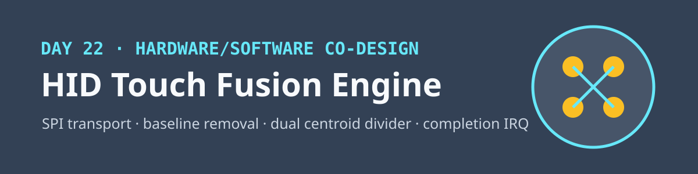
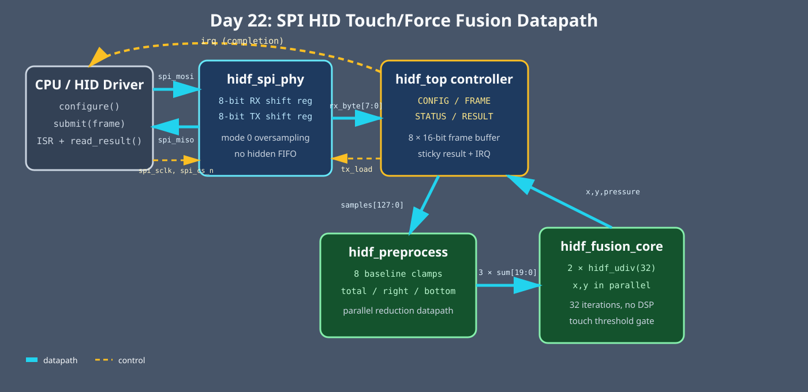

<!-- Author: Asresh -->


# Day 22: HID Touch Fusion Engine

<!-- readability-guide:start -->
## Plain-language overview

This engine combines touch and force sensor readings into pressure and a two-dimensional contact location. Software configures calibration and moves frames over the serial link; hardware removes baselines, sums channels, and divides the weighted totals.

## Abbreviation guide

Every shortened technical term used in this README is expanded below for quick reference:

- **CPU** [Central Processing Unit]
- **HID** [Human Interface Device]
- **IRQ** [Interrupt Request]
- **MIT** [Massachusetts Institute of Technology]
- **RTL** [Register-Transfer Level]
- **SPI** [Serial Peripheral Interface]
<!-- readability-guide:end -->

This project accelerates the low-latency path behind a multi-touch or force-sensing input device. Two four-quadrant sensor tiles produce eight unsigned samples per frame. Hardware removes the calibrated baseline, fuses both tiles, calculates pressure and a two-dimensional centroid, and raises a completion interrupt. A small C driver owns configuration, SPI framing, completion polling, result movement, and the bit-exact software reference.

The project is motivated by current HID systems roles that ask engineers to work across sensing hardware, transport drivers, firmware, algorithms, and user-facing latency. It deliberately demonstrates the boundary: repetitive fixed-width reduction and two 32-step coordinate divisions live in RTL; policy, calibration, scheduling, timeout handling, and the fallback/reference calculation stay in software.



## Hardware/software partition

The eight baseline clamps and the `total`, `right`, and `bottom` reductions are spatial hardware. Two unsigned divider engines run concurrently, so X and Y do not serialize. The no-touch case bypasses division and returns the neutral coordinate `(512,512)`. The host supplies the baseline and touch threshold, streams each frame in big-endian order, waits for the sticky IRQ or polls status, reads the packed result, and compares it with the same integer definition used to generate verification vectors.

The design is parameterized by channel count, sample width, and accumulator width. Its default 8 × 16-bit frame has two sensor tiles arranged as four quadrants each. Division is shift/subtract rather than inferred `/`, keeping the datapath explicit and portable to Icarus Verilog 12.

## SPI command map

SPI mode 0 is used; `spi_cs_n` frames one command. Multi-byte values are big-endian.

| Command | Direction | Payload / response | Purpose |
|---:|---|---|---|
| `0x01 CONFIG` | host → device | baseline `[15:0]`, threshold `[19:0]` | Set calibration and touch gate |
| `0x10 FRAME` | host → device | 8 × sample `[15:0]` | Submit one fused sensor frame |
| `0x20 STATUS` | device → host | bit 0 busy, bit 1 result-valid | Poll completion without an IRQ controller |
| `0x21 RESULT` | device → host | X `[15:0]`, Y `[15:0]`, pressure `[31:0]`, flags `[7:0]` | Read result and clear result-valid/IRQ |

The physical signals are `spi_sclk`, `spi_cs_n`, `spi_mosi`, and `spi_miso`; `irq` is a separate active-high completion line.

## Build and run

```sh
make sim      # build C model/vectors, compile RTL, run 304 frames
make metrics  # regenerate results/metrics.md from the simulation log
make check    # rebuild vector path under ASan + UBSan
make synth    # Yosys when installed; otherwise Icarus elaboration
```

## Measured results

Measured with Icarus Verilog from launch to the completion IRQ. The test intentionally processes one frame at a time, so sustained throughput includes divider drain and relaunch rather than claiming an overlapped rate the RTL does not support.

| Metric | Result |
|---|---:|
| Differential frames | 304 |
| Mismatches | 0 |
| Core cycles | 10,070 |
| Mean launch-to-IRQ latency | 33.12 cycles |
| Sustained non-overlapped throughput | 0.03019 frames/cycle |
| Scalar software baseline | 148 cycles/frame |
| Speedup over scalar baseline | 4.47× |

The scalar baseline is an explicit instruction-cost model in `sw/hid_fusion_baseline.c`: eight loads/clamps, the three reductions, two 64/32 software divides, branches, and result stores on a small in-order embedded CPU.

## Verification

The C host generates 304 reproducible frames: zero input, all-at-baseline, maximum pressure, opposing corners, all channels saturated, periodic below-threshold noise, and 299 pseudo-random frames spanning the full 16-bit range. The SystemVerilog testbench sends every sample over the actual SPI pins, waits for the real interrupt, checks X, Y, pressure, and touch state bit-exactly, and consumes the result command to clear completion. `make check` regenerates the same vectors under AddressSanitizer and UndefinedBehaviorSanitizer. No test is conditionally weakened for tool availability.

## Files

- `rtl/hidf_spi_phy.v`: synchronizing SPI mode-0 byte engine
- `rtl/hidf_preprocess.v`: baseline clamps and three parallel sums
- `rtl/hidf_udiv.v`: parameterized restoring unsigned divider
- `rtl/hidf_fusion_core.v`: threshold/bypass control and parallel X/Y division
- `rtl/hidf_top.v`: command decoder, frame/result storage, and IRQ
- `sw/`: transport driver, reference model, baseline, and vector host
- `tb/hidf_tb.sv`: pin-level randomized differential testbench
- `results/metrics.md`: simulation-derived measurements

MIT License. Copyright Asresh.
