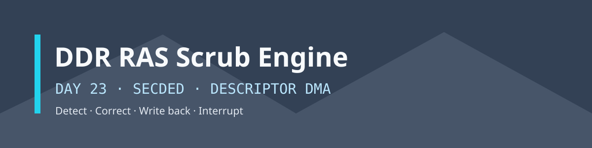
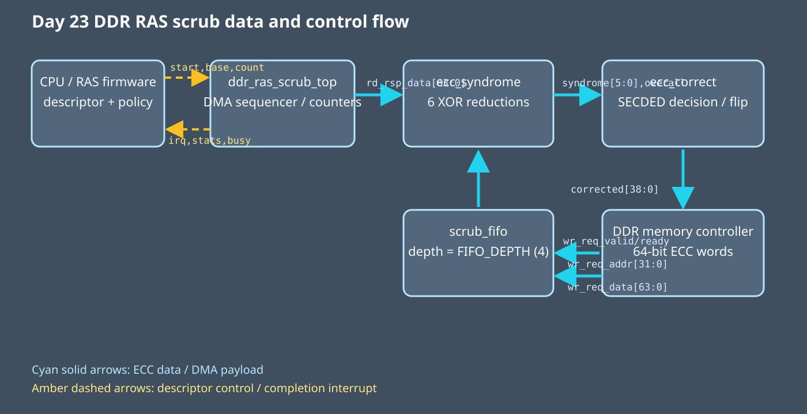
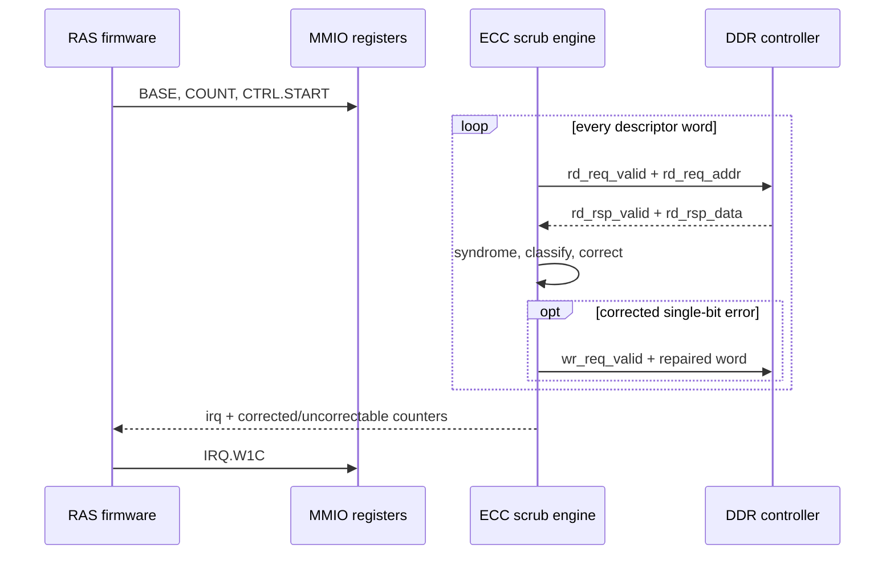

<!-- Author: Asresh -->


# Day 23: DDR RAS Scrub Engine

<!-- readability-guide:start -->
## Plain-language overview

This scrubber continuously checks protected memory words, repairs single-bit errors, and reports errors that cannot be repaired safely. Software chooses memory regions and handles alarms; hardware calculates syndrome bits and performs correction at memory-stream speed.

## Abbreviation guide

Every shortened technical term used in this README is expanded below for quick reference:

- **BMC** [Baseboard Management Controller]
- **COUNT** [Count]
- **CPU** [Central Processing Unit]
- **CTRL** [Control]
- **DDR** [Double Data Rate]
- **DMA** [Direct Memory Access]
- **DRAM** [Dynamic Random-Access Memory]
- **ECC** [Error-Correcting Code]
- **FIFO** [First-In, First-Out]
- **FPGA** [Field-Programmable Gate Array]
- **IRQ** [Interrupt Request]
- **LPDDR** [Low-Power Double Data Rate]
- **MIT** [Massachusetts Institute of Technology]
- **MMIO** [Memory-Mapped Input/Output]
- **RAS** [Reliability, Availability, and Serviceability]
- **RTL** [Register-Transfer Level]
- **SECDED** [Single-Error Correction, Double-Error Detection]
- **W1C** [Write One to Clear]
<!-- readability-guide:end -->

Soft errors in DRAM accumulate silently unless the platform periodically reads ECC words, corrects single-bit faults, writes repaired words back, and reports double-bit faults before redundancy is lost. This project implements that patrol-scrub path as a descriptor-driven DMA engine using a shortened 39-bit Hamming SECDED code for each 32-bit payload.

The project is based on current hardware/software-boundary roles: NVIDIA's recent memory-subsystem firmware opening calls for DDR/LPDDR firmware, RAS, telemetry, C models, and pre/post-silicon validation, while its senior firmware roles emphasize MMIO, DMA, interrupts, and low-level diagnostics. The design demonstrates those same contracts without pretending policy belongs in RTL.



## Hardware/software partition

Hardware performs the repetitive fixed-width work: six parallel parity reductions produce the Hamming syndrome, the overall parity classifies clean/single/double faults, a correction stage flips a single failed bit, and a parameterized FIFO decouples corrected-word writeback from the read scanner. The DMA sequencer walks a host-supplied `{base,count}` descriptor, keeps correction telemetry, and raises a sticky interrupt only after all queued writebacks drain.

Software owns memory-range policy, scrub cadence, descriptor validation, timeout handling, completion acknowledgement, telemetry reporting, escalation of uncorrectable errors, and the independent bit-exact reference model. That is the practical split in server firmware: mechanisms with deterministic per-word latency in hardware; platform policy and recovery decisions in firmware.

## Register map

The selected/ready host bus uses `bus_valid_i`, `bus_write_i`, `bus_addr_i[5:0]`, `bus_wdata_i[31:0]`, `bus_ready_o`, and `bus_rdata_o[31:0]`. The memory side is a 64-bit descriptor DMA master with independent `rd_req_*`, `rd_rsp_*`, and `wr_req_*` channels.

| Offset | Register | Access | Description |
|---:|---|---|---|
| `0x00` | `CTRL` | W | bit 0: self-clearing descriptor start |
| `0x04` | `BASE` | R/W | byte address of first 64-bit ECC word |
| `0x08` | `COUNT` | R/W | number of ECC words in the descriptor |
| `0x0c` | `STATUS` | R | bit 0 busy, bit 1 sticky completion IRQ |
| `0x10` | `CORRECTED` | R | single-bit words corrected and written back |
| `0x14` | `UNCORRECTABLE` | R | double-bit words detected, never modified |
| `0x18` | `IRQ` | R/W1C | completion state; write bit 0 to acknowledge |

## Operation sequence



## Build and run

```sh
make sim      # build C vectors, compile RTL, run randomized DMA simulation
make metrics  # regenerate results/metrics.md from the simulation log
make synth    # Yosys if installed; otherwise synthesis-oriented Icarus elaboration
make check    # regenerate vectors through ASan + UBSan, abort on first finding
```

Yosys is not installed on the development machine, so `make synth` used Icarus synthesis-oriented elaboration. Icarus 13 ran the test; the RTL avoids constructs unsupported by Icarus 12.

## Measured results

The numbers below are emitted by the self-checking simulation under randomized read and write backpressure. The baseline is an explicit 92-cycle-per-word cost model for a small in-order CPU performing loads, parity scans, classification, correction, conditional stores, loop control, and descriptor overhead.

| Metric | Measured result |
|---|---:|
| Differential ECC words | 304 |
| Single-bit repairs | 152 |
| Double-bit detections | 76 |
| Mismatches | 0 |
| Descriptor latency | 734 cycles |
| Sustained throughput | 0.414169 words/cycle |
| Software-only baseline | 27,986 cycles |
| Speedup | 38.128× |

## Verification

The C generator creates 304 deterministic words: all-zero and all-one payloads, clean codewords, every class of single-bit error including the overall-parity bit, double-bit errors, and 299 seeded random payloads with rotating fault locations. The SystemVerilog testbench loads those words into a memory model, applies randomized DMA request/writeback stalls, waits on the real completion interrupt, verifies all 304 memory locations bit-for-bit, and checks both telemetry counters. `make check` rebuilds the driver, model, and baseline with ASan and UBSan and regenerates the vector file cleanly. No test is bypassed for missing tools.

## Use cases

- Patrol scrubbing in server DDR/LPDDR controllers before correctable errors accumulate into data loss.
- Automotive and industrial safety controllers that must distinguish repairable transient faults from uncorrectable memory corruption.
- FPGA-based memory exercisers for pre-silicon firmware development, error injection, and RAS validation.
- Accelerator cards that expose ECC telemetry to a BMC through MMIO and a completion interrupt.
- Radiation-tolerant edge and space systems where firmware schedules scrubs based on observed fault rate.

## File guide

- `rtl/ecc_syndrome.v` and `rtl/ecc_correct.v`: parallel parity tree, fault classification, and repair.
- `rtl/scrub_fifo.v`: parameterized correction/writeback queue.
- `rtl/ddr_ras_scrub_top.v`: descriptor walker, DMA channels, counters, and completion logic.
- `rtl/ras_mmio_regs.v` and `rtl/ddr_ras_scrub_mmio_top.v`: firmware-visible registers and integration top.
- `sw/`: MMIO driver, reference encoder/checker, scalar baseline, and vector host.
- `tb/ddr_ras_scrub_tb.sv`: randomized memory-system differential test.
- `results/metrics.md`: measurements extracted from the simulator log.

MIT License. Copyright Asresh.
