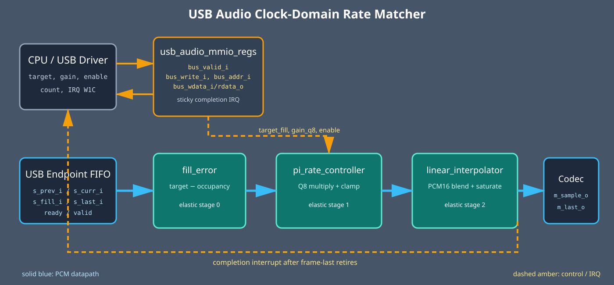

<!-- Author: Asresh -->


# Day 24: USB Audio Rate Matcher

<!-- readability-guide:start -->
## Plain-language overview

Two audio clocks rarely run at exactly the same rate, so a buffer can slowly overflow or empty. Software sets the target fill level; hardware measures drift and interpolates samples to keep playback continuous.

## Abbreviation guide

Every shortened technical term used in this README is expanded below for quick reference:

- **COUNT** [Count]
- **CTRL** [Control]
- **EN** [Enable]
- **FIFO** [First-In, First-Out]
- **FPGA** [Field-Programmable Gate Array]
- **I2S** [Inter-Integrated Circuit Sound]
- **IP** [Internet Protocol]
- **IRQ** [Interrupt Request]
- **MIT** [Massachusetts Institute of Technology]
- **MMIO** [Memory-Mapped Input/Output]
- **PCM** [Pulse-Code Modulation]
- **PCM16** [16-bit Pulse-Code Modulation]
- **Q0** [Fixed-Point Format with 0 Fractional Bits]
- **Q8** [Fixed-Point Format with 8 Fractional Bits]
- **TDM** [Time-Division Multiplexing]
- **USB** [Universal Serial Bus]
- **W1C** [Write One to Clear]
<!-- readability-guide:end -->

USB isochronous audio moves a nominal number of PCM samples every microframe, but the USB host and audio codec run from independent crystals. Their small frequency error slowly fills or drains the endpoint FIFO. Waiting for overflow or underflow produces an audible click; continuously adjusting the resampling phase keeps latency bounded without dropping or duplicating a whole sample.

This project reflects [Apple’s current Software Device Driver Engineer role for Core I/O](https://jobs.apple.com/en-us/details/200660074/software-device-driver-engineer-core-i-o-core-os), which emphasizes USB architecture, driver bring-up, and I/O performance characterization. It implements the hardware contract such a driver needs: explicit FIFO-target policy, a streaming data path that tolerates backpressure, measured latency/throughput, MMIO telemetry, and a completion interrupt.



## Hardware/software partition

Hardware owns the per-sample deterministic path. `fill_error` compares live endpoint occupancy with the programmed target, `pi_rate_controller` converts that signed error into a bounded Q8 phase correction, and `linear_interpolator` blends adjacent PCM16 samples using the corrected Q0.16 phase. Three elastic pipeline stages freeze together on codec backpressure, preserving every sample and its frame marker.

Software owns endpoint policy: selecting the target FIFO depth and control gain, loading the stream buffers, enabling the endpoint, timing out a stalled device, servicing completion, reading the sample counter, and acknowledging the sticky interrupt. The independent C reference uses 64-bit intermediates so signed overflow and negative shifts are impossible.

## Register map

The host side uses `bus_valid_i`, `bus_write_i`, `bus_addr_i[5:0]`, `bus_wdata_i[31:0]`, `bus_ready_o`, and `bus_rdata_o[31:0]`. Audio samples use `s_valid_i/s_ready_o` with `s_prev_i`, `s_curr_i`, `s_fill_i`, and `s_last_i`; output uses `m_valid_o/m_ready_i`, `m_sample_o`, and `m_last_o`.

| Offset | Register | Access | Description |
|---:|---|---|---|
| `0x00` | `CTRL` | R/W | bit 0 enable; bit 1 interrupt enable |
| `0x04` | `TARGET_FILL` | R/W | desired endpoint FIFO occupancy |
| `0x08` | `GAIN_Q8` | R/W | proportional phase-correction gain |
| `0x0c` | `STATUS` | R | bit 0 enabled; bit 1 completion pending |
| `0x10` | `SAMPLE_COUNT` | R | successfully retired output samples |
| `0x14` | `IRQ_STATUS` | R/W1C | sticky frame completion state |

## Transaction sequence

```mermaid
sequenceDiagram
    participant D as USB driver
    participant R as MMIO registers
    participant H as Rate-match hardware
    participant C as Audio codec
    D->>R: TARGET_FILL, GAIN_Q8, CTRL.EN|IRQ_EN
    loop each isochronous PCM sample
        D->>H: prev, current, FIFO fill, frame-last
        H->>H: error -> correction -> interpolation
        H->>C: adjusted PCM16 sample
    end
    H-->>D: sticky completion interrupt
    D->>R: read SAMPLE_COUNT; IRQ_STATUS.W1C
```

## Build and run

```sh
make sim      # C vectors + randomized ready/valid differential simulation
make metrics  # regenerate results/metrics.md from measured simulator output
make synth    # Yosys, or synthesis-oriented Icarus elaboration if unavailable
make check    # regenerate vectors through ASan + UBSan and stop on first issue
```

Yosys is not installed on the development machine, so `make synth` used synthesis-oriented Icarus elaboration. The test ran on Icarus 13 and uses constructs accepted by Icarus 12.

## Measured results

| Metric | Measured result |
|---|---:|
| Differential vectors | 320 |
| End-to-end cycles | 740 |
| Sustained throughput under randomized gaps/backpressure | 0.432432 samples/cycle |
| Pipeline latency | 3 cycles |
| Software-only baseline | 5,772 cycles |
| Speedup | 7.800000x |
| Mismatches | 0 |

The scalar baseline charges 18 cycles per sample plus 12 setup cycles for loads, signed error calculation, multiply/divide, clamp, interpolation, saturation, and store. The simulation number includes randomized source gaps and output stalls, so the speedup is conservative rather than a no-stall roofline.

## Verification

The C generator emits 320 bit-exact cases: silence, both PCM extrema in both interpolation directions, a zero crossing, FIFO occupancy exactly at and one step around the target, and 314 seeded full-range random combinations. The testbench programs the real register interface, injects randomized source gaps and codec backpressure, checks every PCM output against the C reference, verifies `m_last_o`, waits for the real interrupt, and reports simulator-measured cycles. `make check` rebuilds the driver, model, and baseline with ASan and UBSan and regenerates all vectors cleanly.

## Use cases

- USB headsets, microphones, conference bars, and audio interfaces with asynchronous codec clocks.
- Docking stations that bridge USB audio to I2S/TDM without periodic sample slips.
- Automotive infotainment systems carrying audio between clock islands.
- FPGA audio-over-IP gateways whose network and converter clocks are unrelated.
- Pre-silicon USB driver development, endpoint tuning, and I/O latency characterization.

MIT License. Copyright Asresh.
