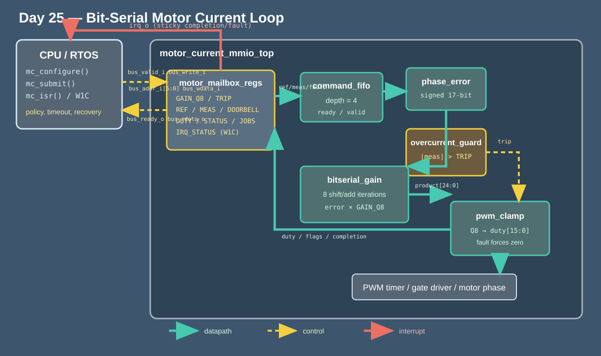

<!-- Author: Asresh -->


# Day 25: Bit-Serial Motor Current Loop

A field-oriented motor controller must turn phase-current error into a bounded PWM command at a fixed cadence. Running that inner loop entirely in firmware spends variable instruction time on signed multiplication, scaling, clamping, register traffic, and safety checks. Jitter becomes torque ripple; a delayed overcurrent response can damage the inverter.

This project follows the requirements in Apple’s current [Application & System Firmware Engineer](https://jobs.apple.com/en-us/details/200663414-3956/application-system-firmware-engineer) opening: production C/C++ firmware and device drivers, hard real-time embedded systems, motor/motion control, safety-critical design, and optimization for constrained compute. It implements the hardware contract behind that work rather than only a control equation: an MMIO mailbox, command buffering, deterministic arithmetic, fault shutdown, telemetry, completion interrupt, portable driver, independent model, and randomized pre-silicon verification.



## Hardware/software partition

Hardware owns the deadline-critical current-loop step. `phase_error` widens the signed subtraction so `INT16_MAX - INT16_MIN` is exact. `bitserial_gain` multiplies the 17-bit error by an unsigned Q8 gain using one adder over eight shift/add cycles, trading latency for compact area. `pwm_clamp` arithmetic-shifts the product, adds the center-aligned 50% bias, and saturates to a 16-bit duty. In parallel, `overcurrent_guard` widens the measured current before taking its magnitude, including the `-32768` corner; a trip or external gate-driver fault forces duty to zero. A four-entry `command_fifo` decouples mailbox timing from the fixed-latency datapath.

Software owns policy and recovery: choosing the current-loop gain and trip threshold, sampling the ADC result, writing reference/current mailboxes, ringing the doorbell, enforcing a timeout, consuming the PWM result, reading flags and telemetry, and acknowledging the sticky interrupt with write-one-to-clear. The reference model uses `int32_t`/`int64_t` arithmetic and explicitly defines negative Q8 rounding, so it does not rely on signed overflow or left-shifting negative values.

## Data and control sequence

```mermaid
sequenceDiagram
    participant F as Motor-control firmware
    participant M as MMIO mailbox
    participant Q as Command FIFO (depth 4)
    participant B as Bit-serial datapath
    participant P as PWM / gate driver
    F->>M: GAIN_Q8, TRIP, reference, measured
    F->>M: DOORBELL (external_fault)
    M->>Q: ready/valid command
    Q->>B: signed error + safety state
    loop 8 gain bits
        B->>B: conditional add, shift
    end
    B->>P: saturated duty or fault-safe zero
    B-->>M: duty, flags, completion
    M-->>F: irq_o
    F->>M: read STATUS/DUTY; IRQ_STATUS.W1C
```

## Register map

The selected/ready host bus uses `bus_valid_i`, `bus_write_i`, `bus_addr_i[5:0]`, `bus_wdata_i[31:0]`, `bus_ready_o`, and `bus_rdata_o[31:0]`. `irq_o` is level-sensitive until acknowledged.

| Offset | Register | Access | Description |
|---:|---|---|---|
| `0x00` | `CTRL` | R/W | bit 0 device present; bit 1 interrupt enable |
| `0x04` | `GAIN_Q8` | R/W | unsigned proportional current gain in Q8 |
| `0x08` | `TRIP` | R/W | absolute-current safety threshold |
| `0x0c` | `REFERENCE` | R/W | signed 16-bit requested phase current |
| `0x10` | `MEASURED` | R/W | signed 16-bit ADC phase current |
| `0x14` | `DOORBELL` | W | bit 0 submit; bit 1 external gate-driver fault |
| `0x18` | `STATUS` | R | ready, busy, done, fault, high-saturation, low-saturation |
| `0x1c` | `DUTY` | R | unsigned 16-bit center-aligned PWM command |
| `0x20` | `JOBS` | R | completed-command counter |
| `0x24` | `IRQ_STATUS` | R/W1C | sticky completion/fault interrupt state |

## Source map

| File | Responsibility |
|---|---|
| `rtl/command_fifo.v` | Parameterized four-command ready/valid decoupling FIFO |
| `rtl/phase_error.v` | Exact signed 17-bit reference-minus-measurement subtraction |
| `rtl/overcurrent_guard.v` | Absolute-current and external-fault safety decision |
| `rtl/bitserial_gain.v` | Eight-cycle signed-error × unsigned-Q8 shift/add engine |
| `rtl/pwm_clamp.v` | Q8 scaling, center bias, saturation, and fault-safe zero |
| `rtl/motor_current_core.v` | Lossless sequencing between FIFO, arithmetic, and result handshake |
| `rtl/motor_mailbox_regs.v` | Register map, doorbell, telemetry, W1C, and interrupt |
| `rtl/motor_current_mmio_top.v` | Synthesizable integration top level |
| `sw/motor_current_driver.c` | Configure, submit, timeout, result movement, and ISR flow |
| `sw/motor_current_model.c` | Independent bit-exact reference result |
| `sw/motor_current_baseline.c` | Documented scalar-MCU instruction-cycle baseline |
| `sw/motor_current_host.c` | Directed/random vector and baseline generator |
| `tb/motor_current_loop_tb.sv` | Pin-level MMIO differential simulation and measurements |

## Build and run

```sh
make sim      # compile C, generate vectors, run differential RTL simulation
make metrics  # regenerate results/metrics.md from simulator output
make synth    # run Yosys, or synthesis-oriented Icarus elaboration
make check    # rebuild vector path under ASan + UBSan; fail on first finding
```

Yosys is not installed on the development machine, so `make synth` used synthesis-oriented Icarus elaboration. The simulator is Icarus Verilog 13; the RTL and testbench avoid constructs unsupported by Icarus 12.

## Measured results

| Metric | Measured result |
|---|---:|
| Differential vectors | 320 |
| Aggregate launch-to-interrupt cycles | 4,160 |
| Mean launch-to-interrupt latency | 13.000 cycles |
| Maximum launch-to-interrupt latency | 13 cycles |
| Non-overlapped throughput | 0.076923 commands/cycle |
| Scalar software baseline | 27,741 cycles |
| Speedup over scalar baseline | 6.668510x |
| Mismatches | 0 |

The scalar baseline charges each command for ADC/PWM register movement, signed preparation, fault branches, a software multiply and Q8 scale, clamp, and state-dependent branches. The hardware measurement begins after the doorbell handshake and ends at the real interrupt; MMIO setup is intentionally outside both current-loop compute measurements.

## Verification

The C generator emits 320 cases: zero error, full signed subtraction range in both directions, zero gain, exact trip boundaries, positive and negative overcurrent, external fault, high/low saturation, and 312 seeded full-range random combinations. The SystemVerilog testbench drives the real register pins with randomized bus gaps, checks duty and all result flags against the C reference, proves every launch completes in exactly 13 clocks, verifies the completed-job counter, and tests interrupt W1C after every result. The run completed with zero mismatches. `make check` rebuilt the driver, model, and baseline under AddressSanitizer and UndefinedBehaviorSanitizer and regenerated all vectors cleanly.

## Use cases

- Electric-vehicle traction inverter and e-bike phase-current inner loops.
- Robot joints, gimbals, drones, and surgical actuators needing bounded torque-loop latency.
- CNC spindles, pumps, fans, and industrial servo drives on small FPGAs or motor-control SoCs.
- Safety islands that must force PWM inactive independently of delayed RTOS firmware.
- Hardware-in-the-loop and pre-silicon driver validation before power electronics are available.

MIT License. Copyright Asresh.
