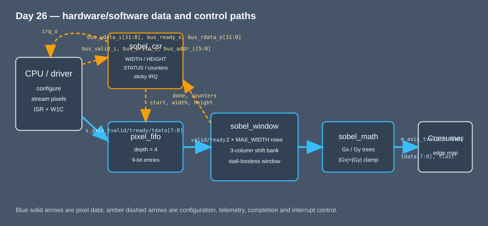

<!-- Author: Asresh -->


# Day 26: Sobel Line-Buffer Engine

Edge extraction is a basic stage in camera pipelines, machine vision, robotics, video preprocessing, and feature detection. A scalar processor repeatedly reloads overlapping 3×3 neighborhoods; eight of nine bytes are reused by the next output but still travel through the memory hierarchy. This accelerator retains that locality in two parameterized row stores and three small shift banks, accepting the image once and producing a saturated Sobel edge map through a backpressure-safe stream.

The project is motivated by NVIDIA's current [Senior Software Engineer — CUDA Driver](https://nvidia.wd5.myworkdayjobs.com/en-US/NVIDIAExternalCareerSite/job/Senior-Software-Engineer---CUDA-Driver_JR2014725) role, which calls out hardware/software co-design, performance modeling, programming-model exposure, memory hierarchy, interrupts, and MMIO. The project turns those requirements into a compact pre-silicon portfolio example: a real device contract, portable C driver, independent golden model, measured performance, interrupt completion, and randomized stream timing.



## Hardware/software partition

Hardware owns the repetitive, locality-sensitive work. `pixel_fifo` absorbs four pixels of host jitter. `sobel_window` stores the preceding two rows, shifts three columns in lockstep, and freezes its entire state when the consumer applies backpressure. `sobel_math` evaluates the two signed 3×3 kernels, takes safe widened magnitudes, adds them, and saturates at 255. `sobel_stream_core` counts accepted and produced pixels and only completes after the final output handshake. `sobel_csr` owns configuration, telemetry, the self-clearing start doorbell, and sticky W1C interrupt state.

Software owns allocation and policy: image geometry validation, MMIO programming, input and output movement, timeout handling, interrupt acknowledgement, and the scalar reference. Keeping geometry and recovery in the driver lets the same RTL serve camera, display, and compute queues without embedding OS policy in hardware.

```mermaid
sequenceDiagram
    participant D as Device driver
    participant C as MMIO CSR
    participant F as FIFO (depth 4)
    participant W as Two-row window
    participant O as Output consumer
    D->>C: WIDTH, HEIGHT, IRQ_EN, START
    loop width × height pixels
        D->>F: s_axis_tvalid/tdata
        F->>W: ready/valid pixel
        W->>W: retain 2 rows + shift 3 columns
        W->>O: magnitude, m_axis_tlast
    end
    W-->>C: final output accepted + counters
    C-->>D: irq_o
    D->>C: read telemetry; IRQ_STATUS W1C
```

## Register map

The selected/ready MMIO bus uses `bus_valid_i`, `bus_write_i`, `bus_addr_i[5:0]`, `bus_wdata_i[31:0]`, `bus_ready_o`, and `bus_rdata_o[31:0]`.

| Offset | Register | Access | Description |
|---:|---|---|---|
| `0x00` | `CTRL` | R/W | present, IRQ enable, self-clearing start bit 8 |
| `0x04` | `WIDTH` | R/W | frame width, 3–64 pixels |
| `0x08` | `HEIGHT` | R/W | frame height, at least 3 pixels |
| `0x0c` | `STATUS` | R | ready, running, IRQ pending, error |
| `0x10` | `PIXELS_IN` | R | accepted input pixels |
| `0x14` | `PIXELS_OUT` | R | consumed edge pixels |
| `0x18` | `IRQ_STATUS` | R/W1C | completion and protocol-error state |
| `0x1c` | `CAPS` | R | maximum width and device version |

## Build and run

```sh
make sim      # build C, generate references, compile and run RTL
make metrics  # regenerate results/metrics.md from measured simulation
make synth    # Yosys, or Icarus synthesis-oriented elaboration fallback
make check    # ASan + UBSan rebuild and vector regeneration
```

Yosys and Verilator are not installed on this macOS machine, so synthesis verification uses Icarus elaboration. The RTL avoids features unsupported by Icarus Verilog 12 used by CI.

## Measured results

| Metric | Measured result |
|---|---:|
| Input pixels | 320 |
| Seeded random pixels | 304 |
| Directed corner pixels | 16 |
| Output pixels checked | 252 |
| Launch-to-interrupt cycles | 461 |
| Sustained output throughput | 0.546638 pixels/cycle |
| Pipeline latency after a complete window | 3 cycles |
| Scalar software baseline | 8,280 cycles |
| Speedup over scalar baseline | 17.960954x |
| Mismatches | 0 |

The scalar baseline charges setup, input traffic, nine neighborhood loads, signed kernel arithmetic, absolute values, clamp and output store. Hardware cycles are measured from the start-doorbell transaction to the real interrupt under deterministic randomized input gaps and output backpressure.

## Verification

The C generator creates a 20×16 frame: 16 directed extrema/checkerboard values followed by 304 seeded random bytes. It computes all 252 valid 3×3 results independently. The SystemVerilog testbench drives actual MMIO and stream pins, randomizes source gaps and sink backpressure, checks every output byte and the unique final `tlast`, cross-checks input/output counters, enforces a completion timeout, and proves interrupt W1C. `make check` regenerates every vector under ASan and UBSan with recovery disabled.

## Use cases

- Camera ISP edge-map generation before segmentation or autofocus statistics.
- Robotics and autonomous systems extracting contours before feature tracking.
- GPU/FPGA preprocessing that reduces raw imagery before a neural network.
- Industrial inspection finding scratches, seams, package boundaries, or alignment marks.
- Driver bring-up and virtual-platform validation before the final imaging accelerator is available.

MIT License. Copyright Asresh.
