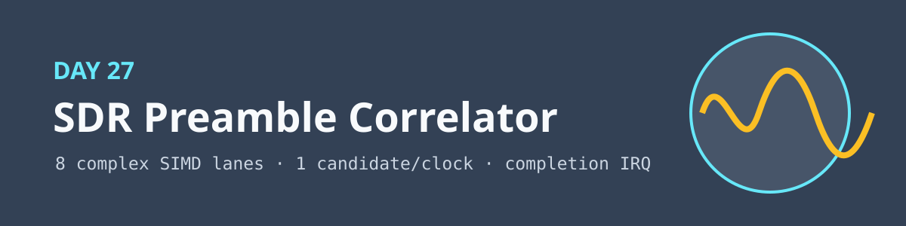
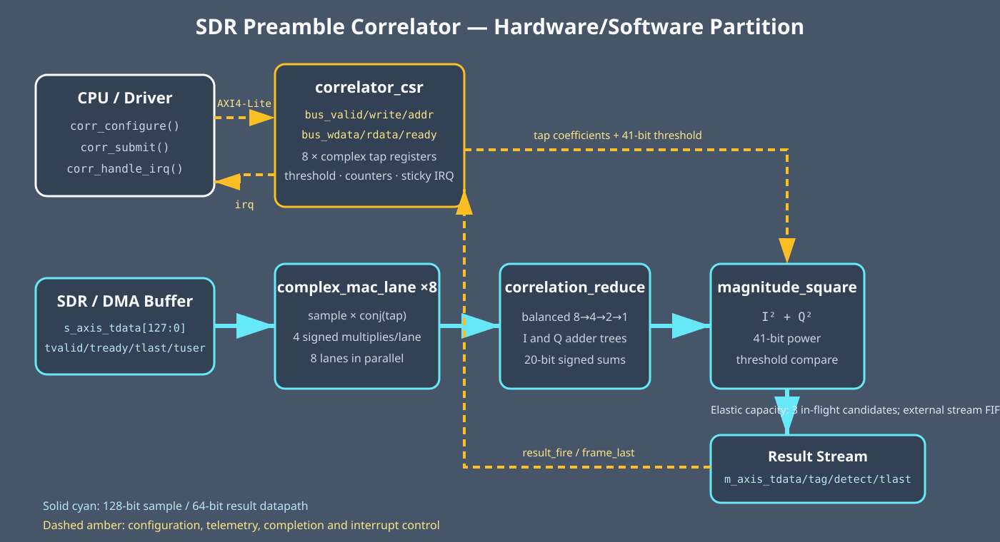

<!-- Author: Asresh -->


# Day 27: SDR Preamble Correlator

<!-- readability-guide:start -->
## Plain-language overview

A receiver finds the start of a radio burst by comparing incoming samples with a known preamble. Software loads the reference pattern and threshold; hardware performs parallel complex correlations and reports the strongest matches.

## Abbreviation guide

Every shortened technical term used in this README is expanded below for quick reference:

- **ACK** [Acknowledge]
- **AXI** [Advanced eXtensible Interface]
- **CAPS** [Capabilities]
- **CPU** [Central Processing Unit]
- **CTRL** [Control]
- **DMA** [Direct Memory Access]
- **FFT** [Fast Fourier Transform]
- **FPGA** [Field-Programmable Gate Array]
- **IQ** [In-Phase and Quadrature]
- **IRQ** [Interrupt Request]
- **LTE** [Long-Term Evolution]
- **MIT** [Massachusetts Institute of Technology]
- **PCIe** [Peripheral Component Interconnect Express]
- **RO** [Read-Only]
- **RTL** [Register-Transfer Level]
- **RW** [Read/Write]
- **SDR** [Software-Defined Radio]
- **TLAST** [Transfer Last]
- **US** [United States]
- **W1C** [Write One to Clear]
- **WO** [Write-Only]
<!-- readability-guide:end -->

An eight-lane complex matched-filter accelerator that identifies known burst preambles in an SDR receive path. This project follows the hardware/software boundary emphasized by NVIDIA's current [Dataflow Development Engineer](https://nvidia.wd5.myworkdayjobs.com/en-US/NVIDIAExternalCareerSite/job/Dataflow-Development-Engineer_JR2014148) role: RTL streaming dataflow, host-side configuration, backpressure, deterministic latency and measured throughput.

## Problem and partition

A software-defined radio must search candidate windows for a known complex sequence before it can estimate carrier offset, align symbols or invoke a decoder. For each candidate, the detector evaluates

`power = |Σ sample[k] × conj(tap[k])|²`

The eight independent complex products, reduction tree and magnitude square are regular, parallel and needed for every candidate, so hardware performs them. Software owns policy: it selects and writes the preamble taps and detection threshold, moves buffers through the streams, waits for completion, acknowledges the interrupt and retains the bit-exact reference model. Changing a wireless standard therefore does not require changing RTL.



The 128-bit ingress beat holds eight `{Q[7:0], I[7:0]}` samples. Eight `complex_mac_lane` instances multiply them by conjugated tap values. `correlation_reduce` uses balanced I and Q adder trees; `magnitude_square` produces a 41-bit unsigned power. The three-stage pipeline carries a 16-bit tag and `TLAST` beside the data and freezes as one unit under output backpressure, so no candidate is lost or reordered. The top level joins that datapath to `correlator_csr`, whose sticky completion state drives `irq`.

## Register map

| Offset | Name | Access | Meaning |
|---:|---|:---:|---|
| `0x00` | `CTRL` | RW | bit 0 enable, bit 1 clear counters/state, bit 2 IRQ enable |
| `0x04` | `STATUS` | RO | bit 0 enabled, bit 1 frame complete |
| `0x08` | `THRESH_LO` | RW | detection threshold bits 31:0 |
| `0x0c` | `THRESH_HI` | RW | detection threshold bits 40:32 |
| `0x10` | `VECTORS` | RO | accepted output-vector count |
| `0x14` | `DETECTIONS` | RO | above-threshold result count |
| `0x18` | `CAPS` | RO | eight lanes, eight-bit components, three stages |
| `0x1c` | `IRQ_ACK` | WO | write bit 0 to clear completion |
| `0x40`–`0x5c` | `TAP[0:7]` | RW | `{Q[7:0], I[7:0]}` complex reference taps |

## Software and file guide

- `sw/correlator_driver.c` performs the real device sequence: clear, threshold/tap writes, enable, stream submission, bounded completion polling and W1C interrupt service.
- `sw/correlator_model.c` is the fixed-width golden matched filter; `sw/correlator_baseline.c` documents the scalar embedded-CPU operation count.
- `sw/correlator_host.c` runs the driver against a mock transport and emits deterministic directed/random vectors.
- `rtl/complex_mac_lane.v`, `rtl/correlation_reduce.v` and `rtl/magnitude_square.v` isolate the arithmetic stages; `rtl/preamble_correlator_core.v` supplies elastic pipeline control; `rtl/correlator_csr.v` supplies control/telemetry; `rtl/sdr_correlator_top.v` is the integration boundary.
- `tb/correlator_tb.sv` programs the RTL through its bus pins, drives both AXI streams and compares every returned tag, power, decision and frame marker.

## Build and run

```sh
make sw       # build driver, host, model and baseline
make check    # regenerate vectors under ASan + UBSan
make sim      # differential Icarus simulation
make metrics  # regenerate results/metrics.md from simulator counters
make synth    # Yosys when present, synthesis-oriented Icarus elaboration here
```

Yosys is not installed on the development machine, so `make synth` used the documented Icarus elaboration fallback. Simulation used only constructs accepted by Icarus Verilog 12.

## Measured results

| Metric | Measured value |
|---|---:|
| Full-rate candidates | 320 |
| Full-rate cycles | 323 |
| First-result latency | 3 cycles |
| Sustained throughput | 0.991 candidates/clock |
| Scalar baseline | 15,680 modeled cycles |
| Speedup over scalar | 48.54× |
| Differential checks | 640 |
| Mismatches | 0 |

The scalar baseline charges 49 primitive operations per candidate: 32 multiply/add operations, 14 reduction adds, two squares and one threshold comparison. Hardware sustains one complete eight-sample candidate per clock after pipeline fill.

## Verification

The C generator emits 320 candidates: three explicit all-zero/exact-preamble/signed-extrema corners plus 317 deterministic cases that include repeated known detections and full-range random IQ data. The testbench runs the complete set twice—once with randomized source gaps and result backpressure, then at full rate—and checks power, tag, decision and `TLAST` bit-exactly. Completion status and the sticky interrupt are checked and acknowledged. `make check` rebuilds the driver, model and baseline with address/undefined-behavior sanitizers and completes cleanly.

## Use cases

- Wi-Fi, LTE/5G, LoRa and satellite burst synchronization ahead of FFT/demodulation.
- FPGA-based spectrum monitors that classify known emitters at line rate.
- Low-power sensor gateways that wake a CPU only after a valid radio preamble.
- PCIe SDR cards where host software supplies protocol-specific taps while the FPGA scans DMA-fed IQ buffers.

MIT licensed. Copyright Asresh.
