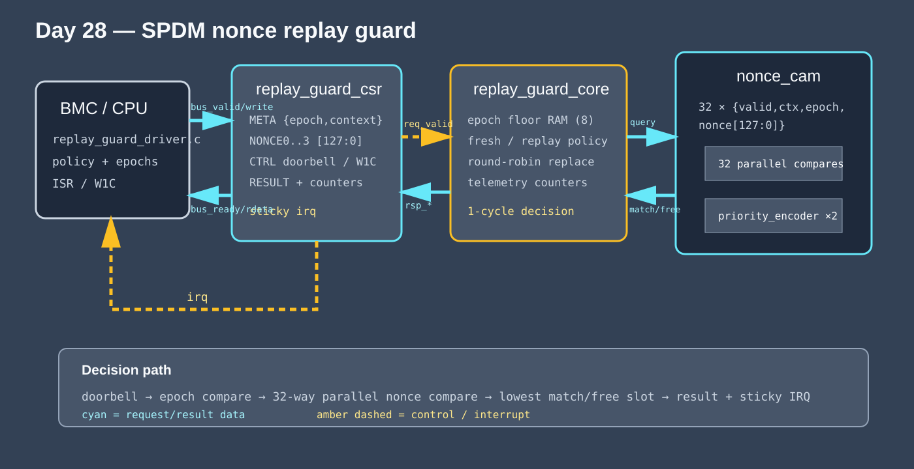
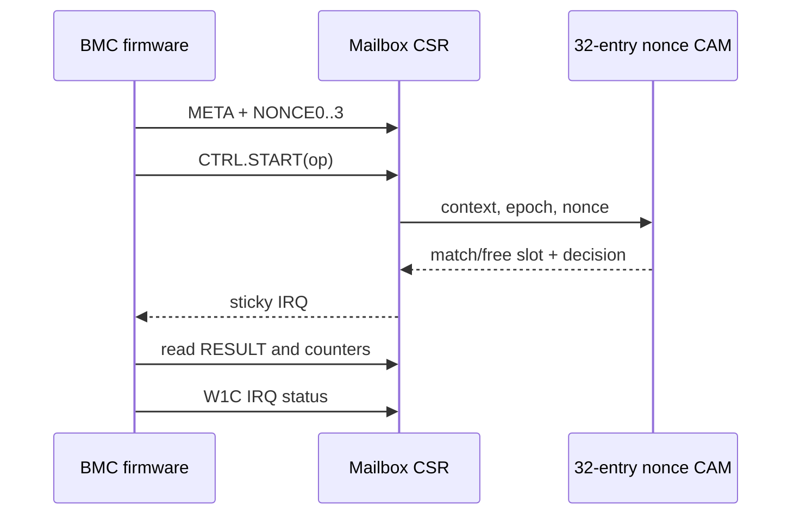

<!-- Author: Asresh -->


# Day 28: SPDM Nonce Replay Guard

<!-- readability-guide:start -->
## Plain-language overview

Authenticated management traffic still needs replay protection so an old valid command cannot be accepted again. Software controls security epochs and flush policy; hardware compares each nonce with all stored entries at once and returns a precise decision.

## Abbreviation guide

Every shortened technical term used in this README is expanded below for quick reference:

- **BMC** [Baseboard Management Controller]
- **CAM** [Content-Addressable Memory]
- **CSP** [Cloud Service Provider]
- **CSR** [Control and Status Register]
- **CTRL** [Control]
- **FW** [Firmware]
- **IRQ** [Interrupt Request]
- **MCTP** [Management Component Transport Protocol]
- **MIT** [Massachusetts Institute of Technology]
- **PCIe** [Peripheral Component Interconnect Express]
- **RAS** [Reliability, Availability, and Serviceability]
- **RPG1** [Replay Guard Version 1 Signature]
- **RTL** [Register-Transfer Level]
- **SPDM** [Security Protocol and Data Model]
- **US** [United States]
- **W1C** [Write One to Clear]
<!-- readability-guide:end -->

SPDM authenticates management traffic, but authentication alone does not make a previously valid request fresh. A BMC or security processor must remember recently accepted nonces per session and reject duplicates before a replayed command reaches privileged firmware. A scalar implementation scans a table with data-dependent branches; the 32-entry associative table here compares every `{context, epoch, nonce}` in parallel and returns a decision in one hardware cycle.

This project is motivated by current datacenter firmware roles that combine hardware bring-up, device drivers, RAS, and secure management protocols including SPDM and MCTP, such as NVIDIA's [Senior Firmware Engineer — CSP Engagements](https://nvidia.wd5.myworkdayjobs.com/en-US/NVIDIAExternalCareerSite/job/Senior-Firmware-Engineer---CSP-Engagements_JR1999599). It is a portfolio-scale model of the boundary such a driver owns: firmware establishes session epochs and handles completion; hardware makes the repetitive, timing-sensitive replay decision.

## Hardware/software partition

Hardware owns the fixed, parallel work: 32 exact 147-bit comparisons, lowest-index match/free selection, freshness enforcement, replacement, telemetry, and a sticky completion interrupt. Software owns session policy: it chooses context IDs and epoch floors, moves a 128-bit nonce through the mailbox, rings the doorbell, handles timeout/IRQ completion, acknowledges W1C status, and retains an independent reference model.



The diagram covers every RTL file: `spdm_replay_guard_top.v` wires the design; `replay_guard_csr.v` implements the mailbox and IRQ; `replay_guard_core.v` applies policy and counts outcomes; `nonce_cam.v` stores and compares entries; and `priority_encoder.v` selects the lowest match or free slot.

## Operations and use cases

- `CHECK` accepts and inserts a fresh nonce, rejects an exact replay, or rejects an epoch below the firmware-programmed floor.
- `SET_EPOCH` advances a context's floor and invalidates its old table entries during session re-key.
- `FLUSH_CONTEXT` removes one tenant/session; `FLUSH_ALL` supports secure reset.
- In a server BMC, place it between an MCTP/SPDM receive path and privileged power, telemetry, or firmware-update handlers.
- In a PCIe device security processor, use it to protect authenticated admin-queue commands.
- In an automotive gateway or industrial controller, use contexts to isolate controllers and epochs to roll keys without rebooting the dataplane.

## Mailbox register map

| Offset | Name | Access | Meaning |
|---:|---|---|---|
| `0x00` | CTRL | R/W | bit 0 doorbell, bit 1 IRQ enable, bit 3 IRQ status/W1C, bits 9:8 operation |
| `0x04` | META | R/W | bits 2:0 context, bits 20:5 epoch |
| `0x08..0x14` | NONCE0..3 | R/W | 128-bit nonce, least-significant word first |
| `0x18` | RESULT | R | accept bit, reason, selected CAM slot |
| `0x1c` | ACCEPTED | R | cumulative fresh checks |
| `0x20` | REPLAYS | R | cumulative exact replays |
| `0x24` | STALE | R | cumulative stale-epoch rejects |
| `0x28` | VERSION | R | `0x52504731` (`RPG1`) |

## Build and run

```sh
make sim
make metrics
make synth
make check
```

`make synth` used Icarus synthesis-oriented elaboration because Yosys is not installed on the development machine. `make check` rebuilds the C driver, reference, generator, and scalar baseline with ASan/UBSan and regenerates all vectors.

## Measured results

| Metric | Measured value |
|---|---:|
| Requests | 320 |
| End-to-end cycles | 7,870 |
| Mailbox throughput with randomized host gaps | 0.040661 requests/clock |
| Average doorbell-to-interrupt latency | 4.709375 clocks |
| Scalar table-scan baseline | 66,256 cycles |
| Speedup | 8.418806× |
| Mismatches | 0 |

These numbers come from `results/sim.log`; the committed extraction is in `results/metrics.md`. End-to-end throughput includes six mailbox writes, a result read, W1C acknowledgement, and randomized zero-to-three-cycle host gaps per bus operation.

## Verification

The C generator sends 320 stateful requests: directed zero nonce and exact replay, epoch advance and stale rejection, context/all flushes, table fill and replacement, repeated historical nonces, and deterministic random traffic over eight contexts. The pin-level testbench drives the actual mailbox, waits on the interrupt, checks accept/reason/slot for every request, and cross-checks all three telemetry counters. Result: **320 differential requests, 0 mismatches**. The sanitizer gate is clean and the RTL uses constructs accepted by Icarus Verilog 12.

## Transaction sequence



MIT License. Copyright Asresh.
