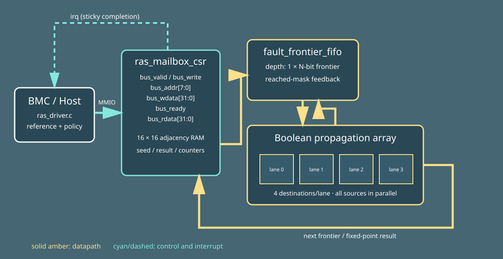
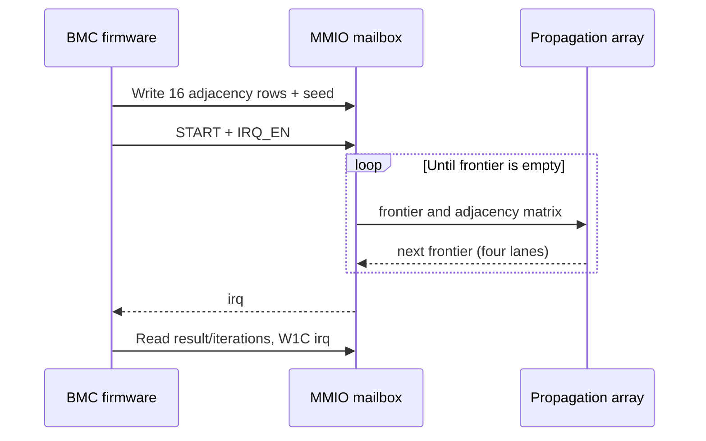

<!-- Author: Asresh -->


# Day 29: RAS Fault Graph Engine

Datacenter firmware receives telemetry from GPUs, retimers, memory controllers, power rails, and links. A single physical fault can fan out into many symptoms. Walking a dependency graph in scalar BMC firmware adds branch-heavy latency precisely when the platform is already degraded. This project accelerates the repeated Boolean graph expansion used to identify every component reachable from one or more injected fault sources.

Software owns platform policy: it builds the directed dependency graph, writes all 16 adjacency rows, chooses the seed mask, rings the doorbell, services the completion interrupt, and compares the result with an independent reference. Hardware owns the regular operation: four parallel lanes evaluate four destinations each against every active frontier source, then feed a frontier register until the reachable set reaches a fixed point.





## Register map

| Offset | Name | Access | Description |
|---:|---|---|---|
| `0x00` | CTRL | R/W | bit 0 START, bit 1 IRQ_EN, bit 2 BUSY, bit 3 IRQ_PENDING/W1C |
| `0x04` | SEED | R/W | Initial 16-node fault mask |
| `0x08` | ROW_INDEX | R/W | Adjacency row selector |
| `0x0c` | ROW_DATA | R/W | Selected 16-bit outgoing-edge mask |
| `0x10` | RESULT | R | Reachable-component mask |
| `0x14` | ITERATIONS | R | Boolean propagation passes |
| `0x18` | VISITED_COUNT | R | Population count of RESULT |
| `0x1c` | REQUESTS | R | Completed/issued graph counter |
| `0x20` | CAPS | R | `RA`, node count, four lanes |

## Build and run

```sh
make sim
make check
make synth
```

## Measured results

| Metric | Result |
|---|---:|
| Graphs | 320 |
| End-to-end cycles | 35380 |
| Throughput | 0.009045 graphs/clock |
| Average doorbell-to-interrupt latency | 7.887500 cycles |
| Scalar baseline | 517920 cycles |
| Speedup | 14.638779x |
| Mismatches | 0 |

The Icarus testbench drives the real mailbox pins with randomized host gaps. It checks 320 graphs (7 directed cases plus 313 deterministic random cases), including isolated nodes, a 16-node chain, all-to-all fanout, self-loops, cycles, multi-seed and fully seeded masks. It checks the exact closure, pass count, population count, request telemetry, completion IRQ and W1C acknowledgement. `make check` regenerates all vectors under AddressSanitizer and UndefinedBehaviorSanitizer. The scalable four-nodes-per-lane structure also elaborates cleanly at 8, 12, and 16 nodes. Icarus 13 runs simulation; because Yosys is unavailable here, `make synth` performs synthesis-oriented elaboration with the same Icarus-compatible RTL accepted by Icarus 12.

## Use cases

- BMC fault isolation for GPU servers using MCTP/PLDM telemetry.
- PCIe switch, retimer, and accelerator dependency blast-radius analysis.
- Memory RAS error-injection campaigns that map one source to downstream symptoms.
- Automotive zonal controllers that isolate power or network fault propagation.
- Factory test systems that rapidly classify failing board-level dependency chains.

The project is inspired by NVIDIA's [Senior Firmware Engineer – CSP Engagements](https://nvidia.wd5.myworkdayjobs.com/en-US/NVIDIAExternalCareerSite/job/Senior-Firmware-Engineer---CSP-Engagements_JR1999599) role, which emphasizes RAS, error injection, fault isolation, observability, device drivers, and hardware/software co-design.
