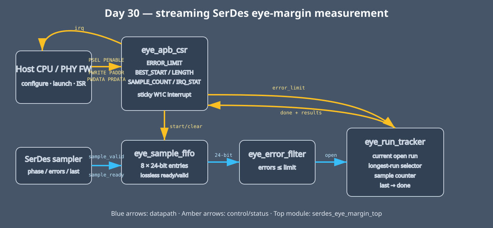

<!-- Author: Asresh -->


# Day 30: SerDes [Serializer/Deserializer] Eye Margin Engine

<!-- readability-guide:start -->
## Plain-language overview

A high-speed serial receiver must find the sampling phases with acceptably low error counts. Software chooses the error policy and sweeps the physical link; hardware buffers the measurements and finds the earliest widest passing interval in one streaming pass.

## Abbreviation guide

Every shortened technical term used in this README is expanded below for quick reference:

- **APB** [Advanced Peripheral Bus]
- **BER** [Bit Error Rate]
- **COUNT** [Count]
- **CSR** [Control and Status Register]
- **CXL** [Compute Express Link]
- **EN** [Enable]
- **EYE0** [Eye Monitor Version 0 Signature]
- **FIFO** [First-In, First-Out]
- **ID** [Identifier]
- **IRQ** [Interrupt Request]
- **ISR** [Interrupt Service Routine]
- **PCIe** [Peripheral Component Interconnect Express]
- **PHY** [Physical Layer]
- **RO** [Read-Only]
- **RTL** [Register-Transfer Level]
- **RW** [Read/Write]
- **RW1C** [Read/Write One to Clear]
- **SerDes** [Serializer/Deserializer]
- **US** [United States]
- **W1C** [Write One to Clear]
<!-- readability-guide:end -->

## Problem

High-speed PHY [Physical Layer] firmware must sweep sampling phase, collect bit-error counts, find the widest contiguous passing region, and interrupt the driver quickly enough to repeat that characterization across lanes, voltages, temperatures, and link speeds. A scalar firmware loop spends cycles loading samples, branching on the error threshold, maintaining run state, and polling for completion. That work is also timing-sensitive: software service jitter should not stall the sampler.

This project follows the current [NVIDIA Senior Firmware Engineer, Physical Layer Devices – Networking](https://nvidia.wd5.myworkdayjobs.com/en-US/NVIDIAExternalCareerSite/job/Senior-Firmware-PHY-Verification-Engineer_JR2002026) emphasis on Physical Layer/link firmware, portable verification infrastructure, automation, and end-to-end hardware/software integration.

## Hardware/software split

Hardware owns the cycle-by-cycle path: an eight-entry FIFO [First-In, First-Out] buffer absorbs sampler/firmware jitter, a threshold comparator classifies each phase point, and a streaming run tracker selects the earliest widest contiguous open interval in one pass. Firmware owns policy: it chooses the BER [Bit Error Rate]/error limit, sequences Physical Layer phase settings, launches a scan, handles the completion interrupt, and decides whether the measured eye is sufficient for the requested link mode.



The transaction flow is:

```text
Firmware          APB [Advanced   FIFO [First-In, First-Out]   ISR [Interrupt
                  Peripheral Bus] /filter/tracker               Service Routine]
                  CSR [Control and
                  Status Register]
   | limit, START    |                       |                   |
   |---------------->| clear scan state      |                   |
   | phase/error stream -------------------->| one point/clock   |
   |                 |<-- best span + done --|                   |
   |                 |-----------------------------------------> IRQ [Interrupt Request]
   |<----------------| read results; W1C [Write One to Clear]    |
```

## RTL [Register-Transfer Level] organization

- `serdes_eye_margin_top.v` wires the Advanced Peripheral Bus control plane to the streaming datapath.
- `eye_sample_fifo.v` is a parameterized 24-bit, eight-entry ready/valid elasticity First-In, First-Out buffer.
- `eye_error_filter.v` classifies a sample as open when `error_count <= ERROR_LIMIT`.
- `eye_run_tracker.v` tracks current and best contiguous passing runs and finishes on `sample_last`.
- `eye_apb_csr.v` implements configuration, result telemetry, device identification, and a sticky Write One to Clear completion interrupt.

## APB [Advanced Peripheral Bus] register map

| Offset | Name | Access | Description |
|---:|---|---|---|
| `0x00` | CONTROL | RW [Read/Write] | bit 0 START (self-clearing), bit 1 IRQ_EN [Interrupt Request Enable] |
| `0x04` | STATUS | RO [Read-Only] | DONE, BUSY, IRQ_PENDING [Interrupt Request Pending] |
| `0x08` | ERROR_LIMIT | RW [Read/Write] | maximum passing error count |
| `0x0c` | BEST_START | RO [Read-Only] | first phase of earliest widest open run |
| `0x10` | BEST_LENGTH | RO [Read-Only] | open-run length in samples |
| `0x14` | SAMPLE_COUNT | RO [Read-Only] | points consumed in the completed scan |
| `0x18` | FIFO_LEVEL [First-In, First-Out Level] | RO [Read-Only] | queued sample count |
| `0x1c` | IRQ_STATUS [Interrupt Request Status] | RW1C [Read/Write One to Clear] | completion pending; write bit 0 to clear |
| `0x20` | DEVICE_ID [Device Identifier] | RO [Read-Only] | `0x45594530` (`EYE0`) |

## Build and run

```sh
make sim
make synth
make check
```

`make sim` [simulation] builds the driver/model/baseline, regenerates deterministic vectors, and runs the pin-level Advanced Peripheral Bus plus ready/valid testbench. `make check` rebuilds the C [C programming language] components with AddressSanitizer and UndefinedBehaviorSanitizer. `make synth` [synthesis] uses Yosys when available and otherwise performs synthesis-oriented Icarus elaboration.

## Measured results

Measured with Icarus Verilog 13 over 320 points in four scans, with deterministic randomized source bubbles:

| Metric | Measured value |
|---|---:|
| Differential vectors | 320 |
| Scan jobs | 4 |
| End-to-end cycles | 426 |
| Sustained throughput | 0.751174 samples/clock |
| Mean first-sample-to-interrupt latency | 106.250 cycles |
| Scalar baseline | 3,592 cycles |
| Speedup | 8.432× |
| Mismatches | 0 |

The scalar baseline charges 18 cycles of scan setup plus 11 cycles per point for loads, comparison, branch, run bookkeeping, and best-span bookkeeping. It is implemented separately in `sw/eye_baseline.c`.

## Verification

The testbench checks 320 vectors and four whole-scan results against the independent C programming language reference: 288 full-range pseudo-random 16-bit error counts plus 32 directed points. Directed coverage includes bounded openings, exact-threshold points (inclusive comparison), alternating pass/fail points, single-point runs, and equal-length runs that verify the first-winner tie rule. It also checks Advanced Peripheral Bus-programmed limits, sample counts, completion timeout, result registers, and the interrupt path. Zero mismatches is required; the Makefile never filters or relaxes a failing test.

## System use cases

- PCIe [Peripheral Component Interconnect Express], Ethernet, NVLink, CXL [Compute Express Link], and chiplet-link manufacturing margin scans.
- Boot-time receiver phase calibration and lane repair decisions.
- Thermal/voltage drift monitoring in datacenter switches and accelerators.
- Automated pre-silicon Physical Layer firmware validation with reproducible pass/fail policy.
- Field diagnostics that report eye width before a link becomes uncorrectable.

## Author

Asresh
