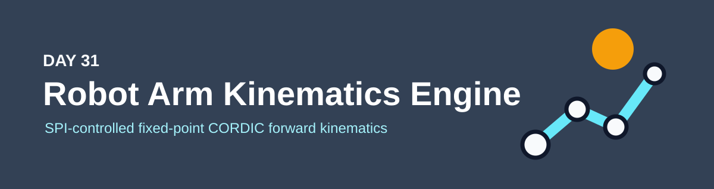
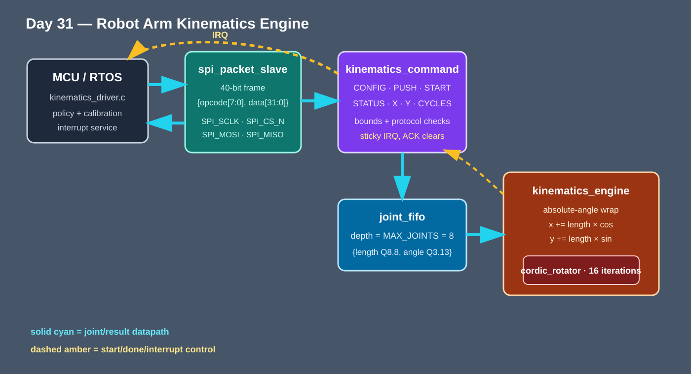

<!-- Author: Asresh -->


# Day 31: Robot Arm Kinematics Engine

## Plain-language overview

A robot controller repeatedly asks: “Given these joint angles and link lengths, where is the hand now?” Software is good at calibration, safety policy and choosing the next motion; this block moves the repetitive trigonometry and coordinate accumulation into a deterministic hardware engine, then reports completion through an interrupt.

This project was motivated by NVIDIA's current [Full-Stack Solution Engineer — Sensorized Human](https://nvidia.wd5.myworkdayjobs.com/en-US/NVIDIAExternalCareerSite/job/Full-Stack-Solution-Engineer---Sensorized-Human_JR2018291) role, which explicitly joins tactile-sensor firmware, wearable exoskeleton hardware/software co-design, and the kinematics mapping between human hands and robot end effectors. NVIDIA's [Principal SoC Architect, Robotics and Automotive](https://nvidia.wd5.myworkdayjobs.com/en-US/NVIDIAExternalCareerSite/job/Principal-SoC-Architect--Robotics-and-Automotive_JR2021367) role reinforces the need for low-latency robotic spatial-computing hardware with measurable real-time behavior.

## Why this partition

Hardware owns the fixed, high-rate path: angle wrapping, sixteen CORDIC microrotations per joint, fixed-point link projection, coordinate accumulation, queueing and exact completion timing. Firmware owns changing policy: it validates the arm description, applies calibration, submits joints over SPI, sleeps or does other work while the engine runs, handles the IRQ and decides how the result feeds control or safety logic. This keeps mechanism-specific choices out of RTL while removing serial sine/cosine work from the MCU's real-time budget.



## How the files fit together

```text
kinematics_driver.c -> SPI frame -> kinematics_command -> joint_fifo
                                                        |
                                                        v
                                              kinematics_engine
                                                        |
                                                        v
                                                 cordic_rotator
                                                        |
                                 result registers + sticky IRQ -> firmware
```

- `spi_packet_slave.v` shifts one 40-bit mode-0 frame and buffers the response for the following frame.
- `kinematics_command.v` decodes commands, rejects invalid counts/full-queue writes, exposes results, and owns the sticky interrupt.
- `joint_fifo.v` stores up to `MAX_JOINTS` `{length, angle}` records so SPI transfer timing cannot disturb compute timing.
- `kinematics_engine.v` walks the chain, converts relative joint angles to wrapped absolute headings, and accumulates X/Y in Q24.8.
- `cordic_rotator.v` produces Q1.15 sine/cosine using a parameterized iterative shift/add datapath; no multiplier or floating-point unit is needed for the trigonometry.
- `sw/kinematics_driver.c` performs reset, configuration, data movement, interrupt polling, result reads and interrupt acknowledgement with bounded timeouts.
- `sw/kinematics_model.c` is the bit-exact reference; `sw/kinematics_baseline.c` is the software-only floating-point implementation and documented cycle model.

## SPI command/register map

Each transaction is `{opcode[7:0], data[31:0]}` on `SPI_MOSI`; read data tagged with the requested opcode is returned on `SPI_MISO` during the next transaction.

| Opcode | Name | Direction | Data / effect |
|---:|---|---|---|
| `0x01` | RESET | Write | Clear FIFO, engine state, result and IRQ |
| `0x10` | CONFIG | Write | `[8]` IRQ enable, `[7:0]` joint count (1–8) |
| `0x20` | PUSH | Write | `[31:16]` unsigned Q8.8 length, `[15:0]` signed Q3.13 relative angle |
| `0x30` | START | Write | Launch only after all configured joints are queued |
| `0x40` | STATUS | Read | FIFO-full, busy, done, IRQ, engine error and protocol error |
| `0x41` | X | Read | Signed Q24.8 end-effector X coordinate |
| `0x42` | Y | Read | Signed Q24.8 end-effector Y coordinate |
| `0x43` | CYCLES | Read | START-to-completion engine cycles |
| `0x44` | JOINTS | Read | Number of joints retired |
| `0x50` | IRQ_ACK | Write | Clear the sticky completion interrupt |

## Build and run

```bash
make check   # UBSan + ASan host/model/baseline gate and vector regeneration
make sim     # 320-chain differential pin-level SPI simulation
make synth   # Yosys synthesis, or Icarus elaboration fallback
```

## Measured results

Measured with Icarus Verilog 13.0. Yosys was not installed, so `make synth` used the documented Icarus synthesis-oriented elaboration fallback. The 4-, 8-, and 16-joint parameter sets all elaborate successfully.

| Metric | Measured value |
|---|---:|
| Kinematic chains | 320 |
| Joint vectors | 1,744 |
| SPI end-to-end cycles | 1,065,360 |
| CORDIC datapath throughput | 0.052632 joints/clock (1 joint / 19 clocks) |
| Mean START-to-interrupt latency | 103.550 cycles |
| Scalar software baseline | 10,592,000 cycles |
| End-to-end speedup | 9.942x |
| Mismatches | 0 |

The end-to-end number includes every bit of every CONFIG, PUSH, START, result-read and IRQ-acknowledge SPI frame. The software baseline charges 400 dispatch/control cycles plus 6,000 cycles per joint for serial floating-point angle handling, sine, cosine, two multiplies and accumulation; that formula is implemented in `kinematics_baseline.c`, not inserted by the testbench.

## What was verified

The testbench drives the real `SPI_SCLK`, `SPI_CS_N`, `SPI_MOSI` and `SPI_MISO` pins. It covers 16 directed chains (zero link, ±π/2, ±π, one-LSB angles, maximum Q8.8 lengths, alternating turns and full eight-joint chains) plus 304 deterministic full-range random chains. Every X/Y result is compared against the sanitizer-checked fixed-point C reference, every retired-joint count is checked, completion must arrive before a hard timeout, response opcodes must match, and zero mismatches are required. The CORDIC issue angle is registered with the FIFO pop so the next joint cannot replace an in-flight command.

## Use cases in the larger system

- A wearable teleoperation exoskeleton can translate finger-joint sensors into fingertip poses before retargeting motion to a different robot hand.
- A collaborative robot can run forward-kinematics safety envelopes at the motor-control rate without consuming the MCU's floating-point budget.
- A prosthetic or rehabilitation device can compute limb endpoint position locally while firmware concentrates on calibration and patient-specific control policy.
- A factory manipulator can place one engine beside each low-cost joint controller and use SPI plus IRQ without requiring a high-end application processor.

## Abbreviation guide

- SPI [Serial Peripheral Interface]
- MCU [Microcontroller Unit]
- RTOS [Real-Time Operating System]
- IRQ [Interrupt Request]
- CORDIC [Coordinate Rotation Digital Computer]
- RTL [Register-Transfer Level]
- FIFO [First-In, First-Out]
- Q8.8 / Q3.13 / Q1.15 / Q24.8 [Fixed-point formats with the stated integer and fractional bit counts]
- UBSan [UndefinedBehaviorSanitizer]
- ASan [AddressSanitizer]

MIT License. Copyright Asresh.
