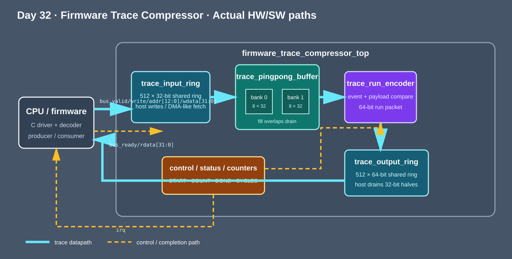
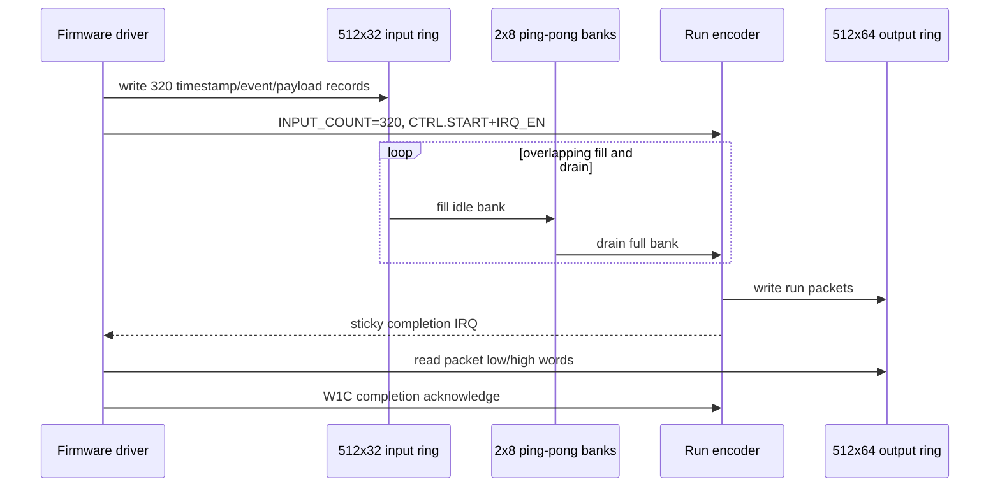

<!-- Author: Asresh -->


# Day 32: Firmware Trace Compressor

Small embedded processors produce boot, power, clock, reset, and fault traces exactly when their memory bandwidth is most constrained. This project moves the repetitive part—finding adjacent identical event/payload pairs and packing them into runs—into hardware. Firmware still decides what to trace, writes the shared producer ring, starts a bounded job, handles the completion interrupt, drains the consumer ring, and reconstructs or uploads the packets.

The project is inspired by NVIDIA's [Senior Firmware Engineer role](https://nvidia.wd5.myworkdayjobs.com/en-US/NVIDIAExternalCareerSite/job/Senior-Firmware-Engineer_JR2019234) (listed at up to $356,500 base), which calls out boot logs, hardware traces, MMIO [Memory-Mapped Input/Output], interrupts, low-level C, and debugging hardware/software boundary failures in Tegra SoCs [Systems on Chip]. The implementation is a portfolio-scale version of that boundary: a device driver and a deterministic trace accelerator with negative, corner, sanitizer, and pin-level protocol checks.

## Big picture and hardware/software split

Firmware understands product policy: which signals matter, when capture is allowed, how a trace is interpreted, and where it is sent. Hardware handles the uniform hot loop: overlap trace-ring reads with encoding, compare every record against the active run, emit a fixed packet on a change, and account exact cycles. This keeps policy easy to update while removing per-record branches and stores from an already-busy control processor.





## What each file does

The data path has four independently parameterized submodules plus the top-level controller:

- `rtl/trace_input_ring.v` is the 32-bit host-producer ring. Host writes and accelerator reads use separate ports.
- `rtl/trace_pingpong_buffer.v` contains two eight-record banks. While the encoder drains one bank, the prefetch side fills the other.
- `rtl/trace_run_encoder.v` compares `{event_id,payload}`, tracks first/last timestamps and run length, and safely handles a final record that starts a new run.
- `rtl/trace_output_ring.v` stores 64-bit packets while exposing two ordinary 32-bit host reads.
- `rtl/firmware_trace_compressor_top.v` owns MMIO decode, bank scheduling, counters, sticky status, errors, and the IRQ [Interrupt Request].
- `sw/trace_driver.c` is the portable driver: validate bounds, load the ring, configure/start, poll with a timeout, handle status, read results, and acknowledge completion.
- `sw/trace_model.c` is the bit-exact reference. `sw/trace_baseline.c` counts the scalar load/compare/branch/store path. `sw/trace_host.c` generates deterministic tests and exercises the driver through a mock register backend before emitting vectors.
- `tb/firmware_trace_compressor_tb.sv` performs all transfers through the real RTL bus pins and compares every output bit against the C reference.

Each 32-bit input is `{timestamp[15:0], event_id[7:0], payload[7:0]}`. Each 64-bit packet is `{first_timestamp[15:0], last_timestamp[15:0], event_id[7:0], payload[7:0], run_length[15:0]}`. Eight-byte packets beat four-byte raw records for runs of three or more; this workload produces 88 packets from 320 records, reducing 1,280 trace bytes to 704 bytes (45% fewer bytes).

## Register and shared-memory map

| Address | Name | Access | Meaning |
|---:|---|---|---|
| `0x0000` | `CTRL` | RW | Bit 0 START, bit 1 IRQ enable, bit 2 W1C [Write One to Clear] status |
| `0x0004` | `STATUS` | RO | Bit 0 IRQ, bit 1 busy, bit 2 done, bit 3 invalid-count error |
| `0x0008` | `INPUT_COUNT` | RW | Number of valid producer-ring records, 1–512 |
| `0x000c` | `OUTPUT_COUNT` | RO | Number of emitted 64-bit packets |
| `0x0010` | `CYCLES` | RO | Exact accelerator-busy clocks |
| `0x0014` | `CAPS` | RO | Bank/ring capability signature |
| `0x0100–0x08fc` | input ring | WO | 512 × 32-bit raw records |
| `0x1000–0x1ffc` | output ring | RO | 512 × 64-bit packets, low word then high word |

`bus_valid`, `bus_write`, `bus_addr[12:0]`, and `bus_wdata[31:0]` are requests; `bus_ready` and `bus_rdata[31:0]` are responses. The ring windows are inaccessible to the accelerator until START and host writes are rejected while it is busy, so producer ownership cannot change mid-job.

## Build and run

```bash
make sw       # build the driver, reference, baseline, and vector generator
make sim      # regenerate vectors and run the self-checking RTL simulation
make check    # rebuild/regenerate under AddressSanitizer + UndefinedBehaviorSanitizer
make synth    # Yosys synthesis, or synthesis-oriented Icarus elaboration fallback
make metrics  # write the measured results table
```

## Measured results

Measured with Icarus Verilog 13.0 from the START write through the sticky completion interrupt. The C scalar baseline is emitted by the checked baseline implementation for the same 320 records; it counts the sequential unpack, compare, branch, run update, packet assembly, and stores.

| Metric | Measured value |
|---|---:|
| Test records | 320 (315 seeded-random + 5 directed) |
| Compressed packets | 88 |
| Accelerator busy cycles | 329 |
| START-to-IRQ latency | 331 cycles |
| Accelerator throughput | 0.972644 records/clock |
| Software-only scalar baseline | 7,474 cycles |
| End-to-end speedup | 22.580060× |
| Output mismatches | 0 |

## What was verified

- Exact packet count and all 64 output bits for every run boundary.
- Timestamp wrap (`0x0000` to `0xffff`), all-one records, adjacent identical extremes, zero fields, single-record and final-boundary behavior through the generated corpus.
- Shared-ring MMIO writes/reads, START, busy/done status, bounded timeout behavior in the C driver, sticky IRQ, and W1C acknowledgement.
- Ping-pong bank transitions across 40 eight-record chunks, including the final partial/full-bank boundary.
- ASan [AddressSanitizer] and UBSan [UndefinedBehaviorSanitizer] clean vector generation; no signed left shifts, signed overflow, unbounded strings, unchecked pointers, or hardcoded credentials.
- Default 512/8 geometry plus synthesis-oriented elaboration for alternate 256/4 and 512/16 ring/bank sizes.

## Use cases

- Boot and secure-monitor trace capture where early firmware has little SRAM [Static Random-Access Memory].
- BPMP [Boot and Power Management Processor] clock, reset, voltage-rail, and power-gating transition logs.
- Automotive and robotics fault histories that must survive long field runs in a small retention buffer.
- Manufacturing diagnostics that collect repetitive register/state transitions before a host is available.
- Always-on coprocessor observability, where reducing trace traffic also reduces memory and interconnect energy.

## Abbreviation guide

- ASan [AddressSanitizer] — detects invalid memory accesses while the C tools run.
- BPMP [Boot and Power Management Processor] — the embedded controller coordinating Tegra boot and power.
- IRQ [Interrupt Request] — the completion signal from hardware to firmware.
- MMIO [Memory-Mapped Input/Output] — registers and ring windows addressed like memory.
- RTL [Register-Transfer Level] — the cycle-accurate hardware implementation.
- SoC [System on Chip] — processors, memory interfaces, and peripherals integrated on one chip.
- SRAM [Static Random-Access Memory] — on-chip storage used for trace rings and staging banks.
- UBSan [UndefinedBehaviorSanitizer] — detects invalid C operations such as signed overflow.
- W1C [Write One to Clear] — status acknowledgement by writing a one to the clear bit.

## Author and license

Asresh. MIT licensed; copyright Asresh.
