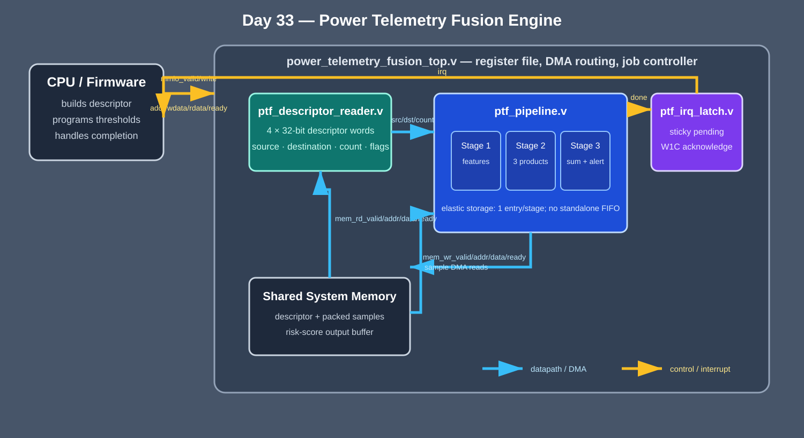
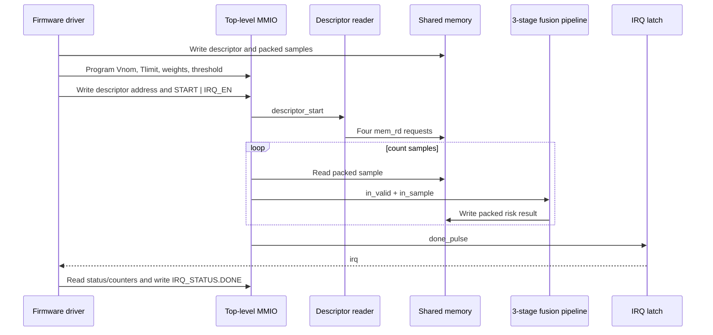

<!-- Author: Asresh -->


# Day 33: Power Telemetry Fusion Engine

Modern accelerators expose voltage, current, and temperature samples, but small management processors still spend cycles unpacking each record, checking limits, weighting three signals, and deciding whether the sample deserves an alert. This project implements that repetitive, parallel arithmetic as a descriptor-driven DMA engine while firmware retains policy, buffer ownership, timeout handling, and interrupt service.

The design follows current power-management and silicon-observability work: recent NVIDIA roles explicitly call for telemetry frameworks, firmware hooks, DMA/register/interrupt contracts, workload characterization, and low-power feature validation. The project is useful preparation for firmware, device-driver, post-silicon validation, platform power, and hardware/software co-design roles.

## Career alignment

- NVIDIA's [Senior Post Silicon Low Power Integration Engineer](https://nvidia.wd5.myworkdayjobs.com/en-us/nvidiaexternalcareersite/job/us-ca-santa-clara/senior-post-silicon-low-power-integration-engineer_jr2014458) description connects power validation with counters, telemetry frameworks, firmware hooks, workload characterization, and cross-team silicon bring-up.
- NVIDIA's [Senior Memory Subsystem Firmware Engineer](https://nvidia.wd5.myworkdayjobs.com/en-US/NVIDIAExternalCareerSite/job/Senior-Memory-Subsystem-Firmware-Engineer_JR2020258) description emphasizes hardware/software co-development, embedded C/C++, low-power states, telemetry, RAS [Reliability, Availability, and Serviceability], and C models for pre-silicon validation.
- NVIDIA's [Senior RAS and Power Management Firmware Architect](https://nvidia.wd5.myworkdayjobs.com/en-US/NVIDIAExternalCareerSite/job/Israel-Yokneam/Senior-RAS-and-Power-Management-Firmware-Architect_JR2018727) description calls out register, interrupt, telemetry, debug, and firmware-to-hardware contracts across accelerators and data-center platforms.

This project turns those themes into a compact portfolio artifact: the register/DMA/interrupt boundary is executable, the software reference is independent, and the telemetry policy remains configurable rather than frozen into RTL.

## What it computes

Each 32-bit input packs `{temperature[7:0], current_mA[11:0], voltage_mV[11:0]}`. Firmware supplies a nominal voltage `Vnom`, a temperature limit `Tlimit`, three unsigned weights, and an alert threshold. Hardware computes:

```text
droop = max(Vnom - voltage, 0)
hot   = max(temperature - Tlimit, 0)
risk  = droop × Wdroop + current × Wcurrent + hot × Wthermal
result[30:0] = saturating risk score
result[31]   = (risk >= alert threshold)
```

Voltage droop, current draw, and excess temperature are physically different signals. Firmware chooses their policy-dependent scaling; hardware performs the high-rate per-sample fusion.

## Hardware/software split

Hardware owns the regular work: descriptor fetch, sample reads, parallel feature extraction, three products, reduction, comparison, result writes, counters, and completion interrupt. A three-stage elastic pipeline holds one record per stage and freezes as a unit if the memory write channel applies backpressure, so no sample can be dropped or reordered.

Software owns the work that changes by product or deployment: buffer allocation, descriptor construction, nominal operating point, weights, alert threshold, timeout policy, completion acknowledgement, and interpretation of alerts. `sw/power_driver.c` is a portable register-level driver, `sw/power_model.c` is the independent bit-exact reference, `sw/power_baseline.c` models scalar MCU work, and `sw/power_host.c` builds all directed and random vectors while exercising the driver.



## Module guide

- `power_telemetry_fusion_top.v` implements the MMIO register file, job state machine, DMA read/write routing, validation, and telemetry.
- `ptf_descriptor_reader.v` fetches four 32-bit descriptor words and presents stable source, destination, count, and flags fields.
- `ptf_pipeline.v` is the three-stage elastic datapath: feature extraction, parallel weighting, then sum/threshold packing.
- `ptf_irq_latch.v` holds completion until firmware performs a write-one-to-clear acknowledgement.

## Transaction flow



## DMA descriptor

The descriptor is four naturally aligned 32-bit words in shared memory.

| Word | Field | Meaning |
|---:|---|---|
| 0 | `src_addr` | Byte address of packed input samples |
| 1 | `dst_addr` | Byte address of 32-bit result records |
| 2 | `count[15:0]` | Number of samples, from 1 through `MAX_SAMPLES` |
| 3 | `flags` | Reserved; must be zero |

Zero count, excessive count, unaligned addresses, or nonzero flags end the job with sticky error status and a completion interrupt. No destination write occurs for a rejected descriptor.

## Register map

| Offset | Name | Access | Description |
|---:|---|---|---|
| `0x00` | `CTRL` | R/W | bit 0 START (accepted only while idle), bit 1 IRQ enable |
| `0x04` | `STATUS` | R | bit 0 busy, bit 1 IRQ pending, bit 2 descriptor error |
| `0x08` | `DESC_ADDR` | R/W | Byte address of the four-word descriptor |
| `0x0c` | `CYCLES` | R | Active-job cycle counter |
| `0x10` | `SAMPLES` | R | Number of results written |
| `0x14` | `VNOM` | R/W | Nominal voltage in millivolts, 12 bits |
| `0x18` | `TLIMIT` | R/W | Signed 8-bit temperature limit in degrees Celsius |
| `0x1c` | `WEIGHTS` | R/W | `{8'b0, Wthermal, Wcurrent, Wdroop}` |
| `0x20` | `THRESHOLD` | R/W | 31-bit alert threshold |
| `0x24` | `IRQ_STATUS` | R/W1C | bit 0 pending/done; write 1 to acknowledge |
| `0x28` | `VERSION` | R | `0x0001_0000` |

## Build and run

Requirements are a C11 compiler, GNU Make, and Icarus Verilog 12 or newer.

```bash
make check   # ASan/UBSan rebuild and vector regeneration
make sim     # compile software + RTL and run differential verification
make synth   # Yosys synthesis, or Icarus elaboration if Yosys is absent
make clean
```

On the development machine, Icarus Verilog 13 performed simulation and synthesis-oriented elaboration. Yosys was not installed, so `make synth` used the documented Icarus fallback. The RTL and testbench avoid constructs unsupported by Icarus 12 in CI.

## Measured results

The numbers are emitted into `results/sim.log` by `make sim` and recorded in `results/metrics.md`. Randomized DMA read and write readiness is active throughout the measured job.

| Metric | Measured value |
|---|---:|
| Differential vectors | 320 (8 directed + 312 seeded random) |
| End-to-end START-to-IRQ cycles | 554 |
| Accelerator busy cycles | 553 |
| Sustained throughput | 0.578662 samples/clock |
| Pipeline latency | 3 cycles from first accepted read to first accepted write |
| Scalar firmware baseline | 15,058 cycles |
| End-to-end speedup | 27.180505× |
| Mismatches | 0 |

The scalar baseline charges 18 cycles for setup/descriptor checks and 47 cycles per record for load, unpacking, comparisons, three multiplies, reduction, thresholding, and store on a small embedded processor. It runs the same independent reference used to create the expected results. Speedup is `15058 / 554` and includes descriptor fetch, randomized shared-memory stalls, pipeline fill/drain, and interrupt completion.

## What was verified

The 320-vector differential set includes zero load, maximum current, both signed temperature extremes, voltage above and below nominal, the exact temperature boundary, and the exact alert threshold neighborhood, followed by 312 deterministic pseudo-random samples. The pin-level testbench checks every DMA destination word against the C model, written-sample telemetry, three-cycle pipeline latency, busy/error status, sticky interrupt acknowledgement, invalid zero-count descriptor rejection, and a hard timeout. It reports zero mismatches.

`make check` recompiles the host, reference, baseline, and driver with AddressSanitizer [ASan] and UndefinedBehaviorSanitizer [UBSan], disables sanitizer recovery, and regenerates all vectors through that binary. Alternate `MAX_SAMPLES` settings are elaborated separately during the project audit.

## Use cases

- A baseboard management controller can score GPU or CPU rail telemetry before exporting only actionable excursions through Redfish or platform logs.
- A mobile system-on-chip power controller can combine regulator droop, current, and die temperature into a fast firmware-visible throttling hint.
- Post-silicon validation can replay captured power traces through the engine to flag workload/state transitions that violate a rail budget.
- A SmartNIC or data processing unit can monitor board power locally without spending embedded cores on every telemetry sample.
- An autonomous or orbital compute platform can generate a compact deterministic health signal when host access is intermittent.

## Abbreviation guide

- DMA [Direct Memory Access]: hardware reads and writes shared memory without the CPU copying each word.
- MMIO [Memory-Mapped Input/Output]: software controls hardware through addressed registers.
- IRQ [Interrupt Request]: the completion signal sent to firmware.
- W1C [Write One to Clear]: writing a one acknowledges and clears a sticky status bit.
- RTL [Register-Transfer Level]: synthesizable hardware logic described in Verilog.
- MCU [Microcontroller Unit]: the small embedded processor represented by the scalar baseline.
- ASan [AddressSanitizer] and UBSan [UndefinedBehaviorSanitizer]: compiler instrumentation used by `make check`.

## Author and license

Author: Asresh. Released under the repository's MIT license.
