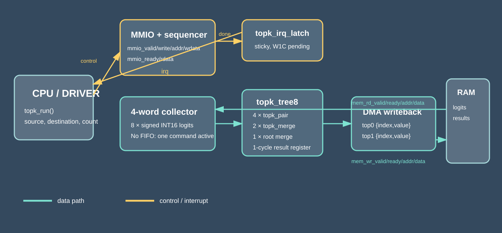
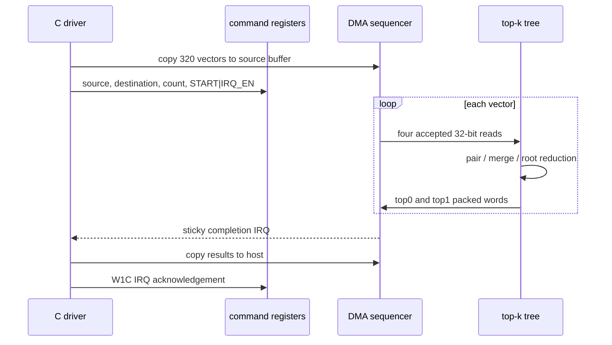

<!-- Author: Asresh -->


# Day 34: ML Top-K Command Engine

An inference runtime often receives a short vector of class logits and must identify the two best classes before it can schedule the next model stage. On a small control CPU, that means a branch-heavy serial scan; this project moves the predictable comparison work into a balanced hardware tree while software keeps ownership of buffers, command submission, timeout policy, and completion handling.

The design was motivated by Apple's August 2026 [Machine Learning System Software Engineer](https://jobs.apple.com/en-us/details/200677404/machine-learning-system-software-engineer) role, which calls out runtime-to-silicon co-design, registers, DMA, command queues, multi-model scheduling, and inference profiling. It is useful practice for Neural Processing Unit (NPU) driver, firmware, compiler-runtime, and accelerator-register work without pretending the selector is an entire NPU.

## What runs where

Software validates pointers and command sizes, copies 8-lane signed INT16 vectors into device memory, writes the source/destination/count registers, starts the command, polls with a timeout, copies results back, and clears the sticky interrupt. It also contains two independent algorithms: a compact golden model and an insertion-sort scalar baseline.

Hardware gathers four 32-bit words per vector, compares all eight logits through a three-level balanced tree, applies a deterministic lowest-index tie rule, writes two packed result words, advances to the next vector, and interrupts only after the last write is accepted. This split leaves policy and memory ownership in software and accelerates the regular, parallel part.





## RTL map

- `ml_topk_command_top.v`: MMIO register file, command validation, DMA address sequencing, progress/cycle telemetry.
- `topk_tree8.v`: balanced hierarchy and one-cycle output register.
- `topk_pair.v`: deterministic two-lane leaf comparator.
- `topk_merge.v`: four-candidate internal merge network.
- `topk_irq_latch.v`: interrupt enable, sticky pending state, and write-one-to-clear behavior.

## Register map

| Offset | Name | Access | Meaning |
|---:|---|---|---|
| `0x00` | CONTROL | R/W | bit 0 START, bit 1 IRQ_EN |
| `0x04` | STATUS | R | bit 0 BUSY, bit 1 IRQ_PENDING, bit 2 ERROR |
| `0x08` | SOURCE | R/W | byte address of packed 8×INT16 input vectors |
| `0x0c` | DESTINATION | R/W | byte address of two 32-bit result words per vector |
| `0x10` | COUNT | R/W | vector count, 1 through `MAX_VECTORS` |
| `0x14` | CYCLES | R | active command cycles |
| `0x18` | IRQ | R/W1C | pending status; write 1 to acknowledge |
| `0x1c` | PROGRESS | R | zero-based vector index |
| `0x20` | CAPS | R | 8 lanes, two outputs, revision 1 |

Each result word is `{13'b0, class_index[2:0], signed_value[15:0]}`. Equal logits are ordered by the lower class index, making results reproducible across software and hardware.

## Build and run

```sh
make check   # ASan + UBSan rebuild and vector regeneration
make sim     # C generation, Icarus RTL simulation, differential checks
make synth   # Yosys when installed; Icarus synthesis-oriented elaboration here
```

## Measured results

| Metric | Result |
|---|---:|
| Test corpus | 320 vectors (8 directed + 312 seeded random) |
| START-to-IRQ | 3,464 cycles |
| Sustained throughput | 0.092379 vectors/clock |
| Final accepted read to first result-valid | 4 clocks |
| Scalar baseline | 51,595 cycles |
| End-to-end speedup | 14.894630x |
| Mismatches | 0 |

These values come from `make sim` with deterministic randomized `mem_rd_ready` and `mem_wr_ready` stalls. The scalar count is produced by the written insertion-sort baseline's target instruction-cycle accounting, not a claimed wall-clock benchmark.

## Verification

The testbench checks both returned scores and class indices for every vector, DMA addresses and write ordering through the memory image, sticky interrupt acknowledgement, progress, a rejected zero-length command, signed INT16 extrema, all-equal ties, duplicated maxima, ascending/descending vectors, and 312 full-range deterministic random vectors. `make check` regenerates the same vectors through the driver, golden model, and baseline with AddressSanitizer and UndefinedBehaviorSanitizer enabled.

## Where this fits

- Classification heads in embedded vision, audio-event, and sensor models.
- Mixture-of-Experts routing where firmware needs the strongest two expert scores.
- Beam-search pruning for compact on-device decoders.
- NPU bring-up and driver validation, where a small deterministic command engine makes DMA, register, timeout, and interrupt bugs observable before a larger accelerator is available.

## Abbreviations

- DMA [Direct Memory Access]
- IRQ [Interrupt Request]
- MMIO [Memory-Mapped Input/Output]
- NPU [Neural Processing Unit]
- RTL [Register-Transfer Level]
- W1C [Write One to Clear]

MIT License. Copyright Asresh.
