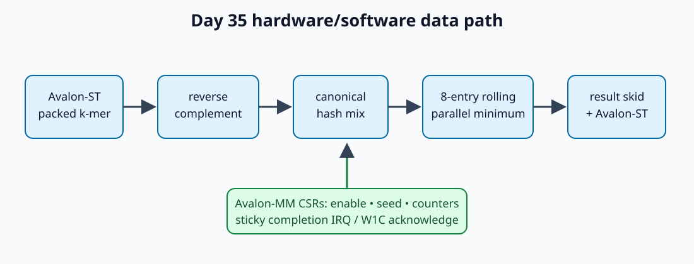

<!-- Author: Asresh -->
# Day 35 — Genomics Minimizer Stream Engine

Read mapping spends substantial CPU time converting DNA k-mers into canonical (strand-independent) hashes and selecting the smallest hash in each overlapping window. This project moves that deterministic front-end into a backpressure-safe streaming accelerator while software retains seed selection, packet ownership, timeout policy, and reference validation.

## Hardware/software partition

Software packs 16 bases into two bits each, configures the hash seed through Avalon-MM, and streams reads over Avalon-ST. Hardware computes the reverse complement, selects the canonical orientation, applies a fixed 32-bit mixing hash, and tracks the earliest minimum over the last eight k-mers. Every full window emits `{position, hash}`. End-of-packet raises a sticky interrupt; firmware acknowledges it write-one-to-clear.

## Architecture

The parameterized `kmer_revcomp` rewires and complements base pairs. `kmer_hash_mix` implements xor/shift/multiply mixing. `min_window` holds `WINDOW` hashes and performs a parallel unsigned minimum with earliest-position tie breaking. `minimizer_irq_latch` isolates completion state. `genomics_minimizer_top` supplies Avalon-MM CSRs, Avalon-ST flow control, counters, and packet semantics.

The entire datapath advances only when an ingress beat is accepted. A one-entry result register couples ingress readiness to downstream readiness, so output backpressure cannot corrupt the rolling window.

## Register map

| Word | Name | Description |
|---:|---|---|
| 0 | CTRL | bit 0 enable; bit 1 clear counters/state |
| 1 | SEED | 32-bit hash seed |
| 2 | STATUS | enable, result-valid, interrupt |
| 3 | IRQ | write bit 0 to acknowledge |
| 4 | ACCEPTED | accepted k-mer beats |
| 5 | EMITTED | consumed minimizer results |

## Verification and measured results

`make sim` runs 320 k-mers: four directed corners (all-A, all-T, a patterned k-mer, and its reverse complement) plus 316 deterministic randomized values. Ingress bubbles and output backpressure are randomized. The testbench independently recomputes reverse complements, hashes, every eight-entry window minimum, earliest ties, counters, and completion IRQ.

Measured with Icarus Verilog 13.0:

- 320 accepted k-mers and 313 checked minimizers in 795 simulated clocks
- 0.402516 accepted k-mers/clock and 0.393711 minimizers/clock under randomized stalls
- zero mismatches
- C reference/driver build passed with warnings-as-errors and ASan/UBSan
- Yosys was unavailable; `make synth` therefore ran synthesis-oriented Icarus elaboration. No area or timing figure is claimed.

Run `make check`, `make sim`, and `make synth`.

## Uses

The engine fits FPGA read mappers, nanopore preprocessing pipelines, metagenomic classifiers, and storage-side genomic indexing where deterministic minimizers reduce the number of candidate reference locations sent to software.
