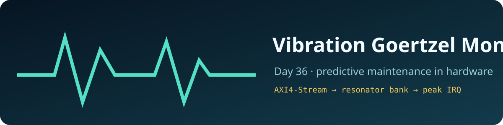
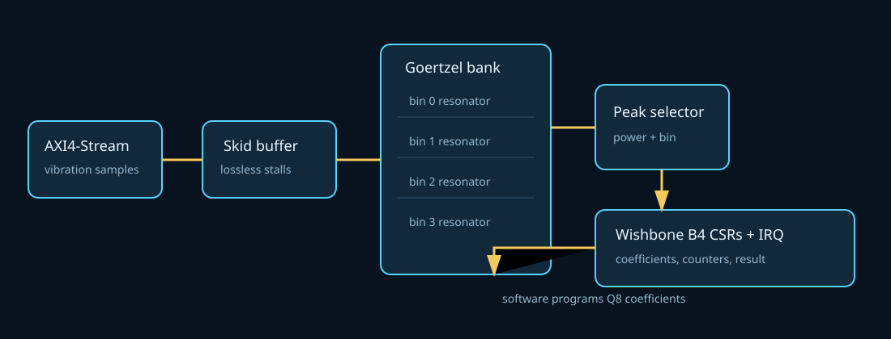
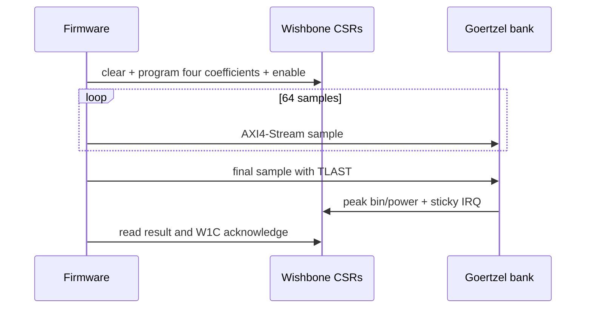

<!-- Author: Asresh -->
# Day 36 — Vibration Goertzel Monitor

Motors, pumps, fans, and gearboxes often reveal a defect as energy at a small set of characteristic frequencies. A host FFT is excessive when firmware needs only those bands. This project implements a programmable four-bin Goertzel bank that evaluates selected vibration frequencies as samples arrive, then reports the strongest bin through memory-mapped registers and a completion interrupt.

## Hardware/software partition

Software chooses Q8 resonator coefficients from the sample rate and mechanical fault frequencies, clears stale telemetry, enables acquisition, and supplies an independent bit-exact reference. Hardware accepts signed samples over AXI4-Stream, preserves them through a skid buffer, advances four second-order resonators in parallel, evaluates their powers at frame end, and exposes the earliest maximum through Wishbone B4 CSRs. The interrupt is sticky until firmware acknowledges it write-one-to-clear.

## Architecture

`axis_skid_buffer` provides lossless ready/valid decoupling. Four parameterized `goertzel_bin` instances implement `s[n] = x[n] + coefficient*s[n-1] - s[n-2]` with a Q8 coefficient and widened state. At `TLAST`, each bin evaluates `s1² + s2² - coefficient*s1*s2`. `power_peak_selector` compares the four unsigned powers in parallel with a deterministic lowest-index tie rule. `vibration_goertzel_top` integrates the stream, Wishbone registers, counters, and interrupt.

The sample, accumulator, and coefficient widths are top-level parameters. The resonator and peak-selector submodules also support a parameterized bin count; the integrated, measured register map deliberately fixes the deployable bank at four software-programmable bins.

## Register map

| Word | Name | Access | Description |
|---:|---|---|---|
| 0 | CTRL | R/W | bit 0 enable; write bit 1 to clear state and counters |
| 1 | STATUS/IRQ_ACK | R/W1C | enable and interrupt status; write bit 0 to acknowledge |
| 2 | SAMPLES | R | accepted sample count |
| 3 | FRAMES | R | completed frame count |
| 4 | PEAK_BIN | R | strongest bin, lowest index wins ties |
| 5–6 | PEAK_POWER | R | 64-bit power, low word first |
| 7–10 | COEFF0–3 | R/W | signed Q8 Goertzel coefficients |

## Transaction sequence

## Verification and measured results

`make check` builds the portable C driver/reference with warnings as errors, runs it again under ASan/UBSan, and runs the self-checking RTL testbench. The simulation contains four directed frames—zero energy, impulse, alternating full scale, and constant full scale—plus 256 deterministic randomized frames. It drives randomized gaps, checks the Wishbone handshake, compares every frame's peak bin and exact 64-bit power against an independently coded recurrence, and checks counters and interrupt acknowledgement.

Measured with Icarus Verilog 13.0:

- 260 frames and 16,640 samples in 48,376 end-to-end clocks
- 0.343972 samples/clock including randomized source gaps and per-frame firmware-style result service
- 186.062 mean end-to-end clocks/frame
- 1,570 checks and zero mismatches
- C reference checksum `0x00000000003fc805`; warnings-as-errors and ASan/UBSan passed
- 16-bit sample / 48-bit accumulator alternate elaboration passed
- Yosys was unavailable, so `make synth` ran synthesis-oriented Icarus elaboration; no area, Fmax, power, or speedup figure is claimed

Run `make check` and `make synth` to reproduce the results.

## Uses

The monitor fits bearing-fault detection, fan imbalance sensing, pump cavitation alarms, gearbox tooth monitoring, and low-power condition-based maintenance nodes where firmware owns policy while hardware guarantees deterministic streaming analysis.
