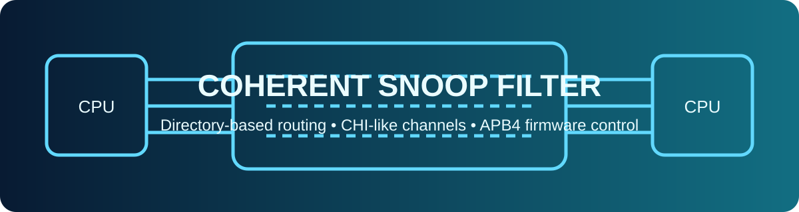
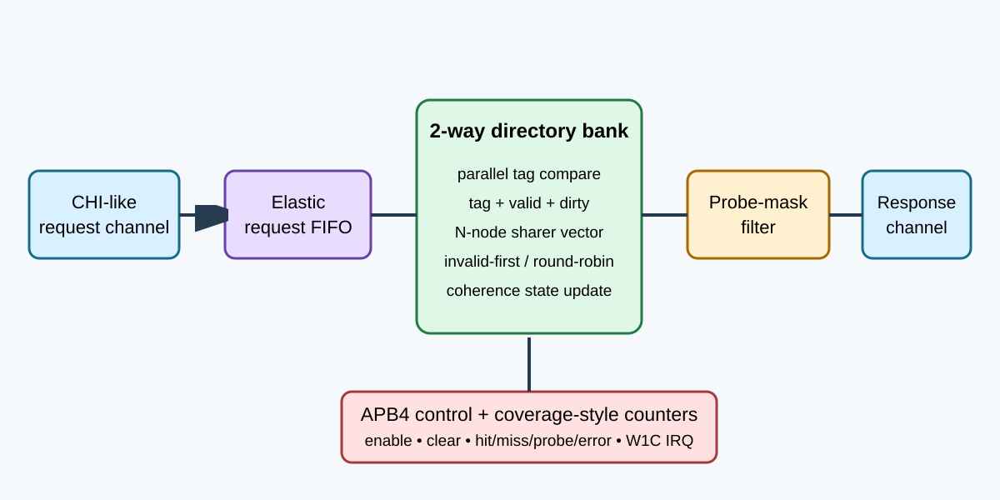
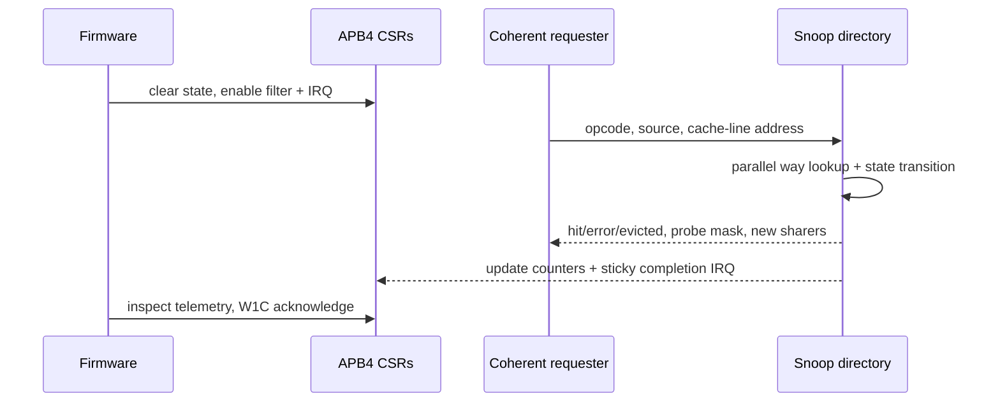

<!-- Author: Asresh -->
# Day 37 — Coherent Snoop Filter

A multicore System-on-Chip (SoC) cannot broadcast every cache-coherence request to every processor without wasting link bandwidth and power. This project implements a two-way set-associative directory that remembers which nodes may hold each cache line, routes only the required probes, and gives firmware control and visibility through APB4 registers.

## Job alignment

The project is based on two current, high-compensation design-verification roles. Apple's [SoC Design Verification Engineer](https://jobs.apple.com/en-sg/details/200662910-3956/soc-design-verification-engineer) role, posted May 12, 2026 with a listed US base range up to $318,400, emphasizes reusable SoC-level test infrastructure, multiprocessor systems, memory controllers, high-bandwidth interfaces, and firmware/hardware interaction. NVIDIA's [Senior ASIC Verification Engineer](https://nvidia.wd5.myworkdayjobs.com/NVIDIAExternalCareerSite/job/US-CA-Santa-Clara/Senior-ASIC-Verification-Engineer_JR2023827) role lists a base range up to $264,500 and calls out ARM-based SoCs, architectural golden models, constrained-random verification, assertions, AXI/APB, DMA, memory controllers, and coherency.

Day 37 turns those requirements into a compact portfolio block with a protocol-aware reference model, randomized stalls, an observable register plane, and line-level coherence corner cases.

## Hardware/software partition

Firmware enables the filter, clears stale directory state and counters, enables interrupts, reads coverage-style telemetry, and acknowledges completion. It also supplies an independent stateful reference model for shared reads, unique ownership, writeback, eviction, and line flush operations. Hardware accepts CHI-like request records, performs both tag comparisons for a set in parallel, updates the selected directory way, removes the requester from same-line probe masks, and holds the response stable under backpressure.

## Architecture

- `coh_request_fifo` is a one-entry elastic input buffer that accepts a replacement request while the previous one advances.
- `coh_directory_bank` contains `SETS × 2` valid, tag, sharer-vector, and dirty entries. Both ways compare in parallel; invalid ways are preferred, then a per-set round-robin victim bit chooses replacement.
- `probe_mask_filter` suppresses self-snoops for same-line upgrades while preserving all sharers when a different victim line must be evicted.
- `coh_irq_latch` implements sticky completion state with write-one-to-clear acknowledgement.
- `coherent_snoop_filter_top` integrates the CHI-like request/response channels, APB4 control plane, and request/hit/miss/probe/error counters.

The default RTL is parameterized for 16-bit addresses, 64-byte lines, 16 sets, and four coherent nodes. The measured configuration uses eight sets and four nodes; alternate elaboration checks cover 4-set/2-node and 32-set/8-node geometries.

## Coherence operations

| Opcode | Operation | Directory action |
|---:|---|---|
| 0 | READ_SHARED | Add requester; downgrade a dirty owner and probe it |
| 1 | READ_UNIQUE | Probe other sharers; make requester the dirty owner |
| 2 | WRITEBACK | Mark a resident requester-owned line clean |
| 3 | EVICT | Remove requester; invalidate when the sharer vector empties |
| 4 | FLUSH_LINE | Probe every recorded sharer and invalidate the line |

A replacement response sets `evicted` and carries the victim line's full sharer vector. A writeback or eviction by a node not recorded as a sharer sets the protocol-error bit without corrupting directory state.

## APB4 register map

| Address | Name | Access | Description |
|---:|---|---|---|
| `0x00` | CTRL | R/W | bit 0 enable; bit 1 IRQ enable; write bit 2 to clear directory and counters |
| `0x04` | STATUS | R | enable, request-buffer-valid, response-valid |
| `0x08` | IRQ_STATUS | R/W1C | sticky response-completion interrupt |
| `0x0c` | REQUESTS | R | processed coherence requests |
| `0x10` | HITS | R | directory tag hits |
| `0x14` | MISSES | R | directory tag misses |
| `0x18` | PROBES | R | individual node probes requested |
| `0x1c` | ERRORS | R | invalid writeback/eviction requests |
| `0x20` | CAPS | R | sets, coherent nodes, and associativity |

## Transaction sequence

## Verification and measured results

`make check` builds the C driver/reference with warnings as errors, reruns it under AddressSanitizer and UndefinedBehaviorSanitizer, and runs the pin-level RTL testbench. The testbench applies eight directed ownership, downgrade, writeback, repeated-eviction, replacement, and flush corners plus 312 deterministic randomized transactions. It independently models every directory entry and replacement bit, randomizes request gaps and response backpressure, compares five response fields per transaction, checks APB counters, and verifies sticky interrupt acknowledgement.

Measured with Icarus Verilog 13.0:

- 320 transactions in 1,399 end-to-end clocks
- 0.228735 transactions/clock including randomized source gaps, response stalls, and APB service
- 4.371875 mean end-to-end clocks/transaction
- 19 directory hits, 301 misses, 90 routed node probes, and 126 intentionally detected protocol errors
- 1,607 checks and zero mismatches
- C reference checksum `0x7f17c1b908c940e2`; warnings-as-errors and ASan/UBSan passed
- Yosys was unavailable, so `make synth` uses synthesis-oriented Icarus elaboration; no area, frequency, power, or unsupported speedup number is claimed

Run `make check` and `make synth` to reproduce the results.

## Abbreviation guide

- APB [Advanced Peripheral Bus]
- ARM [Advanced RISC Machines]
- CHI [Coherent Hub Interface]
- CSR [Control and Status Register]
- DV [Design Verification]
- IRQ [Interrupt Request]
- RTL [Register Transfer Level]
- SoC [System-on-Chip]
- W1C [Write One to Clear]
