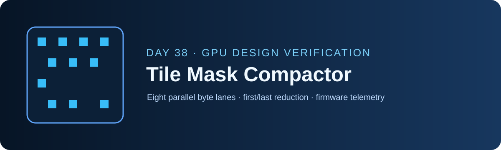
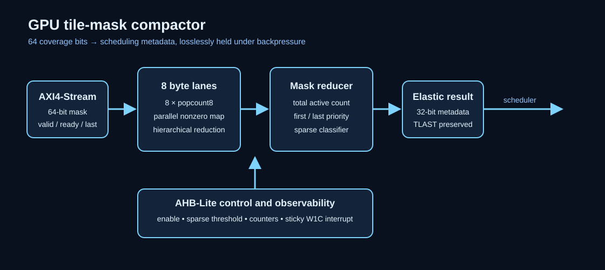
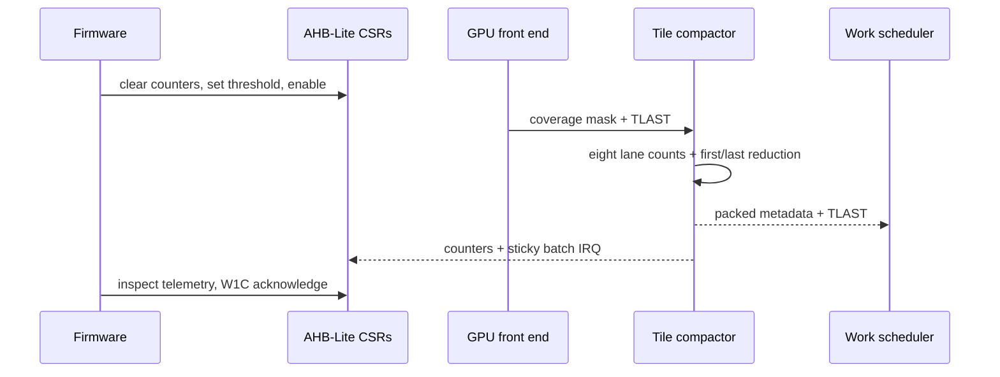

<!-- Author: Asresh -->
# Day 38 — GPU Tile Mask Compactor

Modern Graphics Processing Units (GPUs) divide a frame into tiles, but many tiles contain only a few covered samples after clipping, early depth testing, or visibility culling. Sending all 64 sample positions into later shading stages wastes queue entries and bandwidth. This project turns each 64-bit coverage mask into compact scheduling metadata: active count, first and last active position, empty status, and a firmware-programmable sparse-tile decision.

## Job alignment

The project is based on NVIDIA's current [Senior ASIC Verification Engineer - GPU](https://nvidia.wd5.myworkdayjobs.com/en-US/NVIDIAExternalCareerSite/job/Senior-ASIC-Verification-Engineer---GPU_JR2022633) role, posted in August 2026 with a listed US base-pay range up to $368,000. The role emphasizes GPU/SoC design verification, random stimulus, functional coverage, assertion-based methods, unit and system testbenches, SystemVerilog, C/C++, simulation, and debug. A companion [GPU process-scheduling and system-interface verification](https://nvidia.wd5.myworkdayjobs.com/en-US/NVIDIAExternalCareerSite/job/US-CA-Santa-Clara/Senior-ASIC-Verification-Engineer---GPU_JR1996427) opening specifically centers on the scheduling and system-interface hardware that this block models.

Day 38 maps those requirements into a small GPU work-distribution block with a C golden model, randomized pin-level flow control, directed coverage-mask corners, firmware-visible coverage counters, and repeatable build targets.

## Hardware/software partition

Firmware clears counters, programs the sparse threshold, enables the block, and acknowledges the sticky batch-completion interrupt through an AHB-Lite [Advanced High-performance Bus Lite] register plane. The software library also implements an independent reference result for bring-up and diagnostics. Hardware evaluates eight mask bytes in parallel, combines their counts, selects the first and last active bit, classifies sparse tiles, and transports results through a backpressure-safe AXI4-Stream [Advanced eXtensible Interface Stream] channel.

## Architecture

- Eight `tile_popcount8` instances form byte lanes, each reducing eight coverage bits to a four-bit count.
- `tile_byte_scan` exposes all eight lane counts and a nonzero summary bitmap in parallel.
- `tile_mask_reduce` adds the byte counts and performs deterministic low-to-high first/last priority scans.
- `gpu_tile_mask_compactor` adds a one-entry elastic result stage, AHB-Lite registers, telemetry, threshold comparison, TLAST propagation, and a sticky W1C [Write One to Clear] interrupt.

The `COUNT_WIDTH` parameter controls telemetry-counter width. The datapath accepts a new tile whenever its output register is empty or retires in the same clock, so it sustains one mask per clock without downstream stalls.

## Result word

| Bits | Name | Meaning |
|---:|---|---|
| 6:0 | `active_count` | Number of asserted bits, 0 through 64 |
| 12:7 | `first_active` | Lowest asserted position; zero for an empty mask |
| 18:13 | `last_active` | Highest asserted position; zero for an empty mask |
| 19 | `empty` | No covered samples |
| 20 | `sparse` | Count is less than or equal to the programmed threshold |
| 31:21 | reserved | Reads as zero |

## AHB-Lite register map

| Address | Name | Access | Description |
|---:|---|---|---|
| `0x00` | CTRL | R/W | bit 0 enable; write bit 1 to clear counters; write bit 2 to acknowledge IRQ |
| `0x04` | STATUS | R | output-valid and sticky IRQ state |
| `0x08` | IN_COUNT | R | accepted coverage masks |
| `0x0c` | OUT_COUNT | R | retired result words |
| `0x10` | BATCH_COUNT | R | retired TLAST markers |
| `0x14` | ZERO_COUNT | R | empty coverage masks |
| `0x18` | THRESHOLD | R/W | seven-bit sparse classification threshold |

## Transaction sequence

## Verification and measured results

`make sw` builds and runs the portable C driver and independent golden model. `make sim` runs a self-checking pin-level Icarus Verilog testbench. `make check` repeats the software workload with compiler warnings as errors plus AddressSanitizer and UndefinedBehaviorSanitizer. The testbench applies eight directed masks—empty, full, endpoint singletons, byte extremes, and alternating patterns—plus 312 deterministic randomized masks. It randomizes source gaps and output backpressure, compares the packed result and TLAST for every vector, reads all four telemetry counters through AHB-Lite, and verifies sticky interrupt acknowledgement.

Measured with Icarus Verilog 13.0:

- 320 masks in 783 end-to-end clocks
- 0.408685 masks/clock including AHB setup/readback, deterministic source gaps, and output stalls
- 2.446875 mean clocks/mask end to end; one pipeline clock without stalls
- 645 checks and zero mismatches
- C reference checksum `0x10611f3840e9a09e`; warnings-as-errors and ASan/UBSan passed
- Yosys was unavailable, so `make synth` uses synthesis-oriented Icarus elaboration; no area, frequency, power, or unsupported speedup is claimed

Run `make check`, `make sim`, and `make synth` to reproduce the results.

## Abbreviation guide

- AHB-Lite [Advanced High-performance Bus Lite]
- AXI4-Stream [Advanced eXtensible Interface Stream]
- CSR [Control and Status Register]
- DV [Design Verification]
- GPU [Graphics Processing Unit]
- IRQ [Interrupt Request]
- RTL [Register Transfer Level]
- TLAST [Transaction Last]
- W1C [Write One to Clear]
