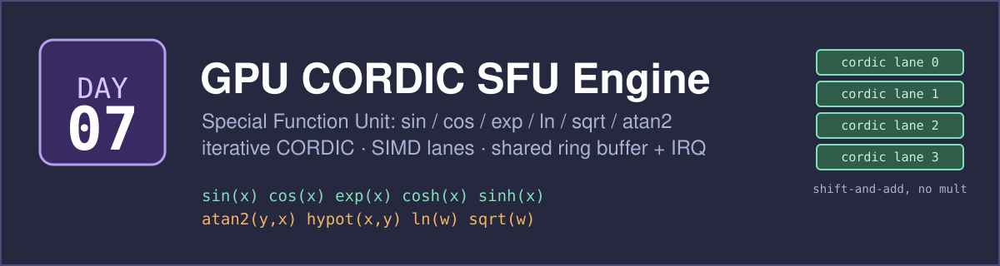
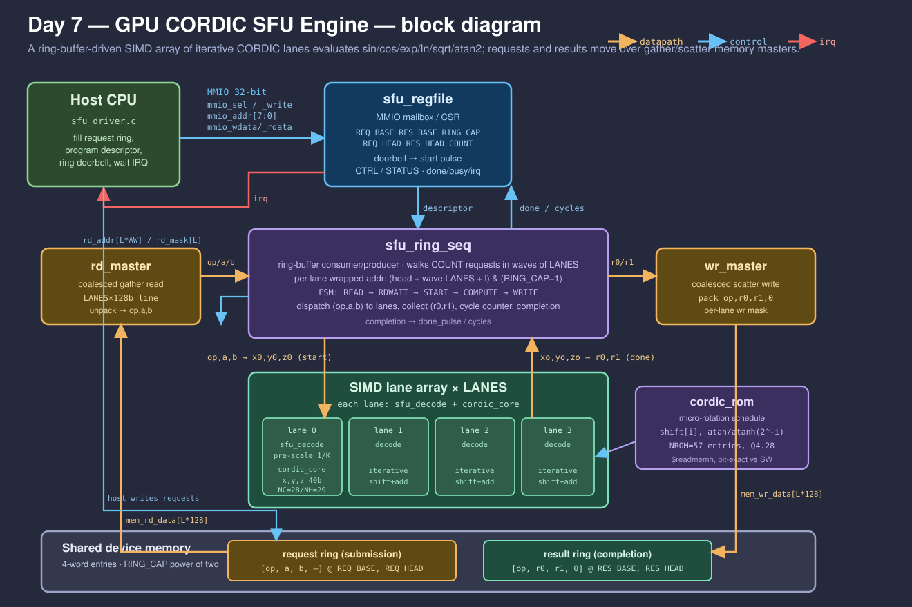
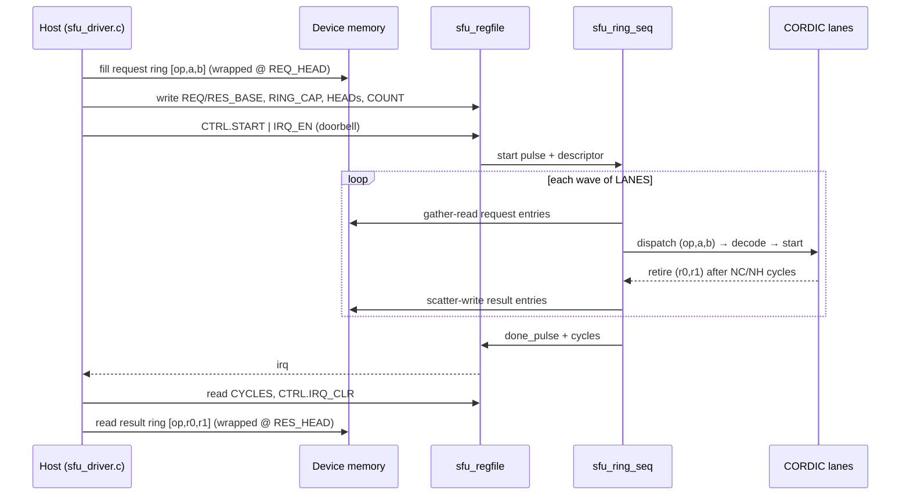

# Day 7 — GPU CORDIC Special Function Unit (SFU) Engine

A fixed-function **Special Function Unit**: a SIMD array of iterative CORDIC
lanes that evaluate `sin`, `cos`, `exp`, `cosh`, `sinh`, `atan2`, `hypot`, `ln`
and `sqrt` in fixed point, driven from a **shared submission/completion ring
buffer** in device memory. One unified shift-and-add datapath — no multiplier in
the iteration — computes every function; the host pushes function requests into
a ring, rings a doorbell, and collects results from a second ring on a
completion interrupt.

This is the piece of a GPU streaming multiprocessor that a general-purpose ALU
never touches: transcendentals are dispatched to a small SFU pool. The same
kernels are the hot path in HFT option pricing (Black-Scholes wants `exp`, `ln`,
`sqrt`; the normal CDF wants more), in DSP mixers (`sin`/`cos`), and in geometry
(`atan2`/`hypot`).

## The problem

Transcendental functions have no cheap closed form on an integer datapath. A
scalar CPU evaluates them with a polynomial or a software CORDIC loop — tens of
iterations, several instructions each, hundreds of cycles per value — and it
does them one at a time. A trading or simulation workload needs *millions* per
tick. CORDIC (Volder 1959, Walther 1971) turns each function into a sequence of
**shift-and-add micro-rotations** by fixed angles `atan(2⁻ⁱ)` (circular) or
`atanh(2⁻ⁱ)` (hyperbolic): no multiplier in the loop, one rotation per clock,
and the whole thing replicates trivially across SIMD lanes. Wrap that datapath
in a ring-buffer command interface and the host can stream requests at it with
zero per-call handshaking.

## Hardware / software partition

| Concern | Where | Why |
|---|---|---|
| The CORDIC iteration (shift/add micro-rotations) | **Hardware** | Pure shift-and-add, one rotation/clock/lane; this is what silicon is good at and where the speedup lives. |
| Per-function decode (argument pre-scale, result map) | **Hardware** | A tiny "function table": pre-scale the initial vector by `1/K`, pick circular/hyperbolic + rotation/vectoring, map `x/y/z` back to the result. |
| Ring walk, wave dispatch, completion | **Hardware** (`sfu_ring_seq`) | Address generation with wraparound and lane scheduling must run at clock speed against the memory masters. |
| Filling requests, reading results, retries/flow-control | **Software** (`sfu_driver.c`) | Policy, not throughput: what to compute and when. The host just fills a ring and reads a ring. |
| Golden model + scalar baseline | **Software** | The reference the hardware is checked against, and the cost model the speedup is measured against. |

The datapath is deliberately function-*agnostic*. All the per-function knowledge
lives in `sfu_decode` (one combinational block); adding a function is a decode
entry, not a new datapath.

## Architecture



```
host ──MMIO──▶ sfu_regfile ──descriptor──▶ sfu_ring_seq
                                              │  walks the request ring in
                    rd_master ◀──gather───────┤  waves of LANES entries
                       │ (op,a,b) per lane     │
                       ▼                        ▼
             LANES × { sfu_decode + cordic_core }   (iterative SFU lanes)
                       │ (op,r0,r1) per lane
                       ▼
                    wr_master ──scatter──▶ result ring ──▶ completion IRQ
```

Per wave the sequencer issues one **coalesced gather** beat for up to `LANES`
request entries, latches `{op,a,b}`, pulses each lane's CORDIC core with the
decoded initial vector, waits for every lane to retire (a lane takes `NC=28`
circular or `NH=29` hyperbolic core cycles), then posts one **coalesced scatter**
beat of the completion entries. Per-lane addresses are generated as
`(head + wave·LANES + l) & (RING_CAP−1)`, so a wave can straddle the ring's wrap
boundary transparently, and the final wave's inactive lanes are masked off.

### RTL modules (`rtl/`)

| Module | Role |
|---|---|
| `sfu_top.v` | Top level: wires mailbox, sequencer, lanes and memory masters. |
| `sfu_regfile.v` | MMIO mailbox / CSR; doorbell → start pulse; sticky done + interrupt. |
| `sfu_ring_seq.v` | Ring consumer/producer + wave scheduler; generates wrapped per-lane addresses, dispatches to lanes, collects results, counts cycles. |
| `cordic_core.v` | One iterative CORDIC lane: 40-bit `x/y/z`, unified circular/hyperbolic × rotation/vectoring, one micro-rotation per clock. |
| `cordic_rom.v` | Micro-rotation schedule ROM (shift + `atan/atanh` angle, Q4.28), generated bit-exact against the software model. |
| `sfu_decode.v` | Per-function decode: argument pre-scale (`1/K`) and result mapping. |
| `rd_master.v` | Coalesced gather read of `LANES` request entries; unpacks `op,a,b`. |
| `wr_master.v` | Coalesced scatter write of `LANES` result entries under a per-lane mask. |

### Supported functions

| `op` | Name | Input(s) | Domain | `r0` | `r1` | CORDIC mode |
|---|---|---|---|---|---|---|
| 0 | `SINCOS` | `a = z` | \|z\| ≤ 1.5 | `sin z` | `cos z` | circular / rotate |
| 1 | `EXP` | `a = z` | \|z\| ≤ 1.1 | `exp z` | `cosh z` | hyperbolic / rotate |
| 2 | `COSHSINH` | `a = z` | \|z\| ≤ 1.1 | `cosh z` | `sinh z` | hyperbolic / rotate |
| 3 | `ATAN2` | `a = y, b = x` | x > 0 | `atan2(y,x)` | `hypot(x,y)` | circular / vector |
| 4 | `LN` | `a = w` | 0.15 ≤ w ≤ 6 | `ln w` | — | hyperbolic / vector |
| 5 | `SQRT` | `a = w` | 0.03 ≤ w ≤ 2.3 | `sqrt w` | — | hyperbolic / vector |

All values are signed **Q4.28** fixed point (range ±8, resolution 2⁻²⁸). The gain
constant `K` is divided out by pre-scaling the initial vector with `1/Kc` or
`1/Kh`, so the CORDIC outputs are already correctly scaled — only an add (`exp`),
a doubling (`ln`) or a passthrough remains. Domains are the single-region CORDIC
convergence ranges (no argument reduction), which is why the ring interface hands
the SFU already-reduced arguments.

## Register map (MMIO mailbox)

| Offset | Name | Access | Meaning |
|---|---|---|---|
| `0x00` | `IDENT` | RO | Engine identity, `0x5C1D0007` |
| `0x04` | `CTRL` | WO | `START` (bit 0), `IRQ_EN` (bit 1), `IRQ_CLR` (bit 2) |
| `0x08` | `STATUS` | RO | `DONE` (bit 0), `BUSY` (bit 1), `IRQ` (bit 2) |
| `0x0C` | `REQ_BASE` | RW | Request ring base (32-bit word address) |
| `0x10` | `RES_BASE` | RW | Result ring base (32-bit word address) |
| `0x14` | `RING_CAP` | RW | Ring capacity in entries (power of two) |
| `0x18` | `REQ_HEAD` | RW | First request entry index (consumer) |
| `0x1C` | `RES_HEAD` | RW | First result entry index (producer) |
| `0x20` | `COUNT` | RW | Number of requests to process |
| `0x24` | `CYCLES` | RO | Hardware cycles of the last completed job |
| `0x28` | `LANES` | RO | SIMD lane count (build parameter) |

Each ring entry is 4 words: a request is `[op, a, b, —]`, a result is
`[op, r0, r1, 0]`.

### Transaction sequence



## Build & run

```bash
make sw       # build host/driver/reference/baseline, generate vectors + ROM
make sim      # Icarus differential testbench (256+ jobs, must be 0 mismatches)
make metrics  # regenerate results/metrics.md from the run
make elab     # elaborate RTL at LANES = 1 / 4 / 8
make synth    # analytical area estimate (Yosys absent here)
make all      # sim + metrics
```

Requires Icarus Verilog (`iverilog`/`vvp`) and a C compiler. Verilator and Yosys
are **not** installed in this environment; `make synth` prints an analytical
gate/flop estimate instead of a synthesized cell report, and says so.

## Results (measured)

From `results/sim.log` (Icarus Verilog) and the scalar-baseline cost model.
Hardware cycles are measured in RTL simulation; the software baseline is a
dynamic instruction count over the real request workload at one op per cycle.

| Metric | Value |
|---|---|
| Jobs run | 264 |
| Result words checked | 39,759 |
| **Mismatches vs golden** | **0** |
| Function requests evaluated | 13,253 |
| Total hardware cycles | 119,437 |
| Sustained throughput | 0.111 functions/cycle (9.01 cycles/function) |
| Peak throughput | 0.115 functions/cycle (8.73 cycles/function) |
| SIMD lanes | 4 |
| CORDIC latency | 28 (circular) / 29 (hyperbolic) core cycles |
| Scalar baseline cycles | 4,117,512 |
| **Aggregate speedup** | **34.47×** |
| **Peak speedup** | **35.58×** |
| Max abs error vs libm | 1.15×10⁻⁷ (~23 bits) |

Each function is one iterative CORDIC pass; the 4-lane SIMD array evaluates 4
functions per wave, so the per-function cost amortises to ~9 cycles including
ring read/write and pipeline fill/drain. Against a scalar CPU running the same
CORDIC (≈300 ops/function), that is **34.5× aggregate**. The fixed-point unit
tracks IEEE double `libm` to **1.15×10⁻⁷** worst-case absolute error across all
six functions.

## What was verified

- **Bit-exact hardware vs golden.** The `cordic_core` datapath, the schedule ROM
  and the software golden (`sfu_eval` in `sw/sfu_accel.h`) share one definition
  of the Q4.28 CORDIC iteration and the same angle constants (the host emits the
  ROM from the very integers the model uses). Over **264 jobs / 13,253 requests /
  39,759 checked result words, 0 mismatches.**
- **Accuracy anchored to `libm`.** Every generated result is checked against IEEE
  double `sin/cos/exp/cosh/sinh/atan2/hypot/log/sqrt`; the vector generator
  aborts if the fixed-point CORDIC ever drifts past 10⁻⁶. Worst case measured:
  **1.15×10⁻⁷**.
- **Independent cross-check.** The scalar baseline is a *separately written*
  CORDIC loop; the host asserts it produces bit-identical results to the golden
  before emitting any vector.
- **Ring semantics.** Corner jobs force `COUNT == RING_CAP` (maximum wrap), heads
  placed at the top of the ring (immediate wraparound), single-request jobs, and
  one canonical request per op (`sin 0`, `exp 0`, `ln 1`, `sqrt 1`, …). Random
  jobs use random capacity, random head indices and random disjoint ring bases.
- **Parameterization.** The RTL elaborates cleanly at `LANES = 1, 4, 8` (and
  `ADDR_WIDTH = 18, 20, 22`) via `make elab`.
- **Firmware builds** against the shared register map (`make sw` compiles
  `sfu_driver.c`).

## Layout

```
day7 - gpu_cordic_sfu_engine/
├── README.md
├── Makefile
├── docs/         banner.svg, block_diagram.svg
├── rtl/          sfu_top, sfu_ring_seq, cordic_core, cordic_rom, sfu_decode,
│                 sfu_regfile, rd_master, wr_master
├── tb/           sfu_tb.sv  (+ generated vectors/ROM in tb/vectors/)
├── sw/           sfu_accel.h, sfu_cordic.c, sfu_ref.c, sfu_baseline.c,
│                 sfu_driver.c, sfu_host.c
├── scripts/      extract_metrics.py, area_estimate.py, elaborate.sh
└── results/      metrics.md (committed); sim.log / vcd / vvp (generated)
```

## License

MIT — see [LICENSE](../LICENSE).
